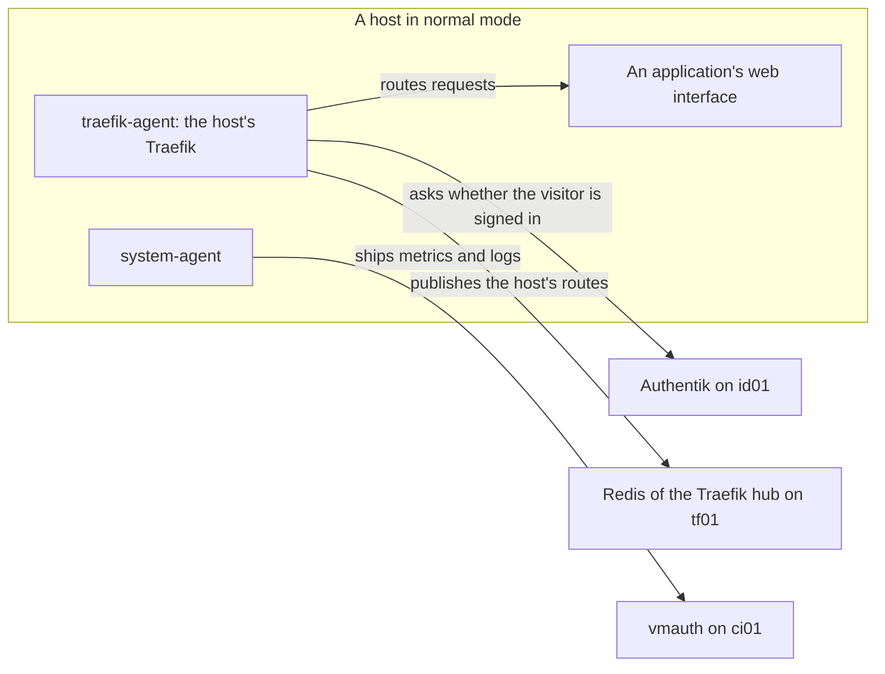

# Bootstrap mode

Bootstrap mode is how a host runs before the fleet can give it single sign-on, telemetry, and shared routing. This page explains what the mode changes, why the first hosts need it, and how to tell which mode a host is in.

At the end of it you know what to expect from a host built in the mode: a certificate warning, no sign-in page, no metrics, and DNS records made by hand. The page has no steps. The one setting is in the inventory, and leaving the mode is a procedure of its own.

Status: written, not yet run. See [Not yet confirmed](#unconfirmed).

## Why the first hosts need it {#why}

Three things every finished host depends on are themselves stacks on hosts.

| A finished host needs | Which comes from |
| --- | --- |
| Sign-in in front of its web interfaces | [Authentik](../../tools/authentik/index.md), on id01 |
| Somewhere to send metrics and logs | vmauth, the one endpoint in front of [VictoriaMetrics](../../tools/victoriametrics/index.md), on ci01 |
| A Redis to publish its [routes](../../tools/glossary.md#route) into | The [Traefik](../../tools/traefik/index.md) [hub](../../tools/glossary.md#hub), on tf01 |

The diagram shows a host in normal mode. Two of its stacks reach out to the three other hosts, and bootstrap mode leaves out every arrow that crosses to another host.



km01 and ci01 are built before any of the three exists, and id01, pk01, and tf01 are built before all of them do. Bootstrap mode lets each of those hosts come up complete enough to use, on its real hostnames, without the parts that are missing.

## What it changes {#changes}

Set `docker_stacks_bootstrap: true` on a host, or on a group, in the private repo's `hosts.yml`. The host's `docker_stacks` list stays as it will be when the fleet is finished. `nixos-sync.yml` and `komodo-sync.yml` work out the rest when they write the host's files, and the run deploys what those files hold. See [The generated files](fleet-private.md#generated).

| The list has | In bootstrap mode the host's files |
| --- | --- |
| A stack that needs something elsewhere in the fleet, such as system-agent or traefik-agent | Leave it out |
| A stack that needs a Traefik on the same host, with none left in the list | Get traefik-bootstrap to stand in |
| A stack that is itself a Traefik, such as traefik-server | Keep it. No stand-in is added |
| Any stack with `TRAEFIK_AUTH_CHAIN` in its `komodo.env` | Set it to `chain-no-auth@file`, an [auth chain](../../tools/glossary.md#auth-chain) with no sign-in in it |

What a stack needs and provides is declared in its `setup.yaml`, under `needs_host`, `needs_fleet`, and `provides`. Both playbooks read those, so a new stack takes part in bootstrap mode with no change to ansible.

<details>
<summary>Background: how the playbooks decide from setup.yaml</summary>

Three stacks from fleet-stacks show the three cases.

| Stack | Declares | So in bootstrap mode |
| --- | --- | --- |
| traefik-agent | `needs_fleet: ["kop-redis"]` | It is left out, because the Redis it publishes to is on tf01 |
| system-agent | `needs_fleet: ["vmauth"]` | It is left out, because vmauth is on ci01 |
| authentik-server | `needs_host: ["traefik"]` | It stays, and traefik-bootstrap is added, because the Traefik the host listed has been left out |

traefik-server, on tf01, declares that it provides `traefik` to its own host and needs nothing from the fleet. It stays as it is, and so does every stack beside it that needs a Traefik.

The list keeps its final form so that leaving the mode is one changed line. Nothing has to be remembered about which stacks to put back.

</details>

Outside bootstrap mode a playbook stops when a host lists a stack that needs something on the same host which nothing in the list provides. The message names what is missing.

## What you see in bootstrap mode {#effects}

| | Bootstrap mode | Normal |
| --- | --- | --- |
| Hostnames | The real ones | The same |
| Certificate | Traefik's own self-signed one, with a browser warning | Let's Encrypt, trusted |
| Sign-in | None in front of the application. Its own login still applies | Authentik first |
| Routes | Served by the host's own Traefik only | Also published to tf01 |
| Metrics and logs | Not shipped, from any host | Shipped to ci01 |
| DNS records | Made by hand | Written by dockns, for a container that carries its labels |

Because nothing writes DNS records in bootstrap mode, each hostname a page sends you to needs a record pointing at the host, or an entry in your own machine's hosts file. Most keep needing it afterwards. See [Not yet confirmed](#unconfirmed).

> [!WARNING]
> `chain-no-auth@file` puts nothing in front of a web interface. Anything with no login of its own, such as the blackbox-exporter page on ci01, is open to the internal network until the host leaves bootstrap mode.

## How traefik-bootstrap differs from the real Traefik {#traefik}

traefik-bootstrap runs the same Traefik service as every other Traefik stack, with no command or label of its own changed. Three values in its `komodo.env` make the difference.

| Key | traefik-bootstrap | Every other Traefik stack |
| --- | --- | --- |
| `TRAEFIK_TLS_OPTIONS` | `tls-opts-selfsigned@file` | `tls-opts@file` |
| `TRAEFIK_CERT_RESOLVER` | Blank | `letsencrypt` |
| `TRAEFIK_AUTH_CHAIN` | `chain-no-auth@file` | Blank, which takes `chain-authentik@file` |

`tls-opts@file` sets `sniStrict`, which refuses any request whose hostname has no matching certificate. A resolver, in Traefik, is what fetches certificates from an authority such as Let's Encrypt. A Traefik with no resolver has only its self-signed default, so strict matching would refuse everything. `tls-opts-selfsigned@file` is the same options with `sniStrict` off.

A blank resolver name matches no resolver, so Traefik never asks for a certificate and serves the self-signed one. The `letsencrypt` resolver is still defined, and nothing points at it.

`chain-no-auth@file` is rate limiting, secure headers, and compression, with no forward to Authentik. See [forward auth](../../tools/glossary.md#forward-auth) for what the other chain adds.

## What the real Traefik turns on {#real-traefik}

Every Traefik stack extends one service, `.traefik` in `containers/traefik/compose.yaml` in fleet-stacks. tf01 is the first host to use two parts of it.

### Certificates from Let's Encrypt {#certificates}

The `letsencrypt` resolver uses a [DNS-01](../../tools/glossary.md#dns-01) challenge through Cloudflare, so Let's Encrypt never has to reach a host from the internet. It reads `CF_DNS_API_TOKEN`, `CF_API_EMAIL`, and `LE_EMAIL`. The certificate reaches the HTTPS entrypoint through the default TLS store, which covers the domain and its wildcards:

```yaml
- "traefik.tls.stores.default.defaultGeneratedCert.resolver=${TRAEFIK_CERT_RESOLVER-letsencrypt}"
```

The entrypoint's own `certresolver` line is commented out on purpose. Leave it.

[step-ca](../../tools/step-ca/index.md) on pk01 is not where Traefik gets certificates. It is planned as a second resolver for internal names and as the SSH certificate authority, and the Traefik service defines no resolver for it.

### The Redis provider {#redis-provider}

tf01's Traefik reads the routes every other host publishes from Redis:

```yaml
- ${TRAEFIK_REDIS_ENDPOINTS:+--providers.redis.endpoints=${TRAEFIK_REDIS_ENDPOINTS}}
- ${TRAEFIK_REDIS_ENDPOINTS:+--providers.redis.password=${REDIS_PASSWORD}}
```

Both lines depend on `TRAEFIK_REDIS_ENDPOINTS`. fleet-stacks sets it to `redis:6379` in the stacks that run a Redis of their own, traefik-server and traefik-dmz, and nowhere else. With the key absent both lines expand to nothing and the provider stays off.

They are the last two arguments, and have to be. Traefik stops reading its arguments at the first empty one, so an optional argument anywhere but the end would take everything after it along when it disappears. `TRAEFIK_EXTRA_COMMAND` falls back to a repeat of `--ping=true` for the same reason.

## Which mode a host is in {#which}

Read it from the inventory, or from the host's Stacks in [Komodo](../../tools/komodo/index.md).

| Komodo shows | The host is in |
| --- | --- |
| `traefik-bootstrap-<host>` | Bootstrap mode |
| `traefik-agent-<host>` and `system-agent-<host>` | Normal mode |
| Both Traefik Stacks | Normal mode, with the stand-in's Stack left in Komodo. Only one of the two can be up, since they share container names and ports. Delete the stand-in |

tf01 and bh01 run a Traefik of their own in either mode, so for those two the inventory is the only place to look.

## Leaving it {#leaving}

The whole fleet leaves together, after tf01 is up, and after bh01 in a fleet that has one. It is an inventory change, new files for every host, and one run per host. See [Leaving bootstrap mode](../procedures/leave-bootstrap-mode.md).

A host added after that is never in bootstrap mode. See [Adding a host](../procedures/add-a-host.md).

## Not yet confirmed {#unconfirmed}

- Traefik's fall back to its self-signed certificate when no resolver is named. It follows Traefik's documentation, and has not been checked on a host built by the run.
- What dockns writes. Only ntfy, Stalwart, and Bulwark carry its labels, and those labels name a server called `technitium`. The dockns in system-agent defines `unifi` and `cloudflare`, so as the repo stands it writes no record.
