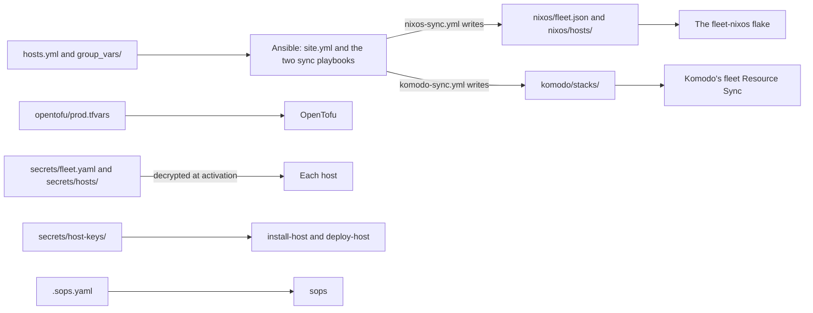

# The private repo

Everything that describes your fleet, as opposed to anyone's, lives in one private git repo. These pages call it fleet-private. This page explains what each file in it holds and how to describe a host, for anyone about to add or change one.

At the end of it you know which file to edit for a given change, which files are written for you, and what to do after an edit so that the change reaches a host.

Status: written, not yet run.

The fleet-ansible, fleet-stacks, fleet-nixos, and fleet-opentofu repos are public and hold no address, key, or name of yours. The run reads the private repo next to them, so nothing is copied between the two. See [How a host is built](how-a-host-is-built.md) for the run.

## What the repo holds {#files}

```text
fleet-private/
  hosts.yml
  group_vars/all/private.yml
  group_vars/all/secrets.sops.yaml
  opentofu/prod.tfvars
  komodo/stacks/<host>.toml
  nixos/fleet.json
  nixos/hosts/<host>.json
  secrets/fleet.yaml
  secrets/hosts/<host>.yaml
  secrets/host-keys/<host>.yaml
  .sops.yaml
```

You write four of them by hand.

| File | Holds |
| --- | --- |
| `hosts.yml` | The [inventory](../../tools/glossary.md#inventory), which is the list of hosts [Ansible](../../tools/ansible/index.md) works from. What each host is: its address, what it runs, and its [stacks](../../tools/glossary.md#stack) |
| `group_vars/all/private.yml` | [Fleet values](#fleet-values) that are not secret: SSH public keys, Core's address and public key, the sub-domain |
| `opentofu/prod.tfvars` | The [tfvars](../../tools/glossary.md#tfvars) file, which holds the values [OpenTofu](../../tools/opentofu/index.md) is run with. The Proxmox servers, and each host's VM: size, disks, VLAN, and address |
| `.sops.yaml` | Who can decrypt each secrets file. The command [new-host-key](nixos-flake.md#commands) writes the entries that name a host |

Two playbooks write three more from those and from fleet-stacks. See [The generated files](#generated).

| File | Holds | Written by |
| --- | --- | --- |
| `nixos/fleet.json` | The values every host shares | `nixos-sync.yml` |
| `nixos/hosts/<host>.json` | One host's network, features, and what its stacks need from it | `nixos-sync.yml` |
| `komodo/stacks/<host>.toml` | One host's Komodo Stacks | `komodo-sync.yml` |

The rest are [secrets](#secrets), encrypted with [sops](../../tools/sops/index.md).

| File | Holds | Written by |
| --- | --- | --- |
| `secrets/fleet.yaml` | The secrets every host reads | You, through sops |
| `secrets/hosts/<host>.yaml` | One host's own secrets. Optional | You, through sops |
| `secrets/host-keys/<host>.yaml` | The host's SSH host keys | `new-host-key` |
| `group_vars/all/secrets.sops.yaml` | `server_password`, for the Proxmox hosts | You, through sops |

The host's name links them. It is the key in `hosts.yml`, the key in the tfvars file in lower case, and the name of every file with `<host>` in its path.

### Which tool reads which file {#readers}

The diagram shows which tool reads each file, and the two playbooks that write the generated files.



The split follows the tools. Each one reads its own format, so a host's description is spread over the files its tools read, and the generated files exist to carry the inventory's facts to the two readers that cannot read an inventory.

Start the repo from `private-repo.example/` in the fleet-ansible repo, which has the files you write with example values and a comment on each key. See [The control shell](../foundation/control-shell.md#checkouts).

> [!WARNING]
> Never commit a private age key, or a secrets file that sops has not encrypted. API tokens, the state passphrase, and Komodo's API key are not in this repo at all. They live in the control node's environment file or in Semaphore's secrets.

## Describing a host {#describe}

A host is two entries. The first is in `hosts.yml`:

```yaml
docker_host:
  hosts:
    id01:
      ansible_host: 172.16.7.131
      serverHostname: "id01"
      docker_stacks:
        - system-agent
        - traefik-agent
        - authentik-server
```

| Key | Holds |
| --- | --- |
| `ansible_host` | The host's address. The host is given it as a static address |
| `serverHostname` | The hostname the host is given, and the name of its [Server](../../tools/glossary.md#server) in Komodo in lower case |
| `docker_stacks` | The stacks the host runs once the fleet is finished, by their folder name in fleet-stacks |

`docker_host` is a group, which is how an inventory gives several hosts the same values. The group's own `vars` hold what every Docker VM shares:

```yaml
docker_host:
  vars:
    NIXOS: true
    network_gateway: "172.16.7.1"
    docker_stacks_internal_subnet: "172.16.7.0/24"
    FIREWALL: true
    DOCKER: true
    KOMODO: true
    NODE_EXPORTER: true
```

| Key | Default | Holds |
| --- | --- | --- |
| `NIXOS` | `false` | Marks a host as one the run installs NixOS on |
| `network_gateway` | None, required | The host's gateway. A host on another network, such as the DMZ, sets its own |
| `network_prefix_length` | `24` | The prefix length of the host's address |
| `network_dns` | The gateway | The host's nameservers, as a list |
| `network_interface` | `ens18` | The interface that carries the address |
| `swap_size_mib` | `0` | The size of the swap file. `0` is no swap |
| `docker_stacks_internal_subnet` | None | The subnet a port is opened to when a stack opens it to the internal network only |
| `docker_stacks_port_sources` | `[]` | More addresses for one of those ports, for a host outside the subnet. Each entry has `port`, `proto`, and `sources`. See [Admit the DMZ on tf01](../hosts/bh01-dmz-edge.md#boundary-tf01) |

The flags turn parts of a host on and off. Each is a feature of the host's configuration. See [A host's configuration](nixos-flake.md#configuration).

| Flag | Default | Turns on |
| --- | --- | --- |
| `FIREWALL` | `false` | The firewall |
| `DOCKER` | `false` | Docker, the Docker disk, and the persistent disk |
| `KOMODO` | `false` | Komodo [Periphery](../../tools/glossary.md#core-and-periphery) |
| `NODE_EXPORTER` | `false` | Node Exporter |
| `FAIL2BAN` | `true` | fail2ban |
| `AUDITD` | `false` | The Linux audit system |
| `MAIL` | `true` | Postfix, for root's mail |
| `MOSH` | `true` | mosh |

Any of these can be set on one host to differ from its group.

The second entry is in `opentofu/prod.tfvars`:

```hcl
vms = {
  id01 = {
    server       = "vh01"
    vm_id        = 7131
    cores        = 4
    memory_mb    = 8192
    vlan_id      = 7
    ipv4_address = "172.16.7.131/24"
    ipv4_gateway = "172.16.7.1"
    dns_servers  = ["172.16.7.1"]
    tags         = ["docker"]
    extra_disks = {
      persist = { interface = "scsi2", size_gb = 20 }
    }
  }
}
```

| Key | Holds |
| --- | --- |
| `server` | Which entry under `servers` the VM lives on |
| `vm_id` | The VMID. These pages use the VLAN followed by the address's last part in three digits |
| `cores`, `memory_mb` | The VM's size. Each host page gives the numbers and what drives them |
| `vlan_id` | `7` for the internal [VLAN](../../tools/glossary.md#vlan) and `8` for the [DMZ](../../tools/glossary.md#dmz) in these pages |
| `ipv4_address`, `ipv4_gateway` | The address with its prefix, and the gateway. The installer takes them from here |
| `dns_servers` | The installer's nameservers |
| `os_disk_gb`, `docker_disk_gb` | The sizes of the first two disks. Optional, 20 and 40 |
| `extra_disks` | The persistent disk, always on `scsi2`. See [Host layout](host-layout.md#disks) |

The network is written twice, because the installer reads it from the VM and the built host reads it from the inventory. The run stops when the address, the prefix length, the gateway, or the nameservers differ between the two.

Add `node_name` to pin a VM to one node of a cluster. A pinned VM that is moved in Proxmox is migrated back by the next run that includes it. Without the key, a VM is created on the server's default node and then left wherever you or Proxmox's high availability (HA) move it.

`envs/prod/terraform.tfvars.example` and `variables.tf` in the fleet-opentofu repo list every key.

## The Proxmox servers {#servers}

The tfvars file opens with the servers the VMs live on:

```hcl
servers = {
  vh01 = {
    endpoint     = "https://172.16.1.11:8006/"
    insecure     = true
    default_node = "vh01"
  }
}
```

| Key | Default | Holds |
| --- | --- | --- |
| `endpoint` | `PROXMOX_VE_ENDPOINT` | The address of the server's API |
| `insecure` | `PROXMOX_VE_INSECURE` | `true` skips the certificate check, for while the API certificate is self-signed |
| `default_node` | None, required | The node a VM is created on when it pins none |
| `installer_iso` | `local:iso/fleet-nixos-installer.iso` | The ISO a VM on this server boots while its disk is empty |
| `datastore_id` | `local-zfs` | The datastore for the disks and the cloud-init drive |

A standalone Proxmox host is a server of its own. A cluster is one server, reached through any node. The ISO has to be on every node a VM is created on.

Each node a VM runs on also needs an entry in the `pve_host` group of `hosts.yml`, under the node's name, with `pve_ssh_host_key` set to its SSH host key. `install-host` logs in to the node to read a new VM's installer key, and accepts no other key from it. See [The installer](nixos-flake.md#installer) for why, and [The installer ISO](../foundation/proxmox-and-installer.md#installer-iso) for setting it.

## Identity values {#identity}

The fleet names things after four values. Set them in `hosts.yml` under `all: vars:`, so every host and every control node reads the same ones:

```yaml
all:
  vars:
    short_name: "MYMI"
    abbr_name: "mm"
    location_abbr: "home"
    domain_name: "myah-mitchell.com"
```

| Value | Gives |
| --- | --- |
| `short_name` | The name on the SSH banner, unless `ssh_legal_banner_name` sets another |
| `abbr_name` | The admin account, `mmadmin`, and the admin list, `mmadmins@myah-mitchell.com` |
| `location_abbr` | The location's domain, `home.myah-mitchell.com`. It can be empty |
| `domain_name` | Every hostname in the fleet |

Every NixOS host shares them, and `nixos-sync.yml` stops when one host's differ from another's. A value passed with `-e`, or held in *Extra Variables* in [Semaphore](../../tools/semaphore/index.md), beats the inventory, so keep these four out of there.

## Fleet values {#fleet-values}

`group_vars/all/private.yml` holds what every host shares and nobody needs to keep secret. Ansible reads every file under `group_vars/all/` for every host, with no line in the inventory naming it.

| Key | Holds |
| --- | --- |
| `admin_ssh_public_keys` | The keys that sign in to the admin account, and to the installer |
| `ansible_ssh_public_keys` | The keys that sign in to the deploy account, and to the installer. The control node holds the private half of one |
| `client_ssh_public_keys`, `client_account` | The client account's keys and name. The keys default to the admin's |
| `komodo_core_address` | Where every host's Periphery reaches Komodo Core |
| `komodo_core_public_key` | Core's public key. See [Core's public key](../foundation/komodo-setup.md#core-key) |
| `komodo_stacks_sub_domain_name` | The sub-domain of every stack's hostname, with its trailing dot |
| `ca_certificates` | Certificate authorities every host trusts |
| `ntp_servers` | The hosts' time servers. Empty leaves the default |
| `ssh_legal_banner_body` | The text under the name on the SSH banner |

These end up in `nixos/fleet.json`. A change to the admin or ansible keys also means a new installer ISO. See [The installer](nixos-flake.md#installer).

## Secrets {#secrets}

The files under `secrets/`, and `group_vars/all/secrets.sops.yaml`, are encrypted with sops before they are committed. `.sops.yaml` names the keys that can decrypt each one. See [Secrets with sops](secrets-with-sops.md).

A stack's own secrets are not here. They are [Komodo](../../tools/komodo/index.md) Secrets, which a stack's *Environment* refers to by name. See [Variables and Secrets](variables-and-secrets.md).

## Bootstrap mode {#bootstrap}

`docker_stacks_bootstrap: true` on a host, or in a group's `vars`, puts it in bootstrap mode, which is how a host runs before the hosts it depends on exist. The `docker_stacks` list does not change. See [Bootstrap mode](bootstrap-mode.md).

## Stack values {#stack-values}

Each stack in fleet-stacks has a `komodo.env` file, which lists the keys of the Stack's *Environment* in Komodo. The run fills in four of those keys wherever a stack's `komodo.env` has them.

| Key | Value |
| --- | --- |
| `SERVER_NAME` | The host's `serverHostname`, in lower case |
| `SUB_DOMAIN_NAME` | `komodo_stacks_sub_domain_name` from `private.yml`, with its trailing dot, such as `home.` |
| `DOMAIN_NAME` | `domain_name` |
| `TRAEFIK_AUTH_CHAIN` | `chain-no-auth@file` in bootstrap mode, blank otherwise |

Set any other key with `komodo_stack_env`, keyed by the stack's folder name:

```yaml
    ci01:
      komodo_stack_env:
        core-infra:
          POSTFIX_RELAYHOST: "[smtp.myah-mitchell.com]:587"
          POSTFIX_RELAYHOST_USERNAME: "relay@myah-mitchell.com"
```

- Every key must already have a line in that stack's `komodo.env`. A misspelt key stops the run, and is not silently dropped.
- A value can be a literal, a blank, or a reference to a Variable or Secret of your own, such as `"[[DOCKNS_WAN_IP_DMZ]]"`.
- A secret never goes here. Create a Komodo Secret and reference it.
- A host's `komodo_stack_env` replaces a group's. Ansible does not merge the two, so a host that sets its own lists every stack and key it needs.

## The generated files {#generated}

Three kinds of file are written by a playbook and committed as they come out. They are never edited by hand.

| File | Read by | Made from |
| --- | --- | --- |
| `nixos/fleet.json` | The flake, for every host | The identity values and the fleet values |
| `nixos/hosts/<host>.json` | The flake, for one host | The host's inventory entry, and the `setup.yaml` of each of its stacks |
| `komodo/stacks/<host>.toml` | Komodo's `fleet` [Resource Sync](../../tools/glossary.md#resource-sync) | The host's stacks, and the `komodo.env` of each |

A host's JSON file holds its name, its network, its features, and a `stacks` object with the folders, seed files, and ports its stacks need. The text of each seed file is inside it. See [Stack folders](host-layout.md#stack-folders) and [The firewall](host-layout.md#firewall).

Both playbooks connect to no host, so they are safe to run at any time. Each also removes the file of a host that has left the inventory.

Two readers take the files from git, not from your working folder. The flake reads what git tracks in the checkout the run uses, and Komodo reads what has been pushed. The run compares each committed file with what the inventory gives and stops at a host whose files are out of date.

<details>
<summary>Background: why the files are generated and committed, not worked out during the run</summary>

The inventory is an Ansible file, and neither the flake nor Komodo can read one. Something has to translate, and the two sync playbooks do.

The run could do that translation in passing and hand the result straight to each tool. Committing it instead gives every change to a host a diff you can read before it is applied: the diff of a host's JSON file is what its operating system will change, and the diff of its TOML file is what Komodo will deploy. It also means the flake and Komodo build from a commit, so what a host runs can be traced to one.

The cost is the extra step this page keeps repeating, and the check in the run is there so that a forgotten step stops the run instead of deploying stale files.

</details>

## After a change {#after-a-change}

Generate the files again and commit them after any of these changes:

- A host is added or removed, or its entry in `hosts.yml` changes.
- A group's `vars` or a value in `private.yml` changes.
- A stack's `komodo.env`, `setup.yaml`, or seed file changes in fleet-stacks.

A change to the tfvars file alone needs no generating, only a commit.

`<host>` is the host's name in the inventory.

--8<-- "generate-fleet-files.md"

Then run every host whose files changed. A change to `nixos/fleet.json` reaches every host, one run each.

## Not yet confirmed {#unconfirmed}

`nixos-sync.yml` and `komodo-sync.yml` were run against a copy of the private repo with placeholder secrets, and a second run changed nothing. Every host in it evaluates with the flake. No host has been built from it.

- The generated files with the real secrets in place of the placeholders.
- A run of a host from Semaphore, which reads this repo through the checkout of the Repository entry.
