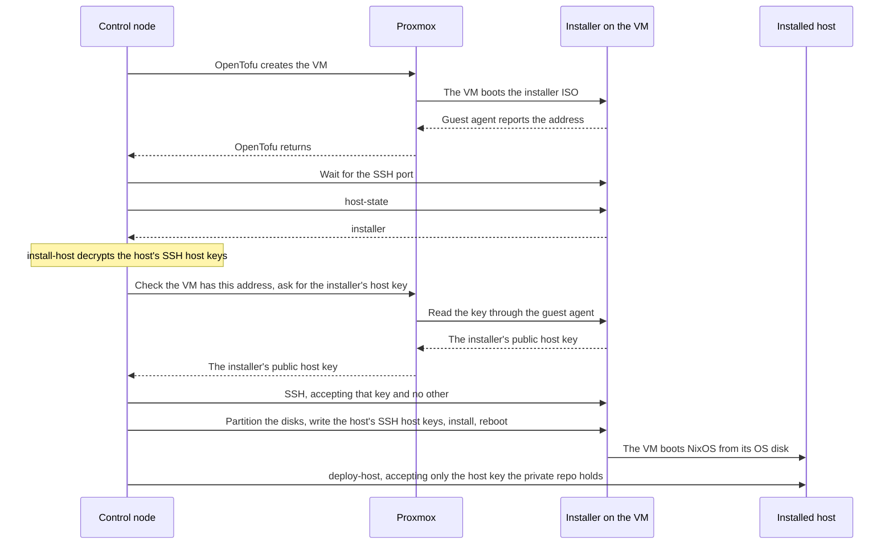

# How a host is built

Every VM in the fleet is built by one [Ansible](../../tools/ansible/index.md) run, `site.yml`, from what the [private repo](../../tools/glossary.md#private-repo) says about it. This page explains what that run does, what it needs, and what it leaves to you. Read it once before the first host page, and come back when a run stops somewhere unexpected.

At the end of it you know what each stage of a run changes, where a run can start from, and why a second run of the same host is safe. [The fleet at a glance](the-fleet-at-a-glance.md#run) has the picture of the whole run, and this page takes its stages one at a time.

Status: written, not yet run. See [Not yet confirmed](#unconfirmed).

## The four stages {#stages}

`site.yml` takes the hosts named in `target` through four stages, in order. The tag is the name ansible knows a stage by. A page that has you run one stage alone, or leave one out, passes it with `--tags` or `--skip-tags`.

| Stage | Tag | What it does |
| --- | --- | --- |
| Create the VM | `vms` | [OpenTofu](../../tools/opentofu/index.md) creates a blank VM from the host's entry in `opentofu/prod.tfvars`. Its disk is empty, so it boots the [installer ISO](../../tools/glossary.md#installer-iso) |
| Wait | `wait` | Waits for the host to answer on its SSH port, for up to 30 minutes |
| NixOS | `nixos` | Stops if the host's committed files under `nixos/` are out of date. Asks the host what it runs, installs [NixOS](../../tools/nixos/index.md) when the answer is the installer, then deploys the host's configuration |
| Deploy the stacks | `komodo` | Runs the `fleet` [Resource Sync](../../tools/glossary.md#resource-sync) of [Komodo](../../tools/komodo/index.md) for this host's [Stacks](../../tools/glossary.md#stack), then waits until every one is running |

Ansible runs nothing on the host itself. Every task runs on the [control node](#control-node), which calls OpenTofu, the commands of [the NixOS flake](nixos-flake.md#commands), and Komodo's API. Ansible usually copies Python code to a machine and runs it there. Here a host has no Python and needs none.

A host that is already built goes through the same four stages, and each one changes only what differs from the description.

| Stage | On a host that is already built |
| --- | --- |
| Create the VM | OpenTofu plans no change |
| Wait | The host answers as soon as it is up |
| NixOS | The host answers as installed and is not installed again. The deploy activates whatever changed in its configuration |
| Deploy the stacks | The sync redeploys a Stack that changed or is not running |

Running it twice is safe, which is why every host page says to run it again after fixing a failure. A run with that property is called [idempotent](../../tools/glossary.md#idempotent).

The run never reboots a built host. A deploy that brings a new kernel takes effect at the next reboot, which is yours to do. See [Updating the fleet](../procedures/update-the-fleet.md#reboot).

## Where the run starts from {#control-node}

Whatever runs `site.yml` is the control node. The fleet has two.

| Control node | Used for | Holds its secrets in |
| --- | --- | --- |
| A shell on your own machine | km01 and ci01, before Semaphore exists | An environment file, mode `0600`, deleted at the handover |
| [Semaphore](../../tools/semaphore/index.md) on ci01 | Every host after the handover, and every later run against km01 and ci01 | The [Variable Group](../../tools/glossary.md#variable-group)'s secrets |

Both run the same playbook against the same private repo, so a host built from the shell does not differ from one built from Semaphore. The shell comes first because Semaphore is itself a stack on ci01, and cannot build the host it will live on. See [The foundation](../foundation/index.md) for how the shell hands over, and [Running from a shell again](../foundation/handover.md#shell-runs) for the times a shell is needed afterwards.

Every connection the control node makes is outbound: the Proxmox API on port 8006, SSH to the VMs, Komodo's API on port 9120, and GitHub for the repos it clones. Nothing in the fleet has to reach the control node.

## What the run needs {#needs}

This section is reference. On a first read, skip to [What first boot does](#first-boot), and come back when a foundation page has you set one of these values.

The control node needs nix with flakes enabled, ansible with the collections in the fleet-ansible repo's `requirements.yml`, OpenTofu, and [sops with age](../../tools/sops/index.md). See [The control shell](../foundation/control-shell.md#tools) for the shell, and [The Semaphore project](../foundation/semaphore-project.md#nix) for Semaphore.

The run's own credentials come from the environment of the `ansible-playbook` process. None of them is in a repo.

| Name | Holds |
| --- | --- |
| `TF_ENCRYPTION` | The encryption block for OpenTofu's [state](../../tools/glossary.md#state), with the passphrase |
| `TF_VAR_server_api_tokens` | A JSON object with one Proxmox API token per server in the tfvars file |
| `KOMODO_API_KEY`, `KOMODO_API_SECRET` | The Komodo service user's API key |
| `PG_CONN_STR` | The state database's connection string. The runs from the shell do without it, since they pass `-e vms_backend=local` and keep state in a file until the handover |
| `SOPS_AGE_KEY` or `SOPS_AGE_KEY_FILE` | The [deploy key](../../tools/glossary.md#deploy-key), which decrypts the private repo's secrets. See [Secrets with sops](secrets-with-sops.md#keys) |

With a single Proxmox server, its token can go in `PROXMOX_VE_API_TOKEN` in place of the JSON object.

The control node also holds the SSH private key whose public half is in `ansible_ssh_public_keys`. The installer, every built host, and the deploy account on each Proxmox host accept that key.

Everything else comes from the private repo. See [The private repo](fleet-private.md). The run never asks a question, so a value missing from the [inventory](../../tools/glossary.md#inventory) stops it with a message that says what is missing.

## What first boot does {#first-boot}

A new VM has an empty OS disk, so it boots the [installer ISO](../../tools/glossary.md#installer-iso). The run finds the installer there, installs NixOS with `install-host`, and the VM boots from its own disk from then on.

The install sends the host its private SSH [host keys](../../tools/glossary.md#host-key), so it first reads the installer's own host key through Proxmox and accepts no other. The diagram shows the first run of a new host between the four machines that take part, with that check in the middle.

Background: what each machine does at first boot, and why the first connection is not simply trusted

A new VM has three blank disks, the installer ISO in its CD drive, and a [cloud-init](../../tools/glossary.md#cloud-init) drive that carries its address. Its boot order is the OS disk and then the CD drive, so an empty OS disk sends it to the installer.

The installer runs from memory and changes nothing on the disks by itself. It takes the VM's address from the cloud-init drive, starts the [guest agent](../../tools/glossary.md#guest-agent), and accepts the fleet's admin and deploy SSH keys for root. Its sshd makes a new host key at every boot. See [The installer](nixos-flake.md#installer).

`tofu apply` returns when the guest agent reports an address, and the wait stage then waits for the SSH port. The NixOS stage asks the host what it runs with `host-state`, gets `installer`, and runs `install-host`.

That command partitions the OS and Docker disks, prepares the [persistent disk](../../tools/glossary.md#persistent-disk), writes the host's SSH host keys onto it, installs the host's configuration, and reboots. The OS disk holds a system after that, so the VM boots NixOS and never the installer again.

SSH usually handles a machine it has never met by showing its key and asking you to accept it, which is called trust on first use. That is a fair risk for a login. It is not one for an install, where the first thing sent is the private keys the host will identify itself with for the rest of its life. A machine that had taken the VM's address would receive them.

The installer's key cannot be known in advance, because the installer makes a new one at every boot. So the key is fetched over a path an impostor on the network cannot answer on: the Proxmox host, which is itself checked against a key from the inventory, asks the VM by its ID through the guest agent. The keys go to the VM OpenTofu made for the host, or nowhere. See [The installer](nixos-flake.md#installer) for the order `install-host` works in.

The host takes its SSH host keys from the persistent disk at its first boot, so it answers with the keys the private repo holds for it. The deploy that follows checks the host against that key and refuses any other. Nothing that carries a secret accepts a host key on first contact. See [The host's SSH keys](secrets-with-sops.md#host-keys).

## How a host joins Komodo {#onboarding}

Komodo has two parts. Core is the server on km01 that holds the Stacks and decides what is deployed. Periphery is the agent on each host that carries the deploys out. See [Core and Periphery](../../tools/glossary.md#core-and-periphery).

Periphery is a systemd service on each host, and it dials out to Komodo Core on km01. Core never connects inward, so km01 is the only host that opens port 9120.

A host proves itself to Core the first time with an [onboarding key](../../tools/glossary.md#onboarding-key). Core creates the host's [Server](../../tools/glossary.md#server) at that moment, and the two trust each other by their own keypairs from then on. One key, created with an expiry and not privileged, onboards every new host until it expires. See [the onboarding key](../foundation/komodo-setup.md#onboarding-key).

The onboarding key is the entry `komodo-onboarding-key` in the private repo's `secrets/fleet.yaml`, encrypted with sops. A host decrypts it with its own key when its configuration is activated, and Periphery reads it from there. It is not an ansible variable, and it is never passed on a command line.

Periphery keeps its private key at `/srv/persist/host/komodo/periphery.key`, on the persistent disk. A rebuilt host that keeps its disk reconnects as the Server it already was and needs no onboarding key.

## What the run overwrites {#overwrites}

A host's operating system is built from its configuration, so a change made by hand to a file the configuration owns is undone by the next deploy or reboot. That covers the firewall, the accounts and their keys, the services, and everything under `/etc`. Change the inventory, generate the host's files again, and run the host. See [After a change](fleet-private.md#after-a-change).

A Stack's *Environment* in Komodo comes from the committed file `komodo/stacks/<host>.toml`. An edit made in Komodo's UI is undone by the next sync. Put the value in the inventory's `komodo_stack_env`, or in a Komodo Variable or Secret the stack references. See [Variables and Secrets](variables-and-secrets.md#how).

A config file that a deploy copies into a stack's folder is never replaced when a copy is already there. Your edits to it survive every later run.

A Stack made by hand under the name the run would give it is taken over, not duplicated. Stacks that run on every VM carry the host name on the end, such as `system-agent-id01`, because Komodo wants Stack names unique. The rest keep their plain names.

## Seeing what a run would do {#check}

Add `--check` to the command, or tick **Dry Run** in Semaphore. Ansible calls this [check mode](../../tools/glossary.md#check-mode): the run goes through its stages and reports what it would change, without changing it.

| Stage | In check mode |
| --- | --- |
| Create the VM | OpenTofu stops at its plan |
| Wait | Skipped |
| NixOS | Confirms the committed files are current, and asks over SSH whether the host is the installer, an installed host, or not there. For an installed host, it evaluates the configuration on the control node with `deploy-host --action dry-build`, which lists what would be built. Nothing on the host changes |
| Deploy the stacks | Confirms the committed Komodo file is current, and stops there |

A host that has never been built gets less from check mode. OpenTofu still shows its plan and the committed files are still checked, but the configuration is evaluated only for a host that is already installed.

Check mode does not list which services a deploy would restart. For that, run `deploy-host --action dry-activate` by hand, which builds the system on the host. See [The commands](nixos-flake.md#commands).

## Limits {#limits}

This list is reference. A first-time reader can skip it, and come back when a run stops or leaves something behind that the stages above do not explain.

- The sync never deletes. A Stack a host no longer lists stays in Komodo until you delete it there, and so does a host's traefik-bootstrap Stack after the host leaves bootstrap mode.
- A reference to a Variable or Secret that does not exist reaches the container as the literal text. See [how a stack gets its values](variables-and-secrets.md#how).
- OpenTofu is given only the VMs of the hosts in `target`, and refuses any plan that would destroy one. Removing a VM is a deliberate edit in the fleet-opentofu repo.
- Every run reads each Proxmox server's VM list. A node that is down is missing from that list, and a run that includes an unpinned VM on it fails.
- The flake reads only the files git tracks in the private repo. The run stops when a file under `nixos/` or `secrets/` is changed, untracked, or ignored, so commit them before a run. The flake's commands run by hand are less strict: they read a file once it is added. See [After a change](fleet-private.md#after-a-change).
- The run stops when a VM's address, prefix length, gateway, or nameservers in the tfvars file differ from the inventory. A VM with no `dns_servers` is not compared on nameservers.
- A host's configuration is built on the host, which downloads what it lacks from the public NixOS cache. A host with no route to the internet cannot be installed or deployed this way.

## Not yet confirmed {#unconfirmed}

The run has been checked against the playbooks, the flake's commands, and an evaluation of each example host. None of it has run against a real Proxmox host.

- The whole run, end to end, from a shell and from Semaphore.
- A blank VM booting the installer, the installer taking its address from the cloud-init drive, and its guest agent reporting that address to OpenTofu.
- `install-host` from start to end on a VM, and the first boot into NixOS with the host keys from the persistent disk.
- `install-host` reading the installer's key through `qm guest exec` on a real Proxmox host. It was tried against the ISO in QEMU on a workstation, with a stand-in for the Proxmox host.
- Periphery onboarding from the secret in `secrets/fleet.yaml`, and reconnecting after a rebuild with the key it kept.
- Running the sync for some of its Stacks, while the file also lists Stacks for a Server that is not in Komodo yet.
- The sync on km01, where Core redeploys the Stack it runs in. See [The first run](../foundation/first-run.md#unconfirmed).
- A VM pinned to a node other than the server's default node.
