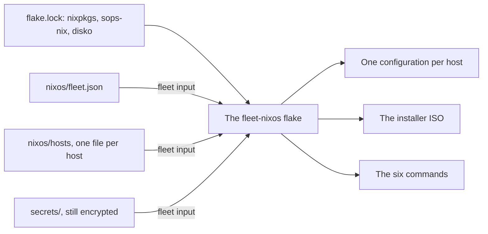

# The NixOS flake

Every VM in the fleet runs [NixOS](../../tools/nixos/index.md), and one flake in the fleet-nixos repo builds all of them. This page explains what the flake holds, how a host's configuration comes out of it, and what its six commands do. Read it before the first host, and come back when a run stops in its NixOS stage.

At the end of it you can read a host's features off its file, tell what each command changes before you run it, and get a host back to an earlier system. The NixOS primer covers the ideas underneath: the store, modules, generations, and flakes in general. See [the ideas you need](../../tools/nixos/index.md#ideas).

Status: written, not yet run. The flake evaluates and builds on a workstation. See [Not yet confirmed](#unconfirmed).

## Placeholders {#placeholders}

| Placeholder | Value |
| --- | --- |
| `<flake>` | Path of a checkout of [fleet-nixos](https://github.com/myah-mitchell/fleet-nixos), such as `$HOME/src/fleet-nixos` |
| `<fleet-dir>` | Absolute path of the private repo's checkout, such as `$HOME/src/fleet-private` |
| `<host>` | The host's name in the inventory, which is also the name of its file in `nixos/hosts/` |
| `<address>` | The host's IPv4 address |
| `<proxmox-login>` | The deploy account on the Proxmox host the VM runs on, such as `ansible@172.16.1.11` |
| `<user>` | The account to sign in to the host as, when it is not the deploy account `ansible` |
| `<node-key>` | That Proxmox host's ed25519 SSH host key, as `ssh-ed25519 AAAA...` |
| `<vmid>` | The VM's ID on that Proxmox host |

## What the flake is {#what}

A [flake](../../tools/glossary.md#flake) is a git repo with a `flake.nix` that names its inputs, and a `flake.lock` that pins each input to one commit. An input is another repo or folder the flake builds from. The same flake and the same lock file build the same system on any machine, which is why a host rebuilt next year comes out as it did today.

| Input | Gives |
| --- | --- |
| `nixpkgs` | Every package and NixOS itself, from the `nixos-26.05` branch |
| `sops-nix` | Decrypting the fleet's secrets on a host |
| `disko` | Partitioning a host's disks at install |
| `fleet` | What the fleet is: its hosts and its secrets |

The flake is public and holds no host of yours. The `fleet` input is a plain folder, and its default is the example fleet inside the repo. Every command on these pages puts the [private repo](../../tools/glossary.md#private-repo) in its place, so the hosts come from `nixos/` and the secrets from `secrets/` in that repo. See [The private repo](fleet-private.md#generated).

Replacing an input for one command is called overriding it. The override reads the private repo through git and takes only the files git tracks. A file you have generated and not yet added does not exist as far as a build is concerned.

The diagram shows what goes into the flake and what comes out of it.



The lock file is the flake's own, and the other three inputs are the private repo's. The outputs are covered in [A host's configuration](#configuration), [The installer](#installer), and [The commands](#commands).

## A host's configuration {#configuration}

Each file `nixos/hosts/<host>.json` in the private repo becomes one NixOS configuration, named for the host. A module is a file of NixOS settings for one concern, such as the firewall or the accounts. The flake's modules are the same for every host. The file's values, together with those in `nixos/fleet.json`, are what make one host differ from the next.

Every host gets the base modules: packages, accounts, CA certificates, time, the network with its static address, sshd and its banner, logging, the swap file, the guest agent, GRUB, and the serial console. The `features` object in the host's file turns on the rest.

| Feature | Inventory flag | Adds |
| --- | --- | --- |
| `firewall` | `FIREWALL` | The firewall, the SSH rate limit, and the ports the host's stacks need |
| `docker` | `DOCKER` | Docker, the Docker disk, the persistent disk, and the folders and seed files of the host's stacks |
| `komodo` | `KOMODO` | Komodo [Periphery](../../tools/glossary.md#core-and-periphery) as a systemd service. It needs `docker` |
| `nodeExporter` | `NODE_EXPORTER` | Node Exporter on port 9100, with TLS and a password |
| `fail2ban` | `FAIL2BAN` | fail2ban with its sshd jail |
| `auditd` | `AUDITD` | The Linux audit system with the fleet's rules |
| `mail` | `MAIL` | Postfix, which sends root's mail to the admin list |
| `mosh` | `MOSH` | mosh and its UDP ports |

[Host layout](host-layout.md) describes what those modules leave on a host: the disks, the folders, the firewall, and the accounts.

The inventory flag is the key you set in `hosts.yml`. `nixos-sync.yml` copies it into the host's file as the feature. See [Describing a host](fleet-private.md#describe).

A value missing from either file stops the build with a message that names the file and the key. To check that a host builds without touching it, run this from `<flake>`:

```bash
nix build .#nixosConfigurations.<host>.config.system.build.toplevel \
  --override-input fleet git+file://<fleet-dir> \
  --no-write-lock-file --dry-run
```

## The commands {#commands}

The flake carries its own commands, and each brings the tools it calls from the pinned `nixpkgs`, so nothing but nix has to be installed to use one. The run calls them for you. Run one by hand when a page says to, or to find out why the run stopped.

```text
nix run <flake>#new-host-key      -- --fleet <fleet-dir> <host>
nix run <flake>#build-installer   -- --fleet <fleet-dir> [--flake <flake>]
nix run <flake>#host-state   -- [--user <user>] <address>
nix run <flake>#install-host -- --fleet <fleet-dir> --proxmox <proxmox-login> --proxmox-host-key <node-key> --vmid <vmid> [--flake <flake>] [--build-on local|remote] <host> <address>
nix run <flake>#deploy-host  -- --fleet <fleet-dir> [--flake <flake>] [--user <user>] [--build-on local|remote] [--action switch|boot|test|dry-activate|dry-build] <host> <address>
nix run <flake>#reset-host   -- [--user <user>] --yes-wipe <host> <address>
```

| Command | What it does | Changes |
| --- | --- | --- |
| `new-host-key` | Makes a host's SSH host keys before the host exists and lets the host read the fleet's secrets. See [The host's SSH keys](secrets-with-sops.md#host-keys) | Files in the private repo |
| `build-installer` | Builds the installer ISO with the fleet's SSH keys, and prints the ISO's path. See [The installer](#installer) | The Nix store of the machine that builds |
| `host-state` | Prints `installer`, `installed`, or `unreachable` for an address | Nothing |
| `install-host` | Installs NixOS on a VM that runs the installer, and reboots it | The VM's OS disk and Docker disk, and a blank persistent disk |
| `deploy-host` | Builds a host's configuration and activates it on the host | The host's running system |
| `reset-host` | Wipes the start of the OS disk and reboots, so the VM boots the installer again | The VM's OS disk |

| Option | Default | Meaning |
| --- | --- | --- |
| `--flake` | The flake the command came from | The flake to build the host from |
| `--build-on` | `remote` | `remote` builds on the host. `local` builds on the [control node](../../tools/glossary.md#control-node) and copies the result |
| `--user` | `ansible` | The account to sign in to an installed host as |
| `--action` | `switch` | What happens to the built system. See [What a deploy does](#deploys) |
| `--proxmox` | None | `install-host` only. The account and address to log in to the VM's Proxmox host as. The account runs `qm` through sudo without a password |
| `--proxmox-host-key` | None | `install-host` only. The Proxmox host's SSH host key. No other key is accepted from it |
| `--vmid` | None | `install-host` only. The VM's ID on the Proxmox host |

Every command prints its options with `--help`. It exits with 0 on success. On failure it prints one line that says what stopped it, and exits with another code.

Three of the commands read the private repo's secrets: `new-host-key`, `install-host`, and `deploy-host`. Each needs the [deploy key](../../tools/glossary.md#deploy-key) or the admin key in its environment. See [Secrets with sops](secrets-with-sops.md#keys).

`host-state` exits with 0 whichever word it prints, and gives up on an address that does not answer after about five seconds. It tells the installer from a built host by a marker file: the installer has `/etc/fleet-installer`, and a built host has `/etc/fleet-host` with its own name in it.

## The installer {#installer}

The [installer](../../tools/glossary.md#installer-iso) is a small NixOS on an ISO, built from the same flake. A VM whose OS disk is empty boots it from the CD drive.

| The installer | Detail |
| --- | --- |
| Runs from memory | It writes to no disk until `install-host` tells it to |
| Takes its address from the [cloud-init](../../tools/glossary.md#cloud-init) drive | Address, gateway, and nameservers. With no drive attached it asks DHCP |
| Accepts root over SSH, with keys only | The keys are `adminSshKeys` and `deploySshKeys` from `nixos/fleet.json`, as they were when the ISO was built |
| Makes its SSH host key at boot | A new ed25519 key every time it starts. The ISO holds no secret |
| Runs the [guest agent](../../tools/glossary.md#guest-agent) | OpenTofu learns the VM's address from it, and `install-host` reads the host key through it |

The keys are inside the ISO, so the ISO is built again whenever the admin or deploy SSH keys change. The ansible pve role builds it on the control node with `build-installer` and copies it to every Proxmox host.

The installer's host key is how `install-host` knows it talks to the fleet's installer and not to some other machine at the same address, before it sends that machine a host's private keys. Since the key is new at every boot, `install-host` asks the VM itself for it.

It logs in to the Proxmox host the VM runs on, which has to answer with the key in `--proxmox-host-key`, and runs `qm guest exec` there to read the key inside the VM. The guest agent reaches the VM over a virtual serial port and not the network, so a machine that takes the VM's address cannot answer in its place. [What first boot does](how-a-host-is-built.md#first-boot) shows the exchange as a diagram.

`install-host` works in this order, and stops at the first step that fails.

1. It decrypts the host's SSH host keys, so a missing key stops the install before anything is touched.
2. It reads the VM's settings on the Proxmox host with `qm config`, and checks that the VM's cloud-init address is the address it was given.
3. It reads the installer's host key through the guest agent, trying for up to five minutes while the VM starts.
4. It checks that the machine at the address is the installer and answers with that key, and refuses any other.
5. It partitions and formats the OS disk and the Docker disk.
6. It formats the persistent disk only when the disk is blank. A disk that holds an ext4 filesystem is mounted as it is, and a disk that holds anything else stops the install.
7. It writes the host's SSH host keys to `/srv/persist/host/ssh`.
8. It installs the host's configuration and reboots.

Steps 5 and 8 are done by nixos-anywhere, a tool that installs NixOS on a machine over SSH. `install-host` calls it, and it comes with the command.

Every connection of the install checks the installer's host key. nixos-anywhere turns the check off for its own connections, so `install-host` gives it an `ssh` of its own that turns the check back on, with the key read in step 3.

If the installer's key changes during an install, nixos-anywhere's first login fails with `Host key verification failed` and it retries without a limit. Stop it with **Ctrl+C**. Nothing is sent to the machine meanwhile.

None of the commands share an SSH connection. Each passes `ControlMaster=no` and `ControlPath=none`, which override an `ssh_config` that keeps connections open. A login that reused a connection `host-state` had opened would skip the host key check.

> [!WARNING]
> An install wipes the OS disk and the Docker disk of whatever installer answers at `<address>`. Check the address before you run `install-host` by hand.

## What a deploy does {#deploys}

`deploy-host` is how a built host changes, and nothing else changes one. No host updates itself.

A deploy first takes the host's ed25519 host key from the private repo's secrets, and refuses to go on when the machine at the address answers with another key. It then works out the host's configuration on the control node, builds it on the host, and activates it. The host downloads what it lacks from the public NixOS cache.

Building makes the new system next to the running one and changes nothing. Activating is the moment the host starts to use it. See [the NixOS primer](../../tools/nixos/index.md#ideas) for both.

Activation restarts the services whose configuration changed and leaves the rest running. A deploy that changes nothing restarts nothing. Secrets are decrypted into `/run/secrets` at activation, so a changed secret reaches a host with its next deploy.

| `--action` | Builds | Activates | Boots into it next time |
| --- | --- | --- | --- |
| `switch` | Yes | Yes | Yes |
| `boot` | Yes | No | Yes |
| `test` | Yes | Yes | No |
| `dry-activate` | Yes | No. It lists what a switch would restart | No |
| `dry-build` | No. It lists what would be built, and never reaches the host | No | No |

The run uses `switch`, and `dry-build` in check mode, so that a check run changes nothing on the host. A new kernel takes effect at the next reboot, whichever action brought it. See [Updating the fleet](../procedures/update-the-fleet.md#reboot).

No command changes `flake.lock`. The versions a host is built from move only when the lock file is updated in fleet-nixos and committed. See [Updating the fleet](../procedures/update-the-fleet.md#lock).

## Generations and rollback {#rollback}

Each system a host has activated is kept as a [generation](../../tools/glossary.md#generation). The boot menu lists them, and the host boots the newest unless you pick another at the console.

There are three ways back to an earlier system.

| Way | Use it when |
| --- | --- |
| Put the private repo or fleet-nixos back to the earlier commit and run the host again | You can. It is the only way that leaves the repos and the host in agreement |
| Run `sudo nixos-rebuild switch --rollback` on the host | The host answers over SSH and the fix has to come first |
| Pick the earlier generation in the boot menu, from the VM's console in Proxmox | The host does not come up far enough to answer |

The last two leave the host behind what the repos describe, and the next run brings it forward again. Fix the repos before that run. See [Updating the fleet](../procedures/update-the-fleet.md#rollback).

A rollback covers the operating system only. It does not touch the persistent disk, a stack's data, or what Komodo has deployed.

Generations older than 30 days are deleted by a weekly job on the host, along with whatever in the store nothing else uses. The generation the host runs is always kept.

## Limits {#limits}

- The flake builds `x86_64-linux` hosts on Proxmox, with the three disks OpenTofu gives them. It describes no other hardware.
- One lock file serves every host. Two hosts deployed from the same commit run the same versions, and a host that has not been deployed since the lock file moved runs the older ones.
- Working out one host's configuration took about 1 GiB of memory on the workstation it was measured on. Semaphore's container is limited to 4 GiB, so a run against several hosts at once can run out. See [The Semaphore project](../foundation/semaphore-project.md#nix).
- A host builds its own system by default, which needs memory and a route to the internet on the host.
- Komodo Periphery comes from the flake's own package, pinned to release v2.3.3. The `nixos-26.05` branch carries Komodo 1, which cannot connect out to a version 2 Core.
- The flake has no test that boots a VM. Its checks prove that every host evaluates and that every secret a host asks for exists.

## Not yet confirmed {#unconfirmed}

The flake's checks pass, the example hosts and the installer ISO build, and the commands stop as described when nothing answers. Nothing has run on a VM.

- The ISO booting on a Proxmox VM, taking its address from the cloud-init drive, and its guest agent reporting the address.
- `install-host` from start to end, with the build done on an installer that runs from memory.
- `qm config` and `qm guest exec` on a real Proxmox host, as the deploy account through sudo. Reading the key through the guest agent was tried on 2026-10-03 against the ISO in QEMU on a workstation, with a stand-in for the Proxmox host, and `install-host` refused a wrong address, an unknown VMID, a wrong Proxmox host key, and a key that did not match the installer's. nixos-anywhere's own logins, through the `ssh` that `install-host` gives it, took the right key and refused another.
- A built host booting from its OS disk, mounting the persistent disk early in the boot, and sshd finding the host keys there.
- An install keeping a persistent disk that already holds a filesystem.
- `deploy-host` against a host as the deploy account.
- `reset-host` leaving the VM in the installer.
- `sudo nixos-rebuild switch --rollback` on a host, and picking a generation in the boot menu. The boot menu waits two seconds.
- How much memory a build takes on a host of the smallest size these pages use.
