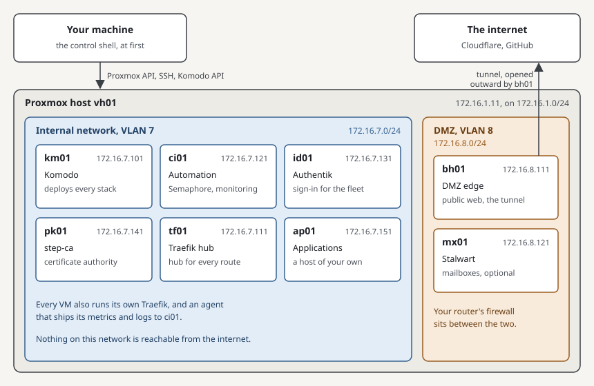
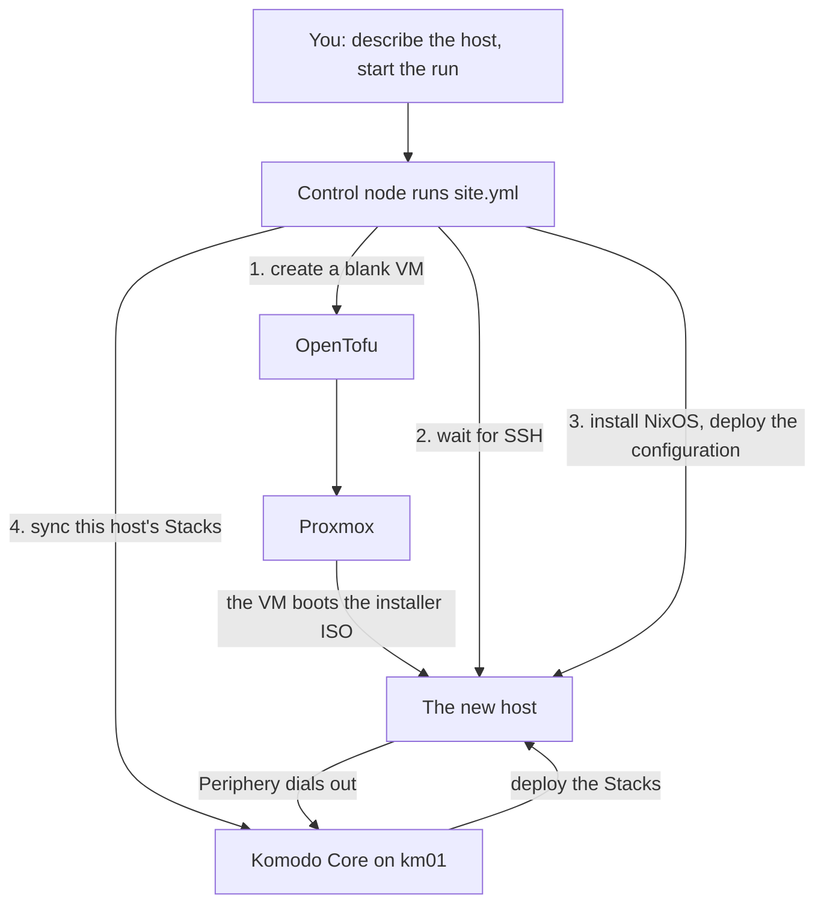

# The fleet at a glance

This page is the place to start if the tools in this guide are new to you. It shows what you are building, which tool does which job, and how a host goes from nothing to running services. Nothing here is a step. Read it one time, then follow [the running order](../index.md#running-order).

Each tool has a primer in [Tools](../../tools/index.md), and each recurring term is in the [glossary](../../tools/glossary.md). The build pages link to both where a tool or a term first appears, so you can read them as you meet them.

## What you are building {#what}

A fleet is a group of virtual machines that are built the same way and managed together. This one runs on a Proxmox host, and every VM in it is a Docker host: a small Linux machine whose job is to run containers.

Each VM has one purpose, and its name says which. The two digits leave room for a second of the same kind.

| Host | Runs | Why the fleet needs it |
| --- | --- | --- |
| [km01](../hosts/km01-komodo.md) | Komodo | Deploys the containers on every host, itself included |
| [ci01](../hosts/ci01-automation.md) | Semaphore, the monitoring stack, notifications, and the mail relay | Starts every build, and stores every host's metrics and logs |
| [id01](../hosts/id01-identity.md) | Authentik | One sign-in in front of every web interface |
| [pk01](../hosts/pk01-certificates.md) | step-ca | The fleet's own certificate authority |
| [tf01](../hosts/tf01-traefik-hub.md) | The Traefik hub | One place that knows every published route |
| [bh01](../hosts/bh01-dmz-edge.md) | The DMZ edge | The only way in from the internet, through a tunnel it opens outward |
| [mx01](../hosts/mx01-mail.md) | Stalwart | Mailboxes. Optional |
| [ap01](../hosts/ap01-applications.md) | Your own applications | The worked example of adding a host |

The internal network holds everything that should never face the internet. The DMZ is a second network for the two hosts that do, and your router's firewall decides what may pass between the two.

Background: why one VM for each job

Everything could run on one large VM. The fleet splits it up for three reasons.

A failure stays small. A full disk or a bad upgrade on one VM takes out one service, and the others keep running.

Each VM can be rebuilt on its own. A host is wiped and installed again in one run, and it finds its data on a disk the rebuild leaves alone. See [Rebuilding a VM](../procedures/rebuild-a-vm.md).

The network can tell the hosts apart. A firewall rule can let bh01 reach tf01 and nothing else, which is not possible when both are containers on one machine.

## Which tool does which job {#tools}

No single tool builds a host. Each one does the part it is good at and hands over to the next.

| Job | Tool | Its instructions live in |
| --- | --- | --- |
| Create the VM in Proxmox | [OpenTofu](../../tools/opentofu/index.md) | The fleet-opentofu repo, and `opentofu/prod.tfvars` in the private repo |
| Install and configure the operating system | [NixOS](../../tools/nixos/index.md) | The fleet-nixos repo, and `nixos/` in the private repo |
| Define the containers | [Docker Compose](../../tools/docker-compose/index.md) | The fleet-stacks repo |
| Deploy the containers and keep them as defined | [Komodo](../../tools/komodo/index.md) | `komodo/` in the private repo |
| Run those three in order, for the hosts you name | [Ansible](../../tools/ansible/index.md) | The fleet-ansible repo, and `hosts.yml` in the private repo |
| Give the run a permanent home, with its secrets and its history | [Semaphore](../../tools/semaphore/index.md) | Semaphore's own database on ci01 |
| Keep secrets in git without exposing them | [sops with age](../../tools/sops/index.md) | `secrets/` in the private repo |

Four of the repos are public and hold no fact about your fleet. Everything that makes the fleet yours, which hosts exist, their addresses, their secrets, is in the private repo. See [The private repo](fleet-private.md).

Once a host is up, a second set of tools serves what runs on it.

| Job | Tool |
| --- | --- |
| Route a hostname to the right container, with TLS | [Traefik](../../tools/traefik/index.md) |
| Ask for a sign-in before a web interface loads | [Authentik](../../tools/authentik/index.md) |
| Collect metrics and logs, and raise alerts | [VictoriaMetrics](../../tools/victoriametrics/index.md) |
| Issue certificates inside the fleet | [step-ca](../../tools/step-ca/index.md) |
| Hold mailboxes | [Stalwart](../../tools/stalwart/index.md) |

Two more stacks are defined in fleet-stacks, and no host in this guide runs them: [CrowdSec](../../tools/crowdsec/index.md), which bans addresses that behave like attackers, and [Technitium](../../tools/technitium/index.md), a DNS server. Each has a primer for the day you add it.

## How a host is built {#run}

You describe a host in the private repo: a few lines of inventory saying what it is called and which stacks it runs, and a few lines saying how big its VM is. Then you start one run and name the host. The diagram shows what the run does with that description.

The control node is whatever machine the run starts from: a shell on your own machine for the first two hosts, and Semaphore from then on. It does all the work. The new host is told what to become and never has to be logged in to.

Running the same host again is safe. Each stage looks at what exists and changes only what differs from the description, so a second run of a finished host does nothing. See [How a host is built](how-a-host-is-built.md) for each stage.

Background: why describe a host instead of setting it up by hand

A host set up by hand is the sum of every command anyone ever ran on it, and nobody has the full list. Building a second one like it, or the same one again after a failure, means remembering.

A described host is built from files. The files are in git, so every change has an author, a date, and a reason, and the host can be built again from them at any time. A change is made in the files and applied by a run, never typed into the host, which is why the pages keep sending you back to the private repo.

This approach goes by the names infrastructure as code and declarative configuration. OpenTofu, NixOS, Compose, and Komodo's Resource Sync each apply it to one layer.

## Why the first two hosts are different {#foundation}

Komodo deploys every stack, and Komodo is itself a stack on km01. Semaphore starts every run, and Semaphore is itself a stack on ci01. Neither can build the host it lives on.

A shell on your own machine stands in until both exist, and then hands over. That stretch of the guide is called [the foundation](../foundation/index.md), and it is the only part with more than a handful of manual steps.

The same problem shows up one more time. A finished host expects a sign-in from id01, a telemetry store on ci01, and the hub on tf01, and the first hosts are built before those exist. They start in [bootstrap mode](bootstrap-mode.md), which leaves those three out, and the whole fleet leaves the mode together in one procedure.

## What to read next {#next}

| To | Read |
| --- | --- |
| Start building | [The running order](../index.md#running-order) |
| Understand the run before starting it | [How a host is built](how-a-host-is-built.md) |
| Learn a tool before you meet it | [Tools](../../tools/index.md) |
| Look up a term | [Glossary](../../tools/glossary.md) |
