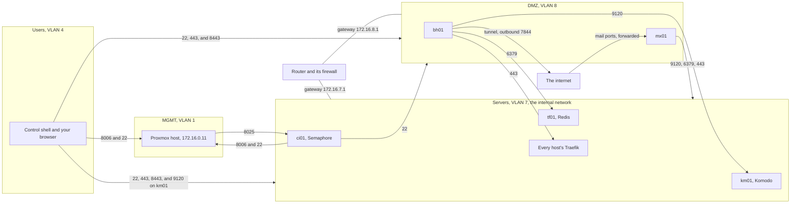

# The network and DNS the fleet expects

The fleet builds its own VMs, and it builds none of the network under them. This page describes that network: the VLANs the fleet touches, what your router has to let pass between them, and how a fleet hostname comes to resolve.

At the end of it you know what to set up on your router, your switch, and your DNS server before the build starts, and which name each page needs pointing at which address. The page has no steps of the fleet's own. The steps on a router depend on your equipment, so the page says what the fleet needs and leaves the clicks to the router's documentation.

Status: written, not yet run. See [Not yet confirmed](#unconfirmed).

## The two networks {#networks}

The fleet's VMs sit on two networks, and each is a VLAN of its own. A VLAN, a virtual LAN, is a separate network that shares switches and cables with others, kept apart by a number tagged on each frame.

| Network | VLAN | Subnet and gateway in these pages | Holds |
| --- | --- | --- | --- |
| Servers | `7` | `172.16.7.0/24`, gateway `172.16.7.1` | Everything that never faces the internet |
| DMZ | `8` | `172.16.8.0/24`, gateway `172.16.8.1` | The hosts that take traffic from the internet |

These pages call the Servers VLAN the internal network. Wherever a page says internal network, internal subnet, or internal host, it means VLAN 7.

Two more VLANs take part in the build and hold no VM. The Proxmox host's management address is on MGMT, VLAN 1, and is `172.16.0.11` in these pages, in `172.16.0.0/24`. The machine you work from, with the control shell and your browser, is on Users, VLAN 4.

The network these pages were written for has eleven VLANs. The fleet touches four of them, and the rest play no part in the build.

| VLAN | Name | Part in the build |
| --- | --- | --- |
| `1` | MGMT | Proxmox management and the network switches. The Proxmox host's own address is here |
| `2` | AV | None |
| `3` | Security | None |
| `4` | Users | End users, and the machine you work from |
| `5` | VoIP | None |
| `7` | Servers | The internal network, with six of the eight VMs |
| `8` | DMZ | bh01 and mx01 |
| `9` | Guest | None |
| `10` | WAN1 | None |
| `11` | WAN2 | None |
| `14` | IOT | None |

Each VM has one static address. You write it in the inventory and in `opentofu/prod.tfvars`, and the build sets it.

| Host | Network | Address |
| --- | --- | --- |
| km01 | Internal | `172.16.7.101` |
| tf01 | Internal | `172.16.7.111` |
| ci01 | Internal | `172.16.7.121` |
| id01 | Internal | `172.16.7.131` |
| pk01 | Internal | `172.16.7.141` |
| ap01 | Internal | `172.16.7.151` |
| bh01 | DMZ | `172.16.8.111` |
| mx01 | DMZ | `172.16.8.121` |

Your own numbers differ. See [The values in these pages](../foundation/index.md#example-values) for what to replace.

Each VM uses its network's gateway as its DNS server too, unless the inventory names another with `network_dns`. In these pages that is the router, at `172.16.7.1` for the internal network and `172.16.8.1` for the DMZ.

<details>
<summary>Background: why the DMZ is a network of its own</summary>

bh01 and mx01 handle traffic that starts on the internet. If one of them is taken over, the attacker holds a machine inside your network.

On a separate VLAN, every connection from that machine to the internal hosts passes through the router, and the router's firewall refuses all but the few listed on this page. On the same network as the other hosts, nothing would stand between them.

</details>

## What to set up before the build {#before}

The fleet configures nothing on the router or the switch. These have to exist before [Proxmox and the installer ISO](../foundation/proxmox-and-installer.md):

| On | The fleet needs |
| --- | --- |
| The router | The Servers and DMZ VLANs, each with a subnet and a gateway address on the router |
| The router's firewall | The flows in [What has to cross](#flows), and nothing else from the DMZ inward |
| The switch | Servers and DMZ carried as tagged VLANs on the port the Proxmox host is plugged in to, beside MGMT for the host's own address |
| The Proxmox host | The bridge `vmbr0` set as VLAN aware |
| The DNS server the VMs use | A way for you to add records. See [Names](#names) |

OpenTofu attaches each VM to the bridge and gives its network device the VLAN tag from the VM's `vlan_id` in `opentofu/prod.tfvars`. The bridge is `vmbr0` unless the VM's entry sets `bridge`. A VM with `vlan_id = 7` is on the internal network, and one with `vlan_id = 8` is on the DMZ.

The DMZ is first used by bh01, so its firewall rules can wait until [bh01's page](../hosts/bh01-dmz-edge.md#boundary). The VLAN itself is simplest to create now, with the internal one.

## What has to cross {#flows}

Hosts on the same VLAN reach each other without the router. A connection that leaves a VLAN goes through the router, and the router's firewall has to allow it.

The fleet needs the flows below, and every one of them crosses the router. Your machine is on Users and the Proxmox host is on MGMT, so neither shares a VLAN with any VM. The other rows run between Servers and the DMZ, or start on the internet. How you write each rule depends on your router.

| From | To | Port | Why |
| --- | --- | --- | --- |
| The control shell, on Users | The Proxmox host, on MGMT | `8006/tcp`, `22/tcp` | OpenTofu creates VMs through the API. The install logs in over SSH to read a new VM's host key |
| The control shell, on Users | Every VM, on Servers and the DMZ | `22/tcp` | The run installs and deploys over SSH |
| The control shell and your browser, on Users | km01 | `9120/tcp` | The run's last stage calls Komodo's API, and you open Komodo at its direct address |
| Your browser, on Users | Every VM | `443/tcp`, `8443/tcp` | The web interfaces, and each host's Traefik dashboard |
| ci01, where Semaphore runs | The Proxmox host, on MGMT | `8006/tcp`, `22/tcp` | The same two as the shell, after the handover |
| The Proxmox host, on MGMT | ci01 | `8025/tcp` | Proxmox's notifications, sent as mail to mailrise |
| ci01 | bh01 and mx01 | `22/tcp` | The run, from Semaphore |
| bh01 and mx01 | km01 | `9120/tcp` | Periphery dials Komodo Core |
| bh01 and mx01 | tf01 | `6379/tcp` | The Redis copy on bh01, and each host's route publisher |
| bh01 | Every internal host that serves a web interface | `443/tcp` | Published routes, the sign-in on id01, and telemetry to ci01 |
| mx01 | ci01 and id01 | `443/tcp` | Telemetry, and the sign-in |
| ci01 | mx01 | `587/tcp` | Service mail, which Postfix relays through Stalwart once mx01 is live |
| mx01 | The UniFi console | The port in `DOCKNS_UNIFI_HOST` | dockns, after bootstrap mode |
| The internet | mx01, by a port forward | `25/tcp`, `465/tcp`, `587/tcp`, `993/tcp` | Mail arriving, and mail clients |

Outbound, every VM needs the internet on ports 80 and 443, for NixOS packages, container images, the fleet-stacks repo, Let's Encrypt, and Cloudflare's API. bh01 also needs port 7844 outbound, over TCP and UDP, for its tunnel. mx01 also needs port 25 outbound, to deliver mail.

Allow nothing else from the DMZ inward, and forward no port to bh01. The web reaches bh01 through the tunnel it opens outward.

The diagram shows the four VLANs, the router that joins them, and the flows that cross it. Every arrow between two boxes passes through the router's firewall.



The diagram draws mx01's three flows as one arrow. They go to km01, tf01, and to ci01 and id01, as the table says. It leaves out the router's lines to Users and MGMT, whose gateway addresses these pages do not give, and ci01's mail to mx01 on port 587.

### The hosts' own firewalls {#host-firewalls}

The router is one of two firewalls on each path. Every VM has a firewall of its own, written by the build, so no rule on a VM is yours to add by hand.

| A VM opens | To |
| --- | --- |
| SSH, port 22 | Any address, with a rate limit |
| Traefik's ports 80, 443, and 8443 | Any address |
| Komodo Core, port 9120 on km01 | Any address |
| The mail ports on mx01 | Any address |
| Redis on tf01, port 6379 | The internal subnet |
| Syslog, the Dozzle agent, and ci01's two SMTP ports | The internal subnet |

The internal subnet is the value of `docker_stacks_internal_subnet` in the inventory. A port opened to it is closed to every other VLAN, which is why bh01 and mx01 are each added to tf01's `docker_stacks_port_sources` by address. The Proxmox host needs the same on ci01 for port 8025. See [Send Proxmox's notifications to mailrise](../hosts/ci01-core-infra.md#proxmox). See [Admit the DMZ on tf01](../hosts/bh01-dmz-edge.md#boundary-tf01) and [The firewall](host-layout.md#firewall).

## Names {#names}

Every web interface in the fleet is reached by name. Traefik on each host picks the container from the name in the request, so an address alone gets no answer from it.

### How a name is formed {#name-forms}

The names are built from the domain, the site's subdomain, the host, and the service. In these pages the domain is `myah-mitchell.com` and the subdomain is `home.`.

| Form | Example | Names |
| --- | --- | --- |
| `<service>.<host>.home.myah-mitchell.com` | `semaphore.ci01.home.myah-mitchell.com` | One service, by the host it runs on |
| `<host>.home.myah-mitchell.com` | `tf01.home.myah-mitchell.com` | The host itself |
| `<service>.home.myah-mitchell.com` | `ntfy.home.myah-mitchell.com` | A service by its short name, inside the site |
| `<service>.myah-mitchell.com` | `auth.myah-mitchell.com` | A public name, reached through bh01's tunnel |

`<service>` is the service's name, such as `komodo` or `traefik`, and `<host>` is the VM's, such as `km01`. The first form is the one the build pages send you to. See [Conventions](https://github.com/myah-mitchell/fleet-stacks/blob/main/docs/conventions.md) in the fleet-stacks repo for the variables behind the forms.

### Three ways a name resolves {#resolving}

No host in this guide runs a DNS server. A name resolves because you, or later dockns, put it somewhere a resolver looks.

| Way | Works for | Used when |
| --- | --- | --- |
| A line in your own machine's hosts file | Your browser and your shell, on that machine alone | Opening a web interface, at any stage |
| A record on your own DNS server | Every machine that uses the server, the VMs and their containers included | A container has to look the name up |
| A record written by dockns | The same as the row above | Not yet, for internal names. See [dockns](#dockns) |

### The hosts file {#hosts-file}

A hosts file is a list of names and addresses that a machine consults before it asks DNS. Each line is an address, a space, and one or more names:

```text
172.16.7.121 semaphore.ci01.home.myah-mitchell.com grafana.ci01.home.myah-mitchell.com
```

| System | File |
| --- | --- |
| Linux | `/etc/hosts` |
| macOS | `/etc/hosts` |
| Windows | `C:\Windows\System32\drivers\etc\hosts` |

Editing it needs root on Linux and macOS, and an editor run as administrator on Windows. The file has no wildcards, so each name needs to be written out.

### A record on your DNS server {#dns-record}

A hosts file on your machine does nothing for a container on a VM. Some containers look a fleet name up themselves, and they ask the VM's DNS server, which is the network's gateway in these pages.

Those names need an A record on that server, pointing at the host's address. The DMZ's DNS server has to resolve the same internal names, because bh01 looks up tf01. How a record is added depends on what serves your DNS.

### dockns {#dockns}

dockns is a container in the system-agent stack. It writes a DNS record for each container on its host that carries dockns labels, on a UniFi console for internal names and at Cloudflare for public ones. It first runs when a host leaves bootstrap mode.

As the fleet-stacks repo stands, dockns writes no internal record. Only ntfy, Stalwart, and Bulwark carry its labels, and those labels name a server called `technitium`, while system-agent sets dockns up with `unifi` and `cloudflare`. Keep every hosts file line and every record made by hand after the fleet leaves bootstrap mode. See [Leaving bootstrap mode](../procedures/leave-bootstrap-mode.md#dockns).

### Which name each page needs {#names-needed}

Each row is the first page that needs the name. A name marked DNS server has to be a record, because a container looks it up. For the others, a hosts file line on your own machine is enough.

| Page | Name | Points at | Where |
| --- | --- | --- | --- |
| [The first run](../foundation/first-run.md) | `komodo.km01.home.myah-mitchell.com` | `172.16.7.101` | Hosts file. Optional, since `http://172.16.7.101:9120` works without a name |
| [Semaphore (ci01)](../hosts/ci01-semaphore.md#first-access) | `semaphore.ci01.home.myah-mitchell.com` | `172.16.7.121` | Hosts file |
| [VictoriaMetrics (ci01)](../hosts/ci01-victoriametrics.md) | `grafana.ci01.home.myah-mitchell.com` | `172.16.7.121` | Hosts file |
| [Core infrastructure (ci01)](../hosts/ci01-core-infra.md) | `uptime-kuma.ci01.home.myah-mitchell.com` | `172.16.7.121` | Hosts file |
| [Identity (id01)](../hosts/id01-identity.md#first-access) | `authentik.id01.home.myah-mitchell.com` | `172.16.7.131` | Hosts file |
| [Certificates (pk01)](../hosts/pk01-certificates.md) | `step-ca.pk01.home.myah-mitchell.com` | `172.16.7.141` | Hosts file |
| [Traefik hub (tf01)](../hosts/tf01-traefik-hub.md) | `tf01.home.myah-mitchell.com` | `172.16.7.111` | DNS server |
| [Traefik hub (tf01)](../hosts/tf01-traefik-hub.md) | `traefik.tf01.home.myah-mitchell.com` | `172.16.7.111` | Hosts file |
| [DMZ edge (bh01)](../hosts/bh01-dmz-edge.md#boundary) | `tf01.home.myah-mitchell.com`, from the DMZ | `172.16.7.111` | DNS server |
| [DMZ edge (bh01)](../hosts/bh01-dmz-edge.md#first-access) | `traefik.bh01.home.myah-mitchell.com` | `172.16.8.111` | Hosts file |
| [Leaving bootstrap mode](../procedures/leave-bootstrap-mode.md) | `authentik.id01.home.myah-mitchell.com` | `172.16.7.131` | DNS server |
| [Leaving bootstrap mode](../procedures/leave-bootstrap-mode.md) | `vmauth.ci01.home.myah-mitchell.com` | `172.16.7.121` | DNS server |
| [Mail (mx01)](../hosts/mx01-mail.md) | `mail.mx01.home.myah-mitchell.com` | `172.16.8.121` | Hosts file |
| [Applications (ap01)](../hosts/ap01-applications.md) | `dozzle.ap01.home.myah-mitchell.com` | `172.16.7.151` | Hosts file |

Public names, such as `auth.myah-mitchell.com`, are records at Cloudflare that a command on bh01's page creates. See [Publishing a hostname](../hosts/bh01-dmz-edge.md#publish).

## Not yet confirmed {#unconfirmed}

Nothing on this page has been tried against a router or a running fleet. It is derived from the build pages and the fleet's repos.

- The list of flows. It is collected from the host pages, the stacks' firewall rules, and the connections the run makes. No fleet has been built behind a firewall that allows only these.
- How MGMT reaches the Proxmox host. The pages give the host's address and say the bridge is VLAN aware. Whether MGMT arrives untagged on the Proxmox host's port is not stated anywhere.
- The Proxmox host's example address. `172.16.0.11` is kept as the pages have it, though MGMT is VLAN 1 and the other example addresses carry their VLAN's number in the third part.
- The subnets and gateways of Users and MGMT, which these pages do not give. Write the rules from Users with your own.
- The Proxmox host to ci01 on port 8025. It follows from the Proxmox host being on MGMT while ci01 opens that port to the internal subnet alone. No page listed it before, and Proxmox Backup Server needs the same from wherever it runs.
- ci01 to the Proxmox host on port 22. It follows from Semaphore running the same install as the shell, which logs in to the Proxmox host. No page lists it as a rule.
- dockns on bh01. mx01's page says dockns needs to reach the UniFi console, and bh01 runs the same system-agent after bootstrap mode. bh01's page lists no such rule.
- The browser's ports. 443, 8443, and 9120 on km01 come from the addresses the pages open. A page may open another port directly.
- Outbound internet for the internal hosts. The pages list the ports for bh01 and mx01, and say of km01 only that it can reach the internet.
- The names table. It lists the first name each page opens. A page may open further names on the same host, each of which needs a line of its own.
- The hosts file paths and the form of a line. They are each system's standard ones and were not checked on a machine for this build.
