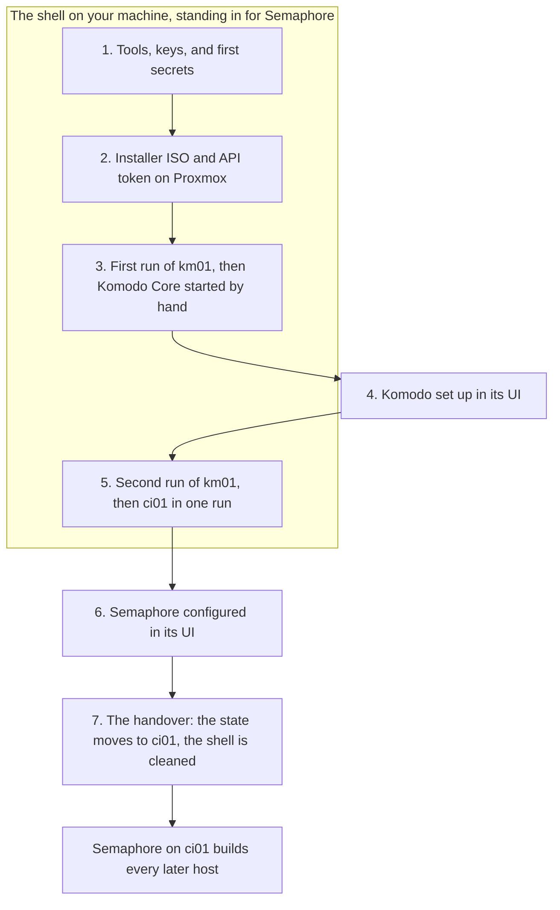

# The foundation

The foundation is everything that has to exist before a host can be built by running one [Template](../../tools/glossary.md#template) in [Semaphore](../../tools/semaphore/index.md): the fleet's keys and secrets, Proxmox with the installer ISO, [Komodo](../../tools/komodo/index.md) on km01, and Semaphore on ci01. Follow these pages one time, in order, when the fleet is built from nothing.

At the end you have two running hosts, km01 and ci01, and a Semaphore that builds every other host from one form. Most of the work is commands in a shell on your own machine. Two pages are done in a web interface, Komodo's and Semaphore's. This is the stretch of the guide with the most manual steps and the most new tools, and each page links a tool to its primer where you first meet it.

Status: written, not yet run. See [what is not yet confirmed](first-run.md#unconfirmed).

## The problem it solves {#why}

Komodo deploys every [stack](../../tools/glossary.md#stack), and Komodo is itself a stack on km01. Semaphore runs every build, and Semaphore is itself a stack on ci01. Neither can build the host it lives on before it exists.

A shell on your own machine stands in for Semaphore until ci01 is up. It runs the same playbook against the same [private repo](../../tools/glossary.md#private-repo), so km01 and ci01 come out the same as every host built after them.

Komodo Core is started by hand one time, on a km01 that the run has already built, and the next run hands that stack over to Komodo.

Nothing built here is temporary except a few files in the shell, which the last page deletes.

## The order of the foundation {#order}

The diagram shows the seven steps in order, which of them the shell does in Semaphore's place, and where the shell hands over.

The shell comes first, because everything after it is a file the shell writes or a command the shell runs. The keys and the secrets are made there, before any host, because the [installer ISO](../../tools/glossary.md#installer-iso) is built from the fleet's file and that file holds the keys.

Proxmox comes next. The run creates a VM from the ISO, so the ISO has to be on the Proxmox host, and the token has to exist, before the first run.

km01 is built in two runs with Komodo's setup between them. The first run stops before the Komodo stage, because there is no Komodo to hand the stacks to. Core is started by hand, set up, and the second run hands the stacks over. ci01 follows in one run. The first run's page has a background block on why, under [Create km01](first-run.md#km01-vm).

Semaphore is set up last, and the handover moves the [state](../../tools/glossary.md#state) to it. Until then the shell is the [control node](../../tools/glossary.md#control-node).

## The steps {#steps}

| Step | Page | Done from |
| --- | --- | --- |
| 1. Set the shell up as a control node, with the keys and the secrets | [The control shell](control-shell.md) | The shell |
| 2. Describe Proxmox, build the installer ISO, and create an API token | [Proxmox and the installer ISO](proxmox-and-installer.md) | The shell and the Proxmox host |
| 3. Create km01 and start Komodo Core | [The first run](first-run.md) | The shell and km01 |
| 4. Set Komodo up | [Setting up Komodo](komodo-setup.md) | Komodo's UI |
| 5. Run km01 in full, then build ci01 | [The first run](first-run.md#km01-full) | The shell |
| 6. Configure Semaphore | [The Semaphore project](semaphore-project.md) | Semaphore's UI |
| 7. Move the state, prove Semaphore, clean the shell | [The handover](handover.md) | The shell and Semaphore |

Every host after that is one run of the `site` Template. See [Fleet bootstrap](../index.md#running-order) for the order.

## What stays by hand {#by-hand}

- Installing Proxmox, and the shell's own tools.
- Starting Komodo Core the first time, in step 3.
- The setup inside Komodo and Semaphore, in steps 4 and 6.
- Each application's own first-run work, such as Authentik's first login and the step-ca key ceremony.

None of these makes one VM differ from another. Every VM is created from the same ISO by [OpenTofu](../../tools/opentofu/index.md) and built from the same [flake](../../tools/glossary.md#flake) by the same playbook.

## What the shell holds {#shell-secrets}

From step 1 until the handover, the shell holds the fleet's SSH private key, the deploy age key, the Proxmox API token, the state passphrase, Komodo's API secret, and OpenTofu's state file. Treat the machine as you would a password manager until step 7 removes them.

Together those files can log in to every host as root, create and delete VMs, and decrypt every secret in the private repo. Each page says what a key or a token is for where it has you create it.

## Read first {#read-first}

[The fleet at a glance](../concepts/the-fleet-at-a-glance.md) shows which tool does which job, and is the place to start if the tools are new to you. [How a host is built](../concepts/how-a-host-is-built.md) explains the run these pages start. [The private repo](../concepts/fleet-private.md) explains the files they have you write.
