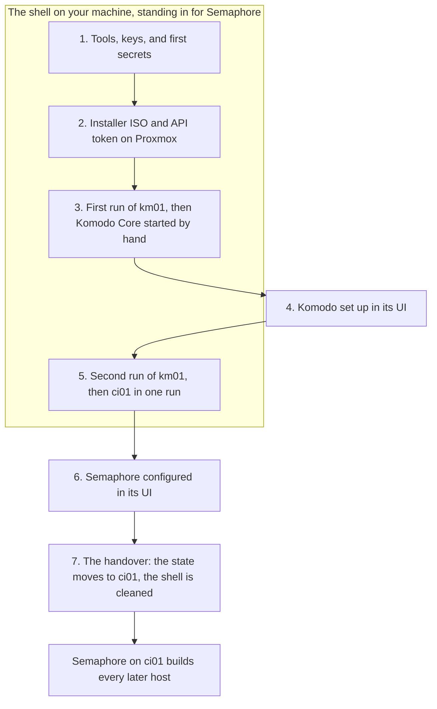

# The foundation

The foundation is everything that has to exist before a host can be built by running one [Template](../../tools/glossary.md#template) in [Semaphore](../../tools/semaphore/index.md): the fleet's keys and secrets, Proxmox with the installer ISO, [Komodo](../../tools/komodo/index.md) on km01, and Semaphore on ci01. Follow these pages one time, in order, when the fleet is built from nothing.

At the end you have two running hosts, km01 and ci01, and a Semaphore that builds every other host from one form. Most of the work is commands in a shell on your own machine. Two pages are done in a web interface, Komodo's and Semaphore's. This is the stretch of the guide with the most manual steps and the most new tools, and each page links a tool to its primer where you first meet it.

Status: written, not yet run. See [what is not yet confirmed](first-run.md#unconfirmed).

## Before you start {#before}

The pages assume a few things exist that the fleet does not build. Gather them first, since some take a day to arrive.

| You need | Used for | First needed |
| --- | --- | --- |
| A server with Proxmox VE installed, and its root password | Running every VM | [Proxmox and the installer ISO](proxmox-and-installer.md) |
| Two [VLANs](../../tools/glossary.md#vlan) on your router and switch, each with a subnet and a gateway, and both carried to the Proxmox host. See [What to set up before the build](../concepts/the-network.md#before) | The internal network and the DMZ | [Proxmox and the installer ISO](proxmox-and-installer.md) |
| A GitHub account, with an SSH key that can push to it | The private repo | [The control shell](control-shell.md#checkouts) |
| A password manager | The keys and secrets that outlive the shell | [The control shell](control-shell.md#age-keys) |
| A domain whose DNS is on Cloudflare, and the right to create an API token for it | Certificates from Let's Encrypt, and public hostnames | [Setting up Komodo](komodo-setup.md) |
| An account at an SMTP relay, such as your mail provider's | Mail the fleet's services send | [Automation and monitoring (ci01)](../hosts/ci01-automation.md) |
| A DNS server you can add records to, or your own machine's hosts file. See [Names](../concepts/the-network.md#names) | Opening each web interface by name | [The first run](first-run.md) |

Later hosts add two more. id01 can use a free MaxMind account, and leaving bootstrap mode as written needs a UniFi console that serves the fleet's DNS.

### The values in these pages {#example-values}

Every address, name, and domain on these pages is an example from one fleet, and yours differ. Replace these wherever they appear:

| On the page | Stands for |
| --- | --- |
| `172.16.7.x`, VLAN `7` | Your internal network. Its gateway is `172.16.7.1` here |
| `172.16.8.x`, VLAN `8` | Your DMZ |
| `172.16.0.11` | Your Proxmox host |
| `myah-mitchell.com` and `home.myah-mitchell.com` | Your domain, and the subdomain for internal names |
| `myah-mitchell` in a GitHub address of the private repo | Your GitHub account. The three public repos stay as written |
| `MYMI`, `mm`, `mmadmin` | Your own short name and the accounts made from it |

The host names, such as km01 and ci01, can stay as they are.

## The problem it solves {#why}

Komodo deploys every [stack](../../tools/glossary.md#stack), and Komodo is itself a stack on km01. Semaphore runs every build, and Semaphore is itself a stack on ci01. Neither can build the host it lives on before it exists.

A shell on your own machine stands in for Semaphore until ci01 is up. It runs the same playbook against the same [private repo](../../tools/glossary.md#private-repo), so km01 and ci01 come out the same as every host built after them.

Komodo Core is started by hand one time, on a km01 that the run has already built, and the next run hands that stack over to Komodo.

Nothing built here is temporary except a few files in the shell, which the last page deletes.

## The order of the foundation {#order}

The diagram shows the seven steps in order, which of them the shell does in Semaphore's place, and where the shell hands over. [The route](#route) lists every page and section in the order you visit them.

The shell comes first, because everything after it is a file the shell writes or a command the shell runs. The keys and the secrets are made there, before any host, because the [installer ISO](../../tools/glossary.md#installer-iso) is built from the fleet's file and that file holds the keys.

Proxmox comes next. The run creates a VM from the ISO, so the ISO has to be on the Proxmox host, and the token has to exist, before the first run.

km01 is built in two runs with Komodo's setup between them. The first run stops before the Komodo stage, because there is no Komodo to hand the stacks to. Core is started by hand, set up, and the second run hands the stacks over. ci01 follows in one run. The first run's page has a background block on why, under [Create km01](first-run.md#km01-vm).

Semaphore is set up last, and the handover moves the [state](../../tools/glossary.md#state) to it. Until then the shell is the [control node](../../tools/glossary.md#control-node).

## The steps {#steps}

| Step | Page | Done from |
| --- | --- | --- |
| 1. Set the shell up as a control node, with the keys and the secrets | [The control shell](control-shell.md) | The shell |
| 2. Describe Proxmox, build the installer ISO, and create an API token | [Proxmox and the installer ISO](proxmox-and-installer.md) | The shell and the Proxmox host |
| 3. Create km01 and start Komodo Core | [The first run](first-run.md) | The shell and km01 |
| 4. Set Komodo up | [Setting up Komodo](komodo-setup.md) | Komodo's UI |
| 5. Run km01 in full, then build ci01 | [The first run](first-run.md#km01-full) | The shell |
| 6. Configure Semaphore | [The Semaphore project](semaphore-project.md) | Semaphore's UI |
| 7. Move the state, prove Semaphore, clean the shell | [The handover](handover.md) | The shell and Semaphore |

Every host after that is one run of the `site` Template. See [Fleet bootstrap](../index.md#running-order) for the order.

## The route {#route}

The seven steps cross between pages more often than the table above shows, because km01 and ci01 have pages of their own. This table is the whole foundation in the order it is done, one row for each stop. Keep it open in a second tab, and find your row whenever a page sends you somewhere else.

| Stop | Go to | What you do there | Then |
| --- | --- | --- | --- |
| 1 | [The control shell](control-shell.md#tools) | Steps 1 to 8: the tools, the checkouts, the keys, the environment file, and the first secrets | Stop 2 |
| 2 | [Describe the Proxmox host](proxmox-and-installer.md#describe) | Step 1, then the first sentence of step 2 | Stop 3 |
| 3 | [km01's inventory entry](../hosts/km01-komodo.md#describe-inventory) | Copy km01's entry and the group's `vars` into `hosts.yml`. Stop at *The VM entry* | Stop 4 |
| 4 | [Write the fleet's file](proxmox-and-installer.md#fleet-file) | The rest of step 2, then steps 3 to 5: the ISO, the API token, and the token in the shell | Stop 5 |
| 5 | [Describe km01](first-run.md#describe) | The first sentence of step 1 | Stop 6 |
| 6 | [km01's VM entry](../hosts/km01-komodo.md#describe-vm) | Copy the VM entry into `opentofu/prod.tfvars` | Stop 7 |
| 7 | [Describe km01](first-run.md#describe) | The rest of step 1, then steps 2 and 3: the run of km01 without Komodo, and Core started by hand | Stop 8 |
| 8 | [Setting up Komodo](komodo-setup.md#admin) | Steps 1 to 8, in Komodo's UI | Stop 9 |
| 9 | [Run km01 in full](first-run.md#km01-full) | Step 5: the commit and the run of km01 in full. Then read step 6, which holds the command for stop 12 | Stop 10 |
| 10 | [Describe ci01](../hosts/ci01-automation.md#describe) | Step 1: ci01's entries and its generated files | Stop 11 |
| 11 | [Semaphore's values](../hosts/ci01-semaphore.md#values), then [VictoriaMetrics'](../hosts/ci01-victoriametrics.md#values), then [core infrastructure's](../hosts/ci01-core-infra.md#values) | Create the fourteen values ci01's stacks read | Stop 12 |
| 12 | [Check the values](../hosts/ci01-automation.md#values-check) | The check, then step 3 with the command from [Build ci01](first-run.md#ci01), then the start of step 4 | Stop 13 |
| 13 | [Verify Semaphore](../hosts/ci01-semaphore.md#verify), then [VictoriaMetrics](../hosts/ci01-victoriametrics.md#verify), then [core infrastructure](../hosts/ci01-core-infra.md#verify) | Check each stack | Stop 14 |
| 14 | [Semaphore's sign-in](../hosts/ci01-semaphore.md#first-access) and [sops](../hosts/ci01-semaphore.md#sops), then [Grafana](../hosts/ci01-victoriametrics.md#first-access), then [ntfy to Uptime Kuma](../hosts/ci01-core-infra.md#ntfy) | Sign in to each service and finish it. These are the rows of [step 5 of ci01's page](../hosts/ci01-automation.md#first-access) | Stop 15 |
| 15 | [The Semaphore project](semaphore-project.md#sign-in) | Steps 1 to 8, in Semaphore's UI | Stop 16 |
| 16 | [The handover](handover.md#tunnel) | Steps 1 to 5: move the state, prove Semaphore, clean the shell | [Identity (id01)](../hosts/id01-identity.md) |

Each page says the same at the point where it sends you away: which section to go to, and which one to come back to. One more page is opened for its tables and not followed: the [register of Variables and Secrets](../concepts/variables-and-secrets.md#operational), from stop 8.

## What stays by hand {#by-hand}

- Installing Proxmox, and the shell's own tools.
- Starting Komodo Core the first time, in step 3.
- The setup inside Komodo and Semaphore, in steps 4 and 6.
- Each application's own first-run work, such as Authentik's first login and the step-ca key ceremony.

None of these makes one VM differ from another. Every VM is created from the same ISO by [OpenTofu](../../tools/opentofu/index.md) and built from the same [flake](../../tools/glossary.md#flake) by the same playbook.

## What the shell holds {#shell-secrets}

From step 1 until the handover, the shell holds the fleet's SSH private key, the deploy age key, the Proxmox API token, the state passphrase, Komodo's API secret, and OpenTofu's state file. Treat the machine as you would a password manager until step 7 removes them.

Together those files can log in to every host as root, create and delete VMs, and decrypt every secret in the private repo. Each page says what a key or a token is for where it has you create it.

## Read first {#read-first}

[The fleet at a glance](../concepts/the-fleet-at-a-glance.md) shows which tool does which job, and is the place to start if the tools are new to you. [How a host is built](../concepts/how-a-host-is-built.md) explains the run these pages start. [The private repo](../concepts/fleet-private.md) explains the files they have you write.
