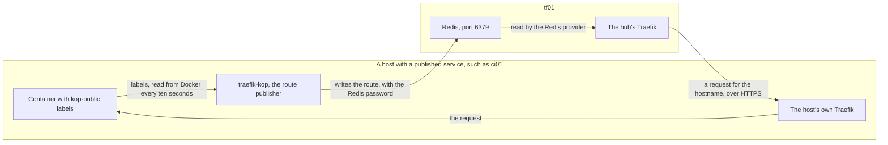

# Traefik hub (tf01)

tf01 is the fleet's [Traefik](../../tools/traefik/index.md) [hub](../../tools/glossary.md#hub). It holds the Redis, a small in-memory database, that every other host publishes its public [routes](../../tools/glossary.md#route) into, and its own Traefik serves those routes from one place. It is also the first host whose Traefik asks Let's Encrypt for a certificate.

Nothing publishes to it until the fleet leaves bootstrap mode, so it could wait until now. It has to come before bh01, because bh01's Redis copies this one. See [How a route reaches the hub](#route-path) for what the Redis is for.

Its own [stack](../../tools/glossary.md#stack) is [traefik-server](../stacks/traefik-server.md), which is traefik-agent with a Redis added. tf01 therefore never runs traefik-agent or traefik-bootstrap beside it.

tf01 is built while the fleet is still in [bootstrap mode](../../tools/glossary.md#bootstrap-mode), and the whole fleet leaves that mode once bh01 is up as well. Until then tf01 is a hub with nothing publishing to it. See [What tf01 does in bootstrap mode](#bootstrap).

At the end of this page tf01 serves its dashboard with a trusted certificate, and its Redis answers on the internal network.

Status: written, not yet run.

## Prerequisites

- The foundation is finished, through [The handover](../foundation/handover.md).
- The seven Traefik values exist in Komodo, from [Setting up Komodo](../foundation/komodo-setup.md#traefik). [Step 2](#values) says which of them tf01 is the first to use.
- A DNS record for `tf01.home.myah-mitchell.com` pointing at `172.16.7.111`, in the DNS server the fleet's hosts use. An entry in your own hosts file is not enough, because containers on tf01 look the name up.
- `docker_stacks_internal_subnet` is set in the `docker_host` group's `vars`. See [The private repo](../concepts/fleet-private.md#describe).

## 1. Describe the host {#describe}

In the [private repo](../../tools/glossary.md#private-repo)'s `hosts.yml`, add tf01 to the `docker_host` group:

```yaml
    tf01:
      ansible_host: 172.16.7.111
      serverHostname: "tf01"
      docker_stacks:
        - system-agent
        - traefik-server
```

The entry has no key that [km01's entry](km01-komodo.md#describe) does not explain. What differs is the list of stacks: traefik-server stands where the other hosts list traefik-agent.

While `docker_stacks_bootstrap: true` is set, the run leaves out system-agent. traefik-server is itself a Traefik, so the run deploys it as it is and adds no stand-in. See [Bootstrap mode](../concepts/bootstrap-mode.md#changes).

In `opentofu/prod.tfvars`, add its VM inside `vms`:

```hcl
  tf01 = {
    server       = "vh01"
    vm_id        = 7111
    cores        = 4
    memory_mb    = 8192
    vlan_id      = 7
    ipv4_address = "172.16.7.111/24"
    ipv4_gateway = "172.16.7.1"
    dns_servers  = ["172.16.7.1"]
    tags         = ["docker"]
    extra_disks = {
      persist = { interface = "scsi2", size_gb = 20 }
    }
  }
```

tf01's Traefik can serve any route the fleet publishes, so it is sized for traffic, with four cores and 8 GB. The disk holds certificates and logs, and 20 GB is plenty.

tf01 is on the internal VLAN. bh01 is the host that faces the internet, and it reaches tf01 over the internal network.

Then generate tf01's files: its SSH host keys, its NixOS file, and its Komodo file.

--8<-- "generate-fleet-files.md"

## 2. Stage the values {#values}

Nothing new is created for tf01. All seven values it reads were created during the foundation, when nothing used them. tf01 is the first host that does, so check these five before the run:

| Name | tf01 uses it to |
| --- | --- |
| `CF_DNS_API_TOKEN` | Create the DNS records that prove to Let's Encrypt that you control the domain |
| `CF_API_EMAIL` | Name the Cloudflare account that owns the token |
| `LE_EMAIL` | Register the Let's Encrypt account |
| `TRAEFIK_KOP_REDIS_PASSWORD` | Set the password of its Redis |
| `TRAEFIK_KOP_REDIS_SERVER` | Find that Redis, from its own route publisher |

The token needs the right to edit DNS records in the zone. Traefik asks for the certificate on its first start, so a token that lacks it shows as an error in [step 4](#verify).

<details>
<summary>Background: why a certificate needs a DNS token</summary>

Let's Encrypt gives a certificate only to someone who proves they control the name. The usual proof is a file served on port 80, which Let's Encrypt fetches from the internet. tf01 is on the internal network and cannot be fetched from outside.

The [DNS-01](../../tools/glossary.md#dns-01) challenge proves the same thing another way. Traefik uses the token to create a TXT record in the zone at Cloudflare, Let's Encrypt reads the record from public DNS, and Traefik removes it again. Nothing has to reach tf01.

DNS-01 is also the only challenge that proves a wildcard, and tf01's certificate is one. See [Certificates from Let's Encrypt](../concepts/bootstrap-mode.md#certificates).

</details>

`TRAEFIK_KOP_REDIS_SERVER` holds the name from the prerequisites, `tf01.home.myah-mitchell.com`.

The Redis password is the one every other host and bh01's replica use later. Changing it after they are built means a redeploy of each.

The other two values are `GLOBAL_AUTHENTIK_HOST`, which names Authentik on id01, and `GLOBAL_CROWDSEC_LAPI_HOST`, which is for [CrowdSec](../../tools/crowdsec/index.md). Neither is used in bootstrap mode. See [Traefik](../concepts/variables-and-secrets.md#traefik) for all seven.

## 3. Run the build {#run}

/// tab | Semaphore

In [Semaphore](../../tools/semaphore/index.md), run the **site** Template with *Target* set to `tf01`.

///

/// tab | Command line

From `~/src/fleet-ansible`, in a shell prepared for runs after the handover. See [Running from a shell again](../foundation/handover.md#shell-runs).

```bash
ansible-playbook -i ../fleet-private/hosts.yml site.yml \
  -e target=tf01
```

///

The run creates the VM, installs NixOS on it, deploys its configuration, and has Komodo deploy one Stack, `traefik-server`.

tf01's configuration opens four ports in its firewall. Three are Traefik's and open to anywhere. The fourth is Redis on port 6379, open to the internal subnet only, because the Redis holds the routing of the whole fleet. See [The firewall](../concepts/host-layout.md#firewall).

<details>
<summary>Manual steps, instead of site.yml</summary>

--8<-- "manual-vm.md"

--8<-- "manual-install.md"

--8<-- "generated/traefik-server/manual.md"

--8<-- "manual-stack-deploy.md"

</details>

## 4. Verify {#verify}

--8<-- "verify-run.md"

The `traefik-server` Stack has seven services:

--8<-- "generated/traefik-server/services.md"

### The certificate {#verify-certificate}

From a machine on the internal network, read the issuer of the certificate Traefik serves:

```bash
openssl s_client -connect 172.16.7.111:443 \
  -servername traefik.tf01.home.myah-mitchell.com < /dev/null 2> /dev/null \
  | openssl x509 -noout -issuer
```

The issuer names Let's Encrypt. The certificate arrives some time after the Stack shows as running, because the DNS challenge has to finish first. A failed handshake, or an issuer of `TRAEFIK DEFAULT CERT`, means it has not arrived.

If it does not arrive, read what the resolver logged, on tf01:

```bash
docker logs traefik-traefik 2>&1 | grep -i acme
```

A rejected token and a rejected email address both show there. Fix the value in Komodo and redeploy the Stack. Let's Encrypt limits how often a failed request can be repeated, so find the cause before trying again.

### The Redis {#verify-redis}

From another host on the internal network, such as ci01, check that the port answers:

```bash
timeout 3 bash -c '< /dev/tcp/172.16.7.111/6379' && echo open
```

The command prints `open`.

On tf01, read the route publisher's log:

```bash
docker logs --tail 20 traefik-traefik-kop
```

The log shows no connection error. A name that does not resolve and a refused password both show there, and the container's health check catches neither.

## 5. Open the dashboard {#first-access}

Open `https://traefik.tf01.home.myah-mitchell.com:8443` in a browser. The name needs a DNS record pointing at tf01, or an entry in your own hosts file.

The browser shows no certificate warning. tf01's certificate covers the domain, every name under it, every name under the sub-domain, and every name under `tf01.home.myah-mitchell.com`.

The dashboard opens with no sign-in while tf01 is in bootstrap mode, for any machine that can reach port 8443 on tf01. It shows the fleet's routes and changes nothing.

## How a route reaches the hub {#route-path}

A container asks to be published with labels that start with `kop-public`. The diagram shows what carries such a route from a container on another host into tf01, and where a request for it goes afterwards.



The route publisher is traefik-kop, a service in every host's traefik-agent stack. It finds the Redis by the name in `TRAEFIK_KOP_REDIS_SERVER` and signs in with `TRAEFIK_KOP_REDIS_PASSWORD`, which is why [step 2](#values) checks both.

The hub's Traefik reads the Redis from inside its own stack, as `redis:6379`. The published route does not point at the container. It points at the Traefik on the container's host, which routes the request a second time. tf01's own traefik-kop publishes to the same Redis, through the port tf01 publishes.

bh01 keeps a copy of this Redis, so the same routes reach the edge. See [Publishing a route beyond its VM](../../tools/traefik/index.md#in-the-fleet) for the whole picture, with both paths a request can take.

## What tf01 does in bootstrap mode {#bootstrap}

| | In bootstrap mode | After it |
| --- | --- | --- |
| Certificate | Let's Encrypt, trusted | The same |
| Dashboard | No sign-in | Authentik first |
| Routes from other hosts | None. No other host runs a route publisher yet | Every route a host marks as public |
| Metrics and logs | Not shipped | Shipped to ci01 by system-agent |

The Redis is up and takes writes from the first deploy. Its table stays empty until the other hosts swap traefik-bootstrap, which has no route publisher, for traefik-agent. See [Leaving bootstrap mode](../procedures/leave-bootstrap-mode.md).

## What to keep safe {#keep}

`/opt/docker/volumes/traefik/traefik-certs` holds `acme.json`: the Let's Encrypt account key and every certificate issued. It is on the persistent disk, so a rebuilt tf01 keeps it and asks Let's Encrypt for nothing.

The Redis keeps no folder on the host. Its table is rebuilt from what the route publishers write, so there is nothing of it to back up.

## What's next

Build bh01, the host that faces the internet. See [DMZ edge (bh01)](bh01-dmz-edge.md).

## Not yet confirmed {#unconfirmed}

- The whole page. tf01 has not been built by the run.
- A first certificate from Let's Encrypt through this stack. No host in the fleet has asked for one, since every earlier Traefik is traefik-bootstrap.
- The rights the Cloudflare token needs. The ACME client's documentation asks for read access to the zone as well as the right to edit its DNS records.
- The Redis health check with a password set. The check sends a command without the password, and whether the refusal counts as a failure has not been tried.
- The route publisher on tf01 reaching its own Redis by tf01's name, through the host's published port.
- Whether the firewall's rule decides who reaches port 6379. Docker publishes a port with rules of its own, and what arrives for a published port is forwarded to the container, so it may never pass the chain the host's rules are in.
- The address the route publisher writes for a published service. [How a route reaches the hub](#route-path) takes it to be the Traefik on the service's own host, on port 443, as [bh01's page](bh01-dmz-edge.md#unconfirmed) does.
- bh01's replica reaching this Redis. tf01's firewall opens port 6379 to the internal subnet only, and bh01 is on the DMZ subnet. See [Open the path across the boundary](bh01-dmz-edge.md#boundary).
