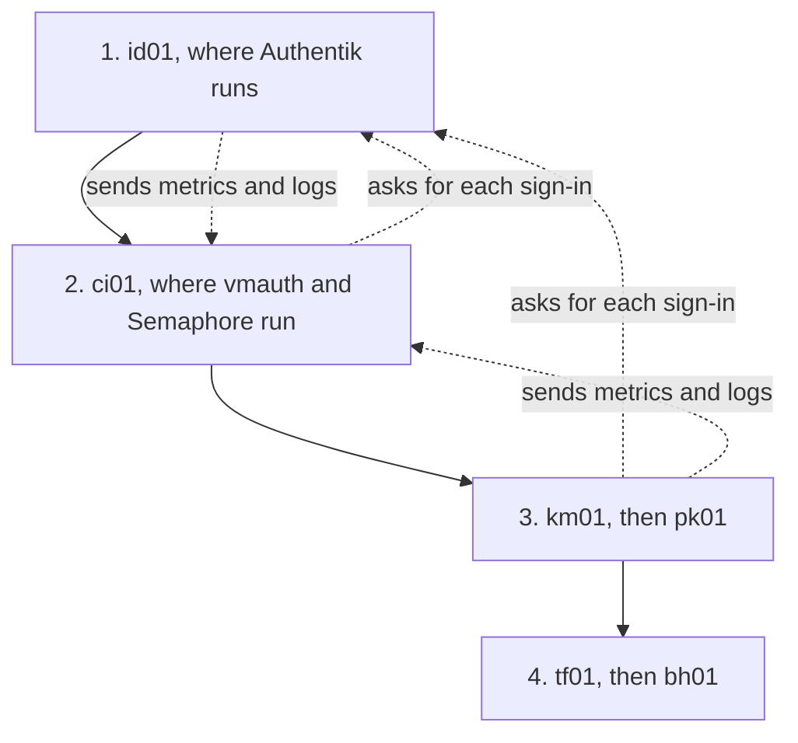

# Leaving bootstrap mode

This procedure takes the fleet out of [bootstrap mode](../../tools/glossary.md#bootstrap-mode). Each host swaps its stand-in [Traefik](../../tools/traefik/index.md) for the real one, gets a trusted certificate, puts [Authentik](../../tools/authentik/index.md)'s sign-in in front of its web interfaces, and starts shipping metrics and logs to ci01. It is one change to the inventory, a little work in Authentik and Komodo, and one run per host.

You do it one time, at row 12 of the [running order](../index.md#running-order), when the hosts the fleet was waiting for are up. See [Bootstrap mode](../concepts/bootstrap-mode.md) for what the mode is and what it changes. This page only covers getting out of it.

| What changes on a host | Before | After |
| --- | --- | --- |
| Traefik | The stand-in, traefik-bootstrap | The real one, traefik-agent. tf01 and bh01 keep the Traefik they have |
| Certificate | Self-signed, with a browser warning | From Let's Encrypt, trusted, as tf01's is already |
| Sign-in | None in front of a web interface | Authentik first |
| Metrics and logs | Not shipped | Shipped to ci01 by system-agent |

It puts no data at risk. Each host's web interfaces are down from the moment its stand-in is taken down until its run finishes, and the run redeploys each Stack whose sign-in changed. What can go wrong is access: with the Authentik setup in [step 2](#authentik) missing, every interface behind the sign-in returns an error.

Status: written, not yet run.

## Prerequisites {#prerequisites}

- Every host in rows 1 to 11 of the [running order](../index.md#running-order) is built: km01, ci01, id01, pk01, tf01, and bh01. The real Traefik on each host publishes to the Redis on tf01, and bh01 copies it.
- mx01 and ap01 are not built yet. Both come after this page and are never in bootstrap mode. See [A host built ahead of the order](#early) if you built one early.
- tf01 serves a certificate from Let's Encrypt. See [The certificate](../hosts/tf01-traefik-hub.md#verify-certificate). It proves the Cloudflare token and the resolver before the other hosts depend on them.
- Authentik has its admin account. See [Create the admin account](../hosts/id01-identity.md#first-access).
- The DNS server the fleet's hosts use resolves three names: the Authentik name to id01, the vmauth name to ci01, and the Redis name to tf01. They are the values of `GLOBAL_AUTHENTIK_HOST`, `GLOBAL_VMAUTH_HOST`, and `TRAEFIK_KOP_REDIS_SERVER`. An entry in your own hosts file is not enough, because containers look the names up. See [A record on your DNS server](../concepts/the-network.md#dns-record).
- A UniFi console that serves the fleet's DNS, and the right to create an API key on it.
- A shell prepared for runs after the handover, for ci01. See [Running from a shell again](../foundation/handover.md#shell-runs).

## Placeholders {#placeholders}

| Placeholder | Value |
| --- | --- |
| `<host>` | The host being moved, such as `id01` |
| `<address>` | That host's address, `ansible_host` in the inventory |
| `<unifi-url>` | The local URL of the UniFi console, with its scheme |

## 1. Stage the values {#values}

Two stacks deploy for the first time when a host leaves bootstrap mode, [system-agent](../stacks/system-agent.md) and [traefik-agent](../stacks/traefik-agent.md). The first collects the host's metrics and logs and runs dockns, and the second is the real Traefik. Most of what they read exists already, as Komodo [Variables and Secrets](../../tools/glossary.md#variables-and-secrets).

| Values | Read by | State |
| --- | --- | --- |
| The seven [Traefik](../concepts/variables-and-secrets.md#traefik) values | traefik-agent | Created in the foundation. tf01 was the first to use them |
| The three [telemetry](../concepts/variables-and-secrets.md#telemetry) values | system-agent | Created when ci01 was built |
| The six [dockns](../concepts/variables-and-secrets.md#dockns) values | system-agent | New. See [The dockns values](#dockns) |

Open *Settings > Variables* in Komodo and check that the first ten exist. A reference with nothing behind it reaches the container as literal text, and the deploy does not stop for it.

### The dockns values {#dockns}

dockns is the container in system-agent that writes DNS records for the containers on its host. It is set up with two places to write to, the UniFi console for internal names and Cloudflare for public ones, and it reads a credential for each.

These values are staged for later. As the fleet-stacks repo stands, dockns writes no internal record: no container's labels name the UniFi server it is given. The records you made by hand stay in use after this page. See [dockns](../concepts/the-network.md#dockns).

Create the two UniFi values all the same. system-agent passes both to dockns on every VM, and the repo does not show whether dockns starts with them missing. On the UniFi console, create **a local API key** that may manage DNS records.

Then create these in Komodo. See [Creating one](../concepts/variables-and-secrets.md#create) for the clicks.

| Name | Kind | Value |
| --- | --- | --- |
| `DOCKNS_UNIFI_HOST` | Variable | `<unifi-url>`, the console's own address and not `api.ui.com` |
| `DOCKNS_UNIFI_API_KEY` | Secret | **The API key** |

The other four are for a VM that hosts something the internet reaches by a record dockns writes in Cloudflare. No host in this guide is one: the public names here are tunnel routes made on [bh01's page](../hosts/bh01-dmz-edge.md#publish).

| Name | Kind | Value |
| --- | --- | --- |
| `DOCKNS_CF_API_KEY` | Secret | **A Cloudflare API token** with DNS edit rights on the zone |
| `DOCKNS_CF_ACCOUNT_ID` | Secret | **The account ID**, from the account overview page in the Cloudflare dashboard |
| `DOCKNS_CF_ZONE_ID` | Secret | **The zone ID**, from the zone overview page for the domain |
| `DOCKNS_WAN_IP` | Variable | **The site's public address** |

Create the four only if a host uses them. For every other host, blank the keys in the inventory, which [step 3](#inventory) does for the whole group. A blanked key reaches the container empty, where a reference to a Secret that does not exist would reach it as literal text.

## 2. Set up the sign-in in Authentik {#authentik}

Create one Provider and one Application in Authentik, and give the Application to the embedded outpost, before the first host leaves. Without them, every interface behind the sign-in chain returns an error.

The steps below are Authentik's own, and its labels change between versions. See [Not yet confirmed](#unconfirmed).

Open Authentik at `https://authentik.id01.home.myah-mitchell.com` and sign in as `akadmin`. id01 is still in bootstrap mode, so the browser warns about the certificate.

1. In the admin interface, open *Applications > Providers* and create a **Proxy Provider**.
2. In *Name*, enter `fleet-forward-auth`.
3. In *Authorization flow*, choose **default-provider-authorization-implicit-consent**. It lets a signed-in person through without a consent page.
4. For the mode, choose **Forward auth (domain level)**.
5. In *Authentication URL*, enter `https://authentik.id01.home.myah-mitchell.com`.
6. In *Cookie domain*, enter `myah-mitchell.com`.
7. Save the Provider.
8. Open *Applications > Applications* and create an Application. In *Name*, enter `Fleet`, and for its Provider, choose **fleet-forward-auth**.
9. Open *Applications > Outposts* and edit **the embedded outpost**.
10. Add **Fleet** to its selected applications, and save.

The outposts list shows the embedded outpost with one Provider.

<details>
<summary>Background: what the Provider, the Application, and the outpost each do</summary>

Outside bootstrap mode, each host's Traefik asks Authentik about every request to a web interface behind the sign-in chain. It passes the request on when Authentik says the browser is signed in, and sends the browser to Authentik's sign-in page when it is not. This is [forward auth](../../tools/glossary.md#forward-auth), and the sign-in chain is the [auth chain](../../tools/glossary.md#auth-chain) that holds it.

Three objects in Authentik make up the answering side.

| Object | Its part |
| --- | --- |
| Provider | Says how one thing is protected. A Proxy Provider in a forward auth mode answers a proxy's question about a request |
| Application | What a person is given access to. It points at one Provider |
| Outpost | The component that receives Traefik's question. The embedded one runs inside Authentik itself, and it only answers for a Provider assigned to it |

Domain level means one Provider covers every interface under the domain. The sign-in cookie is set for `myah-mitchell.com`, so a browser that signed in at one interface is signed in at all of them. The *Authentication URL* is where a browser with no cookie is sent.

See the [Authentik primer](../../tools/authentik/index.md#ideas) for each of these in full, and the [Traefik primer](../../tools/traefik/index.md#in-the-fleet) for the chain.

</details>

Whoever may use the Fleet Application may open every interface behind the chain. `akadmin` can. Give other people access through the Application's bindings, after the fleet has left bootstrap mode.

### Which interfaces ask for a sign-in {#behind-the-chain}

Some interfaces never ask Authentik, in either mode, because they have a login of their own or serve machines.

| Sign-in | Interfaces |
| --- | --- |
| Authentik first | The Traefik dashboard on every host. On ci01: Semaphore, Uptime Kuma, Mailpit, VictoriaMetrics, VictoriaLogs, VictoriaTraces, vmalert, Alertmanager, and the blackbox exporter |
| Never Authentik | Authentik itself, Komodo, step-ca, Grafana, ntfy, and vmauth. On mx01: Stalwart and Bulwark |

## 3. Turn the mode off in the inventory {#inventory}

In the private repo's `hosts.yml`, find the `vars` of the `docker_host` group and remove the `docker_stacks_bootstrap: true` line. That one line is what put the fleet in bootstrap mode.

In the same `vars`, add a block that blanks the four dockns keys for the group:

```yaml
docker_host:
  vars:
    komodo_stack_env:
      system-agent:
        DOCKNS_CF_API_KEY: ""
        DOCKNS_CF_ACCOUNT_ID: ""
        DOCKNS_CF_ZONE_ID: ""
        DOCKNS_WAN_IP: ""
```

A host's own `komodo_stack_env` replaces the group's, and the two are not merged. ci01, id01, and pk01 each have one, so add the same `system-agent` block to each. See [Stack values](../concepts/fleet-private.md#stack-values).

### One host at a time instead {#per-host}

To move a single host and leave the rest, keep the group's line and set the mode on the host:

```yaml
    id01:
      docker_stacks_bootstrap: false
```

A host's value beats the group's. Follow the rest of this page for that host, and come back for the next. When the last host has left, remove the group's line and each host's.

Keep to the order in [step 4](#hosts) when moving hosts this way, for the reasons given there.

### Generate the files {#generate}

--8<-- "generate-fleet-files.md"

Every host has its keys already, so the first command is not needed. Use a commit message such as `Leave bootstrap mode`. The diff shows three changes in each host's Komodo file:

- The `traefik-bootstrap-<host>` Stack is gone, and `traefik-agent-<host>` is there in its place. tf01 and bh01 have neither.
- A `system-agent-<host>` Stack is new.
- `TRAEFIK_AUTH_CHAIN` is blank wherever it was `chain-no-auth@file`.

Each host's NixOS file gains what system-agent needs from the host: its folders and its ports. traefik-agent uses the folders and the ports of the stand-in, so that part of the file stays as it is.

Nothing has changed on any host yet. The files say what each host should be, and a host moves when it is run.

## 4. Move each host {#hosts}

Move the hosts one at a time, in this order. Finish a host and verify it before the next.

| Order | Host | Why here |
| --- | --- | --- |
| 1 | id01 | Every other host's Traefik calls Authentik over HTTPS and checks its certificate. id01 serves a trusted one only after it has left |
| 2 | ci01 | Every agent writes to vmauth over HTTPS and checks the certificate the same way. Until ci01 has left, the agents on id01 keep what they collect |
| 3 | km01, then pk01 | Neither serves anything the others wait for |
| 4 | tf01, then bh01 | Both run the real Traefik already. They gain the sign-in and system-agent |

ci01 has steps of its own. See [Moving ci01](#ci01) before its turn.

<details>
<summary>Background: why id01 goes first and ci01 second</summary>

A host that has left calls two other hosts over HTTPS, and it checks the certificate of each. The diagram shows the order of the moves as solid arrows and those calls as dotted ones.



Every host from the third on makes the same two calls as km01 and pk01. A call only works when the host that is called serves a trusted certificate, which it does after it has left. So the two hosts that are called go first.

id01 goes before ci01 because of what waits in the meantime. The agents keep up to 100 MB of unsent data each, so id01 loses nothing while ci01 is moved. The reverse order would put Semaphore behind a sign-in that ci01's Traefik cannot reach, because it would refuse id01's self-signed certificate.

Each host gains the same three things when it is run: a trusted certificate, the sign-in, and system-agent. The hosts with a stand-in also gain the real Traefik, which publishes their routes to the [hub](../../tools/glossary.md#hub) on tf01.

</details>

### Take the stand-in down {#stand-in}

Skip this on tf01 and bh01, which have no stand-in.

Take the stand-in down by hand before the run. The real Traefik cannot start while the stand-in is up, and the [Resource Sync](../../tools/glossary.md#resource-sync) never removes a Stack.

1. In Komodo's UI, open *Resources > Stacks* and open **the Stack** named `traefik-bootstrap-<host>`.
2. Click **Destroy** and confirm. Komodo takes the Stack's containers down.
3. Delete **the Stack** itself, so it is not deployed again by mistake.

The two cannot run side by side because traefik-bootstrap and traefik-agent are two [Compose projects](../../tools/glossary.md#project) that give their containers the same names and publish the same three ports.

From here until the run finishes, the host's web interfaces do not answer. On km01 that includes Komodo's name behind Traefik. Use the direct address, `http://172.16.7.101:9120`.

On the host, check that the ports are free:

```bash
docker compose ls
docker ps --filter name=traefik-
```

The first list has no `traefik-bootstrap-<host>`, and the second is empty. The stand-in's certificates folder and logs stay on the persistent disk, and the real Traefik uses the same folders.

### Run the host {#run}

/// tab | Semaphore

In Semaphore, run the **site** Template with *Target* set to **the host's name**.

///

/// tab | Command line

From `~/src/fleet-ansible`, in a shell prepared for runs after the handover. See [Running from a shell again](../foundation/handover.md#shell-runs).

```bash
ansible-playbook -i ../fleet-private/hosts.yml site.yml \
  -e target=<host>
```

///

The NixOS stage deploys the host's configuration, which makes the folders the two stacks need and opens their ports. The last stage has Komodo create and deploy `traefik-agent-<host>` and `system-agent-<host>`, and redeploy each Stack whose chain changed.

### Verify the host {#verify}

--8<-- "verify-run.md"

The host's Stacks now include `traefik-agent-<host>` and `system-agent-<host>`, and no `traefik-bootstrap-<host>`.

Read the issuer of the certificate the host serves, from a machine on the internal network:

```bash
openssl s_client -connect <address>:443 \
  -servername traefik.<host>.home.myah-mitchell.com < /dev/null 2> /dev/null \
  | openssl x509 -noout -issuer
```

The issuer names Let's Encrypt. The certificate arrives a few minutes after the Stack shows as running, because the [DNS challenge](../../tools/glossary.md#dns-01) has to finish.

An issuer of `TRAEFIK DEFAULT CERT` means it has not arrived yet. If it stays that way, read the resolver's errors on the host:

```bash
docker logs traefik-traefik 2>&1 | grep -i acme
```

Then open the host's Traefik dashboard in a browser:

```text
https://traefik.<host>.home.myah-mitchell.com:8443
```

The browser shows no certificate warning. Authentik asks for a sign-in, and the dashboard loads after it.

For the metrics and logs, use the checks on the stack's page. See [system-agent](../stacks/system-agent.md#verify). On id01 they show nothing until ci01 has been moved.

### Moving ci01 {#ci01}

Run ci01 from a shell, not from Semaphore. Semaphore is behind ci01's Traefik, and its own Stack is one of those the run redeploys, so a run started in Semaphore would be cut off partway.

1. Prepare the shell and open the tunnel to the state database. That database holds OpenTofu's [state](../../tools/glossary.md#state), and it is on ci01. See [Running from a shell again](../foundation/handover.md#shell-runs).
2. Take the stand-in down, as [above](#stand-in). Komodo is on km01 and is not affected.
3. Run the command from the **Command line** tab with `ci01` as the target.
4. Verify ci01 as [above](#verify). `system-agent-ci01` is the first agent to report, so ci01's own metrics and logs are the first to show in Grafana.
5. Open Semaphore at its own name. Authentik asks for a sign-in first, and Semaphore's own login follows.
6. Clean the shell. See [Clean the shell](../foundation/handover.md#clean).

Run every later host from Semaphore again.

### Moving tf01 and bh01 {#tf01-bh01}

Neither has a stand-in to take down. The run redeploys the host's Traefik Stack with the sign-in chain, which drops every route through that host for a moment, and adds `system-agent-<host>`.

bh01 reaches id01 and ci01 across the router. The rule for port 443 on [bh01's page](../hosts/bh01-dmz-edge.md#boundary) covers both.

### A host built ahead of the order {#early}

The running order builds mx01 and ap01 after this page, so neither has anything to move. If you built one of them while the fleet was still in bootstrap mode, it has a stand-in like the first hosts, and nothing waits on it. Move it last, after bh01, with the same three steps: take the stand-in down, run the host, and verify it.

On mx01, follow that with the steps of its page that had to wait. See [If the fleet is still in bootstrap mode](../hosts/mx01-mail.md#bootstrap).

## 5. Check the fleet {#fleet}

In Komodo, open *Resources > Stacks* and search for `traefik-bootstrap`. The list is empty.

Open **the Resource Sync** named `fleet` and look at its *Pending* view. Nothing is pending for a host that has been moved.

Keep the DNS records and the hosts file lines made by hand. dockns is running, and it does not write the internal records yet. See [The dockns values](#dockns).

## What's next {#whats-next}

Publish the names the internet should reach. See [Publishing a hostname](../hosts/bh01-dmz-edge.md#publish).

A host added from now on is never in bootstrap mode. See [Mail (mx01)](../hosts/mx01-mail.md) and [Applications (ap01)](../hosts/ap01-applications.md), the next two rows of the running order, and [Adding a host](add-a-host.md) for a host of your own.

### Replacing the static SSH key {#ssh-key}

Not available yet. The fleet's one static SSH key stays as it is, in Semaphore's Key Store and in your password manager, because nothing in the flake makes a host trust step-ca's SSH certificate authority.

## Not yet confirmed {#unconfirmed}

No host has left bootstrap mode by these steps.

- The Authentik steps in [step 2](#authentik). The field names follow Authentik's documentation and were not read from a running Authentik. The steps name no button for creating or saving, and the Provider form may ask for more than they set. The *Authorization flow* field and the flow's name, `default-provider-authorization-implicit-consent`, are taken from Authentik's documentation, not from a live instance. Whether one Provider in domain mode is enough for every interface, with the outpost's paths served by id01's Traefik alone, has not been tried.
- What a browser sees when the Provider is missing. The page expects an error from Traefik on every interface behind the chain.
- The labels *Destroy* and the Stack's delete action in Komodo, and what deleting a Stack does to containers that are still up. Destroying first makes the second question moot.
- What the run does when the stand-in is still up. The page expects the deploy of `traefik-agent-<host>` to fail on a container name that is taken, and the run to stop at its last stage.
- system-agent on ci01, where the agents and the vmauth they send to share a host. See [system-agent](../stacks/system-agent.md#unconfirmed).
- dockns. The containers that carry its labels name a DNS server the stack does not define, so it is not expected to write an internal record. Whether dockns starts with the two UniFi values missing or wrong has not been tried. See [system-agent](../stacks/system-agent.md#unconfirmed).
- The first certificate on each host. Every host asks Let's Encrypt for its own, under its own names, within the same hour or two.
- A run against ci01 from a shell while the run redeploys Semaphore. The tunnel is only used in the first stage, which is over by then.
- The scrape of Traefik's metrics, and syslog over TCP. See [system-agent](../stacks/system-agent.md#unconfirmed).
