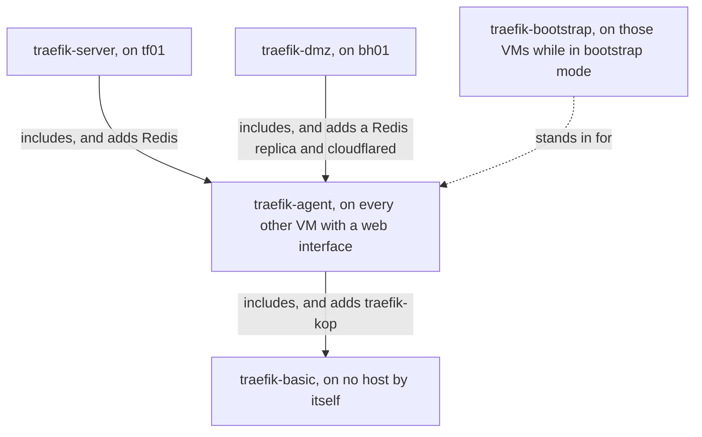

# Stacks

A stack is a set of containers that are defined together and deployed together. Each one is a folder under `stacks/` in the fleet-stacks repo, holding a [Docker Compose](../../tools/docker-compose/index.md) file that defines the containers. [Komodo](../../tools/komodo/index.md) deploys that file to a host and keeps the containers as it defines them.

These pages are reference: what each stack runs, the values it reads, what it needs on the host, and how to check it. None of them deploys anything. A host gets a stack by listing it under `docker_stacks` in the [inventory](../../tools/glossary.md#inventory) and being run. See [How a host is built](../concepts/how-a-host-is-built.md).

The tables of services, values, folders, seed files, and ports on each page are generated from the fleet-stacks repo. The run reads the same files, so the tables match what a host is given.

The stacks in the plan fall into three groups, and a fourth section lists the ones no host runs.

| Group | What sets it apart |
| --- | --- |
| [One per host](#per-host) | The stack is the reason one VM exists, and runs on that VM alone |
| [One per VM](#per-vm) | The same stack runs on many VMs, and does the fleet's housekeeping on each |
| [Building blocks](#layers) | The stack is written to be included in another, so the Traefik stacks share one definition |

## One per host {#per-host}

Each of these is what a specific VM is for.

| Stack | Provides | Host |
| --- | --- | --- |
| [komodo-server](komodo-server.md) | Komodo Core and its database | [km01](../hosts/km01-komodo.md) |
| [semaphore-server](semaphore-server.md) | Semaphore, and the database that holds OpenTofu's state | [ci01](../hosts/ci01-semaphore.md) |
| [victoriametrics-server](victoriametrics-server.md) | Metrics, logs, traces, alerting, and Grafana | [ci01](../hosts/ci01-victoriametrics.md) |
| [core-infra](core-infra.md) | Notifications, the mail relay, and uptime checks | [ci01](../hosts/ci01-core-infra.md) |
| [authentik-server](authentik-server.md) | Authentik, the identity provider behind the fleet's sign-in | [id01](../hosts/id01-identity.md) |
| [step-ca-server](step-ca-server.md) | The internal certificate authority | [pk01](../hosts/pk01-certificates.md) |
| [traefik-server](traefik-server.md) | The internal Traefik hub and the Redis every host publishes routes to | [tf01](../hosts/tf01-traefik-hub.md) |
| [traefik-dmz](traefik-dmz.md) | The public edge, with the tunnel to Cloudflare | [bh01](../hosts/bh01-dmz-edge.md) |
| [stalwart-server](stalwart-server.md) | Mailboxes for the domain. Optional | [mx01](../hosts/mx01-mail.md) |

## One per VM {#per-vm}

Each of these runs on many VMs and does the same job on each.

| Stack | Provides | Runs on |
| --- | --- | --- |
| [system-agent](system-agent.md) | Metrics, logs, container DNS, and a Dozzle agent | Every VM |
| [traefik-agent](traefik-agent.md) | The VM's own Traefik, and the route publisher | Every VM that serves a web interface, outside bootstrap mode |
| [traefik-bootstrap](traefik-bootstrap.md) | A stand-in Traefik with no dependency on another host | Every VM that serves a web interface, in bootstrap mode |

A Stack, with a capital, is Komodo's record of one stack deployed on one host. Komodo wants Stack names unique, so the Stack for one of these carries the host's name on the end, such as `system-agent-id01`. Container and network names come from the Compose [project](../../tools/glossary.md#project) name and do not change.

traefik-agent and traefik-bootstrap both bind ports 80, 443, and 8443, so a VM runs one or the other. The inventory always lists traefik-agent, and the run swaps in traefik-bootstrap while the host is in bootstrap mode. See [Bootstrap mode](../concepts/bootstrap-mode.md).

## Building blocks {#layers}

These are pulled into other stacks through Compose `include`, which makes one stack's services part of another. Each works as a stack on its own.

| Stack | Provides | Included by |
| --- | --- | --- |
| [traefik-basic](traefik-basic.md) | Traefik, its error pages, and its socket proxies | traefik-agent |
| [traefik-agent](traefik-agent.md) | traefik-basic and the route publisher | traefik-server, traefik-dmz |

traefik-agent is a building block as well as a stack of its own. traefik-server and traefik-dmz include it, so tf01 and bh01 do not list it.

### How the Traefik stacks relate {#traefik-stacks}

A VM that serves a web interface runs one of the five Traefik stacks, and never two, because each binds ports 80, 443, and 8443. Four of them form a chain, each including the one before it and adding to it. The diagram shows the chain and where each stack runs.

traefik-bootstrap is outside the chain. It defines the same five services as traefik-basic in its own file, and takes traefik-agent's place while a host is in bootstrap mode. tf01 and bh01 keep their own stacks in both modes.

The chain also works together once deployed. traefik-kop on each VM publishes routes to the Redis on tf01, the Traefik on tf01 reads them, and the replica on bh01 copies them for the public edge. See [traefik-agent](traefik-agent.md#services) and [traefik-server](traefik-server.md#services).

## Not in the plan {#unused}

| Stack | Provides | Why no host lists it |
| --- | --- | --- |
| [dozzle-server](dozzle-server.md) | A log viewer for every VM's Dozzle agent | No host chosen yet |
| [crowdsec-server](crowdsec-server.md) | [CrowdSec](../../tools/crowdsec/index.md)'s central server, which decides which addresses to block | Cloudflare and the network's own intrusion detection cover the same ground |
| [crowdsec-agent](crowdsec-agent.md) | A CrowdSec that reads one host's logs and reports to that server | The same |
| [technitium-server](technitium-server.md) | [Technitium](../../tools/technitium/index.md), a DNS server | dockns, in system-agent, writes records to the network's own DNS |
| [victoriametrics-agent](victoriametrics-agent.md) | The metric and log collectors alone | system-agent carries the same collectors and publishes the same port |
| [dozzle-agent](dozzle-agent.md) | The Dozzle agent alone | system-agent carries the same agent and publishes the same port |

The folders stay in the repo because the container definitions still work. Use one on a host of your own the way [Applications (ap01)](../hosts/ap01-applications.md) describes.

## Starting a new stack {#template}

The repo's `template` stack defines the four standard networks (`proxy`, `frontend`, `backend`, and `socket_proxy`) and no services. Copy it to start a stack of your own. See [Applications (ap01)](../hosts/ap01-applications.md#new-stack).
