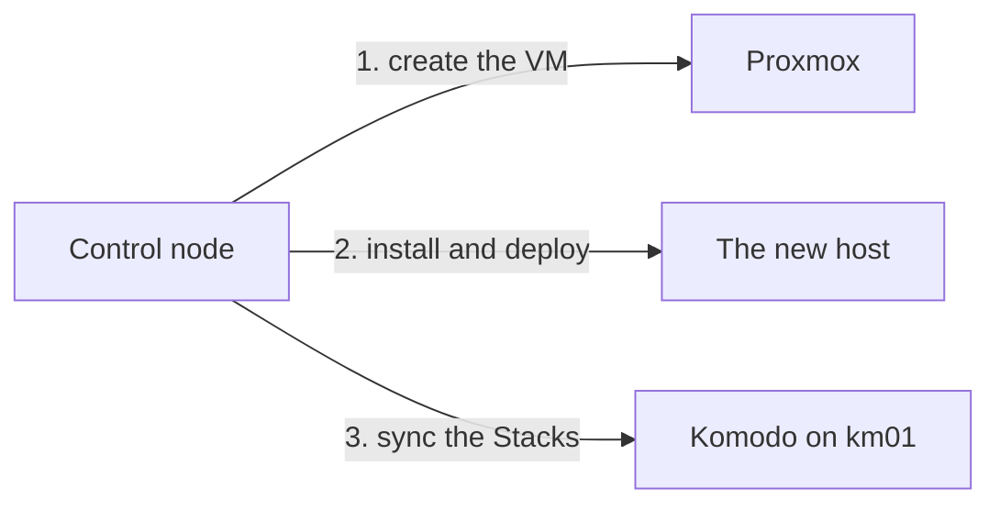

# Markdown style guide

The house standard for every Markdown file in these repos: READMEs, `docs/` pages, runbooks, contributing guides, and anything else a person reads instead of runs.

It exists to make a page skimmable. A reader should be able to run their eye down it, see every action they have to take, and do the job correctly without reading a single paragraph of explanation. Explanation is still there for the reader who wants it, but it never sits between someone and the next thing they have to type.

Two rules carry most of that weight: the [emphasis system](#the-emphasis-system), which makes actions visible, and [density](#density), which keeps explanation out of the way.

## Contents

- [The emphasis system](#the-emphasis-system)
- [Density](#density)
- [Procedures and runbooks](#procedures-and-runbooks)
- [Site-only features](#site-only-features)
- [Fleet bootstrap pages](#fleet-bootstrap-pages)
- [Tool pages](#tool-pages)
- [Headings and structure](#headings-and-structure)
- [Voice and prose](#voice-and-prose)
- [Code blocks and commands](#code-blocks-and-commands)
- [Placeholders and example values](#placeholders-and-example-values)
- [Links](#links)
- [Lists and tables](#lists-and-tables)
- [Callouts](#callouts)
- [Images and screenshots](#images-and-screenshots)
- [Diagrams](#diagrams)
- [Files and layout](#files-and-layout)
- [Punctuation and characters](#punctuation-and-characters)
- [Before and after](#before-and-after)
- [Applying this to an existing repo](#applying-this-to-an-existing-repo)
- [Review checklist](#review-checklist)
- [Linting](#linting)

## The emphasis system

Three markers, three meanings, no overlap.

| Marker | Meaning | Examples |
| --- | --- | --- |
| `**bold**` | Something the reader does or supplies | **Sign Up**, **Deploy**, **Add Server**, **Is Secret** |
| `*italic*` | Something printed on the screen being described | *Settings > Variables*, *Public key*, *Console*, *Name* |
| `` `code` `` | A string the reader acts on: copies, types, runs, or matches exactly | `qm start 101`, `/opt/docker/volumes`, `--full`, `KOMODO_DB_USERNAME` |

### Bold is the action

Bold marks the thing the reader clicks, presses, chooses, ticks, or has to provide. It answers "what do I do here?".

Use it for buttons, menu items being chosen, dropdown options being selected, checkboxes being ticked, keys being pressed, and any value the reader supplies that is not a literal string (see [when two rules collide](#when-two-rules-collide)).

The same name is bold only where the reader acts on it. "Run the **site** Template" is an action. "The `site` Template runs every stage" describes it, so the name is code. A button named in a *Not yet confirmed* list or in an explanation is a label, so it is italic.

In a table of fields and values, the field is italic, a value picked from a list is bold, and a value typed as written is code.

Bold needs something the reader can name: a control on the screen, a key, or a value they supply, such as **your relay's login**. An ordinary noun the step merely handles is plain text. Write "Copy the key" and "start a sync", not "Copy **the key**" and "start **a sync**".

Because bold means this and nothing else, a reader can scan a page, read only the bold, and see the entire sequence of actions. That property is the whole point, and it survives only if bold is never used for anything else: not for emphasis, not for warnings, not for the first mention of a term, not to make a paragraph look important.

### Italic is the label

Italic marks text the interface displays: field labels, tab names, section titles, dialog titles, column headers, page names, the wording of a message the reader will see. It answers "where am I?" and "what is this called?".

Quote the label exactly as it appears on screen, including its capitalisation. If the UI says *E-mail address*, write *E-mail address*, not *Email*.

Navigation paths are locations, so they are italic, with `>` between the levels and no code formatting inside them:

```markdown
In *Datacenter > km01 > Console*, watch the host boot.

Go to *Settings > Variables* and click **New Variable**.
```

### Code is what the reader acts on

Code marks a string the reader will act on: copy it, type it, paste it, run it, or match it character for character against something on their own screen.

That covers commands and flags, paths they open or change into, filenames they edit, config keys and the values they set, environment variables, the exact text to enter in a field, and output they compare against.

Bold marks where the reader's hands move in the interface. Code marks where they move on the keyboard. Both are about what the reader does, which is why neither can be spent on ordinary description.

#### Naming is not acting

A name that identifies something, rather than one to be reproduced, is plain. Most technical nouns in explanatory prose are names.

Ask whether the reader's hands move. If the sentence says what a thing is, what it does, or where it sits in the system, its name is plain. If the sentence tells the reader to produce that string, it is code.

```markdown
system-agent supersedes traefik-agent, victoriametrics-agent and dozzle-agent
for the per-VM role.

Confirm `traefik`, `error-pages` and `logrotate` all show as running.
```

The first sentence is taxonomy. Nobody types those names; they are the subject being described. The second has the reader reading names off a terminal and comparing them, so the exact strings matter.

The same word switches on how it is used, not on what it refers to:

```markdown
The fleet-ansible repo is public, so no deploy key is needed.

Clone it to `/tmp/fleet-ansible`, then run `ansible-playbook -i hosts.yml site.yml -e target=km01`.

Semaphore reaches every host as the `ansible` service account.
```

A repo being named, then a path and a command, then a Unix username the machine matches exactly.

#### Lists of names are the usual failure

A sentence that names four or five things and marks every one of them turns into a row of boxes, and the reader stops reading it as a sentence. This is the most common way a page becomes hard to read.

If those names are being described, unmark them. If the reader really does need all of them exactly, the sentence is the wrong container: use a table or a code block, where the marker costs nothing because the whole cell or line is already set apart.

More than about three code spans in one sentence is the signal.

#### When a plain name would not survive

Keep the marker where dropping it would mislead or garble. This exception stays narrow, or it grows back into the category rule it replaced.

It applies to a literal that collides with an ordinary word, so that plain text reads as prose rather than as a value: `main` as a branch, the `users` role, a service account called `ansible`.

It also applies to anything that is not a word: `target: docker_host`, `NODE_EXPORTER: true`, `chain-no-auth@file`, `POSTGRES_PASSWORD`. Marking these is not about the reader acting, it is about the text being legible at all.

#### Why this is not a category rule

The obvious alternative is to mark by kind: all hostnames, all filenames, all VM names. It is easier to apply and it can be linted, and it is what this guide used to say.

It fails on repetition. The words a document uses most are the ones the document is about, so a category rule marks them in every other sentence. A page about one host will name that host forty times and have the reader type it four.

Judgment about what the reader is doing is the thing that cannot be automated, which is exactly why it belongs in the standard rather than in the linter.

### When two rules collide

Apply the first rule that matches:

1. Will the reader copy, type, run, or exactly match this string? Use `code`.
2. Otherwise, must the reader act on it or supply it? Use **bold**.
3. Otherwise, is it text the interface displays? Use *italic*.
4. Otherwise, leave it plain.

Three consequences come up constantly and are worth spelling out.

#### Role beats type

A button is a labelled thing on the page, but when the reader is told to press it the action wins and it is bold. The same element is italic when you are only locating it:

```markdown
Click **Sign Up**.

The *Sign Up* form only appears while no admin account exists.
```

#### Code beats bold

A value the reader types exactly is code, never bold, and never both. Code already means "reproduce this exactly", so bolding it adds nothing but noise. Never nest markers: `` **`km01`** `` is always wrong, and so is a code span inside an italic navigation path.

```markdown
In *Server Name*, enter `km01`.
```

Bold still applies to a value chosen from the interface rather than typed, because that is a control, not machine text:

```markdown
Set *Restart Mode* to **unless-stopped**.
```

#### Neither marker is for stress

Bold and italic point at things on screen. They never mean "note this" or "I really mean it". If a sentence needs force, the force belongs in the words:

```markdown
Bad:  You set these **once**, here, and every stack picks them up.
Good: You set these here, one time, and every stack picks them up.

Bad:  Komodo can't GitOps-deploy *itself* the first time.
Good: Komodo can GitOps-deploy every other stack, but not its own.
```

If the force is a real consequence, it is a [callout](#callouts), not bold:

```markdown
Bad:  **If you type a password by hand, keep it alphanumeric.**

Good: > [!WARNING]
      > A hand-typed password must be alphanumeric. `containers/ferretdb/compose.yaml`
      > substitutes `POSTGRES_PASSWORD` into a connection URL without encoding it, so
      > `@`, `:`, `/`, `#`, or `?` breaks the URL and surfaces as a DNS error.
```

#### No run-in labels

A paragraph or list item that opens with a bold phrase standing in for a heading is the most common way this system gets diluted, because the bold reads as an action from across the page and turns out to be a topic. If a paragraph needs a label, it needs a subheading:

```markdown
Bad:  **A shared operational tip, not repeated in every doc**: most stacks are gated
      behind `chain-authentik@file`.
Good: ### A shared operational tip

      Most stacks are gated behind `chain-authentik@file`.
```

### Keep the units small

Emphasis marks a target the reader can point at, so it is one to four words. Never bold or italicise a whole sentence, a whole list item, or any clause containing a verb.

```markdown
Bad:  **Registering other hosts and deploying stacks to them through Komodo** is covered elsewhere.
Good: Registering other hosts, and deploying stacks to them, is covered in [ci01-bootstrap.md](ci01-bootstrap.md).
```

### Documents with no interface

In CLI, API, or config reference docs there is often nothing to click, so bold barely appears and code carries the page. That is correct. Do not manufacture bold to make such a page look formatted.

The common exception is a value the reader must supply before the commands will work, which is a genuine action item:

```markdown
Export **your Proxmox API token** as `PVE_TOKEN` before running any of these.
```

## Density

A page fails at a glance long before it fails on its facts. These limits keep explanation from burying the instructions.

### One idea per paragraph

Three sentences at most inside a procedure, five in a section that is purely explanatory. A paragraph still going after that is two paragraphs, or it is a subsection.

A closing sentence that only points somewhere, such as `See [Host keys](secrets-with-sops.md#host-keys).`, does not count toward the limit.

### No nested parentheses

One parenthetical per paragraph, and never an aside inside an aside. If the aside needs more than a short clause, promote it to its own sentence after the one it qualifies:

```markdown
Bad:  It clones the public repo (https://github.com/myah-mitchell/fleet-ansible, no
      credential needed, it's public) to /tmp/fleet-ansible.
Good: It clones `https://github.com/myah-mitchell/fleet-ansible` to `/tmp/fleet-ansible`. That
      repo is public, so no credential is needed.
```

### Lead with the conclusion

Then give the reason. A reader who already knows why can stop after the first sentence.

```markdown
Bad:  Because the flake reads the private repo through git and takes only the files
      git tracks, and a file you have just generated is not tracked yet, you need
      to add the host's file before the run.
Good: Add the host's file with `git add` before the run. The flake reads only the
      files git tracks, so a file you have just generated does not reach the host
      until it is added.
```

### Instruction first, rationale after

Never open a step with background. The first line of a step says what to do, and six lines of rationale after it is the ceiling. Anything longer moves into a [background block](#background-blocks), below the procedure under its own heading, or into a concepts page the step links to.

### Keep cross-references out of the middle of sentences

Put the link at the end of the sentence, or on its own line. A sentence interrupted by two file paths and a parenthetical is not recoverable on a first read.

### One aside per step, not one per sentence

History, alternatives not taken, and future plans are all worth writing down, but they belong in a *Background* or *What's next* section rather than woven through the instructions.

## Procedures and runbooks

Numbered list, one action per step, in the order performed. Lead with the location so the reader is never hunting for a control they have already been told to press:

```markdown
1. Open *Settings > Variables* and click **New Variable**.
2. In *Name*, enter `GLOBAL_PUID`, and in *Value*, enter `1000`.
3. Leave **Is Secret** unticked. These are operational defaults, not credentials.
4. Click **Save**. The variable appears in the *Variables* list immediately.
```

Rules that keep procedures readable:

- One bold item per step as a rule of thumb. Two usually means two steps. A location followed by the control you press is the normal exception.
- End a step with its observable result when the reader would otherwise not know it worked.
- Prerequisites go in a section before the list, never as step 0.
- Lead a conditional step with its condition: "If the host is already joined to the cluster, skip to step 6."
- Do not number a single-step procedure. Write it as a sentence.

Long-form runbooks, where a step owns several commands and a paragraph of context, use numbered `##` headings instead of a numbered list. This is the one place a heading may carry a number, because later steps refer back to earlier ones by number:

```markdown
## 7. Create the runtime folders
```

A runbook also gets, in this order: a one-paragraph statement of what it builds and when to use it, a *Prerequisites* section listing what must already be true, a placeholder table, the numbered steps, and a *What's next* section. Verification belongs inside the step that needs it, not collected at the end.

When automation does a step for the reader, lead with the automated path and put the hand-run commands in a collapsed block after it. The page stays short for the common case and complete for a reader without the automation:

````markdown
Run the **site** Template with *Target* set to `ci01`.

<details>
<summary>Manual steps, instead of site.yml</summary>

```bash
mkdir -p /opt/docker/volumes/core/ntfy-data
```

</details>
````

- The summary always reads "Manual steps, instead of" and names the tool, so the reader knows what the block replaces.
- Leave a blank line after `<summary>` and before `</details>`. Without them GitHub shows the Markdown inside as plain text.
- Collapse only alternatives and [background](#background-blocks). A step every reader must do, a warning, or a verification never goes inside a collapsed block.
- `details` and `summary` are the only HTML allowed in a page. See [Linting](#linting).

### Background blocks

A background block holds the why behind a step: how the thing works, why it is done this way, what was decided against. It is collapsed, so a reader who is building skips it and a reader who is learning opens it.

````markdown
Add the host's files with `git add` before the run.

<details>
<summary>Background: why the flake only sees tracked files</summary>

A flake copies its source into the nix store before it evaluates anything, and for a git repo it copies only what git tracks. A file you have just generated is on disk but not in that copy, so the build behaves as if it did not exist.

</details>
````

- The summary always starts "Background:" and then names the question the block answers, in lower case. A reader decides from the summary alone whether to open it.
- The block explains and nothing else. It holds no step, no value to set, no warning, and no verification, so skipping every one on a page loses nothing the build needs.
- The instruction comes first and the block follows it. One sentence of reason may stay in the open after a surprising step. The block is for what goes past that.
- One block per step, and at most a screen long. A block that outgrows that, or that two pages need, becomes a page of its own, and each step links to it.
- An explanation of a tool in general belongs in that tool's [primer](#primers), not in a block. The block says what is particular to this step and links to the primer for the rest.
- A block may hold a [diagram](#diagrams), a table, or a code block that illustrates. A code block inside one is never something to run.

## Site-only features

Three features work on the built site and not in a forge's Markdown view. Use them in this repo, where the site is what people read. Keep them out of a README and out of any file that is read on GitHub.

| Feature | Use it for | On GitHub |
| --- | --- | --- |
| Explicit anchor | A heading other pages link to | The braces print after the heading |
| Include | Text that more than one page needs word for word | The include line prints and the text is missing |
| Tabs | One step done with different tools | The marker lines print and the content renders normally |

### Explicit anchors

Give a heading an explicit anchor when another page links to it. The heading can then be reworded or renumbered without breaking the link:

```markdown
## 3. Run it {#run}
```

- Lower case, kebab-case, no space inside the braces.
- Link to the anchor, never to a step number. `See [the run](id01-identity.md#run)` survives a new step 2. "See step 3" does not.
- Inside one page, a plain "step 3" is fine. The reader can see the numbers, and whoever renumbers the page sees the reference.
- An anchor is a promise. Changing one is the breaking change that renaming a heading used to be.

### Includes

An include pulls a file from `snippets/` into the page at build time:

```markdown
;--8<-- "manual-vm.md"
```

The leading semicolon is there so this page can show the line without acting on it. Leave it off in a real page.

- Include a block only when two or more pages need the same words. Text one page needs stays in that page. [Generated facts](#generated-facts) are the exception.
- An include file is a fragment. It has no H1, and its headings start at the level of the place it lands.
- Name the file for what it says, not for the page that uses it.
- A missing file fails the build.

### Tabs

Tabs show one step in the forms a reader might do it in. Each reader picks a tab and the rest stay out of the way:

````markdown
/// tab | Semaphore

Run the **site** Template with *Target* set to `id01`.

///

/// tab | Command line

```bash
ansible-playbook site.yml -e target=id01
```

///
````

- Tabs are for the same step done with different tools. Optional reading goes in a [background block](#background-blocks), and a choice between outcomes gets a heading for each.
- Every tab must get the reader to the same place. If one tab needs a follow-up step the other does not, put it inside that tab.
- Use the same labels in the same order on every page. A reader who picked **Command line** once expects it second everywhere.
- Leave a blank line after the opening line and before the closing `///`.
- Never put a warning or a verification inside a tab. A reader on the other tab will not see it.

## Fleet bootstrap pages

The fleet bootstrap section has two page shapes of its own and one kind of text nobody writes by hand. A page of either kind follows its shape, so that a reader who has used one host page can use them all.

### Host pages

A host page builds one VM. It is a runbook, with the same steps under the same anchors on every host:

| Step | Anchor | Holds |
| --- | --- | --- |
| Describe the host | `#describe` | The host's entries in `hosts.yml` and `opentofu/prod.tfvars`, and why it is sized as it is |
| Stage the values | `#values` | The Variables and Secrets to create in Komodo before the run, each linked into the register |
| Run the build | `#run` | The run, in tabs, then the collapsed manual steps: the VM, the install, the stacks' folders, and the deploy |
| Verify | `#verify` | What a finished run looks like, and the stack's services |

- Title the page with the role first and the hostname in parentheses: "Identity (id01)". Name the file the other way round, `id01-identity.md`, so the files sort by host.
- Put each step the application needs after the run, such as a first login, in a numbered step of its own after *Verify*.
- Follow the opening with a status line, such as "Status: written, not yet run."
- List what could not be checked under a last section, *Not yet confirmed*, with the anchor `#unconfirmed`.
- Leave out what the run does for the reader. The install, the folders, and the deploys appear in the collapsed block only.

### Stack pages

A stack page is reference. It says what a stack is, and never how to deploy it, because a stack is deployed by listing it in the inventory and running the host.

| Section | Anchor | Holds |
| --- | --- | --- |
| What it runs | `#services` | The generated list of services, and a table saying what each does |
| Values it reads | `#values` | The generated table of references, and a link to the host page that stages them |
| What the host needs | `#host-setup` | The generated folders, seed files, and ports |
| Hostnames | `#hostnames` | The names Traefik routes to it. Leave the section out when there are none |
| Verify | `#verify` | How to tell that it is working |

Title the page with the stack's name as the repo spells it, and name the file the same: `authentik-server.md`.

### Generated facts

`scripts/fleet_facts.py` reads the fleet-stacks repo and writes the register of Variables and Secrets, and four fragments for each stack under `snippets/generated/`. Run it after fleet-stacks changes, and commit what it writes:

```bash
python scripts/fleet_facts.py --fleet-stacks ../fleet-stacks
```

- Never edit a generated file. Change the source in fleet-stacks, or the description in `scripts/fleet-register.yaml`, and run the script.
- Include the fragment wherever the fact is needed. Do not retype a list of services, a folder, or a port into a page, where it would go stale.
- A generated fragment is exempt from the rule that an include needs two pages.
- Prose beside a fragment must not restate what is in it, apart from a count the reader uses to check their own screen.

## Tool pages

The tools section teaches the tools the fleet is built from. Each tool has a folder under `content/tools/`, holding one primer and the how-tos for that tool. The build guide links to these pages instead of explaining a tool in the middle of a step.

### Primers

A primer is the tool's `index.md`. It is explanation, for a reader who has never used the tool, and it holds no procedure.

| Section | Anchor | Holds |
| --- | --- | --- |
| What it is | `#what` | The problem the tool solves and what it does about it, in plain words |
| The ideas you need | `#ideas` | Each concept the fleet relies on, under a `###` heading with an anchor of its own, defined before it is used |
| How the fleet uses it | `#in-the-fleet` | Where it runs, which repo and files hold its configuration, and what it talks to |
| Finding your way around | `#around` | The few screens or commands a person uses to look at its state, none of which changes anything |
| Making changes | `#changes` | A table linking each how-to for the tool, and the build guide pages that touch it |
| When it goes wrong | `#troubleshooting` | The first places to look |
| Going further | `#further` | Links to the tool's own documentation |

- Title the page with the tool's name as its project spells it, and name the folder in kebab-case: `tools/victoriametrics/index.md`.
- Define a term before using it, and build each idea on the ones above it. A reader goes through *The ideas you need* top to bottom, one time.
- Explain the general idea in a sentence or two, then show it with the fleet's own file, not an invented example.
- Cover what the fleet uses. Whatever the tool can do beyond that is one link under *Going further*.
- Leave out any section that would be empty.

### How-tos

A how-to makes one change with one tool: adding a route, a mailbox, an alert rule. It is a [runbook](#procedures-and-runbooks) and follows that shape.

- Title it with the task, starting with a verb form: "Adding a route". Name the file for the task in the imperative: `add-a-route.md`.
- Open by saying what the change is and when a person makes it.
- Link each concept to its anchor in the primer instead of explaining it again.
- Say where the change is made, a repo file or a UI, and what carries it to the hosts.
- Follow the opening with a status line and end with *Not yet confirmed*, as a [host page](#host-pages) does, until the page has been followed against a real fleet.

## Headings and structure

- One `#` H1 per file, naming what the file is about rather than repeating the filename.
- Sentence case: "Quick start", not "Quick Start". Proper nouns keep their capitals.
- No trailing colons and no emphasis markers inside headings. No numbering either, except numbered runbook steps as above.
- Never skip a level. `##` follows `#`, `###` follows `##`.
- Headings are anchors that other repos link to, so renaming one is a breaking change. Search for links to the old anchor first. In this repo, give the heading an [explicit anchor](#explicit-anchors) instead.
- Open with a sentence or two under the H1 saying what the page covers and who it is for, before the first `##`.
- Add a contents list once a file has more than roughly eight `##` sections.
- Order sections along the reader's path: what it is, prerequisites, quick start, the detail, then troubleshooting and reference material last.
- Prefer more headings to fewer. A `##` section running past a screen and a half usually contains two or three `###` sections that the reader would rather jump between.

## Voice and prose

- Second person, present tense, active voice: "Run the playbook", not "The playbook should then be run".
- Imperative for instructions, indicative for explanation, never both in one sentence.
- Explain the why when a step is surprising, in a plain sentence after the step.
- Prefer prose for anything with a train of thought. Bullets are for genuine lists: options, prerequisites, alternatives.
- Say it once. A paragraph that restates the step above it gets deleted.
- Be specific about versions and dates: "needs ansible-core >= 2.15", not "needs a recent ansible".
- No filler openers ("It's worth noting that", "In conclusion"), no hedging where the answer is known, no emoji as decoration.
- Keep terminology fixed within a repo. Pick one of datastore, storage pool, or target, and use it everywhere including headings.

## Code blocks and commands

- Always tag the language: `bash`, `yaml`, `json`, `toml`, `ini`, `python`, `console`, `text`. A URL or an error message goes in a `text` block, not an untagged one.
- No `$` or `#` prompt prefixes. The reader copies the block, and prompts break the paste.
- Commands and their output go in separate blocks, output tagged `text`.
- Keep a copyable block copyable: no ellipses, no `<snip>`, no commentary lines that are not real comments.
- Break long commands with a trailing `\` at option boundaries.
- Include `sudo` only where it is actually required.
- Inline code for anything a sentence mentions in passing: `~/.ssh/config`, `--check`, `docker compose ps`.
- Use four backticks for a fence that itself contains a fence.

```bash
qm create <km-vmid> --name km01 --cores 2 --memory 4096 \
  --ide2 local:iso/fleet-nixos-installer.iso,media=cdrom \
  --ipconfig0 ip=<km-ip>/24,gw=<gateway-ip>
```

## Placeholders and example values

- Placeholders are lower-kebab inside angle brackets, always in code formatting: `<km-vmid>`, `<gateway-ip>`, `<api-token>`.
- A placeholder standing in for a named variable keeps that variable's own spelling instead: `<short_name>`, not `<short-name>`. The reader is going to set that exact key, and renaming it in prose makes it unfindable.
- A document with more than two placeholders opens with a table naming each one and where its value comes from, so the reader can gather them before starting rather than stopping mid-procedure. Every placeholder the page uses goes in that table, including the ones that only appear once.
- Never paste a real IP address, key, token, password, or certificate, even an expired one.
- Take example IPv4 addresses and subnets from `172.16.0.0/16`, that is `172.16.0.x` through `172.16.255.x`, and IPv6 ones from `2001:db8::/32`. The examples use `172.16.1.0/24` for the Proxmox hosts, `172.16.7.0/24` for the internal network on VLAN 7, and `172.16.8.0/24` for the DMZ on VLAN 8, so the third part of an address is its VLAN. A private range looks like the network the reader really has, and the fleet's own addresses are outside it.
- Where a repo ships a sanitised example inventory or config, the docs use those same values, so the commands run as written.

### Use the real domain, not example.com

`myah-mitchell.com` is the example domain across these repos, and it is preferred over `example.com`. For the sub-domain, use `home.` or `cloud.`, matching the two real sites.

A domain is not a secret. It is already public in the GitHub account name these repos live under, in every certificate the fleet issues, and in DNS. Writing `example.com` instead buys nothing and costs the reader something real: they have to translate every hostname in the page back to what they will actually type, and a worked example like `semaphore.ci01.home.myah-mitchell.com` stops showing the shape of the naming scheme it exists to demonstrate.

This is the domain only. Addresses, keys, tokens, and passwords stay placeholders or example addresses, because those are secrets or are specific to one deployment.

| Placeholder | Value |
| --- | --- |
| `<km-vmid>` | VMID to give the new VM |
| `<km-ip>` | Static address for km01 |
| `<gateway-ip>` | Gateway of km01's network |

## Links

- Link text names the destination: `see [Traefik bootstrap](traefik-bootstrap.md)`, never `see [here](traefik-bootstrap.md)` or a bare URL in prose.
- This does not conflict with bold click targets. **Click here** as an instruction points at a control in someone else's UI. A hyperlink in our own text always names where it goes.
- Relative paths within a repo, including the `.md` extension, so links work both on the filesystem and in the forge web UI.
- Link to a specific anchor when the target page is long: `overview.md#the-general-pattern`.
- Cross-repo links use the full URL, pinned to a tag or commit when a rename would break them.
- Link a term on its first meaningful mention in a page, not every mention.
- Do not format a link's target path as code as well. `[ci01-bootstrap.md](ci01-bootstrap.md)` is a link, not a path being quoted.

## Lists and tables

- Bullets use `-`. Ordered lists are numbered properly rather than left as `1.` for every item.
- Parallel grammar within a list. If one item starts with a verb, all of them do.
- Sentence case items. Full stops only when the items are full sentences, and then on all of them.
- Nest at most two levels. A third level means the section wants subheadings.
- Tables are for reference matter with a repeating shape: options, variables, ports, permissions, file layouts. Anything of the form "name, then what it is" is a table, not a bullet list.
- Keep to four columns or fewer, keep cells to a phrase, and put units in the header rather than the cells.
- Anything needing a paragraph in a cell belongs in `###` subsections instead.

## Callouts

Use the alert syntax, which renders on GitHub and GitLab:

```markdown
> [!NOTE]
> Useful context the reader can act on but will not be harmed by missing.

> [!IMPORTANT]
> Required for the task to succeed.

> [!WARNING]
> Data loss, downtime, or a security consequence.
```

- One to three lines. A long callout stops being scannable and should be prose or its own subsection.
- At most one per screen of text. A page of warnings reads as noise and every one of them gets skipped.
- `[!WARNING]` is reserved for real consequences: destroyed data, an outage, an exposed secret, a volume whose loss forces re-onboarding the fleet. Not for "this takes a while".
- A callout is what replaces bold-for-emphasis. Whenever you want to bold a sentence for danger, it is a callout.

## Images and screenshots

- Screenshot only what words cannot carry: a dense settings pane, a graph, a layout being described. A three-field form is faster to read as three steps.
- Alt text describes what the image shows, not that it is a screenshot: ``.
- Store images beside the doc in `docs/img/`, named for their content in kebab-case. On the site, that is an `img/` folder beside the page.
- The text stays complete on its own. A reader with images disabled, or reading a diff, must still be able to follow the procedure.
- Crop to the relevant region, and redact hostnames, addresses, and tokens before committing.
- Screenshots age badly, so updating them is part of the change that alters the UI, not a follow-up.

## Diagrams

A diagram earns its place when the subject is a set of relations: which thing talks to which, what happens in what order between several actors, where machines sit on networks. One thing after another in a straight line is a numbered list, and name-and-meaning is a table.

Write it in Mermaid, in a fenced block tagged `mermaid`. It renders on the site and on GitHub, follows light and dark mode, and changes show in a diff:

````markdown
The run talks to three systems, in this order.


````

- Introduce the diagram with a sentence saying what it shows. The text around it stays complete for a reader who cannot see it.
- Use `flowchart` for structure and flow, and `sequenceDiagram` when the order of messages between actors is the point.
- Keep it to about twelve nodes. A bigger picture is two diagrams, or an overview and a detail.
- Label a node with the name the text uses for it. Label an arrow with what travels along it or what triggers it, in a few words.
- Set no colours, fonts, or styles. The theme supplies them, and a hand-picked colour fails in one of the two modes.
- Put a diagram in an explanatory section or a [background block](#background-blocks), never between two steps of a procedure.
- No emphasis markers and no code spans inside a diagram. A label is plain text.

Draw an SVG only when Mermaid cannot lay the picture out legibly, which in practice means a network map where position carries meaning.

- Store it in an `img/` folder beside the page, named for its content in kebab-case, and include it as an image with alt text that says what it shows.
- Give it a solid background of its own, so it reads the same in light and dark mode.
- Write it by hand as plain shapes and text, with no embedded fonts and no raster images, so a later edit is a text change.
- Use the same example hostnames and addresses as the pages do.

## Files and layout

- Filenames in kebab-case with a `.md` extension: `komodo-bootstrap.md`. The conventional shouty files keep their names: `README.md`, `CONTRIBUTING.md`, `SECURITY.md`, `CHANGELOG.md`, `LICENSE.md`, `CODE_OF_CONDUCT.md`.
- `README.md` is the entry point: what this is, what it needs, a quick start that works as written, then links into `docs/`. It is not the manual.
- Anything longer than a couple of screens moves to `docs/` and gets a link from the README.
- One topic per file. A file needing an "and" in its title is two files.
- `docs/overview.md`, or an equivalent index, lists the pages in `docs/` and says what each is for.
- No YAML front matter unless a site generator in that repo consumes it.
- Do not hard-wrap prose. One paragraph is one line, and the editor soft-wraps it. Rewording a sentence then touches one line instead of reflowing a whole block, and the source has no ragged right edge.
- List items and table rows are one line each, however long.
- Code blocks keep their own natural line breaks, and long commands break at option boundaries with `\`.
- End files with a single newline, no trailing whitespace, no consecutive blank lines.

## Punctuation and characters

- No em-dashes, and no hyphen standing in for one. Recast with a full stop, comma, colon, semicolon, or parentheses. Two clauses joined by a dash are almost always two sentences.
- Straight quotes and apostrophes, not typographic ones, so copied text behaves.
- ASCII over decorative Unicode: `>` in navigation paths rather than an arrow, `->` in prose rather than an arrow glyph.
- No AI-attribution markers of any kind: no generated-with footers, no co-authored trailers, no watermark comments, no badges.
- Quotation marks are for actual quoted text and message strings. UI labels take italic and literal values take code, so quotes rarely appear.
- Spell out an abbreviation on first use in a page unless it is universal in the domain.
- Ranges use "to" in prose ("2 to 4 hours") and a plain hyphen in code and tables.

## Before and after

A real shape, taken from a bootstrap runbook.

Before:

````markdown
## 12. First access

Every VM eventually gets its own local Traefik (`stacks/system-agent`, or
`stacks/traefik-bootstrap` as the temporary stand-in before `pk01`/`id01` exist, see
[`docs/traefik-bootstrap.md`](traefik-bootstrap.md)), `tf01` is only the *central* hub
for cross-host visibility, not a prerequisite for any one VM's own local Traefik.
`km01` isn't behind one yet purely by deliberate choice: that retrofit is deferred
until `ci01`, `id01`, and `pk01` are all live and the pattern is proven on a
less-critical host first (see "What's next" below). Until then, Komodo's container
publishes its own port directly:

```
http://<km-ip>:9120
```

Open that fillin your prefered admin user and password and then click `Sign Up`.
````

After:

```markdown
## 12. First access

Open `http://<km-ip>:9120` in a browser.

Enter an admin username and password, then click **Sign Up**. This is the first
account on the instance, so it becomes the admin.

km01 is not behind Traefik yet, so this direct port is its real access path rather
than a fallback. The retrofit is deferred until ci01, id01, and pk01 are live.
See [What's next](#whats-next).
```

What changed:

- The action moved to the top. Before, the reader had to get through six lines of architecture to find out they were opening a URL.
- The URL is inline code in the instruction, not an untagged block the reader has to reassemble.
- `Sign Up` is a button the reader presses, so it became bold. It was code, which claimed it was a string to type.
- *central* was italicised for stress, which is what italic never means. The sentence it was carrying was cut instead.
- The nested parenthetical about system-agent, traefik-bootstrap, pk01, and id01 came out entirely. It answers a question nobody has at this step, and the page it points to says it better.
- The four host names left in the closing paragraph are plain. The reader is being told where the retrofit sits in the plan, not asked to type any of them. The URL two lines above stays code, because they open it.
- Two em-dashes and a mid-sentence "see" reference went away with it.
- The remaining rationale sits after the action, in two sentences, ending with one link.

## Applying this to an existing repo

Convert in passes so each diff is reviewable.

1. Unwrap. Join every hard-wrapped paragraph into one line. This is mechanical, it touches nearly every line, and it must be its own commit with no other change in it, or nothing else in the conversion is reviewable.
2. Structure. Fix the H1, heading levels, section order, and filenames. These change anchors, so update inbound links in the same commit.
3. Code. Tag every fence, strip prompt prefixes, split commands from output, replace real hostnames and tokens with documentation values, and add the placeholder table.
4. Emphasis. Apply the four-step precedence to every procedure, and strip every bold and italic that was carrying stress rather than pointing at something. This is the pass worth reviewing closely.
5. Density. Split the long paragraphs, pull the nested asides out into their own sentences or into *Background* and *What's next*, and move rationale below the instruction it explains.
6. Prose. Voice, duplication, filler, terminology, em-dashes.
7. Verify. Run every command and click through every procedure you touched, on a real host or a scratch VM. A tidied procedure that no longer matches the product is worse than the untidy one it replaced.

While converting:

- Keep the original meaning. A step that looks wrong gets verified and fixed as its own described change, never silently inside a formatting commit.
- Do not retitle sections purely for style when other repos link to them. Fix the links, or leave the heading.
- Content that no longer belongs in a step is usually still worth keeping. Move it to *Background* or *What's next* before deleting it.
- If a document is stale beyond repair, say so in the commit message and rewrite it deliberately rather than reformatting fiction.

## Review checklist

Structure and files:

- [ ] One H1, sentence case headings, no skipped levels
- [ ] File named in kebab-case, one topic, linked from a README or index
- [ ] Opening paragraph says what the page covers and who it is for
- [ ] Sections ordered along the reader's path
- [ ] No hard-wrapped paragraphs

Emphasis:

- [ ] Every bold item is something the reader does or supplies
- [ ] Every italic item is text shown on screen, quoted exactly
- [ ] Every code span is a string the reader copies, types, runs, or matches exactly
- [ ] Names being described rather than reproduced are plain
- [ ] No sentence carries more than about three code spans
- [ ] No nested or stacked markers, no emphasised sentences
- [ ] No bold or italic used for stress or for warnings

Density:

- [ ] No paragraph over three sentences inside a procedure
- [ ] No nested parentheses, one aside per paragraph
- [ ] Every step opens with the action, not the background
- [ ] Cross-references sit at the end of a sentence or on their own line

Procedures:

- [ ] Numbered, one action per step, location before action
- [ ] Steps end with an observable result where it is not obvious
- [ ] Prerequisites stated before the steps
- [ ] Placeholder table present when there are more than two placeholders
- [ ] Links between pages point at explicit anchors, not step numbers
- [ ] Tabs hold the same step in different tools, with no warning or verification inside
- [ ] Collapsed blocks hold only manual alternatives or background, with the fixed summary wording
- [ ] No step, warning, or verification sits inside a collapsed block

Explanation:

- [ ] Every tool and fleet term is explained or linked where the page first uses it
- [ ] Each diagram is introduced by a sentence, and the text is complete without it
- [ ] Diagrams set no colours and stay near twelve nodes

Code:

- [ ] Every fence has a language tag
- [ ] No prompt prefixes, blocks paste and run as written
- [ ] No real addresses, keys, tokens, or passwords
- [ ] Every placeholder used on the page is in the placeholder table

Prose:

- [ ] Second person, present tense, active voice
- [ ] Consistent terminology throughout the repo
- [ ] No em-dashes, no filler openers, no AI-attribution markers
- [ ] Version and dependency claims specific and current

Verification:

- [ ] Every command was run
- [ ] Every link resolves, including anchors
- [ ] Every screenshot matches the current UI

## Linting

Lint catches the mechanical rules. It cannot check emphasis semantics or density, which stay a review responsibility, so a green lint run is not a passing document.

`.markdownlint.jsonc` in the repo root:

```jsonc
{
  "default": true,
  // Prose is unwrapped by design; the editor soft-wraps it.
  "MD013": false,
  // Repeated headings are fine under different parents.
  "MD024": { "siblings_only": true },
  // No trailing punctuation in headings.
  "MD026": { "punctuation": ".,;:!" },
  // Numbered runbook step headings are allowed; nothing else is.
  "MD036": true,
  // First line must be a top-level heading.
  "MD041": true,
  // Inline HTML only for collapsed blocks: manual alternatives and background.
  "MD033": { "allowed_elements": ["details", "summary"] },
  // Fenced code blocks only, always with a language.
  "MD040": true,
  "MD046": { "style": "fenced" },
  // House marker style: *italic*, **bold**.
  "MD049": { "style": "asterisk" },
  "MD050": { "style": "asterisk" }
}
```

Include files in `snippets/` are fragments with no H1, so that folder has its own `.markdownlint.jsonc`, which extends the root file and turns off MD041. Every other rule applies to them.

The tab and anchor syntax pass the rules above as they stand. If a tab trips MD031 or MD046, it is missing a blank line or has indented content, and the fix is in the page.
