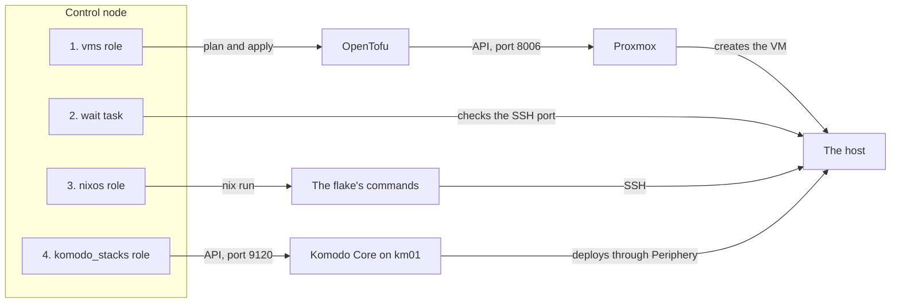

# Ansible

Ansible is the tool that runs the fleet's build. This page explains what it is, the ideas you need to read the fleet's playbooks, and how the fleet uses it, for a reader who has never run it.

## What it is {#what}

Building a server by hand means logging in and typing commands in the right order, and remembering what you typed when the next server comes along. Ansible replaces the typing with files. You write down the hosts you have and the steps each one needs, and Ansible carries the steps out, in order, and reports what it changed.

It is agentless: nothing is installed on the hosts for it. One machine holds Ansible and the files, and reaches the others when a step needs them.

The fleet uses Ansible in an unusual way. Most Ansible setups log in to each host and configure it there. The fleet's main playbook never does. It uses Ansible as the conductor of three other tools, [OpenTofu](../opentofu/index.md), [NixOS](../nixos/index.md), and [Komodo](../komodo/index.md), and every step runs on the machine Ansible itself runs on. See [How the fleet uses it](#in-the-fleet).

## The ideas you need {#ideas}

### Control node and managed hosts {#control-node}

The control node is the machine the `ansible-playbook` command runs on. The managed hosts are the machines it acts for. Ansible is installed on the control node only.

The fleet has two control nodes: a shell on your own machine for the first two hosts, and [Semaphore](../semaphore/index.md) on ci01 for everything after. See [Where the run starts from](../../fleet-bootstrap/concepts/how-a-host-is-built.md#control-node).

### Inventory {#inventory}

The inventory is the list of managed hosts. It is a YAML file that names each host, sorts the hosts into groups, and holds values about them. A host can be in several groups, and every host is in the built-in group `all`.

This is part of the example inventory in the fleet-ansible repo, `hosts.yml`:

```yaml
nixos_host:
  hosts:
    ex01:
      ansible_host: 172.16.7.91
      serverHostname: "ex01"
      docker_stacks:
        - system-agent
        - traefik-agent
  vars:
    NIXOS: true
    network_gateway: "172.16.7.1"
```

The group is nixos_host, and ex01 is a host in it. The name a host has in the inventory is how every command refers to it. `ansible_host` is the address Ansible uses for it, which Ansible would otherwise take from the name.

The inventory is chosen with `-i` on the command line. The fleet's real inventory is `hosts.yml` in the private repo. See [The private repo](../../fleet-bootstrap/concepts/fleet-private.md).

### Variables {#variables}

A variable is a named value. The steps read variables, so one set of steps builds different hosts from different values.

In the inventory above, the keys under ex01 are host variables: they belong to that one host. The keys under `vars` are group variables: every host in the group gets them. A third place holds group variables too, a folder named `group_vars` next to the inventory file, with one folder inside it for each group. The private repo's `group_vars/all/private.yml` is read for every host, because every host is in `all`.

When the same variable is set in more than one place, the more specific place wins.

| Order | Where the value is set | Wins over |
| --- | --- | --- |
| 1 | A role's defaults | Nothing |
| 2 | The group `all` | A role's defaults |
| 3 | Any other group | The group `all` |
| 4 | The host | Every group |
| 5 | [Extra vars](#extra-vars) on the command line | Everything |

Ansible does not merge a list or a dictionary set in two places. The winning value replaces the other whole.

A value in double braces, such as `"{{ short_name }}"`, is a template: Ansible fills in the variable's value when the step runs. The language inside the braces is Jinja2. A bar passes a value through a filter, so `"{{ serverHostname | lower }}"` is the hostname in lower case.

### Playbooks, plays, and tasks {#playbooks}

A task is one step: one action with its settings. A play is a list of tasks together with the hosts they are for. A playbook is a YAML file holding one or more plays, which run in order from the top.

This is the second play of the fleet's `site.yml`, trimmed to its outline:

```yaml
- name: Wait for the hosts to answer
  hosts: "{{ target }}"
  gather_facts: false

  tasks:
    - name: Wait for the host's SSH port
      ansible.builtin.wait_for:
        host: "{{ ansible_host | default(inventory_hostname) }}"
        port: "{{ ansible_port | default(22) }}"
      delegate_to: localhost
      tags: [ vms, wait ]
```

`hosts` says which hosts from the inventory the play is for. Here it is itself a variable, `target`, so the person starting the run chooses. Ansible goes through the tasks one at a time, and runs each task once for every host in the play before it moves to the next task.

A host that fails a task drops out of the run, and the other hosts go on. The run ends with a recap: one line for each host, counting the tasks that were ok, changed, failed, and skipped.

### Modules and collections {#modules}

A module is the code that carries out a task. In the play above, `ansible.builtin.wait_for` is a module that waits until a port answers. Others copy a file, run a command, call a web API, or check that a condition holds.

Modules come in collections, which are packages of modules. The name has three parts: `ansible.builtin` is the collection that ships with Ansible, and `wait_for` is the module in it. Other collections are installed onto the control node with `ansible-galaxy`, from the list in the repo's `requirements.yml`:

| Collection | The fleet's build uses it for |
| --- | --- |
| cloud.terraform | The module that runs OpenTofu |
| community.sops | Decrypting the inventory's encrypted file, before any task runs |
| ansible.utils, ansible.posix, community.general, community.crypto | Configuring a Proxmox host with `provision.yml` |

### Roles {#roles}

A role is a folder of tasks with a name, packaged to be used from more than one playbook. A play lists the roles it runs. Each role keeps its parts in fixed places:

| Path under `roles/<role>/` | Holds |
| --- | --- |
| `tasks/main.yml` | The role's tasks. It often only includes other task files from the same folder |
| `defaults/main.yml` | A default for each variable the role reads. Anything in the inventory wins over it |
| `vars/main.yml` | Values the role works out for itself, which the inventory does not override |
| `templates/` | Files with variables in them, filled in when a task writes them out |

A role's `defaults/main.yml` is the list of what the role can be told. In the fleet-ansible repo each one carries a comment per variable, so it is the first place to look when you want to know what a variable does.

### Delegation {#delegation}

A task normally runs on the host it is for: Ansible logs in to the host over SSH and runs the module there. Two task settings change that.

| Setting | Effect |
| --- | --- |
| `delegate_to: localhost` | The task runs on the control node. It still runs once for each host in the play, and reads that host's variables |
| `run_once: true` | The task runs one time for the whole play, not once for each host |

Delegation is what the whole of the fleet's `site.yml` rests on. Every task in it either only works with variables, which happens on the control node anyway, or is delegated to the control node. The host is the subject of each task and never the place it runs.

### Idempotence {#idempotence}

A task is idempotent when running it again leaves things as they are. A module does not run a command blindly. It looks at the current state, compares it with what the task asks for, and acts only on the difference. A task that found nothing to do reports `ok`, and one that acted reports `changed`.

This is why a failed run is fixed by running it again. The steps that finished report `ok` the second time, and the run picks up where it stopped. The fleet's run keeps that property by leaning on tools that have it themselves. See [The four stages](../../fleet-bootstrap/concepts/how-a-host-is-built.md#stages).

### Tags {#tags}

A tag is a label on a task, a role, or a play. `--tags` on the command line runs only what carries one of the tags named, and `--skip-tags` runs everything else. Without either option, everything runs.

In the play above, the wait task carries two tags, `vms` and `wait`, so it runs when either is named. Each stage of `site.yml` has a tag. See [Running part of a run](run-part-of-a-run.md).

### Extra vars {#extra-vars}

An extra var is a variable given on the command line with `-e`, as in `-e target=id01`. It applies to every host in the run and wins over every other place a variable can be set.

That strength is the reason the fleet passes very little this way. A value given with `-e` overrules what a host sets for itself in the inventory, so only the run's own choices are passed: which hosts, in `target`, and in a few cases where OpenTofu keeps its state.

### Check mode {#check-mode}

`--check` starts a run in check mode: each module works out what it would change and reports it, and changes nothing. `--diff` adds the difference in a file's content to the report.

A task can opt out. With `check_mode: false` it runs for real even in a check run, which suits a task that only reads. The fleet's roles mark their read-only steps this way, so a check run still clones the repos it needs and still asks OpenTofu for its plan. See [Seeing what a run would do](../../fleet-bootstrap/concepts/how-a-host-is-built.md#check).

### Facts {#facts}

A fact is something Ansible finds out about a host by logging in and looking: its operating system, its addresses, its disks. A play gathers facts at its start unless it sets `gather_facts: false`.

Every play in `site.yml` turns gathering off. Gathering needs a login and Python on the host, and the hosts it builds have no Python. A new one does not even exist when the first play starts.

A task can also store a value of its own on a host with the `set_fact` module, for later tasks in the same run to read. The fleet's roles use that to pass what one step worked out to the next.

## How the fleet uses it {#in-the-fleet}

All of the fleet's Ansible is in the [fleet-ansible](https://github.com/myah-mitchell/fleet-ansible) repo, which is public and holds nothing about any one fleet. The inventory and everything else that is yours are in the private repo. See [The private repo](../../fleet-bootstrap/concepts/fleet-private.md).

### The playbooks {#the-playbooks}

| Playbook | What it does | Reaches |
| --- | --- | --- |
| `site.yml` | Builds the NixOS VMs: creates each VM, installs NixOS, deploys its stacks | The Proxmox API, the VMs through the flake's commands, Komodo's API |
| `nixos-sync.yml` | Writes the private repo's files under `nixos/` from the inventory | Nothing but the control node's disk |
| `komodo-sync.yml` | Writes the private repo's `komodo/stacks/<host>.toml` files from the inventory | Nothing but the control node's disk |
| `provision.yml` | Configures a Proxmox host or another Debian-based host, in the ordinary Ansible way | The host, over SSH |

`provision.yml` is the one playbook that logs in to a host and configures it there. It never runs against a NixOS VM. The build guide uses it one time, to put the installer ISO on the Proxmox host. See [Proxmox and the installer ISO](../../fleet-bootstrap/foundation/proxmox-and-installer.md).

### The other files {#files}

| Path in the fleet-ansible repo | Holds |
| --- | --- |
| `ansible.cfg` | Ansible's settings for this repo. It turns on the sops plugin that decrypts inventory files ending in `.sops.yaml` |
| `requirements.yml` | The collections to install on the control node |
| `group_vars/all/vars.yml` | `github_user`, which every clone address in the roles is built from |
| `group_vars/all/stacks.yml` | `runs_stacks`, the one test of whether a host runs stacks |
| `hosts.yml` | An example inventory with made-up hosts |
| `private-repo.example/` | A skeleton of the private repo, to copy |
| `roles/` | One folder for each role |

`runs_stacks` is true for a host that sets `DOCKER` and `KOMODO` and lists at least one stack in `docker_stacks`. The roles and both sync playbooks read it, so they always agree on which hosts have Stacks.

### How site.yml is laid out {#site-yml}

`site.yml` has four plays, one for each stage of the build. Every play has the same hosts, the ones named in `target`, and each sets `gather_facts: false`. The diagram shows the four plays on the control node, and what each one calls.



Nothing in the diagram is Ansible logging in to the host. The wait task only tests whether a port answers, the flake's commands make their own SSH connections, and Komodo reaches the host through Periphery, its agent there.

Four roles do the work, and all four run on the control node only.

| Role | Used by | What it does |
| --- | --- | --- |
| vms | `site.yml`, stage 1 | Creates the VMs through OpenTofu |
| nixos | `site.yml`, stage 3, and `nixos-sync.yml` | Writes a host's NixOS files, and installs and deploys NixOS |
| stacks | The nixos and komodo_stacks roles | Works out which stacks a host runs and what each needs from the host |
| komodo_stacks | `site.yml`, stage 4, and `komodo-sync.yml` | Writes a host's Komodo file, and deploys its Stacks |

The other roles in the repo, such as users, ssh, and pve, configure a Debian-based host and run from `provision.yml` only.

### Stage 1: the vms role {#stage-vms}

The role does nothing when the private repo has no `opentofu/prod.tfvars`. Otherwise it works through these steps, each on the control node:

1. Stops if `TF_ENCRYPTION` is not set in the environment, or `PG_CONN_STR` when the state is kept in the database.
2. Clones the fleet-opentofu repo to `/tmp/ansible-fleet-opentofu-checkout` and copies the tfvars file into it.
3. Reads each VM's address, gateway, and nameservers from the tfvars file and compares them with the inventory. One mismatch stops the run for every host, before any VM is made.
4. Applies the configuration, for the VMs of the hosts in the play and no others. In check mode it stops at the plan.
5. Notes each VM's Proxmox node and VMID as a fact on the host, for stage 3 to use.

Steps 1, 2, and 4 run one time for the whole play, since OpenTofu takes all the play's VMs in one apply.

### Stage 2: the wait task {#stage-wait}

The second play is one task and no role. It waits, for up to 30 minutes, until the host's SSH port answers. A new VM answers when it has booted the installer, and a built one as soon as it is up. Check mode skips it, because a check run creates no VM to wait for.

### Stage 3: the nixos role {#stage-nixos}

The role runs for a host whose `NIXOS` variable is true.

1. Works out the host's NixOS files from the inventory again and compares them with the committed ones. A difference stops the run.
2. Asks git whether anything under the private repo's `nixos/` or `secrets/` is changed, untracked, or ignored. Anything listed stops the run.
3. Clones the fleet-nixos repo to `/tmp/ansible-fleet-nixos-checkout`.
4. Runs the flake's `host-state` command, which answers `installer`, `installed`, or `unreachable` for the host's address.
5. On `installer`, runs `install-host`, then repeats `host-state` every 10 seconds, up to 60 times, until the answer is `installed`.
6. Runs `deploy-host` with the action `switch`. In check mode the action is `dry-build`, and only for a host that answered `installed`.

Steps 5 and 6 take one host at a time, even in a run against a group. See [The commands](../../fleet-bootstrap/concepts/nixos-flake.md#commands) for what each command does.

### Stage 4: the komodo_stacks role {#stage-komodo}

The role runs for a host where `runs_stacks` is true.

1. Works out the host's Komodo file again and compares it with the committed one. A difference stops the run.
2. Prints a message and ends the stage, without a failure, when Komodo's address or its API key or secret is not set. Check mode ends here too.
3. Asks Komodo's API whether the host's Server is connected, every 10 seconds, up to 30 times.
4. Asks Komodo to run the Resource Sync named `fleet` for this host's Stacks only, and waits for it to complete.
5. Asks for the state of the host's Stacks every 10 seconds, up to 90 times, until every one is running.

### The two sync playbooks {#sync-playbooks}

The NixOS flake and Komodo do not read the inventory. Each reads files generated from it: JSON files under `nixos/` and one TOML file for each host under `komodo/stacks/`. `nixos-sync.yml` and `komodo-sync.yml` write those files, using the same role tasks that stages 3 and 4 use to check them. That shared code is why the run can tell that a committed file is out of date.

Both run against every host in the inventory, connect to none, and write next to the inventory file. See [The generated files](../../fleet-bootstrap/concepts/fleet-private.md#generated).

### What it reads from the environment {#environment}

Ansible itself needs nothing secret. The tools it calls do, and they take it from the environment of the `ansible-playbook` process: the OpenTofu state passphrase, the Proxmox API tokens, Komodo's API key, and the age key that [sops](../sops/index.md) decrypts with. See [What the run needs](../../fleet-bootstrap/concepts/how-a-host-is-built.md#needs).

## Finding your way around {#around}

These commands only read. Run them from `~/src/fleet-ansible`, the checkout that [The control shell](../../fleet-bootstrap/foundation/control-shell.md#checkouts) makes. Each one reads the inventory, so each needs the deploy key in `SOPS_AGE_KEY` or `SOPS_AGE_KEY_FILE` to decrypt the inventory's encrypted file.

| To see | Command |
| --- | --- |
| The groups and the hosts in each | `ansible-inventory -i ../fleet-private/hosts.yml --graph` |
| Every variable the inventory gives one host | `ansible-inventory -i ../fleet-private/hosts.yml --host id01` |
| The plays and tasks of the build, in order | `ansible-playbook -i ../fleet-private/hosts.yml site.yml -e target=id01 --list-tasks` |
| The tags the build accepts | `ansible-playbook -i ../fleet-private/hosts.yml site.yml -e target=id01 --list-tags` |

`--host` shows what the inventory sets, with host and group values already merged. It does not show a role's defaults. For those, read the role's `defaults/main.yml`.

`--list-tasks` shows the tasks written in the playbook and at the top of each role. A role's task files are included while the run is under way, so the tasks inside them are not listed.

In Semaphore, every run of a Template keeps its full output. See [Semaphore](../semaphore/index.md#around).

## Making changes {#changes}

| To | See |
| --- | --- |
| Run one stage, or see what a run would do | [Running part of a run](run-part-of-a-run.md) |
| Set a value for one host or for a group | [Adding a variable to the inventory](add-an-inventory-variable.md) |
| Find out why a run stopped | [Reading a failed run](read-a-failed-run.md) |
| Describe a new host | [Adding a host](../../fleet-bootstrap/procedures/add-a-host.md) |
| Generate the files after a change to the inventory | [After a change](../../fleet-bootstrap/concepts/fleet-private.md#after-a-change) |
| Set up a control node | [The control shell](../../fleet-bootstrap/foundation/control-shell.md) and [The Semaphore project](../../fleet-bootstrap/foundation/semaphore-project.md) |

## When it goes wrong {#troubleshooting}

Start with the last task the output names and the message under it. Most stops in the fleet's playbooks are deliberate checks, and each prints what to do. See [Reading a failed run](read-a-failed-run.md).

| What you see | Look at |
| --- | --- |
| A run that stops before its first task | The command line: the inventory path after `-i`, and `target` |
| An error about decrypting, before any task | The deploy key in `SOPS_AGE_KEY` or `SOPS_AGE_KEY_FILE` |
| A message that a committed file does not match | [After a change](../../fleet-bootstrap/concepts/fleet-private.md#after-a-change) |
| A failure with its output hidden | The Update in Komodo. The tasks that call Komodo's API hide their output, because it carries the API key |
| A value that is not what the inventory says | The command line, for a `-e` that overrules it |

## Going further {#further}

- [Ansible documentation](https://docs.ansible.com/ansible/latest/index.html)
- [Variable precedence](https://docs.ansible.com/ansible/latest/playbook_guide/playbooks_variables.html#variable-precedence-where-should-i-put-a-variable), the full order of every place a variable can be set
- [Tags](https://docs.ansible.com/ansible/latest/playbook_guide/playbooks_tags.html)
- [Check mode and diff mode](https://docs.ansible.com/ansible/latest/playbook_guide/playbooks_checkmode.html)
- [Controlling where tasks run](https://docs.ansible.com/ansible/latest/playbook_guide/playbooks_delegation.html), on delegation
- [The fleet-ansible repo's README](https://github.com/myah-mitchell/fleet-ansible/blob/main/README.md), for `provision.yml` and its roles
