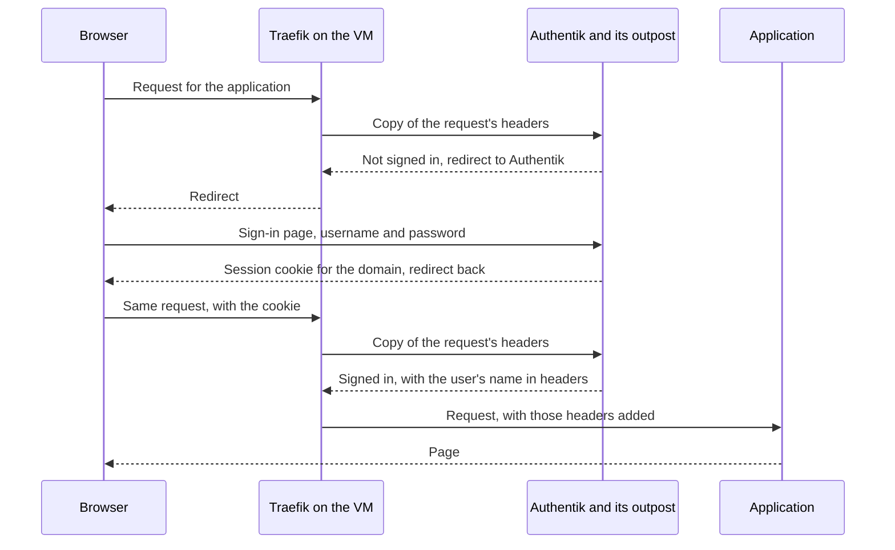

# Authentik

Authentik is the fleet's identity provider: the one place that holds user accounts and decides who may open which web interface. This page explains the ideas behind it and how the fleet uses it, for a reader who has never run one. It holds no procedure. The how-tos are listed under [Making changes](#changes).

## What it is {#what}

Every web application wants to know who is using it. Left alone, each one keeps its own list of accounts and its own login page, so ten applications mean ten passwords for each person, and ten places to remove someone who leaves. Some applications, such as a metrics dashboard, have no login at all and are open to anyone who can reach them.

Authentik takes that job away from the applications. It keeps one list of accounts, shows one sign-in page, and tells each application who the visitor is. An application either asks Authentik directly, or has the reverse proxy in front of it ask on its behalf.

Authentik is open source and runs as containers. The fleet runs one instance, on the host id01.

## The ideas you need {#ideas}

### Identity provider and single sign-on {#identity-provider}

An identity provider is a service that holds accounts and vouches for them to other services. The other services trust its answer and never see the password.

Single sign-on is what the person at the browser gets from that. They sign in to the identity provider one time, the browser keeps a session cookie, and every application that trusts the provider lets them in without asking again until the session ends.

For the person running the fleet it buys three things: one place to add or remove a person, one place to require a second factor, and a sign-in in front of applications that have none of their own.

### Users and groups {#users-and-groups}

A user is one account: a username, a password, an email address, and whatever else Authentik knows about the person. A group is a named set of users.

Groups are how access is granted. A rule that names a group keeps working as people join and leave, while a rule that names people has to be edited every time. The fleet's mail host gives a mailbox to each member of the group `mail-users`, for example.

### The akadmin account {#akadmin}

`akadmin` is the first account on a new Authentik, created by the setup flow that runs one time. It is a member of the group authentik Admins, which makes it a superuser: it can change anything in Authentik, including who may open what.

The fleet creates it right after id01 is built. See [Create the admin account](../../fleet-bootstrap/hosts/id01-identity.md#first-access).

### Application {#application}

An Application is Authentik's record of one thing people sign in to. It has a name, a slug, and the rules for who may use it. The slug is the short form of the name that appears in addresses, such as `mail`.

An Application says nothing about how the sign-in travels between Authentik and the real application. That is the Provider's job.

### Provider {#provider}

A Provider is the protocol side of an Application: the settings for one way of telling an application who signed in. Each Application has one Provider, and a Provider does nothing until an Application uses it.

Authentik has a Provider type for each protocol. The fleet uses two, described next: the Proxy Provider, for an application that cannot ask Authentik anything, and the OAuth2/OpenID Provider, for an application that can.

### Outpost {#outpost}

An outpost is a small service that does a Provider's work outside Authentik's own web server. A Proxy Provider needs one, because something has to answer the reverse proxy's question about every single request, quickly, without loading Authentik's whole interface.

A Provider is served by an outpost only when its Application is assigned to that outpost. A Proxy Provider with no outpost exists in the database and answers nothing.

Authentik ships with one outpost built in, the embedded outpost. It runs inside the server container and answers on the server's own port, under the path `/outpost.goauthentik.io/`. The fleet uses the embedded outpost and deploys no other.

### Forward auth {#forward-auth}

Forward auth is for an application with no login of its own, or one whose login you do not want to rely on. The reverse proxy in front of the application asks the outpost about each request before passing it on. The outpost answers yes, with the user's name in a set of headers, or answers no, with a redirect to Authentik's sign-in page. The application never takes part.

In Authentik this is a Proxy Provider in one of two forward auth modes.

| Mode | Covers | Access rules |
| --- | --- | --- |
| Forward auth (single application) | One hostname | Its own Application, so its own rules |
| Forward auth (domain level) | Every hostname under one domain | One Application's rules for all of them |

Domain level is less work, since one Provider and one cookie cover everything. Its cost is that Authentik cannot let a person into one interface and keep them out of another. The fleet uses domain level. See [How the fleet uses it](#in-the-fleet).

The sign-in below is what happens the first time a browser asks for an interface behind forward auth. The reverse proxy is Traefik, which every VM runs. See the [Traefik primer](../traefik/index.md).



Traefik asks the outpost about every request, and only the first one ends in a redirect. The cookie is set for the whole domain, so a second interface on another VM is let through without a new sign-in.

### OpenID Connect {#oidc}

OpenID Connect, or OIDC, is a standard way for an application to ask an identity provider who a person is. It is built on OAuth2, a standard for handing out access tokens, and the two names are used together.

An application that speaks OIDC shows a button such as "Sign in with Authentik". It sends the browser to Authentik, the person signs in there, and Authentik sends the browser back with a short-lived code. The application exchanges the code for tokens that say who the person is. The reverse proxy plays no part.

Four values tie the two sides together.

| Value | Is |
| --- | --- |
| Issuer | The address of the Provider in Authentik. The application reads everything else it needs from there |
| Client ID | The application's name, as Authentik knows it |
| Client secret | The application's password to Authentik |
| Redirect URI | The address in the application that Authentik may send the browser back to |

Use OIDC when the application supports it, and forward auth when it does not. With OIDC the application knows the user as a real account of its own, with a name and groups, and clients that are not browsers can sign in too. Forward auth only works for a browser that can follow a redirect.

An application that signs people in with OIDC is not also put behind forward auth, or people would be sent through two sign-ins for one page.

### Flows and stages {#flows}

A flow is a sequence of steps Authentik takes a person through, and each step is a stage. Signing in is a flow whose stages ask for a username, then a password, then log the person in. Signing out, enrolling, and recovering a password are flows too.

Authentik ships with a default flow for each purpose, and the fleet uses the defaults. You meet flows in two places. A Provider asks which authorization flow to run when a person opens its Application, and the first-run address on id01 is the flow named `initial-setup`.

### Policies and bindings {#bindings}

A binding attaches a user, a group, or a policy to an Application. A policy is a rule Authentik evaluates, such as "the password is not expired". Most of the time a group is all you bind.

An Application with no binding is open to every user who can sign in. As soon as it has one, only people who match a binding get in. Limiting an Application to a group is therefore one binding. See [Adding a user and a group](add-a-user.md#binding).

### Server and worker {#server-and-worker}

Authentik runs as two processes from one image. The server answers the browser: the sign-in pages, the admin interface, the API, and the embedded outpost. The worker does what does not have to happen during a request, such as sending mail, running scheduled tasks, and applying database migrations after an upgrade.

Both keep their state in a PostgreSQL database and use Redis as a cache and task queue. Nothing that matters is in the containers themselves.

## How the fleet uses it {#in-the-fleet}

### Where it runs {#where}

Authentik runs on id01, as the stack authentik-server. The stack holds the server, the worker, PostgreSQL with a daily backup, Redis, and two helpers. See [authentik-server](../../fleet-bootstrap/stacks/authentik-server.md) for each service, and [Identity (id01)](../../fleet-bootstrap/hosts/id01-identity.md) for the build.

| What | Where |
| --- | --- |
| The two Authentik services | `containers/authentik/compose.yaml` in fleet-stacks |
| The stack | `stacks/authentik-server/` in fleet-stacks |
| The version | The image tag in the container's compose file, `2025.8.4` as these pages were written |
| Secrets and settings | Komodo Variables and Secrets. See [Authentik](../../fleet-bootstrap/concepts/variables-and-secrets.md#authentik) |
| Users, groups, Applications, Providers | Authentik's database on id01, and nowhere else |

The last row matters. Everything you create in Authentik's interface lives in its database, not in a repo. A rebuilt id01 keeps it because the database is on the persistent disk, and the stack page says which folders to back up. See [Data worth keeping](../../fleet-bootstrap/stacks/authentik-server.md#data).

On the internal network Authentik answers at `authentik.id01.home.myah-mitchell.com`. Its public name is meant to be `auth.myah-mitchell.com`. Authentik's own route never asks for a sign-in, because Authentik cannot sit behind itself.

Authentik sends its mail, such as a password recovery link, through Postfix on ci01.

### Forward auth from each VM's Traefik {#chain}

Every VM runs its own Traefik, and every Traefik carries the same rule files from `containers/traefik/rules/` in fleet-stacks. Two of them make up the sign-in.

`middlewares-authentik.yaml` defines the forward auth middleware. Its address is the embedded outpost on id01, built from the `AUTHENTIK_HOST` value, which Komodo fills from the Variable `GLOBAL_AUTHENTIK_HOST`:

```yaml
    middlewares-authentik:
      forwardAuth:
        address: https://{{env "AUTHENTIK_HOST"}}/outpost.goauthentik.io/auth/traefik
        trustForwardHeader: true
```

`chain-authentik.yaml` defines the chain named chain-authentik: rate limiting, security headers, compression, and then that middleware. A second chain, chain-no-auth, is the same list without the last entry.

A container chooses its chain with one label on its route. A container that Authentik should guard carries this line, which takes chain-authentik unless the stack's `TRAEFIK_AUTH_CHAIN` value says otherwise:

```yaml
      - "traefik.http.routers.$PROJECT_NAME-rtr.middlewares=${TRAEFIK_AUTH_CHAIN:-chain-authentik@file}"
```

So the call crosses hosts. Traefik on ci01 asks Authentik on id01, over HTTPS, about a request for an interface on ci01. That is why each VM has to resolve Authentik's name and trust its certificate.

On Authentik's side one Proxy Provider answers all of these. It is named `fleet-forward-auth`, runs in domain level mode with the cookie domain `myah-mitchell.com`, belongs to an Application named `Fleet`, and is assigned to the embedded outpost. Whoever may use the `Fleet` Application may open every interface behind the chain. It is created when the fleet leaves bootstrap mode. See [Set up the sign-in in Authentik](../../fleet-bootstrap/procedures/leave-bootstrap-mode.md#authentik).

### What asks Authentik and what does not {#guarded}

| Sign-in | Interfaces |
| --- | --- |
| Forward auth | The Traefik dashboard on every host, and the interfaces on ci01 with weak or no logins of their own, such as VictoriaMetrics and Mailpit |
| OpenID Connect | Bulwark, the webmail on mx01 |
| Never Authentik | Authentik itself, Komodo, step-ca, Grafana, ntfy, vmauth, and Stalwart |

The last row are applications with a login of their own or ones that serve machines, which cannot follow a redirect to a sign-in page. The full list is in [Leaving bootstrap mode](../../fleet-bootstrap/procedures/leave-bootstrap-mode.md#authentik).

Bulwark's Application is named `Mail`, and Stalwart accepts the tokens it issues. See [Create the Authentik application](../../fleet-bootstrap/hosts/mx01-mail.md#authentik).

### What leaving bootstrap mode switches on {#bootstrap}

The first hosts are built before Authentik exists, and Authentik's own host is built before the others can trust its certificate. Until the fleet leaves bootstrap mode, every stack's `TRAEFIK_AUTH_CHAIN` is set to `chain-no-auth@file`, so no Traefik asks Authentik anything. Authentik is up and has its admin account, and nothing uses it. See [Bootstrap mode](../../fleet-bootstrap/concepts/bootstrap-mode.md).

Leaving the mode blanks that value on each host, the label falls back to chain-authentik, and the host's Traefik starts asking. id01 leaves first, because the other hosts call it over HTTPS and it serves a trusted certificate only after it has left.

## Finding your way around {#around}

Authentik has two interfaces at the same hostname. The user interface is what a person sees after signing in: their applications and their own settings. The admin interface is where everything on this page is managed, and it is at `/if/admin/`:

```text
https://authentik.id01.home.myah-mitchell.com/if/admin/
```

| Screen | Shows |
| --- | --- |
| *Applications > Applications* | Each Application, and the Provider it uses |
| *Applications > Providers* | Each Provider, and a warning on one that no Application uses |
| *Applications > Outposts* | The embedded outpost, the Providers assigned to it, and whether it is healthy |
| *Directory > Users* | Every account, with its groups and last sign-in |
| *Directory > Groups* | Every group and its members |
| *Events > Logs* | What happened and to whom: sign-ins, failed sign-ins, changes |
| *Flows and Stages > Flows* | The flows, which the fleet leaves at their defaults |

On id01, two commands show the containers and the server's log:

```bash
docker compose -p authentik ps
docker logs --tail 50 authentik-authentik-server
```

## Making changes {#changes}

| Task | Page |
| --- | --- |
| Put a web interface behind the sign-in | [Putting an application behind a sign-in](protect-an-application.md) |
| Give a person an account, and decide what they may open | [Adding a user and a group](add-a-user.md) |
| Let an application that speaks OIDC sign people in through Authentik | [Signing in to an application with OpenID Connect](add-an-oidc-application.md) |

These pages of the build guide touch Authentik.

| Page | Does |
| --- | --- |
| [Identity (id01)](../../fleet-bootstrap/hosts/id01-identity.md) | Builds the host and creates `akadmin` |
| [Leaving bootstrap mode](../../fleet-bootstrap/procedures/leave-bootstrap-mode.md) | Creates the fleet's Provider and turns the sign-in on |
| [Mail (mx01)](../../fleet-bootstrap/hosts/mx01-mail.md) | Creates the `Mail` Application and its group |

## When it goes wrong {#troubleshooting}

| What you see | Look at |
| --- | --- |
| Every interface behind the chain returns an error, and Authentik itself opens | *Applications > Outposts*. The embedded outpost must list the `Fleet` Application's Provider |
| The same, on one host only | That host's Traefik log. It has to resolve the name in `GLOBAL_AUTHENTIK_HOST` and accept the certificate id01 serves |
| The sign-in succeeds and the browser comes back to the sign-in page, over and over | The Provider's *Cookie domain*. It must be a parent of the interface's hostname |
| A person signs in and is told they have no access | The Application's bindings, and the person's groups |
| An OIDC application reports a redirect URI error | The Provider's *Redirect URIs*, against the address in the error |
| An OIDC application rejects the issuer | The trailing slash. Authentik's issuer ends in one, and some applications want it left off |
| Authentik itself does not open | `docker compose -p authentik ps` on id01, then the server's log |

*Events > Logs* records each failed sign-in and each denied Application, with the reason, and is the first place to look for anything that concerns one person.

## Going further {#further}

- [Authentik's documentation](https://docs.goauthentik.io/)
- [Forward auth](https://docs.goauthentik.io/add-secure-apps/providers/proxy/forward_auth/), and its [Traefik page](https://docs.goauthentik.io/add-secure-apps/providers/proxy/server_traefik/)
- [The OAuth2 provider](https://docs.goauthentik.io/add-secure-apps/providers/oauth2/)
- [Outposts](https://docs.goauthentik.io/add-secure-apps/outposts/)
- [Flows](https://docs.goauthentik.io/add-secure-apps/flows-stages/flow/)
