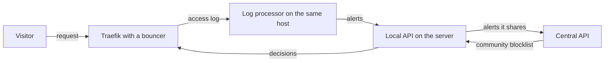

# CrowdSec

CrowdSec reads logs, spots addresses that behave like attackers, and has them blocked. This page explains how it works and where it sits in the fleet-stacks repo, for a reader who has never used it.

No host in the fleet runs CrowdSec. It was cut from the plan, and its two stacks stay in the repo for a host of your own. See [How the fleet uses it](#in-the-fleet) for what is there and what is switched off.

## What it is {#what}

A service that faces a network gets probed all day: password guessing, scans for known vulnerabilities, floods of requests. Each attempt leaves a line in a log. CrowdSec reads those lines as they are written, recognises the patterns, and records a ban against the address they came from. A separate piece, sitting where the traffic passes, asks CrowdSec about each visitor and turns the banned ones away.

It also shares. Every installation reports the addresses it bans to CrowdSec's own service, and gets back a list of addresses that many installations have reported. An address can be blocked on your host before it has sent you anything.

CrowdSec itself blocks nothing. It decides, and something else enforces. Most of what follows comes from that split.

## The ideas you need {#ideas}

### The log processor {#log-processor}

The log processor is the part that reads logs. CrowdSec's older name for it is the agent, and the fleet-stacks repo uses that name. It takes lines from the sources it is told about, works out what each line means, and looks for patterns across them.

The list of sources is the acquisition configuration. Each entry names a source and gives its lines a type, so the processor knows which rules apply. The repo's file, `containers/crowdsec/config/acquis.yaml`, has two entries:

```yaml
---
filenames:
 - /var/log/traefik/access.log
poll_without_inotify: true
labels:
 type: traefik
---
source: docker
use_container_labels: true
```

The first reads Traefik's access log as a file. The second reads container logs through the Docker API, and only from containers that carry CrowdSec's own labels saying they want to be read and what type their lines are.

### Parsers and scenarios {#parsers-and-scenarios}

A parser turns a raw log line into named fields: the source address, the path requested, the status code. Each type of log needs a parser that knows its format.

A scenario is a rule over parsed events that describes one kind of bad behaviour, such as "the same address got more than a set number of 404 replies in a short time". When an address fills a scenario, the log processor raises an alert, which names the address and the scenario.

A parser can also drop events before any scenario sees them. CrowdSec calls such a parser a whitelist. An address on it can never fill a scenario, because its events are gone by then.

### Collections and the hub {#collections}

Nobody writes parsers and scenarios from nothing. The hub is CrowdSec's public catalogue of them, and a collection is a bundle from the hub that covers one piece of software or one family of attacks.

The repo's container installs seven collections when it starts, through its `COLLECTIONS` variable in `containers/crowdsec/compose.yaml`:

| Collection | Covers |
| --- | --- |
| `crowdsecurity/traefik` | The parser for Traefik's access log, and the base HTTP scenarios |
| `crowdsecurity/base-http-scenarios` | Scans, probing, and crawlers that misbehave |
| `crowdsecurity/http-cve` | Requests that try known vulnerabilities |
| `crowdsecurity/http-dos` | Request floods |
| `crowdsecurity/appsec-crs`, `crowdsecurity/appsec-generic-rules`, `crowdsecurity/appsec-virtual-patching` | Rules for the application firewall. See [The application firewall](#appsec) |

### The Local API {#local-api}

The Local API is the part that holds state. CrowdSec's documents shorten it to LAPI. It is an HTTP service, on port 8080, with a database behind it. Log processors send it their alerts, and it stores them and answers everyone who asks what is banned.

Two kinds of client talk to it, and each proves who it is in its own way.

| Client | CrowdSec's word | Signs in with |
| --- | --- | --- |
| A log processor | Machine | A name and a password |
| An enforcer | Bouncer | An API key |

Both credentials are made on the Local API's side, with CrowdSec's command-line tool, `cscli`.

### Decisions {#decisions}

A decision is what the Local API makes of an alert: one address, or one range, with an action and a lifetime. The action is nearly always a ban. A file of rules called a profile maps alerts to decisions, and the default profile bans the address for four hours.

A decision expires by itself. An address that stops misbehaving comes back with nobody lifting anything, and one that carries on is banned again by the next alert. A decision can also be added or deleted by hand with `cscli`.

### Bouncers {#bouncers}

A bouncer is the part that enforces. CrowdSec now calls it a remediation component. It sits where traffic passes, asks the Local API for the current decisions, and refuses whatever matches.

Bouncers exist for firewalls, for web servers, and for reverse proxies. For Traefik it is a plugin that runs as a middleware: a step every request passes through before it reaches the application. See the [Traefik primer](../traefik/index.md).

Without a bouncer, CrowdSec is an observer. It raises alerts and stores decisions, and every banned address is still served.

### The Central API and the community blocklist {#central-api}

The Central API is CrowdSec's own service on the internet. A Local API registers with it, sends it the alerts its scenarios raise, and pulls down the community blocklist: addresses that enough installations have reported. Those arrive as ordinary decisions, and a bouncer treats them like any other.

Only the Local API talks to the Central API. A log processor never does.

### The application firewall {#appsec}

Log reading is after the fact: the request has been answered by the time its line is parsed. The AppSec component is CrowdSec's web application firewall, which looks at a request before the application sees it. The bouncer hands each request to it and blocks the request if a rule matches.

It listens on port 7422, and only when the acquisition configuration has an entry that turns it on.

### One server, many agents {#server-and-agents}

The log processor and the Local API are one program, and either half can be switched off. That gives two roles.

| Role | Local API | Log processor | Runs on |
| --- | --- | --- | --- |
| Server | On | On | One host |
| Agent | Off | On | Every other host with logs worth reading |

Logs live on the host that writes them, so each host needs a log processor of its own. Decisions are worth most in one place: an address that attacks one host is then banned at every bouncer, and there is one list to read when something is blocked that should not be.

The diagram shows what passes between the pieces. Every host has the left half, and the Local API exists one time, on the server.



A request reaches Traefik, where the bouncer checks its address against the decisions it holds. Traefik writes the request to its access log, the log processor on that host reads it, and an alert goes to the Local API. The decision that follows reaches every bouncer the next time it asks.

## How the fleet uses it {#in-the-fleet}

It does not, at present. Cloudflare covers the one public hostname, the network's own intrusion detection covers the rest, and alert rules in VictoriaMetrics pick up what is left. See [Not in the plan](../../fleet-bootstrap/stacks/index.md#unused).

What the fleet-stacks repo holds is a working container definition and two stacks built from it.

| Path in fleet-stacks | Holds |
| --- | --- |
| `containers/crowdsec/compose.yaml` | The container, and the server and agent variants of it |
| `containers/crowdsec/config/acquis.yaml` | The acquisition configuration |
| `containers/crowdsec/config/allowlist.yaml` | A whitelist parser for the private address ranges |
| `stacks/crowdsec-server` | The server role. See [crowdsec-server](../../fleet-bootstrap/stacks/crowdsec-server.md) |
| `stacks/crowdsec-agent` | The agent role. See [crowdsec-agent](../../fleet-bootstrap/stacks/crowdsec-agent.md) |

Both stacks use the project name `crowdsec`, so one host runs one or the other. Each pairs CrowdSec with a socket proxy, which gives it a filtered view of the Docker API to read container logs through.

The two variants differ in a handful of settings. The server publishes port 8080 on its host. The agent has `DISABLE_LOCAL_API` set to `true`, and reaches the server through three values: the server's URL, a machine name built from the host's name, and a password. The stack pages say where each comes from.

The image is `crowdsecurity/crowdsec:latest`. No version is pinned, so the version is whatever was current when the host last pulled it.

### What is switched off {#switched-off}

Four things stand between the repo as it is and a CrowdSec that blocks anything.

- No bouncer. The Traefik plugin's lines are commented out in `containers/traefik/compose.yaml`, and so is the whole of `containers/traefik/rules/middlewares-crowdsec.yaml`. The Traefik stacks still carry `CROWDSEC_LAPI_HOST`, set to the literal `unused`.
- No application firewall. The three AppSec collections are installed, but the acquisition file has no entry that starts the listener on port 7422.
- No container opts in. The Docker source reads only containers that carry CrowdSec's labels, and no container in the repo does.
- No firewall rule for port 8080. An agent or bouncer on another host cannot reach the server until one is added. See [crowdsec-server](../../fleet-bootstrap/stacks/crowdsec-server.md#host-setup).

The Traefik access log is in doubt as well. The container looks for it under its own project's log folder, which is not where Traefik writes it. See [Not yet confirmed](../../fleet-bootstrap/stacks/crowdsec-server.md#unconfirmed) on the server's page.

### The private ranges are never banned {#allowlist}

`allowlist.yaml` is mounted into the container as a whitelist parser. It drops every event from `127.0.0.1` and from the three private ranges. Those are `10.0.0.0/8`, `172.16.0.0/12`, and `192.168.0.0/16`.

Every address inside the fleet's networks falls in those ranges. A machine on the internal network or the DMZ can therefore never be banned by a scenario, whatever it does. CrowdSec in this shape guards against the internet and nothing else.

## Finding your way around {#around}

Everything is done with `cscli` inside the container. On the server the container is `crowdsec-crowdsec-server`, and on an agent it is `crowdsec-crowdsec-agent`. None of these commands changes anything.

| Command | Shows |
| --- | --- |
| `cscli metrics` | Lines read per source, how many were parsed, and which scenarios fired |
| `cscli alerts list` | Recent alerts, with the address and the scenario |
| `cscli decisions list` | The bans in force and the time each has left |
| `cscli machines list` | The log processors the Local API knows, and when each last checked in |
| `cscli bouncers list` | The bouncers it knows, and when each last asked |
| `cscli collections list` | The collections installed |
| `cscli lapi status` | Whether this container can sign in to the Local API |

Run one through Docker, on the host:

```bash
docker exec crowdsec-crowdsec-server cscli decisions list
```

The lists of machines and bouncers read the database, so they work on the server only. `cscli decisions list` leaves out the community blocklist unless `--all` is added.

## Making changes {#changes}

This tool has no how-to. A procedure for lifting a ban was planned and left out: no host runs CrowdSec, no bouncer enforces a decision, and the private ranges are never banned, so the fleet has no ban to lift.

| To | See |
| --- | --- |
| Run either stack on a host of your own | [Applications (ap01)](../../fleet-bootstrap/hosts/ap01-applications.md#existing-stack) |
| See what the server stack needs, and what turning it on takes | [crowdsec-server](../../fleet-bootstrap/stacks/crowdsec-server.md#values) |
| See the values an agent needs | [crowdsec-agent](../../fleet-bootstrap/stacks/crowdsec-agent.md#values) |
| See the CrowdSec values the Traefik stacks carry | [Variables and Secrets](../../fleet-bootstrap/concepts/variables-and-secrets.md#traefik) |

## When it goes wrong {#troubleshooting}

These apply once a host of your own runs a stack.

| Sign | Look at |
| --- | --- |
| Nothing is ever banned | `cscli metrics`. A source that shows no lines read is not being read, and one whose lines are all unparsed has the wrong type or no parser |
| An agent's alerts never arrive | `cscli lapi status` on the agent, then `cscli machines list` on the server for its name and last check-in |
| A ban is in the list and the address still gets through | `cscli bouncers list`. With no bouncer, or one that has not asked lately, nothing enforces the decision |
| A container shows `healthy` and CrowdSec does nothing | The health check only asks `cscli` for its version. It says nothing about the Local API or the logs |

## Going further {#further}

- [CrowdSec documentation](https://docs.crowdsec.net/), for concepts, `cscli`, and every data source
- [CrowdSec Hub](https://app.crowdsec.net/hub), the catalogue of collections, parsers, scenarios, and bouncers
- [The Traefik bouncer plugin](https://github.com/maxlerebourg/crowdsec-bouncer-traefik-plugin), which the commented-out lines in the repo refer to
