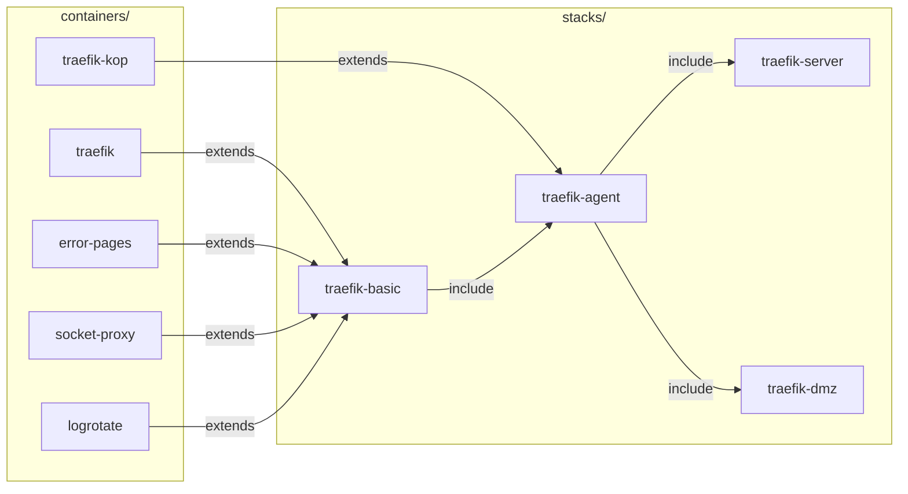

# Docker Compose

Docker Compose starts a group of containers from one file that describes them. This page explains the ideas behind that file and how the fleet-stacks repo layers its files, for a reader who has run a container with `docker run` and has not managed a stack. It holds no procedure. The how-tos are listed under [Making changes](#changes).

## What it is {#what}

A real service is seldom one container. Traefik in the fleet runs beside an error page server, a log rotator, and two proxies in front of the Docker socket, and each of those needs its own image, settings, folders, and networks. Typed as `docker run` commands, that is five long lines nobody can review or repeat.

Compose replaces the commands with a YAML file. The file says what should run, and `docker compose up` compares it with what is running and creates, replaces, or leaves each container so the two match. The same file gives the same result on every host, and a change to the service is a change to a file in git.

In the fleet nobody types `docker compose up`. Komodo runs it on each host, from the files in the fleet-stacks repo. See the [Komodo primer](../komodo/index.md).

## The ideas you need {#ideas}

### Image and container {#image-and-container}

An image is a read-only package: a program and the files it needs, published under a name and a tag such as `amir20/dozzle:latest`. A container is one running copy of an image, with its own processes, network address, and a thin writable layer on top of the image's files.

Deleting a container deletes that writable layer. Compose deletes and recreates containers freely, on every change to their definition, so nothing worth keeping may live inside one. What has to last goes in a [volume](#volumes).

### The compose file {#compose-file}

A compose file is a YAML file, named `compose.yaml`, with a few top-level keys. The fleet uses four of them.

| Key | Holds |
| --- | --- |
| `name` | The project's name |
| `services` | The containers to run |
| `networks` | The networks they join |
| `include` | Other compose files to load with this one |

This is the whole of `stacks/dozzle-server/compose.yaml`, less its comments. The sections below explain each part of it.

```yaml
name: ${PROJECT_NAME}

networks:
  proxy:
    name: ${PROXY_NETWORK}
    external: true
  frontend:
    name: ${PROJECT_NAME}_frontend
    internal: false

services:

  dozzle-server:
    extends:
      file: ../../containers/dozzle/compose.yaml
      service: .dozzle-server
```

### Services {#services}

A service is one entry under `services`: an image, and how to run it. Compose makes one container from each service. The service's key, `dozzle-server` above, is the name Compose commands take, as in `docker compose logs dozzle-server`.

The container gets a name of its own. Compose would make one up from the project and the service, but every fleet definition sets it with `container_name`, to the project name and the container's short name joined by a hyphen. Dozzle's server is the service dozzle-server and the container `dozzle-dozzle-server`. Plain `docker` commands such as `docker logs` take the container name.

### Projects {#project}

A project is one running copy of a compose file. Compose labels every container it creates with the project's name, and that label is how `docker compose ps` knows which containers belong together and how `up` knows what it made last time.

The name comes from the `-p` flag when there is one, then from the file's `name` key, then from the folder the file sits in. Two compose files run under one project name are treated as one project, and each `up` removes what the other file made.

The fleet has two names here that are easy to mix up, and [Two names for one stack](#two-names) sets them side by side.

### Substitution and the env file {#substitution}

Compose fills in `${NAME}` wherever it appears in a value, at the moment it loads the compose file. The values come from the environment of the `docker compose` command and from an env file, a list of `KEY=value` lines that Compose loads from `.env` beside the compose file or from the path given with `--env-file`.

That is how one compose file serves every host. `name: ${PROJECT_NAME}` and `name: ${PROXY_NETWORK}` above are the same text on every VM, and the env file makes them `dozzle` and `proxy`.

A reference can carry a default. The form `${NAME:-value}` uses the value when the variable is unset or empty. The fleet's definitions give nearly every setting one, such as `restart: ${RESTART_MODE:-unless-stopped}`, so a key left blank falls back to what the file says.

### Environment {#environment}

A service's `environment` key lists the variables the program inside the container sees. This is a different thing from the env file. The env file feeds substitution, which happens on the host while Compose reads the file, and nothing in it reaches a container unless a service's `environment` passes it on.

Dozzle's definition shows the two together. Compose substitutes the right-hand side from the env file, and the container receives the result under the name on the left.

```yaml
    environment:
      DOZZLE_HOSTNAME: server.${SERVER_NAME}.${SUB_DOMAIN_NAME}${DOMAIN_NAME}
      DOZZLE_REMOTE_AGENT: ${DOZZLE_REMOTE_AGENT:-}
```

### Volumes and bind mounts {#volumes}

A volume makes a folder inside the container live somewhere outside it, so the data survives when the container is replaced. Docker has two kinds. A named volume is storage Docker manages under its own folder. A bind mount maps a folder or file you name on the host to a path in the container, written as `host-path:container-path`.

The fleet uses bind mounts only. These are two of Traefik's:

```yaml
    volumes:
      - "${DOCKER_LOGS}/${PROJECT_NAME}/traefik:/etc/traefik/log/"
      - "${DOCKER_VOLUMES}/${PROJECT_NAME}/traefik-certs:/etc/traefik/certs/"
```

`DOCKER_VOLUMES` is `/opt/docker/volumes` and `DOCKER_LOGS` is `/opt/docker/logs`, so Traefik's certificates are at `/opt/docker/volumes/traefik/traefik-certs` on the host. Both folders sit on the host's persistent disk, which a rebuild of the VM keeps, while Docker's own storage is on a disk that a rebuild wipes. A named volume would be lost with it. Known paths are also easy to back up and to read from a shell. See [Stack folders](../../fleet-bootstrap/concepts/host-layout.md#stack-folders).

Docker creates a missing bind-mount folder owned by root, which the container's user cannot write to. The fleet's hosts therefore make each folder, with the right owner, before the stack is deployed. See [Why 100000 and 101000](../../fleet-bootstrap/concepts/host-layout.md#uid-offsets).

### Networks {#networks}

A Docker network is a private switch on the host. Containers on the same network reach each other by container name, and containers on different networks cannot reach each other at all. A service lists the networks it joins.

Two settings on a network matter in the fleet. A network marked `internal: true` has no route out of the host, so a database on it can be reached by its application and by nothing else. A network marked `external: true` is one Compose did not make and will not make or delete: it must exist already.

Every fleet stack draws on the same four.

| Network | Named | For |
| --- | --- | --- |
| proxy | `proxy`, external | Traefik and every container Traefik routes to, across all stacks on the host |
| frontend | `<project>_frontend` | Containers that need a route out |
| backend | `<project>_backend`, internal | Databases and other containers only the stack itself reaches |
| socket_proxy | `<project>_socket_proxy`, internal | A container and the proxy that gives it limited access to the Docker socket |

The proxy network is external because it is shared between stacks, and no one stack can own it. The host creates it. See [The proxy network](../../fleet-bootstrap/concepts/host-layout.md#proxy-network).

### Published ports {#ports}

A container's ports are reachable only from its networks. Publishing a port, written `host-port:container-port` under `ports`, opens it on the host's own address. Traefik publishes three:

```yaml
    ports:
      - "80:80"
      - "443:443"
      - "8443:8443"
```

Most fleet containers publish nothing. They join the proxy network, and Traefik, which does publish ports, passes requests to them. A host port can be published by one container only, which is why a VM cannot run two Traefik stacks.

Docker lets connections to a published port past the host's ordinary firewall rules, so every published port is also listed in the stack's `setup.yaml`. See [The firewall](../../fleet-bootstrap/concepts/host-layout.md#firewall).

### Health checks {#health-checks}

A running container is not always a working one. A health check is a command Docker runs inside the container at an interval, and its exit code says whether the program is answering. Dozzle's is:

```yaml
    healthcheck:
      test: ["CMD", "/dozzle", "healthcheck"]
      <<: *default_healthcheck
```

The last line pulls in the timings every fleet container shares, which [Shared defaults](#shared-defaults) explains. They are four settings.

| Setting | Variable | Meaning |
| --- | --- | --- |
| `interval` | `HEALTH_INTERVAL` | Time between checks |
| `timeout` | `HEALTH_TIMEOUT` | How long one check may take before it counts as failed |
| `retries` | `HEALTH_RETRIES` | Failures in a row before the container is unhealthy |
| `start_period` | `HEALTH_START` | Time after start in which a failure is not counted |

The container's health is one of three words.

| Health | Means |
| --- | --- |
| `starting` | Inside the start period, and no check has passed yet |
| `healthy` | The last check passed |
| `unhealthy` | The check failed `retries` times in a row |

Docker reports an unhealthy container and does nothing else about it. It does not restart one.

### Start order {#depends-on}

`depends_on` names the services a service waits for. With `condition: service_healthy`, Compose starts the waiting service only after the other's health check passes. In traefik-basic, Traefik waits for its socket proxy and its error pages:

```yaml
  traefik:
    extends:
      file: ../../containers/traefik/compose.yaml
      service: .traefik
    depends_on:
      socket-proxy:
        condition: service_healthy
      error-pages:
        condition: service_healthy
```

The order applies when Compose brings the stack up. If the socket proxy fails later, Traefik keeps running.

### Restart policy {#restart-policy}

The `restart` key says what Docker does when a container's program exits. Every fleet container takes `unless-stopped` from the `RESTART_MODE` setting: Docker starts it again after a crash and after the host boots, and leaves it stopped only when someone stopped it on purpose. This is what brings a host's stacks back after a reboot, without Komodo having to act.

### Labels {#labels}

A label is a `key=value` note attached to a container. Docker does nothing with labels but store them. Other programs read them through the Docker API, which makes labels the place to put configuration that is about a container and for someone else.

Traefik is the main reader in the fleet. It watches the containers on its host and builds a route from each one's labels, so a service declares its own hostname and nobody edits Traefik's configuration to add it. These are three of Dozzle's:

```yaml
    labels:
      - "traefik.enable=true"
      - "traefik.docker.network=${PROXY_NETWORK}"
      - "traefik.http.services.$PROJECT_NAME-svc.loadbalancer.server.port=8080"
```

What each label means belongs to the [Traefik primer](../traefik/index.md). Two other containers read labels as well: traefik-kop reads those that start `kop-public.`, and dockns reads those that start `dockns.`.

### Extends {#extends}

`extends` lets a service start from a service defined elsewhere, in the same file or another one. Compose copies the other service's keys, then lays the extending service's own keys on top. A single value is replaced, and lists and maps such as `networks` and `environment` are added to.

This is how one container definition serves several uses. In `containers/dozzle/compose.yaml`, the service `.dozzle` holds what every Dozzle shares. `.dozzle-server` extends it and adds the Traefik labels and the proxy network, and `.dozzle-agent` extends it and adds a published port. A stack then extends the variant it wants, as dozzle-server does in [The compose file](#compose-file).

Extending copies the service and nothing around it. The networks it joins and the services its `depends_on` names must be declared in the file that does the extending, which is why each stack declares its own networks.

### Include {#include}

`include` loads another whole compose file, with its services and networks, as if they were part of this one. Where `extends` borrows one service, `include` takes a complete stack. This is `stacks/traefik-agent/compose.yaml`, less its networks:

```yaml
include:
  - ../traefik-basic/compose.yaml

services:

  traefik-kop:
    extends:
      file: ../../containers/traefik-kop/compose.yaml
      service: .traefik-kop
```

traefik-agent is everything in traefik-basic plus one more service. An included file's services cannot be altered from the file that includes it, so a stack built this way only adds.

### Shared defaults {#shared-defaults}

Every container file in fleet-stacks opens with the same block of keys that start `x-`. Compose ignores any top-level key with that prefix, so the block is a place to keep YAML fragments. Each fragment has a YAML anchor, written `&limits`, and a service pulls fragments in with a merge key:

```yaml
  .dozzle:
    <<: [*limits, *restart, *security, *logging]
    image: amir20/dozzle:latest
```

This is plain YAML and not a Compose feature. It gives every container the same memory and CPU limits, restart policy, log rotation, and the `no-new-privileges` security option, each from a variable with a default.

## How the fleet uses it {#in-the-fleet}

### Three layers {#layers}

The fleet-stacks repo splits a stack into three layers, so that a container is written one time and a host differs from another only in values.

| Layer | Path in fleet-stacks | Holds | Written by |
| --- | --- | --- | --- |
| Container definition | `containers/<name>/` | One image, as one or more services to extend | Hand |
| Stack | `stacks/<name>/compose.yaml` | The networks, and services that extend definitions | Hand |
| Environment | `stacks/<name>/komodo.env` | Every variable the stack's compose files read | `scripts/build.py` |

A container definition is never deployed by itself. Its services have names that begin with a dot, such as `.dozzle-server`, and exist to be extended. Its folder also holds the fragments that describe it: a `komodo.env` with its own variables, a `setup.yaml` with the folders and ports it needs, and a `config/` folder of example files where it has any.

A stack is the deployable unit. Its compose file picks definitions with `extends`, adds what is particular to the combination, such as `depends_on` and the socket proxy's permissions, and may build on another stack with `include`.

The figure shows how the Traefik stacks are assembled. Four container definitions are extended into traefik-basic. traefik-agent includes traefik-basic and extends one more definition, and traefik-server and traefik-dmz each include traefik-agent.



traefik-server and traefik-dmz extend further definitions of their own, which the figure leaves out. See [Building blocks](../../fleet-bootstrap/stacks/index.md#layers).

### The environment {#komodo-env}

`build.py` reads a stack's compose file, follows every `extends` and `include`, and joins the `komodo.env` fragment of each container it finds to a base file of settings that every stack shares. The result is the stack's own `komodo.env`. It is generated, so it is never edited by hand.

That file is not an env file as Compose knows one. Its lines are `KEY: value`, and a value may be `[[NAME]]`, a reference to a Variable or Secret held in Komodo. Komodo takes the file as the Stack's *Environment*, fills in the references, and gives Compose the result as its env file at deploy time. See [How a stack gets its values](../../fleet-bootstrap/concepts/variables-and-secrets.md#how).

The same script writes three more files beside it: a `.env` in Compose's own format for testing on a workstation, which git ignores, a `README.md`, and a `setup.yaml` listing the folders, seed files, and ports the stack needs from its host.

### Two names for one stack {#two-names}

`PROJECT_NAME` in a stack's `komodo.env` is a short name such as `traefik`, `system`, or `dozzle`. The compose files use it for everything a person sees on the host: container names, network names, and the stack's folders under `/opt/docker/volumes` and `/opt/docker/logs`. Stacks that build on each other share it, so every Traefik stack is `traefik`.

The Compose [project](#project) on a host is named differently. Komodo passes its own Stack's name with `-p`, which wins over the file's `name` key, so `docker compose ls` on a host lists names such as `komodo-server` and `system-agent-id01`. See [The first run](../../fleet-bootstrap/foundation/first-run.md#km01-full).

| Name | Example | Used for |
| --- | --- | --- |
| The Stack's name in Komodo | `traefik-agent-id01` | The Compose project, and so the `-p` flag |
| `PROJECT_NAME` | `traefik` | Containers, networks, and folders |

### On a host {#on-a-host}

Periphery, Komodo's agent on each host, clones fleet-stacks into a folder of its own under `/opt/docker/stacks` and runs Compose there. The checkout is replaced on a redeploy, so nothing in it is yours to edit.

| Path on the host | Holds |
| --- | --- |
| `/opt/docker/stacks` | Periphery's checkouts, one for each Stack |
| `/opt/docker/volumes/<project>` | The stack's data, config, and secrets folders |
| `/opt/docker/logs/<project>` | The stack's log files |

The host's NixOS configuration makes the folders, the proxy network, and the firewall rules a stack needs, from the stack's `setup.yaml`. Compose makes the containers and the stack's own networks. See [Host layout](../../fleet-bootstrap/concepts/host-layout.md).

## Finding your way around {#around}

These commands read state and change nothing. Run them on a host, signed in as the admin account, which is in the `docker` group.

| Command | Shows |
| --- | --- |
| `docker compose ls` | Every project on the host, and the compose file each was started from |
| `docker compose -p <stack> ps` | A project's containers, with each one's service, status, and ports |
| `docker compose -p <stack> logs --tail 50 <service>` | The last lines a service printed |
| `docker ps` | Every container on the host, whatever its project |

`<stack>` is a name from the first command's list, and `<service>` is a name from the second command's *SERVICE* column. [Looking inside a stack on a host](inspect-a-stack.md) goes through them in order.

Komodo's UI shows the same state for every host in one place. See the [Komodo primer](../komodo/index.md#around).

## Making changes {#changes}

A stack changes in the fleet-stacks repo or in the inventory, and Komodo carries the change to the hosts. Nothing is changed with `docker compose` on a host.

| Page | Covers |
| --- | --- |
| [Looking inside a stack on a host](inspect-a-stack.md) | Reading a stack's containers, health, logs, and files over SSH |
| [Starting a new stack](../../fleet-bootstrap/hosts/ap01-applications.md#new-stack) | Writing a container definition and a stack, and giving it to a host |
| [Deploying a stack by hand](../../fleet-bootstrap/procedures/deploy-a-stack-by-hand.md) | Creating a Stack in Komodo without the run |
| [Stacks](../../fleet-bootstrap/stacks/index.md) | Reference for each stack: its services, values, folders, and ports |
| [The private repo](../../fleet-bootstrap/concepts/fleet-private.md#stack-values) | Setting a stack's variable for one host or for all of them |

## When it goes wrong {#troubleshooting}

| Sign | Look at |
| --- | --- |
| A container's status is `Restarting` | Its logs. The program exits at start, and the restart policy keeps trying |
| A container stays `unhealthy` | Its logs, then the health check's own output. See [Read a health status](inspect-a-stack.md#health) |
| A service never starts, and another is unhealthy | The unhealthy one. `depends_on` is holding the first back |
| The deploy fails with a network that is not found | The proxy network. Run `docker network ls` on the host |
| A container cannot write to its folder | The folder's owner under `/opt/docker/volumes`. See [Why 100000 and 101000](../../fleet-bootstrap/concepts/host-layout.md#uid-offsets) |
| The deploy fails because a port is already allocated | `docker ps`, for another container that publishes the same port |
| A setting holds the text `[[NAME]]` | Komodo, for a Variable or Secret that was never created. See [How a stack gets its values](../../fleet-bootstrap/concepts/variables-and-secrets.md#how) |

## Going further {#further}

- [Docker Compose documentation](https://docs.docker.com/compose/)
- [Compose file reference](https://docs.docker.com/reference/compose-file/)
- [Extend a Compose file](https://docs.docker.com/compose/how-tos/multiple-compose-files/extends/)
- [Include a Compose file](https://docs.docker.com/compose/how-tos/multiple-compose-files/include/)
- [Interpolation in a Compose file](https://docs.docker.com/reference/compose-file/interpolation/)
- [Project layout](https://github.com/myah-mitchell/fleet-stacks/blob/main/scripts/project-layout.md) in fleet-stacks, for how `build.py` generates a stack's files
