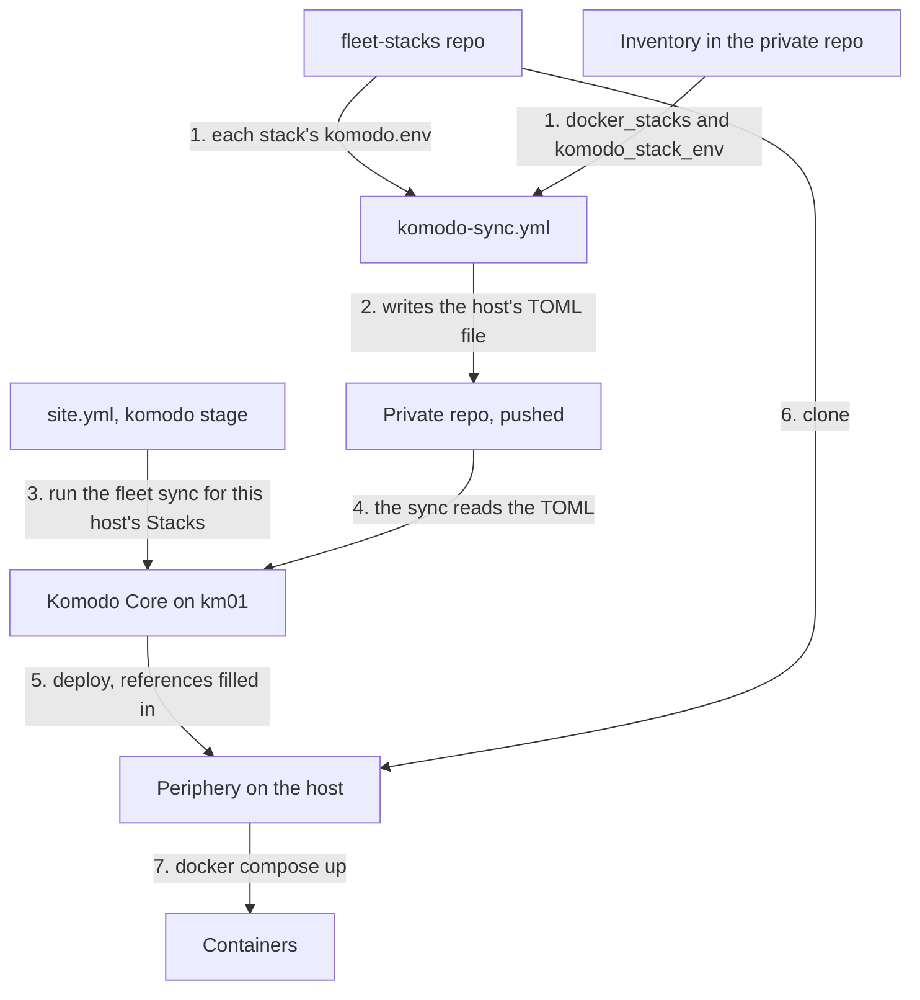

# Komodo

Komodo deploys the fleet's containers. This page explains what it is and the ideas the build guide relies on, for a reader who has run `docker compose` by hand and has never used Komodo.

## What it is {#what}

A host that runs containers with [Docker Compose](../docker-compose/index.md) needs three things for each set of containers: the compose file, the values the file reads, and somebody to run `docker compose up`. On one host that is a checkout, an `.env` file, and a shell. On eight hosts it is eight shells, eight `.env` files that hold passwords, and no single place that says what is running where.

Komodo is that single place. It is a web application with an API that knows every host and every set of containers, holds the values and the secrets, and runs Compose on the right host when told to deploy. The compose files stay in a git repo, and Komodo fetches them from there for each deploy. This arrangement, where a git repo says what should run and a tool makes it so, is often called GitOps.

Komodo does not build the host. In the fleet, [NixOS](../nixos/index.md) gives each host Docker, its folders, and its open ports, and Komodo only starts the containers.

## The ideas you need {#ideas}

### Core and Periphery {#core-and-periphery}

Komodo is two programs. Core is the server: it has the web interface, the API, and the database, and there is one of it. Periphery is a small agent that runs on every host Komodo manages, and it is the part that runs `git` and `docker` there.

Periphery connects out to Core and keeps the connection open. Core sends its instructions back along that connection, so a host opens no port for Komodo. Only the host that runs Core accepts connections, on port 9120.

Core and Periphery each have a keypair of their own. A Periphery is given Core's public key in its configuration and trusts only that Core. Core stores each Periphery's public key and trusts only those.

### Resources {#resources}

Everything Komodo manages is a resource with a type and a name: a Server, a Stack, a Resource Sync. The fleet uses those three types, and each has a section below. Names are unique within a type.

### Server {#server}

A Server is Komodo's record of one host, tied to that host's Periphery. It shows whether the host is connected, and it is what a Stack names to say where it runs.

In the fleet a Server has the host's name in lower case, such as `km01`. Nobody creates one by hand. See [Onboarding key](#onboarding-key).

### Stack {#stack}

A Stack is one Compose project that Komodo deploys to one Server. It holds where the compose file comes from, which Server runs it, and the *Environment* the compose file reads its values from.

A Stack's compose file can be typed into the UI, read from a file on the host, or cloned from a git repo. The fleet uses the git repo for every Stack. This is the `komodo-server` Stack as the fleet declares it, with its *Environment* cut to three lines:

```toml
[[stack]]
name = "komodo-server"
deploy = true

[stack.config]
server = "km01"
git_provider = "github.com"
repo = "myah-mitchell/fleet-stacks"
branch = "main"
run_directory = "stacks/komodo-server"
file_paths = ["compose.yaml"]
environment = '''
PROJECT_NAME: komodo
SERVER_NAME: km01
POSTGRES_PASSWORD: [[KOMODO_DB_PASSWORD]]
'''
```

| Key | Says |
| --- | --- |
| `server` | Which Server runs the Stack |
| `git_provider`, `repo`, `branch` | The repo that holds the compose file |
| `run_directory` | The folder in the repo that Compose runs from |
| `file_paths` | The compose file, relative to the run directory |
| `environment` | The values the compose file reads |

A Stack name is unique across all of Komodo, not per Server. A stack that runs on every host therefore gets one Stack per host, with the host's name on the end, such as `system-agent-id01`.

### Environment {#environment}

A compose file reads values such as `${POSTGRES_PASSWORD}` from an `.env` file beside it. A Stack's *Environment* is the text of that file, kept in Komodo. At each deploy Komodo writes it to an `.env` file in the run directory and passes it to Compose.

In the fleet-stacks repo the *Environment* of each stack is the file `komodo.env` in the stack's folder, one `KEY: value` line for each value the stack reads.

### Variables and Secrets {#variables-and-secrets}

A Variable is a named value held in Core's database, not in any one Stack. A Secret is a Variable marked as secret: Komodo hides its value in the UI and in logs, and only an admin can read it.

An *Environment* refers to one by its name in double square brackets. Just before a deploy, Core replaces each reference with the value it holds. This is interpolation. The line from the Stack above reaches the host with the password in place of the reference:

```text
POSTGRES_PASSWORD: [[KOMODO_DB_PASSWORD]]
```

This is what lets `komodo.env` sit in a public repo. The file holds the names of the secrets and never their values. It also means one value, such as the timezone in `GLOBAL_TZ`, is set one time and read by every Stack.

A reference to a name that does not exist is not an error. It reaches the container as the literal text `[[NAME]]`. See [How a stack gets its values](../../fleet-bootstrap/concepts/variables-and-secrets.md#how).

### Deploy {#deploy}

To deploy a Stack, Core fills in the *Environment* and tells the Server's Periphery to bring the Stack up. On the host, Periphery does what a person would:

1. Clones the Stack's repo, or pulls it when a clone is already there. The fleet's hosts keep these clones under `/opt/docker/stacks`.
2. Writes the *Environment* to an `.env` file in the run directory.
3. Runs `docker compose up` there, with the Stack's name as the Compose project name.

Compose creates the containers that are missing and replaces the ones whose definition changed. The clone is disposable. Periphery writes over it at every deploy, so nothing a container needs to keep lives in it.

### Update {#update}

An Update is Komodo's record of one action, such as a deploy or a sync: who started it, each stage it went through, and the output of every command. When a deploy fails, the Stack's latest Update holds the reason.

### Resource Sync {#resource-sync}

A Resource Sync reads resource definitions written as TOML from a git repo, and creates or changes resources in Komodo to match. The block under [Stack](#stack) is such a definition. With a sync, the list of Stacks is a file with a history, not the result of clicks.

A sync first works out what differs between the files and Komodo, and shows that as pending changes. Running it applies them. A Stack declared with `deploy = true` is also deployed by the sync when it is not running or when its definition changed.

A sync can run for every resource in its files or for a named few. The fleet has one sync, named `fleet`, and always runs it for one host's Stacks at a time.

### Onboarding key {#onboarding-key}

A new Periphery has a keypair that Core has never seen, so Core has no reason to trust it. An onboarding key is a credential, created in Core, that a new Periphery presents the first time it connects. Core accepts it, creates the Server, and stores the Periphery's public key. From then on the two use their own keypairs, and the onboarding key plays no part.

One onboarding key can admit many hosts until it expires. A key created as not privileged can add a new Server but cannot replace the key of a Server that exists.

### API keys and service users {#api-keys}

Everything the web interface does goes through Core's API, and a program can call the same API. It signs in with an API key and its secret, sent in the headers `X-Api-Key` and `X-Api-Secret`.

An API key belongs to a user. A service user is a user that has no password and cannot log in to the web interface, made for a program to have keys of its own. The fleet has one, named `ansible`.

## How the fleet uses it {#in-the-fleet}

Core runs on km01, in the [komodo-server](../../fleet-bootstrap/stacks/komodo-server.md) stack, with FerretDB and Postgres as its database. Periphery runs on every Docker host, km01 included, as a systemd service that the host's NixOS configuration installs. It is not a container, so it can replace any container, Core's among them.

| What | Where it is |
| --- | --- |
| Core's address and public key | `komodo_core_address` and `komodo_core_public_key` in the private repo's `group_vars/all/private.yml` |
| The onboarding key | `komodo-onboarding-key` in the private repo's `secrets/fleet.yaml`, encrypted with [sops](../sops/index.md) |
| Each stack's compose file and `komodo.env` | `stacks/<stack>` in the fleet-stacks repo |
| Which stacks a host runs | `docker_stacks` in the host's entry in `hosts.yml` |
| Each host's Stacks as TOML | `komodo/stacks/<host>.toml` in the private repo, generated |
| The service user's API key | `KOMODO_API_KEY` and `KOMODO_API_SECRET` in the control node's environment |
| Variables and Secrets | Core's database, entered in the UI |

### From the repo to running containers {#flow}

Nobody clicks to deploy. A stack reaches a host through two generated steps and one API call, which the diagram shows in order.



The playbook `komodo-sync.yml` runs on the control node and connects to nothing. For each host it takes the stacks in `docker_stacks`, reads each one's `komodo.env` from fleet-stacks, sets the host's own values in it, and writes one `[[stack]]` block per stack. You commit and push the result, because Komodo reads the pushed copy. See [The generated files](../../fleet-bootstrap/concepts/fleet-private.md#generated).

The last stage of `site.yml` is the `komodo_stacks` role in fleet-ansible, and it talks only to Core's API. It checks that the committed file matches the inventory, waits for the host's Server to be connected, runs the `fleet` sync for that host's Stacks, waits for the sync's Update to complete, and then waits until every one of those Stacks is running. See [The four stages](../../fleet-bootstrap/concepts/how-a-host-is-built.md#stages).

### What follows from that {#consequences}

The TOML file owns each Stack's settings and *Environment*. An edit made in the UI lasts until the next sync. A value that should stay goes in the inventory's `komodo_stack_env`, or in a Variable or Secret. See [What the run overwrites](../../fleet-bootstrap/concepts/how-a-host-is-built.md#overwrites).

The sync has *Delete Unmatched Resources* off, so it never deletes. A Stack a host no longer lists stays in Komodo until you delete it there.

Variables and Secrets are the one part of the fleet that is entered by hand and kept in no repo. Each host page says which to create before its run, and the register lists them all. See [Variables and Secrets](../../fleet-bootstrap/concepts/variables-and-secrets.md).

Core cannot deploy the stack it runs in before it has started. On the first build of km01 it is started by hand with Compose, one time, and then takes its own Stack over. See [Start Komodo Core](../../fleet-bootstrap/foundation/first-run.md#start-core).

Periphery's version comes from the fleet-nixos repo, which pins it in `packages/komodo-periphery.nix`. Core's comes from the image tag in fleet-stacks. The two speak the same protocol only within one major version.

## Finding your way around {#around}

Open Komodo at `http://172.16.7.101:9120`, or at `https://komodo.km01.home.myah-mitchell.com` through Traefik. None of these places changes anything by being looked at.

| To see | Look at |
| --- | --- |
| Which hosts are connected | *Resources > Servers* |
| Every Stack and its state | *Resources > Stacks*, filtered by Server |
| Why a deploy failed | The Stack's page, in its latest Update |
| What a Stack was given | The Stack's *Environment*, where references still show as `[[NAME]]` |
| What differs from the private repo | *Syncs*, the `fleet` sync, its *Pending* view |
| Which values exist | *Settings > Variables* |

On a host, three commands show Komodo's side of things:

```bash
systemctl status komodo-periphery
sudo journalctl -u komodo-periphery -n 50
docker compose ls
```

The first says whether Periphery is running, the second prints the end of its log, and the third lists the Compose projects on the host with the file each was started from.

## Making changes {#changes}

| To | See |
| --- | --- |
| Give a host a stack that exists in fleet-stacks | [Adding a stack to a host](add-a-stack-to-a-host.md) |
| Write a stack of your own | [Writing a new stack](write-a-new-stack.md) |
| Move a container to another image version | [Updating a container image](update-an-image.md) |
| Create a Variable or Secret | [Creating one](../../fleet-bootstrap/concepts/variables-and-secrets.md#create) |
| Set a value for one host | [Stack values](../../fleet-bootstrap/concepts/fleet-private.md#stack-values) |
| Set Komodo up after its first start | [Setting up Komodo](../../fleet-bootstrap/foundation/komodo-setup.md) |
| Build or rebuild km01 | [Komodo (km01)](../../fleet-bootstrap/hosts/km01-komodo.md) |
| Create one Stack in the UI, without the run | [Deploying a stack by hand](../../fleet-bootstrap/procedures/deploy-a-stack-by-hand.md) |
| Run only the deploy stage | [Running only the last stage](../../fleet-bootstrap/procedures/deploy-a-stack-by-hand.md#komodo-stage) |

## When it goes wrong {#troubleshooting}

| What you see | First place to look |
| --- | --- |
| A container fails with `[[NAME]]` in an error, or with a type error on a value | The Variable or Secret `NAME` does not exist. Create it and deploy again |
| The run stops and says a host's `.toml` file does not match | The committed file is out of date. See [After a change](../../fleet-bootstrap/concepts/fleet-private.md#after-a-change) |
| The run stops with no connected Server for the host | Periphery's log on the host. See [How a host joins Komodo](../../fleet-bootstrap/concepts/how-a-host-is-built.md#onboarding) |
| The run says Komodo refused the API key | `KOMODO_API_KEY` and `KOMODO_API_SECRET` on the control node. See [the service user](../../fleet-bootstrap/foundation/komodo-setup.md#service-user) |
| The run says some Stacks are not running | Each Stack's latest Update in Komodo |
| A value set in the UI went back | The sync restored it from the TOML file. See [What follows from that](#consequences) |
| Core itself is down | [If the handover fails](../../fleet-bootstrap/foundation/first-run.md#handover-fails) |

Losing Core's keypair breaks trust with every host. See [What to keep safe](../../fleet-bootstrap/hosts/km01-komodo.md#keep).

## Going further {#further}

- [Komodo's documentation](https://komo.do/docs/intro)
- [Docker Compose in Komodo](https://komo.do/docs/deploy/compose), for every way a Stack can be defined
- [Sync Resources](https://komo.do/docs/automate/sync-resources), for the TOML form of every resource type
- [Variables and Secrets](https://komo.do/docs/configuration/variables)
- [Connect More Servers](https://komo.do/docs/setup/connect-servers), for onboarding keys and Periphery's settings
- [The Komodo source](https://github.com/moghtech/komodo)
