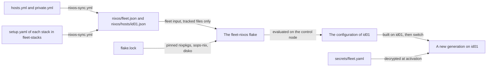

# NixOS

NixOS is the Linux distribution every VM in the fleet runs. This page explains the ideas behind it for someone who has run other distributions and never this one, and shows where each idea appears in the fleet's own files. It holds no procedure. The how-tos are listed under [Making changes](#changes).

## What it is {#what}

On most distributions a server is the sum of everything ever done to it: packages installed, files edited under `/etc`, services enabled, each by a command somebody ran at some point. Two servers set up from the same notes drift apart, and nobody can say for certain what a given one holds.

NixOS turns that around. You write down what the system should be, in files, and a tool builds the whole operating system from them: the kernel, every package, every file under `/etc`, every systemd unit. A change is an edit to those files followed by a new build. Nothing is configured by hand on the machine, and what was configured by hand does not last.

The fleet uses NixOS for three things that follow from this. Every host is built from files in git, so a host can be wiped and installed again and come out the same. A change is reviewed as a diff before it reaches a host. A change that breaks a host is undone by going back to the system that ran before it.

## The ideas you need {#ideas}

Read these in order. Each builds on the ones above it.

### Declarative configuration {#declarative}

A declarative configuration states the result and leaves the steps to the tool. You do not write "install chrony, then edit its config file, then enable the service". You write that the time service is on and which servers it uses, and NixOS works out the package, the config file, and the unit.

This is the fleet's whole time module, `modules/ntp.nix` in the fleet-nixos repo:

```nix
# Keeps the clock right with chrony.
{ config, lib, ... }:
{
  services.chrony = {
    enable = true;
    servers = lib.mkIf (config.fleet.ntpServers != [ ]) config.fleet.ntpServers;
  };
}
```

The language is Nix, a small language for describing data. Curly braces hold named values, a list sits in square brackets, and `#` starts a comment. The file says chrony is enabled, and that its servers are the fleet's list when that list is not empty. It says nothing about how.

The configuration is also the only source. Remove those lines, build again, and chrony is gone from the host: its package, its config file, and its unit. On a hand-configured server, removing something means remembering everything that was done to add it.

### The Nix store {#store}

Everything NixOS builds goes into one folder, `/nix/store`, and each item gets a folder of its own there. The folder's name starts with a hash worked out from everything that went into building the item: its source, its build instructions, and the store paths of everything it depends on.

```text
/nix/store/<hash>-chrony-<version>
```

Two consequences matter here. A store path never changes once built, so nothing is upgraded in place. A new version of a package is a new path next to the old one, and both can exist at the same time. The store is also read-only, so nothing on the host edits a package or a generated config file where it lies.

A recipe for building one store path is called a derivation. You will see the word in error messages and in the output of a dry run, where "these derivations will be built" lists what a build would make.

### The system and its generations {#generations}

A whole NixOS system is itself one store path. It holds links to the kernel, to every package the configuration names, to the generated contents of `/etc`, and to every systemd unit. The file `/run/current-system` on a host is a link to the system that is running.

Changing a host therefore never modifies its system. It builds a second system next to the first and moves a link. Each system a host has been given is kept as a generation, numbered in order. The boot menu lists the generations, so an older one can be booted.

Generations cost little. Two systems that differ in one package share every other store path. The fleet's hosts delete generations older than 30 days in a weekly job, which is set in `modules/system.nix`.

### Modules and options {#modules}

An option is a named setting with a type, such as `services.chrony.enable`, which takes true or false. NixOS ships thousands of them, and setting options is how a configuration says what it wants.

A module is a file that sets options, declares new ones, or both. The time module above is one. NixOS merges every module of a configuration into a single set of option values before it builds anything, so the modules can be written one concern at a time and in any order. Two modules that each open a firewall port both get their port.

A module can also declare options of its own. The fleet's `modules/options.nix` declares everything under the name `fleet`: the host's name, its network, its feature switches, the accounts' keys. The other modules read those values and turn them into NixOS's own options. That is where `config.fleet.ntpServers` in the time module comes from.

A wrong value is caught before anything is built. An option given a value of the wrong type, or an option name that does not exist, stops the build with a message naming it. Working out the final option values is called evaluation, and it happens on the machine that starts the build.

### Flakes and the lock file {#flakes}

A flake is a git repo with a file `flake.nix` at its root, which states two things: its inputs, which are the other repos it builds from, and its outputs, which are what it offers. The fleet-nixos repo is a flake. Its outputs are one NixOS configuration per host, the installer ISO, and six commands.

These are the inputs, from the fleet's `flake.nix`:

```nix
inputs = {
  nixpkgs.url = "github:NixOS/nixpkgs/nixos-26.05";
  sops-nix = {
    url = "github:Mic92/sops-nix";
    inputs.nixpkgs.follows = "nixpkgs";
  };
  disko = {
    url = "github:nix-community/disko";
    inputs.nixpkgs.follows = "nixpkgs";
  };
  fleet = {
    url = "path:./example";
    flake = false;
  };
};
```

nixpkgs is the repo that holds every package and NixOS itself, and `nixos-26.05` is the branch of one NixOS release. An input names a branch, and a branch moves. The lock file, `flake.lock`, records the exact commit of each input that the flake was last updated to, and every build uses those commits. The same flake with the same lock file builds the same system on any machine, today or next year.

Nothing moves the lock file except a person running `nix flake update` and committing the result. That is how the fleet takes updates. See [Updating the fleet](../../fleet-bootstrap/procedures/update-the-fleet.md#lock).

A flake in a git repo is built from the files git tracks, and from no others. A new file that has not been added with `git add` does not exist as far as a build is concerned.

### Build, activate, switch, and boot {#switch}

Putting a configuration onto a host takes three separate acts, and the tool `nixos-rebuild` combines them in different ways.

Building makes the new system's store path, downloading what the public NixOS cache already has and compiling the rest. Activating makes a built system the running one: it replaces `/etc`, starts, stops, and restarts the services whose units changed, and leaves the rest alone. Registering the system makes it a new generation and the default entry in the boot menu.

| Action | Builds | Activates now | Default at next boot |
| --- | --- | --- | --- |
| `switch` | Yes | Yes | Yes |
| `boot` | Yes | No | Yes |
| `test` | Yes | Yes | No |
| `dry-activate` | Yes | No. It lists what a switch would restart | No |
| `dry-build` | No. It lists what would be built | No | No |

A switch is the normal deploy. A kernel cannot be swapped while it runs, so a switch that brings a new kernel leaves the old one running until the host restarts. With `test`, a restart returns the host to the system it had before, which makes it the action for trying a change.

### Rollback {#rollback}

A rollback makes an earlier generation the current one. It builds nothing, because the earlier system is still in the store, so it takes seconds and needs no network. It can be done on a running host, or from the boot menu on a host that no longer starts properly.

A rollback returns the operating system and nothing else. Data a service wrote in the meantime stays as it is, and a database that a newer version has already migrated is not migrated back.

### State and the persistent disk {#state}

State is whatever a machine holds that its configuration does not describe: databases, uploaded files, keys made on the machine. NixOS builds the system and cannot build state, so the two have to be kept apart on purpose.

The fleet draws the line with disks. A host's operating system disk and its Docker disk hold only what can be made again, and an install wipes both. Everything worth keeping lives on a third disk, the persistent disk, mounted at `/srv/persist`, which an install never formats once it holds a filesystem. See [Host layout](../../fleet-bootstrap/concepts/host-layout.md#disks).

The configuration names each path on that disk that the system depends on. In `modules/persist.nix`, sshd is told to read its host keys from `/srv/persist/host/ssh`, and the two folders for the containers' volumes and logs are bind mounted from the disk onto `/opt/docker/volumes` and `/opt/docker/logs`. A host rebuilt from nothing finds its keys and its data at the paths the configuration expects.

The accounts follow the same rule. The fleet sets `users.mutableUsers = false`, so the accounts, their passwords, and their SSH keys are exactly the configured ones. A password changed with `passwd` on a host is put back by the next deploy.

## How the fleet uses it {#in-the-fleet}

Every VM in the fleet runs NixOS, and one flake, the [fleet-nixos](https://github.com/myah-mitchell/fleet-nixos) repo, builds all of them. The flake is public and names no host. What your fleet is comes in through its `fleet` input, which every command points at the private repo.

### From an inventory entry to a running host {#pipeline}

The diagram shows what turns a host's entry in the inventory into the system that runs on it, taking id01 as the host.



You describe a host in the inventory, which is an Ansible file. The playbook `nixos-sync.yml` in the fleet-ansible repo translates that entry into a JSON file, `nixos/hosts/id01.json` in the private repo, and adds what the host's stacks need from it: folders, seed files, and open ports. It writes the values every host shares to `nixos/fleet.json`. Both files are committed. See [The generated files](../../fleet-bootstrap/concepts/fleet-private.md#generated).

The flake reads those two files and nothing else about a host. `lib/fleet.nix` checks that every expected key is present, and `flake.nix` hands the values to the modules as the `fleet` options. Each host file becomes one configuration, named for the host. The modules are the same for every host, so the JSON values are all that makes one host differ from the next.

A deploy evaluates the host's configuration on the control node, the machine the run starts from. The host then builds its own system, downloading packages from the public NixOS cache, and switches to it. See [What a deploy does](../../fleet-bootstrap/concepts/nixos-flake.md#deploys).

### Where its configuration lives {#files}

| Place | Holds |
| --- | --- |
| `flake.nix` in fleet-nixos | The inputs, one configuration per host, the installer ISO, the commands, and the checks |
| `flake.lock` in fleet-nixos | The commit of each input that every host is built from |
| `modules/` in fleet-nixos | One module per concern: the firewall, the accounts, Docker, sshd, and so on. `default.nix` lists them and `options.nix` declares the `fleet` options |
| `lib/fleet.nix` in fleet-nixos | The reader for the two JSON files, which stops on a missing key |
| `scripts/` in fleet-nixos | The six commands, as shell scripts |
| `packages/` in fleet-nixos | Komodo Periphery, packaged from its upstream release |
| `nixos/` in the private repo | The generated JSON files: one for the fleet and one per host |
| `secrets/` in the private repo | The secrets a host decrypts, encrypted with sops |

A host's JSON file has a `features` object, and each key in it switches one optional module on: the firewall, Docker, Komodo Periphery, Node Exporter, fail2ban, auditd, mail, and mosh. Each comes from an upper-case flag in the inventory. See [A host's configuration](../../fleet-bootstrap/concepts/nixos-flake.md#configuration) for the table, and [Describing a host](../../fleet-bootstrap/concepts/fleet-private.md#describe) for the inventory keys.

### What it works with {#neighbours}

| Tool | What passes between them |
| --- | --- |
| [Ansible](../ansible/index.md) | Writes the JSON files, and runs the flake's commands from the control node. It runs nothing on a NixOS host |
| [OpenTofu](../opentofu/index.md) | Creates the blank VM and its three disks, which the installer and then NixOS take over |
| [sops](../sops/index.md) | Encrypts the secrets in the private repo. A host decrypts them into `/run/secrets` each time a system is activated, with a key that follows from its SSH host key |
| [Komodo](../komodo/index.md) | Its agent, Periphery, runs as a systemd service that the host's configuration defines |
| Docker | Installed and configured by the host's configuration. The containers themselves are Komodo's business, not NixOS's |

The flake's six commands install, deploy to, and reset a host. `deploy-host` wraps `nixos-rebuild` and is the only thing that changes a built host. No host updates itself. See [The commands](../../fleet-bootstrap/concepts/nixos-flake.md#commands).

A new VM boots an installer ISO, which is a small NixOS built from the same flake. See [The installer](../../fleet-bootstrap/concepts/nixos-flake.md#installer).

## Finding your way around {#around}

None of these commands changes anything. The examples take id01 as the host.

### On a host {#around-host}

Log in as the admin account. See [Accounts](../../fleet-bootstrap/concepts/host-layout.md#accounts).

| Command | Shows |
| --- | --- |
| `nixos-rebuild list-generations` | Every generation the host keeps, with its date and NixOS version, and which one is current |
| `readlink /run/current-system` | The store path of the system that is running |
| `readlink /run/booted-system` | The store path of the system the host booted. It differs from the line above after a switch |
| `nixos-version` | The NixOS release and the nixpkgs commit the system was built from |
| `cat /etc/fleet-host` | The host's name in the inventory, which marks it as a built host |
| `systemctl --failed` | Units that failed to start. Empty on a healthy host |
| `sudo ls /run/secrets` | The secrets that were decrypted at the last activation |
| `sudo iptables -S nixos-fw` | The firewall's rules |

Files under `/etc` are links into the store. Read them to see what a service was configured with, and change them through the configuration.

### On the control node {#around-control}

Run these from a checkout of fleet-nixos, here `~/src/fleet-nixos`, with the private repo at `~/src/fleet-private`.

The inputs and the commit each is pinned to:

```bash
nix flake metadata
```

The value any option has for a host, here the feature switches of id01:

```bash
nix eval .#nixosConfigurations.id01.config.fleet.features \
  --override-input fleet git+file://$HOME/src/fleet-private \
  --no-write-lock-file
```

Replace the part after `config.` with any option's name, such as `networking.firewall.allowedTCPPorts`. Evaluation needs no access to the host, so this works for a host that does not exist yet.

What a build of the host would make, without building it:

```bash
nix build .#nixosConfigurations.id01.config.system.build.toplevel \
  --override-input fleet git+file://$HOME/src/fleet-private \
  --no-write-lock-file --dry-run
```

Every host of the fleet at once, with the flake's other checks:

```bash
nix flake check --no-build --no-write-lock-file \
  --override-input fleet git+file://$HOME/src/fleet-private
```

## Making changes {#changes}

| To | See |
| --- | --- |
| Change a value or a feature of one host, or a value every host shares | [Changing a host's setting](change-a-host-setting.md) |
| Open a port on a host | [Opening a firewall port](open-a-firewall-port.md) |
| Give every host something the inventory has no setting for | [Adding a module to the flake](add-a-module.md) |
| Move the hosts to newer packages | [Updating the fleet](../../fleet-bootstrap/procedures/update-the-fleet.md) |
| Go back to an earlier generation | [Rolling back](../../fleet-bootstrap/procedures/update-the-fleet.md#rollback) |
| Install a host again and keep its data | [Rebuilding a VM](../../fleet-bootstrap/procedures/rebuild-a-vm.md) |
| Add a host | [Adding a host](../../fleet-bootstrap/procedures/add-a-host.md) |
| Change a secret a host reads | [Changing a secret](../../fleet-bootstrap/concepts/secrets-with-sops.md#edit) |

## When it goes wrong {#troubleshooting}

| What you see | Where to look |
| --- | --- |
| An evaluation stops with a file and a key, such as `nixos/hosts/id01.json: network: missing key "gateway"` | The generated file is older than the flake, or was edited by hand. Generate it again. See [After a change](../../fleet-bootstrap/concepts/fleet-private.md#after-a-change) |
| A build behaves as if a new file were not there | The file is not tracked by git. Add it with `git add` in the repo that holds it |
| The run stops and says a file under `nixos/` does not match what the inventory gives | The inventory or fleet-stacks changed after the files were generated. Run `nixos-sync.yml`, then commit and push |
| `deploy-host: cannot decrypt secrets/host-keys/id01.yaml` | The control node has no usable age key. See [Secrets with sops](../../fleet-bootstrap/concepts/secrets-with-sops.md#keys) |
| `Host key verification failed` during a deploy | The machine at that address did not answer with the host's key from the private repo. Check the address before anything else |
| `deploy-host: nixos-rebuild switch failed` | The lines above it, which are `nixos-rebuild`'s own output and name the option, the derivation, or the unit that failed |
| A switch finishes and a service is down | `systemctl --failed` on the host, then `journalctl -b -u` followed by the unit's name. To get the host back first, see [Rolling back](../../fleet-bootstrap/procedures/update-the-fleet.md#rollback) |
| A change made by hand on a host is gone | Expected. See [What the run overwrites](../../fleet-bootstrap/concepts/how-a-host-is-built.md#overwrites) |
| The host does not finish booting | Its console in Proxmox. A detached persistent disk stops the boot, and the boot menu offers the earlier generations |

## Going further {#further}

- [The NixOS manual](https://nixos.org/manual/nixos/stable/), for installing and configuring NixOS in general.
- [The NixOS option search](https://search.nixos.org/options), for every option's name, type, and default.
- [The package search](https://search.nixos.org/packages), for the name a package has in nixpkgs.
- [nix.dev](https://nix.dev/), for tutorials on the Nix language and on flakes.
- [The Nix reference manual](https://nix.dev/manual/nix/stable/), for the `nix` command.
- [sops-nix](https://github.com/Mic92/sops-nix), [disko](https://github.com/nix-community/disko), and [nixos-anywhere](https://github.com/nix-community/nixos-anywhere), for the three projects the flake builds on.
