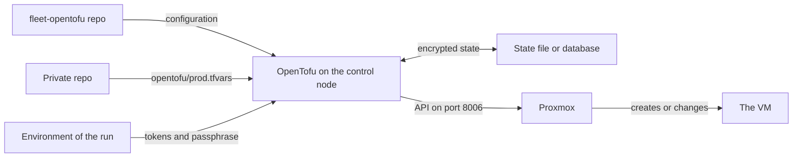

# OpenTofu

OpenTofu creates the fleet's VMs on Proxmox from a text file that describes them. This page explains how it works and how the fleet uses it, for a reader who has never used an infrastructure-as-code tool.

It holds no procedure. The how-tos are listed under [Making changes](#changes).

## What it is {#what}

A VM can be made by clicking through the *Create VM* dialog in Proxmox. That works for one VM. For ten it means ten passes through the same dialog, each a chance to pick a different CPU type or forget a disk, and afterwards nothing records what was chosen or why.

OpenTofu takes the other route, called infrastructure as code. You write down what should exist: a VM with this name, this many cores, these disks. OpenTofu compares that description with what it has already made, works out the difference, and makes the API calls that close it. The description lives in git, so every VM has a history, and a second VM is a copy of five lines.

OpenTofu does one job in the fleet. It creates each VM blank, and changes a VM's hardware later. What runs inside the VM is the work of NixOS and Komodo. See [How a host is built](../../fleet-bootstrap/concepts/how-a-host-is-built.md#stages).

## The ideas you need {#ideas}

### Declaring, not doing {#declarative}

An OpenTofu file says what should exist, not which steps to take. There is no "create" command in it. If the thing is missing, OpenTofu creates it. If it exists and matches, OpenTofu does nothing. If it exists and differs, OpenTofu changes it.

That is why the same run is safe to repeat. A second run against a VM that already matches its description plans no change.

The files are written in a language called HCL and end in `.tf`. A set of `.tf` files in one folder is a configuration. The fleet's configuration is the fleet-opentofu repo, in the folder `envs/prod`.

### Providers {#providers}

OpenTofu itself knows nothing about Proxmox. A provider is a plugin that teaches it one API: which kinds of things exist there, and how to create, read, change, and delete each one.

The fleet uses one provider, bpg/proxmox, declared in `envs/prod/versions.tf`:

```hcl
  required_providers {
    proxmox = {
      source  = "bpg/proxmox"
      version = ">= 0.70.0"
    }
  }
```

OpenTofu downloads the provider the first time `tofu init` runs in the folder. The file `.terraform.lock.hcl` beside it records the exact version that was downloaded, 0.113.1, so every control node uses the same one.

A provider needs an address and a credential. The fleet gives it the API URL of each Proxmox server and an API token for each. See [The Proxmox servers](../../fleet-bootstrap/concepts/fleet-private.md#servers).

### Resources {#resources}

A resource is one thing OpenTofu manages through a provider. Each has a type, which the provider defines, and a name of your choosing. The fleet has one resource block, in `modules/vm/main.tf`, and it describes a VM:

```hcl
resource "proxmox_virtual_environment_vm" "this" {
  name      = var.name
  node_name = var.node_name
  vm_id     = var.vm_id

  cpu {
    cores = var.cores
    type  = var.cpu_type
    numa  = var.numa
  }
```

The block goes on to declare the memory, the network device, every disk, the CD-ROM drive, and the cloud-init drive. Nothing about a fleet VM is set anywhere else.

### Data sources {#data-sources}

A data source reads something through a provider without managing it. The fleet has one, in `envs/prod/main.tf`. It lists the VMs on each Proxmox server that carry the `tofu` tag, so OpenTofu knows which node each VM runs on now.

Every plan runs that read. This is why OpenTofu needs the Proxmox API even when nothing is going to change.

### Variables and tfvars files {#variables}

A variable is an input to a configuration. The configuration declares the variable's name, type, and default, and the value comes from outside. That split is what lets the fleet-opentofu repo be public: it holds the shape of a VM, and no address or name of yours.

`envs/prod/variables.tf` declares three variables.

| Variable | Holds |
| --- | --- |
| `servers` | The Proxmox servers the VMs live on |
| `vms` | The VMs, keyed by name |
| `server_api_tokens` | One API token for each server. Marked sensitive, so OpenTofu never prints it |

Values reach a variable in two ways the fleet uses. A file ending in `.tfvars` holds values in the same language, and a file whose name ends in `.auto.tfvars` is read without being asked for. An environment variable named `TF_VAR_` followed by the variable's name sets it too, which is how the tokens arrive without being written to any file.

The fleet's tfvars file is `opentofu/prod.tfvars` in the private repo. See [A VM's entry, field by field](#vm-entry).

### Modules {#modules}

A module is a folder of `.tf` files used as one unit, with variables as its inputs and outputs as its results. It is OpenTofu's version of a function: write the VM once, call it for each host.

The fleet has one module, `modules/vm`, which holds the resource block above. `envs/prod/main.tf` calls it one time for each entry in `vms`:

```hcl
module "vm" {
  source   = "../../modules/vm"
  for_each = var.vms

  name  = each.key
  cores = each.value.cores
```

`for_each` makes one copy of the module for each key in the map. Each copy has an address that includes the key, and so does the resource inside it:

```text
module.vm["id01"].proxmox_virtual_environment_vm.this
```

That address is the name OpenTofu knows a VM by. It appears in every plan, and in the commands that pick one VM out.

### Outputs {#outputs}

An output is a value a configuration hands back after a run. The fleet's configuration has one, `vms`, which lists each VM's server, node, VMID, and address. The ansible run reads it to learn the node and VMID that Proxmox gave a new VM.

### State {#state}

State is OpenTofu's record of what it has made. For each resource address it stores the real object's ID and every attribute it had after the last run. The description says there should be a VM named id01. The state says that VM is VMID 7131 on vh01, and that OpenTofu made it.

OpenTofu trusts the state over what it could see for itself. It does not search Proxmox for a VM named id01. A resource with no entry in the state is, to OpenTofu, a resource that does not exist yet.

Two things follow, and both matter in this fleet.

- A lost state means every VM looks new. The next run tries to create each one again. The fix is to bring each VM back into the state by hand, one at a time.
- Two states for one fleet do the same damage. A run pointed at an empty state file, while the real state sits in a database, plans to create VMs that already exist.

The reverse holds too. A VM made by hand in Proxmox is in no state, so no plan can touch it.

### State backends {#backends}

A backend is where the state is stored. The fleet uses two.

| Backend | Stores the state in | Used |
| --- | --- | --- |
| `local` | One file on the control node | By the shell, for km01 and ci01, before the database exists |
| `pg` | A Postgres database | By Semaphore, and by every run after the handover |

A file works for one person on one machine. A database can be reached from more than one control node, is backed up with the server's other databases, and locks the state while a run holds it, so two runs cannot write at once.

The fleet moves from the file to the database one time. See [The handover](../../fleet-bootstrap/foundation/handover.md#move).

### State encryption {#state-encryption}

The state holds every attribute of every resource in plain text unless it is encrypted. OpenTofu can encrypt the state, and a saved plan, with a key derived from a passphrase before anything is written.

The fleet requires it. `envs/prod/versions.tf` marks both as enforced:

```hcl
  encryption {
    state {
      enforced = true
    }
    plan {
      enforced = true
    }
  }
```

The passphrase is not in the repo. It arrives in the environment variable `TF_ENCRYPTION`, and OpenTofu refuses to plan or apply without it. The database, and every dump of it, then holds nothing readable.

The cost is that the passphrase is now as important as the state. A state nobody can decrypt is a lost state. See [Store what outlives the shell](../../fleet-bootstrap/foundation/handover.md#keep).

### Plan and apply {#plan-and-apply}

OpenTofu works in two steps. A plan reads the configuration, the state, and the real objects, and lists what it would do: create this, change that attribute from one value to another. A plan changes nothing. An apply carries a plan out, and writes the result to the state.

The plan is the review step. Each line of it is a change to a real VM, shown before it happens. See [Reading a plan before applying](read-a-plan.md).

Some changes can be made to an existing object, and the plan calls those an update in place. Others cannot, and for those the provider plans a replacement: destroy the object and create a new one. For a VM, a replacement means new blank disks.

### Targeting {#targeting}

A plan covers the whole configuration unless it is told otherwise. The `-target` option limits it to the addresses named, so every other resource is left out of the plan.

The fleet's run always targets. A run for id01 plans `module.vm["id01"]` and nothing else, so a mistake in another host's entry cannot change that host's VM during this run.

### Refusing to destroy {#prevent-destroy}

A VM's disks hold its data, so destroying a VM deletes the persistent disk with everything on it. A plan can come to want that without anyone meaning it: an entry deleted or renamed in the tfvars file, a VM moved to another server, a run with the wrong file.

The fleet refuses such a plan in two places. The module sets `prevent_destroy` on the VM resource, which makes OpenTofu fail any plan that would destroy or replace one:

```hcl
  lifecycle {
    prevent_destroy = true
  }
```

The ansible role that runs OpenTofu also sets `check_destroy`, which stops the run when its plan contains a destroy. Removing a VM is therefore never a side effect. It is a procedure of its own. See [Removing a VM](remove-a-vm.md).

### OpenTofu and Terraform {#terraform}

OpenTofu is the open-source fork of Terraform, made in 2023 when Terraform's licence changed, and it uses the same language, providers, and state format under the command `tofu`. That history is why the files keep Terraform's names: a `terraform` block, `terraform.tfvars`, `.terraform.lock.hcl`.

The fleet relies on two things OpenTofu has and Terraform does not: state encryption, and one provider for each entry of a variable. It needs OpenTofu 1.9.0 or later.

## How the fleet uses it {#in-the-fleet}

Nobody runs `tofu` by hand in normal work. The first stage of the ansible run, the `vms` role in the fleet-ansible repo, runs it on the control node for the hosts the run is aimed at. See [Ansible](../ansible/index.md) for what a role and a run are.

The diagram shows what OpenTofu reads and what it reaches during that stage.



### Where everything is {#files}

| What | Where |
| --- | --- |
| The VM module | `modules/vm/` in the fleet-opentofu repo |
| The environment: provider, backend, encryption, the call to the module | `envs/prod/` in the fleet-opentofu repo |
| Every key and its default | `envs/prod/variables.tf`, with an example in `terraform.tfvars.example` |
| The servers and the VMs | `opentofu/prod.tfvars` in the private repo |
| The role that runs it | `roles/vms/` in the fleet-ansible repo |
| The state, before the handover | `~/.local/state/fleet-opentofu/prod.tfstate` in the shell |
| The state, after the handover | The `tofu_state` database on ci01 |

The state database is a second database on Semaphore's Postgres, owned by a role that can read nothing else. See [The state database](../../fleet-bootstrap/foundation/handover.md#state-database).

### What the role does {#role}

The role runs once for a run, on the control node, however many hosts the run names.

1. It checks that `TF_ENCRYPTION` is set, and `PG_CONN_STR` when the state is in the database.
2. It clones the fleet-opentofu repo to `/tmp/ansible-fleet-opentofu-checkout`, replacing any change made in an older checkout.
3. It copies the private repo's tfvars file into `envs/prod` as `private.auto.tfvars`.
4. It chooses the backend. With `vms_backend=local` it writes a file named `backend_override.tf` that swaps the database for a state file.
5. It runs `tofu init`, then compares each VM's network in the tfvars file with the host's entry in the inventory, and stops the run if they differ.
6. It plans and applies, with one target for each host in the run.
7. It reads the `vms` output for each VM's node and VMID.

A host is matched to its VM by name: the host's `serverHostname` in lower case is the key in `vms`. A host with no entry under that key gets no VM from the run. When the private repo has no tfvars file at all, the role does nothing.

The role's `vms_backend` defaults to `pg`. Only the runs from the first shell pass `local`. See [The first run](../../fleet-bootstrap/foundation/first-run.md).

### What comes from the environment {#environment}

Nothing secret is in either repo. OpenTofu reads these from the environment of the `ansible-playbook` process, which is the shell's environment file or Semaphore's Variable Group.

| Variable | Holds |
| --- | --- |
| `TF_VAR_server_api_tokens` | A JSON object with one Proxmox API token for each server |
| `TF_ENCRYPTION` | The state encryption settings, with the passphrase |
| `PG_CONN_STR` | The state database's connection string. Not needed with the `local` backend |

The token belongs to a Proxmox user that can manage VMs and nothing else. See [Create the API token](../../fleet-bootstrap/foundation/proxmox-and-installer.md#token).

### A VM's entry, field by field {#vm-entry}

This is id01's entry under `vms` in `opentofu/prod.tfvars`, from [Identity (id01)](../../fleet-bootstrap/hosts/id01-identity.md#describe):

```hcl
  id01 = {
    server       = "vh01"
    vm_id        = 7131
    cores        = 4
    memory_mb    = 8192
    vlan_id      = 7
    ipv4_address = "172.16.7.131/24"
    ipv4_gateway = "172.16.7.1"
    dns_servers  = ["172.16.7.1"]
    tags         = ["docker"]
    extra_disks = {
      persist = { interface = "scsi2", size_gb = 20 }
    }
  }
```

| Field | Here | Means |
| --- | --- | --- |
| The key | `id01` | The VM's name in Proxmox, and the name the run matches to the host in the inventory |
| `server` | `vh01` | Which entry under `servers` the VM is created on |
| `vm_id` | `7131` | The VMID. Left out, Proxmox picks the next free one |
| `cores` | `4` | The number of virtual CPU cores |
| `memory_mb` | `8192` | The memory, in MB |
| `vlan_id` | `7` | The VLAN tag on the VM's network device. 7 is the internal network in these pages |
| `ipv4_address` | `172.16.7.131/24` | The static address, with its prefix length |
| `ipv4_gateway` | `172.16.7.1` | The gateway of that network |
| `dns_servers` | `172.16.7.1` | The nameservers the installer uses |
| `tags` | `docker` | Proxmox tags, added to the two every fleet VM gets, `nixos` and `tofu` |
| `extra_disks` | One disk, `scsi2`, 20 GB | The persistent disk |

The address, the gateway, and the nameservers are written to the cloud-init drive, which only the installer reads. The installed host takes the same values from the inventory, so the run stops when the two disagree.

The entry leaves out the fields whose defaults suit it.

| Field | Default | Means |
| --- | --- | --- |
| `os_disk_gb` | `20` | The size of the OS disk, in GB |
| `docker_disk_gb` | `40` | The size of the Docker disk, in GB |
| `cpu_type` | `x86-64-v2-AES` | The CPU model the guest sees |
| `numa` | `true` | Whether NUMA is on |
| `balloon_mb` | `0` | The least memory Proxmox may shrink the VM to. 0 gives it a fixed amount |
| `bridge` | `vmbr0` | The Proxmox bridge the network device joins |
| `on_boot` | `true` | Whether the VM starts when the Proxmox node boots |
| `started` | `true` | Whether the VM is started after it is created |
| `node_name` | None | Pins the VM to one node of a cluster. Unset, the VM stays wherever it runs |
| `datastore_id` | The server's | The datastore for this VM's disks |
| `agent_timeout` | `5m` | How long an apply waits for the VM to report its address |

### What a blank VM consists of {#blank-vm}

OpenTofu installs nothing. The VM it creates has five drives, and every one is declared in the module.

| Drive | Set by | Holds |
| --- | --- | --- |
| `scsi0` | `os_disk_gb` | The OS disk, empty. NixOS is installed here |
| `scsi1` | `docker_disk_gb` | The Docker disk, empty |
| `scsi2` | `extra_disks` | The persistent disk, empty |
| `ide2` | The server's `installer_iso` | The installer ISO, as a CD-ROM |
| `ide0` | The address fields | The cloud-init drive |

A cloud-init drive is a small virtual disk that Proxmox writes a VM's hostname and network settings onto, for the guest to read at boot. The installer reads it to learn which address to listen on.

The boot order is `scsi0`, then `ide2`. A new VM finds nothing to boot on its empty OS disk and falls through to the ISO, so it comes up running the installer and waits there. The ISO stays in the drive after the install, ready for a rebuild. See [What first boot does](../../fleet-bootstrap/concepts/how-a-host-is-built.md#first-boot) for what happens next, and [Three disks](../../fleet-bootstrap/concepts/host-layout.md#disks) for what each disk becomes.

A host that runs Docker needs the `scsi2` entry. Nothing checks for it before the apply, and the install stops when it finds no disk there.

The apply returns when the guest agent in the VM reports an address, or when `agent_timeout` runs out. At that point the VM is running the installer, not an installed host.

## Finding your way around {#around}

The run's log is the first place to look. In Semaphore, open the task of a run and find the tasks of the `vms` role. The one named `Apply the configuration for this play's VMs` reports `ok` when OpenTofu had nothing to do and `changed` when it applied a change.

In Proxmox, every VM OpenTofu made carries the `tofu` tag, and a VM without it was made by hand.

For anything more, the `tofu` command needs a checkout of the configuration that has been given the tfvars file and can reach the state. See [Make a checkout](read-a-plan.md#checkout). In that folder, none of these changes anything:

| Command | Shows |
| --- | --- |
| `tofu version` | The version of OpenTofu and of the provider |
| `tofu state list` | The address of every VM in the state |
| `tofu state show '<address>'` | Everything the state records about one VM |
| `tofu output vms` | Each VM's server, node, VMID, and address |
| `tofu plan` | What an apply would do |

`<address>` is one line from `tofu state list`. The single quotes keep the shell from reading the brackets and double quotes inside it.

## Making changes {#changes}

A change to a VM is an edit to its entry in the tfvars file, a commit, and a run of the host. A change to the tfvars file needs no generating. See [After a change](../../fleet-bootstrap/concepts/fleet-private.md#after-a-change).

| Page | Covers |
| --- | --- |
| [Reading a plan before applying](read-a-plan.md) | Seeing what a run would do to a VM, and what the plan's lines mean |
| [Changing a VM's CPU or memory](resize-a-vm.md) | Giving a VM more or fewer cores, or more or less memory |
| [Removing a VM](remove-a-vm.md) | Destroying a VM and its disks, on purpose |

These pages of the build guide touch OpenTofu.

| Page | Covers |
| --- | --- |
| [Proxmox and the installer ISO](../../fleet-bootstrap/foundation/proxmox-and-installer.md) | The servers in the tfvars file, and the API token |
| [The control shell](../../fleet-bootstrap/foundation/control-shell.md#environment) | The state passphrase |
| [The handover](../../fleet-bootstrap/foundation/handover.md) | Moving the state from the file to the database |
| [Adding a host](../../fleet-bootstrap/procedures/add-a-host.md) | A new VM's entry |
| [Growing a disk](../../fleet-bootstrap/procedures/grow-a-disk.md) | Making a VM's disk larger |
| [Rebuilding a VM](../../fleet-bootstrap/procedures/rebuild-a-vm.md#replace-vm) | Replacing a VM with a new one that keeps the persistent disk |

## When it goes wrong {#troubleshooting}

| What you see | Look at |
| --- | --- |
| The run stops with `TF_ENCRYPTION is not set` or `PG_CONN_STR is not set` | The environment file, or Semaphore's Variable Group. See [What comes from the environment](#environment) |
| `tofu` by hand fails with `Invalid expression` on the `state {` line, or `Missing encryption method` | `TF_ENCRYPTION` is missing from the shell. It is the encryption check, not a syntax error |
| The run stops with a message that ends `Make the two agree.` | The VM's address, gateway, or nameservers in the tfvars file differ from the host's in the inventory |
| The plan wants to create a VM that exists | OpenTofu is reading the wrong state, or an empty one. Check `PG_CONN_STR`, and that the run did not pass `vms_backend=local` after the handover |
| The run stops with `Aborting command because it would destroy some resources`, or a plan fails on `prevent_destroy` | A VM is in the state and missing from the tfvars file, or a change needs a replacement. See [Refusing to destroy](#prevent-destroy) |
| The plan fails after a server was removed from `servers` | VMs of that server are still in the state, and have no provider left |
| The apply fails on a disk size | The size was lowered. The provider does not shrink a disk |
| The apply fails for a VM on a cluster node that is down | An unpinned VM on a missing node is planned onto the default node. Bring the node back, then run again |
| The apply ends with a warning about the guest agent | The VM did not report an address within `agent_timeout`. The apply still succeeded. Look at the VM's console in Proxmox |

A failed apply is safe to run again. OpenTofu writes what it finished to the state, and the next plan covers only what is left.

## Going further {#further}

- [OpenTofu documentation](https://opentofu.org/docs/), for the language and every command
- [State and plan encryption](https://opentofu.org/docs/language/state/encryption/), for the other key providers
- [The pg backend](https://opentofu.org/docs/language/settings/backends/pg/)
- [The bpg/proxmox provider's VM resource](https://registry.terraform.io/providers/bpg/proxmox/latest/docs/resources/virtual_environment_vm), for every attribute a VM can have
- [The fleet-opentofu repo's README](https://github.com/myah-mitchell/fleet-opentofu/blob/main/README.md), for clusters, pinned nodes, and what was verified
