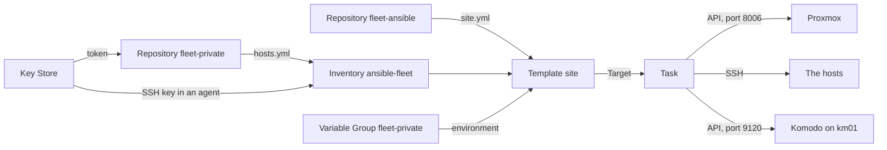

# Semaphore UI

Semaphore UI is a web front end for running Ansible. This page explains what it adds to a playbook run, the handful of ideas its interface is built from, and how the fleet uses them. It is for a reader who has not used Semaphore, and it holds no procedure.

The pages call it Semaphore from here on.

## What it is {#what}

Ansible is a command. You run `ansible-playbook` in a shell, and the shell has to hold everything the run needs: a copy of the playbooks, the inventory, an SSH key, and the secrets in its environment. See [Ansible](../ansible/index.md) for the playbook and the inventory.

That works for one person on one machine, and it leaves four questions open. Which copy of the playbooks ran? Where are the secrets kept between runs? What did the last run print? Who started it?

Semaphore answers them by being the one place a run starts from. It is a server with a database. You describe a run one time, as a form, and from then on a run is one click.

| A shell leaves open | Semaphore's answer |
| --- | --- |
| Which copy of the playbooks ran | It clones the repo for each run, from the branch you named |
| Where the secrets are kept | In its database, encrypted, and never shown again |
| What the run printed | Every run's log is kept and can be read later |
| Who started it | Each run records the user who started it, and when |

Semaphore does not replace Ansible. It runs the same `ansible-playbook` command you would, inside its own container, and shows you the output.

## The ideas you need {#ideas}

Each idea below is a screen in Semaphore's left-hand menu, or a thing made on one. They are in the order you would create them, since each one uses the ones above it.

### Project {#project}

A Project is a container for everything else on this page. Keys, repositories, inventories, and templates all belong to one Project, and a user is given access one Project at a time.

The fleet has one Project, named `fleet-provisioning`.

### Key Store {#key-store}

The Key Store holds credentials. Each entry has a name and a type, and other parts of the Project refer to it by name. Semaphore encrypts the entries in its database and never displays a stored value again.

The fleet uses two of the types.

| Type | Holds | The fleet's entry |
| --- | --- | --- |
| SSH Key | A private key and the login it goes with | `ansible-bootstrap-key`, the fleet's SSH key, with the login `ansible` |
| Login with password | A username with a password or a token | `fleet-private-read`, a GitHub token that can read the private repo |

For a run that uses an SSH key, Semaphore starts an SSH agent and loads the key into it. An SSH agent is a small program that holds a key in memory and signs logins on request, so the key itself is never written where the run could leave it behind.

### Repository {#repository}

A Repository is a git address, a branch, and the Key Store entry that can clone it. Semaphore clones or updates it at the start of each run, so a run always uses what is on the branch at that moment.

The fleet has two: the public fleet-ansible repo, which holds the playbooks, and the private repo, which holds the inventory. The second uses the `fleet-private-read` key and the first needs none.

### Inventory {#inventory}

An Inventory tells Ansible which hosts exist and how to log in to them. In Semaphore it is either text pasted into a form or a file in a Repository, and it names the Key Store entry Ansible logs in with.

The fleet's Inventory is `ansible-fleet`. It is the file `hosts.yml` in the private repo, so a pushed change to the inventory applies to the next run with nothing to paste.

### Variable Group {#variable-group}

A Variable Group holds values a run is given that are not in the repo. Older versions of Semaphore call it an Environment. It has a *Variables* tab, for values anyone with access may read, and a *Secrets* tab, for values that are stored encrypted and masked.

Each tab can pass a value in two ways.

| Section | Reaches the run as |
| --- | --- |
| *Extra Variables* | An Ansible variable, passed with `--extra-vars` |
| *Environment Variables* | A variable in the environment of the `ansible-playbook` process |

The difference matters. An extra variable beats every value in the inventory, so it is the wrong place for anything a host might set for itself. An environment variable is what a program other than Ansible reads, such as OpenTofu or sops.

The fleet has one Variable Group, `fleet-private`, and uses only its environment variables. A run sees no environment except the one Semaphore hands it, which is why the group also sets `PATH`.

### Task Template {#task-template}

A Task Template is the description of a run. It joins the pieces above: which playbook file, from which Repository, against which Inventory, with which Variable Groups. Nothing runs when you save one.

The fleet's one Template is **site**, which runs `site.yml` from the fleet-ansible repo. A Template can also hold options that every run gets, such as *Tags*, which limits a run to the parts of a playbook that carry a tag.

### Survey Variable {#survey-variable}

A Survey Variable is a question a Template asks each time it runs. The answer is passed to Ansible as an extra variable.

The **site** Template has one, named `target` and shown as *Target*. `site.yml` runs against the hosts in `target`, so the answer is the name of a host, or of a group, from the inventory. It is the only question a run asks.

### Task {#task}

A Task is one run of a Template. Starting one opens a form with the Template's Survey Variables, and Semaphore then clones the repositories, starts `ansible-playbook`, and records everything it prints.

A Task has a status, such as *Running*, *Success*, or *Failed*, and a log. The log is the same text a shell would show, kept in the database with the name of the user who started the Task. See [Reading a task's log](read-a-task-log.md).

### Dry Run {#dry-run}

Dry Run is a tick box on the form that starts a Task. It adds `--check` to the command, which is Ansible's check mode: each task reports what it would change and changes nothing.

How much a dry run tells you depends on the playbook. `site.yml` is written for it, and each of its stages does something useful in check mode. See [Seeing what a run would do](../../fleet-bootstrap/concepts/how-a-host-is-built.md#check).

### Schedule {#schedule}

A Schedule starts a Template at times you set, written in cron format: five fields for minute, hour, day of month, month, and day of week. A scheduled Task has a log like any other.

The build guide sets up no Schedule. Every run of the fleet is started by a person, who answers *Target*.

## How the fleet uses it {#in-the-fleet}

Semaphore runs on ci01, as the semaphore-server stack. After [the handover](../../fleet-bootstrap/foundation/handover.md) it is the fleet's control node, which is the name for whatever machine runs `site.yml`. See [Where the run starts from](../../fleet-bootstrap/concepts/how-a-host-is-built.md#control-node).

### What a run pulls together {#run-anatomy}

A run of the **site** Template takes its playbooks from one repo, its inventory from another, its secrets from the Variable Group, and its SSH key from the Key Store. It then reaches three systems, and every connection goes outward from Semaphore.



The Task talks to Proxmox to create the VM, to the host over SSH to install and deploy NixOS, and to Komodo to deploy the host's stacks. See [The four stages](../../fleet-bootstrap/concepts/how-a-host-is-built.md#stages).

Three more repos take part and have no Repository entry: fleet-nixos, fleet-opentofu, and fleet-stacks. The playbook clones each of them itself. See [Add the repositories](../../fleet-bootstrap/foundation/semaphore-project.md#repositories).

### Where its configuration lives {#configuration}

Semaphore's configuration is in two places, and only one of them is a repo.

| What | Where | Changed by |
| --- | --- | --- |
| The container, its database, its hostnames | The fleet-stacks repo, under `stacks/semaphore-server` and `containers/semaphore` | A commit, then a run of ci01 |
| The Project and everything in it | Semaphore's own database on ci01 | Clicks in Semaphore's UI |

The Project is not described in any file. [The Semaphore project](../../fleet-bootstrap/foundation/semaphore-project.md) is the record of how it was made, and the daily dump of the database is its backup. See [semaphore-server](../../fleet-bootstrap/stacks/semaphore-server.md#data).

The stack reads ten Secrets from Komodo. Three of them are the keys Semaphore encrypts its database entries with, so they have to outlive the container. See [Stage the values](../../fleet-bootstrap/hosts/ci01-semaphore.md#values).

### What the Variable Group holds {#group-contents}

The `fleet-private` group carries what the shell's environment file carried before the handover.

| Tab | Names | Read by |
| --- | --- | --- |
| *Secrets* | `TF_ENCRYPTION`, `TF_VAR_server_api_tokens`, `PG_CONN_STR` | OpenTofu |
| *Secrets* | `KOMODO_API_KEY`, `KOMODO_API_SECRET` | The role that syncs Komodo |
| *Secrets* | `SOPS_AGE_KEY` | sops, to decrypt the private repo's secrets |
| *Variables* | `PATH`, `NIX_CONFIG` | The shell that finds nix, and nix itself |

See [Create the Variable Group](../../fleet-bootstrap/foundation/semaphore-project.md#variables) for each value.

### How nix gets into the container {#nix}

`site.yml` calls nix and sops on the control node, and Semaphore's image ships neither. The image does ship Ansible and OpenTofu.

The stack adds nix without building a custom image. A second service, named nix, copies `/nix` out of the official nix image into a folder on the host, one time, and exits. Semaphore's container mounts that folder at `/nix` and starts only after the copy has finished. sops is then added to the same folder by hand, with one nix command.

A run finds both because the Variable Group's `PATH` ends with `/nix/var/nix/profiles/default/bin`. See [Nix for the runs](../../fleet-bootstrap/hosts/ci01-semaphore.md#nix) for the parts, and [Add sops to nix](../../fleet-bootstrap/hosts/ci01-semaphore.md#sops) for the command.

Semaphore's container only works out a host's configuration. The build happens on the host itself. Working one out takes about 1 GB of memory, so the container's limit is 4 GB where the other containers get 2 GB.

### What it can reach {#reach}

Semaphore holds the fleet's SSH key, the key that decrypts the private repo, and the Proxmox API token. Whoever controls it controls every host.

Two things follow in the fleet's design. Semaphore's route asks Authentik for a sign-in, on top of Semaphore's own login, once the fleet leaves bootstrap mode. And the secrets it holds are also kept in a password manager, because Semaphore lives on ci01 and cannot rebuild the host it runs on. See [Store what outlives the shell](../../fleet-bootstrap/foundation/handover.md#keep).

## Finding your way around {#around}

Semaphore answers at `https://semaphore.ci01.home.myah-mitchell.com`. Everything below is in the Project's left-hand menu, and none of it changes anything.

| To see | Open |
| --- | --- |
| Every Task in the Project, newest first, with who ran it | *Dashboard > History* |
| The Templates, each with the status of its last Task | *Task Templates* |
| One Template's Tasks | The Template, then its *Tasks* tab |
| What a Task printed | The Task, which opens on its log |
| Which keys exist. Their values are not shown | *Key Store* |
| The names in the group. Secret values are not shown | *Variable Groups* |

On ci01 itself, two commands show the container's side.

```bash
docker compose -p semaphore ps -a
docker logs --tail 50 semaphore-semaphore
```

The first lists the stack's four containers with their state. The second prints the end of the server's own log, which is about Semaphore and not about any one Task.

## Making changes {#changes}

| To | See |
| --- | --- |
| Add a Template for a different run | [Adding a Task Template](add-a-template.md) |
| Work out why a run stopped | [Reading a task's log](read-a-task-log.md) |
| Deploy or redeploy the stack | [Semaphore (ci01)](../../fleet-bootstrap/hosts/ci01-semaphore.md) |
| Build the Project from nothing | [The Semaphore project](../../fleet-bootstrap/foundation/semaphore-project.md) |
| Move OpenTofu's state in and prove the first run | [The handover](../../fleet-bootstrap/foundation/handover.md) |
| Run from a shell when Semaphore cannot | [Running from a shell again](../../fleet-bootstrap/foundation/handover.md#shell-runs) |
| Move to another version of nix | [Moving to another version of nix](../../fleet-bootstrap/hosts/ci01-semaphore.md#nix-version) |
| Look up the stack's services, values, and folders | [semaphore-server](../../fleet-bootstrap/stacks/semaphore-server.md) |

## When it goes wrong {#troubleshooting}

Start with the Task's log. Its last lines name the stage and the task that stopped. See [Reading a task's log](read-a-task-log.md).

| Symptom | First place to look |
| --- | --- |
| The page does not load | The containers' state on ci01, then the Traefik on ci01 |
| The Task fails before any play starts | The Repository's branch and key. The token in `fleet-private-read` may have expired |
| `nix` or `sops` is not found | `PATH` in the Variable Group, and whether `nix-data` was emptied |
| sops cannot decrypt | `SOPS_AGE_KEY` in the Variable Group |
| The `vms` stage tries to create a VM that exists | `PG_CONN_STR` and `TF_ENCRYPTION` in the Variable Group |
| The `nixos` stage fails with a publickey error | The `ansible-bootstrap-key` entry, and the agent Semaphore starts for the run |
| The run stops and names `nixos-sync.yml` or `komodo-sync.yml` | The private repo's generated files are out of date. See [After a change](../../fleet-bootstrap/concepts/fleet-private.md#after-a-change) |
| The Task dies partway through the `nixos` stage with no error from Ansible | The container's memory limit, `SEMAPHORE_MEM_LIMIT` |
| A Task against ci01 stops partway | The run restarted Semaphore's own container. Run it again |

## Going further {#further}

- [Semaphore UI documentation](https://semaphoreui.com/docs/), the user guide and the administration guide
- [Task Templates](https://semaphoreui.com/docs/user-guide/task-templates/), including build and deploy templates, which the fleet does not use
- [Schedules](https://semaphoreui.com/docs/user-guide/schedules/)
- [Key Store](https://semaphoreui.com/docs/user-guide/key-store), including the external secret stores Semaphore can use
- [The project on GitHub](https://github.com/semaphoreui/semaphore), for releases and their notes. The fleet pins its version in the fleet-stacks repo, in `containers/semaphore/compose.yaml`
