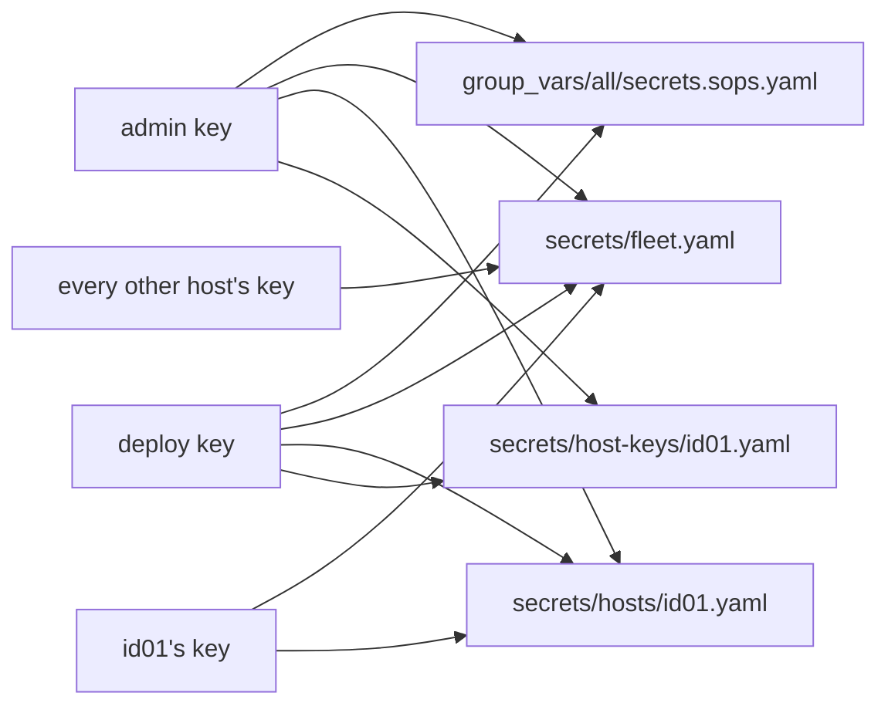

# sops with age

sops encrypts the secrets the fleet keeps in git, and age supplies the keys it encrypts them for. This page is for a reader who has used neither. It explains the ideas underneath the fleet's design, and [Secrets with sops](../../fleet-bootstrap/concepts/secrets-with-sops.md) then says which key decrypts which file and how to replace one.

## What it is {#what}

A host needs a few secrets before it can do anything: the hash of its account password, and the key that lets it join Komodo. The fleet builds every host from files in git, so those secrets have to be in git too. A secret in git in the clear is readable by everyone and everything that can read the repo, for as long as the history exists.

sops is an editor for encrypted files. It keeps a YAML file's structure readable and encrypts each value, so the file can be committed, diffed, and reviewed like any other. age is a small encryption tool with one kind of key, and sops uses it to decide who can decrypt.

## The ideas you need {#ideas}

### Why a secret cannot sit in a repo in the clear {#plaintext}

A git repo is copied whole to every machine that clones it, and every copy holds every earlier commit. A password committed in the clear is on each developer's laptop, on the forge, in each backup of either, and in the checkout of every automation that reads the repo. Deleting it in a later commit removes it from the newest files and from nothing else.

Making the repo private narrows who can clone it and changes none of that. The fleet's private repo is cloned by Semaphore and read by the flake on every run, so a secret in the clear there would be spread across all of those places.

Encrypting the secret before it is committed turns the question around. The file can be copied anywhere, and what has to be guarded is one small key.

### Public-key encryption {#public-key}

Public-key encryption uses a pair of keys that are made together. What one of them locks, only the other opens. The half that locks is the public key and can be handed to anyone. The half that opens is the private key and stays with its owner.

To send someone a secret you need only their public key. This is what lets the fleet encrypt a secret for a host on a machine that is not that host: the control node holds the host's public key and never needs the private one to do the encrypting.

### An age key pair {#age-key}

age calls the public key a recipient and the private key an identity. A recipient is one line that starts with `age1`. An identity is one line that starts with `AGE-SECRET-KEY-1`, and `age-keygen` writes it to a file with the recipient in a comment above it.

A file is encrypted for one or more recipients, and any one of the matching identities decrypts it. The fleet has three kinds of age key: `admin` for a person, `deploy` for automation, and one for each host. See [Three kinds of key](../../fleet-bootstrap/concepts/secrets-with-sops.md#keys).

age can also turn an ed25519 SSH key into an age key. The fleet uses that for hosts: a host's age identity is computed from its SSH host key, so the host has no separate age key file to keep or lose.

### A sops file {#sops-file}

sops encrypts the values of a YAML file and leaves the keys as they are. A reviewer sees which entry changed in a commit without being able to read it. This is `secrets/fleet.yaml` from the example fleet in the fleet-nixos repo, with the long values shortened:

```yaml
server-password-hash: ENC[AES256_GCM,data:...,iv:...,tag:...,type:str]
komodo-onboarding-key: ENC[AES256_GCM,data:...,iv:...,tag:...,type:str]
sops:
    age:
        - enc: |
            -----BEGIN AGE ENCRYPTED FILE-----
            ...
            -----END AGE ENCRYPTED FILE-----
          recipient: age1...
    lastmodified: "..."
    mac: ENC[AES256_GCM,data:...,type:str]
```

The two entries at the top are the secrets. The `sops` block at the bottom is what sops needs to decrypt them again, and it is written by sops alone. Its `mac` is a checksum over the values, so a file changed by hand, outside sops, is refused when it is next decrypted.

### The data key {#data-key}

sops does not encrypt the values for each recipient in turn. It makes one random key for the file, the data key, and encrypts every value with it. It then encrypts the data key once for each recipient, and stores each of those copies in the `sops` block as an `enc` entry beside its `recipient`.

To decrypt, sops takes the identity it was given, finds the copy of the data key that identity opens, and uses the data key on the values. The identity comes from the environment: `SOPS_AGE_KEY` holds the identity itself, and `SOPS_AGE_KEY_FILE` holds the path of a file with it.

This is why the list of recipients can change without anyone retyping a secret. Only the wrapped copies of the data key change, and the values stay as they are.

### Creation rules {#creation-rules}

`.sops.yaml`, at the top of a repo, tells sops which recipients a new file is encrypted for. Each entry under `creation_rules` has a `path_regex` and a list of recipients, and sops uses the first rule whose pattern matches the file's path. This rule is from the private repo's `.sops.yaml`:

```yaml
creation_rules:
  - path_regex: ^secrets/host-keys/[^/]+\.yaml$
    key_groups:
      - age: [*admin, *deploy]
```

`*admin` and `*deploy` are YAML references to recipients named once at the top of the file. sops looks for `.sops.yaml` in the folder it runs in and then in each folder above it, which is why every sops command on these pages runs from the private repo.

The rules are read when a file is created. An existing file carries its own list of recipients in its `sops` block, and editing the rules does not change that list.

### Adding a recipient {#recipients}

Adding a recipient means letting one more key decrypt a file that already exists. It takes two steps: add the recipient to the file's rule in `.sops.yaml`, then run `sops updatekeys` on the file. `updatekeys` compares the file's recipients with the rule, and wraps the data key again for the list the rule now gives. It needs an identity that can already decrypt the file.

Removing a recipient is the same two steps, with one catch. The removed key has seen the data key, so `sops rotate` follows, which makes a new data key and encrypts the values again with it. Neither command reaches into git's history, where the old file still opens with the old key.

In the fleet, `new-host-key` does the adding for a new host: it writes the host's recipient into `.sops.yaml` and runs `updatekeys` on the files the host reads. See [Replacing a key](../../fleet-bootstrap/concepts/secrets-with-sops.md#new-key) for the removal, done by hand.

### sops-nix {#sops-nix}

sops-nix is the NixOS module that gets a secret from a sops file to a program on a host. See the [NixOS primer](../nixos/index.md) for modules and activation. The host's configuration declares each secret it wants by name. The encrypted file travels to the host with the rest of the configuration, still encrypted, so the nix store on a host never holds a secret in the clear.

When the configuration is activated, at boot and at every deploy, sops-nix decrypts each declared secret with the host's own identity and writes it to a file under `/run/secrets`. That folder is in memory and is gone at power-off. A service reads its secret from that path.

A secret that is in the file and that no module declares is never decrypted on a host. A secret a module declares and the file lacks stops the build, before anything reaches the host.

### Which store a secret belongs in {#which-store}

The fleet has two stores for secrets, and what reads the secret decides which one holds it.

| The secret is read by | It belongs in | Reaches its reader |
| --- | --- | --- |
| A host's operating system: an account, a systemd service | `secrets/fleet.yaml` or the host's own file, with sops | Decrypted on the host at activation |
| Ansible on the control node | `group_vars/all/secrets.sops.yaml`, with sops | Decrypted when ansible loads the inventory |
| A container in a stack | A Komodo Secret | Filled into the Stack's *Environment* by Komodo at deploy |

A database password, an API token for an application, and anything else a compose file reads is a Komodo Secret. See [Variables and Secrets](../../fleet-bootstrap/concepts/variables-and-secrets.md#how) and the [Komodo primer](../komodo/index.md). sops holds only what has to exist before Komodo can deploy anything to the host, and what ansible itself needs.

## How the fleet uses it {#in-the-fleet}

sops runs in two places: on the control node, where people and the run edit and decrypt files, and inside each host's activation, through sops-nix. Nothing runs as a service. The encrypted files and `.sops.yaml` are in the private repo, and the code that reads them is in the fleet-nixos and fleet-ansible repos.

| Where | What it does with sops |
| --- | --- |
| `.sops.yaml` in the private repo | Names every recipient and the rule for each file |
| `modules/secrets.nix` in fleet-nixos | Sets `secrets/fleet.yaml` as each host's default sops file, and the host's SSH host key on the persistent disk as its identity |
| `modules/users.nix` and `modules/komodo-periphery.nix` | Declare the two secrets a host reads today |
| `scripts/new-host-key.sh` | Adds a host's recipient and runs `updatekeys` |
| `scripts/install-host.sh` and `scripts/deploy-host.sh` | Decrypt a host's SSH host keys on the control node |
| `ansible.cfg` in fleet-ansible | Turns on the `community.sops.sops` vars plugin, which decrypts any variables file whose name ends in `.sops.yaml` |

The diagram shows which key decrypts which file, with id01 standing for any host.



The admin key and the deploy key each decrypt all four kinds of file. A host's key decrypts the file every host shares and the host's own file, and nothing else. No host decrypts the file of SSH host keys, its own included, because the install writes those keys onto the host's disk from the control node. See [The files](../../fleet-bootstrap/concepts/secrets-with-sops.md#files).

A host's identity is never stored as an age key. sops-nix computes it from the ed25519 SSH host key at `/srv/persist/host/ssh/ssh_host_ed25519_key`, and `new-host-key` computes the matching recipient from the public half before the host exists. See [The host's SSH keys](../../fleet-bootstrap/concepts/secrets-with-sops.md#host-keys).

The control node's sops comes from the flake, so the commands and ansible decrypt with the same version. See [The NixOS flake](../../fleet-bootstrap/concepts/nixos-flake.md#commands).

## Finding your way around {#around}

Run these from the private repo's checkout. The ones that decrypt need the admin key or the deploy key in `SOPS_AGE_KEY` or `SOPS_AGE_KEY_FILE`. None of them changes a file.

| To see | Run |
| --- | --- |
| Which recipients a file is encrypted for | `grep recipient secrets/fleet.yaml` |
| The recipient that belongs to an identity file | `age-keygen -y <key-file>` |
| The names of the secrets in a file, without a key | `grep -v '^ ' secrets/fleet.yaml` |
| One value | `sops decrypt --extract '["komodo-onboarding-key"]' secrets/fleet.yaml` |
| What a host decrypted, on the host | `sudo ls -l /run/secrets` |

Match the first command's output against the `keys` list in `.sops.yaml` to see whether a host was added to a file. `server-password-hash` is decrypted earlier than the rest, before the accounts are made, and sops-nix puts such a secret under `/run/secrets-for-users`.

## Making changes {#changes}

| Task | Page |
| --- | --- |
| Give the hosts a new secret | [Adding a secret for the hosts](add-a-secret.md) |
| Change the value of a secret that exists | [Changing a secret](../../fleet-bootstrap/concepts/secrets-with-sops.md#edit) |
| Replace the admin key, the deploy key, or a host's key | [Replacing a key](../../fleet-bootstrap/concepts/secrets-with-sops.md#new-key) |
| Recover after a key is lost | [A lost key](../../fleet-bootstrap/concepts/secrets-with-sops.md#lost-key) |
| Make the first two keys | [The control shell](../../fleet-bootstrap/foundation/control-shell.md#age-keys) |
| Write the first secrets | [The control shell](../../fleet-bootstrap/foundation/control-shell.md#secrets) |
| Let a new host read the secrets | [Adding a host](../../fleet-bootstrap/procedures/add-a-host.md#host-key) |

## When it goes wrong {#troubleshooting}

| Symptom | Look at |
| --- | --- |
| sops says no creation rule matches | The folder you ran it from, and the file's path against each `path_regex`. sops has to run from the private repo |
| sops cannot get the data key | The identity in your environment. It is missing, or its recipient is not in the file's `sops` block |
| sops reports a MAC mismatch | The file was edited outside sops. Take the last good version from git and make the change again with sops |
| A build stops because a secret is not in its sops file | The name a module declares against the names in the file, and whether the file is committed. The flake reads only what git tracks |
| A host fails to decrypt at activation | Whether the host's recipient is in the file. Run `new-host-key` for the host again and commit what it changes |
| Every playbook fails while loading the inventory | sops and the deploy key on the control node. Once `group_vars/all/secrets.sops.yaml` exists, each run needs both |

## Going further {#further}

- [The sops documentation](https://getsops.io/docs/), for key groups, other file formats, and the key services the fleet does not use
- [The age README](https://github.com/FiloSottile/age#readme), for age's format and its own command line
- [The sops-nix README](https://github.com/Mic92/sops-nix#readme), for every option a declared secret takes
- [The community.sops collection](https://docs.ansible.com/ansible/latest/collections/community/sops/), for the vars plugin ansible decrypts with
