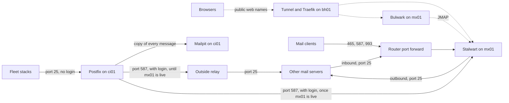

# Stalwart

Stalwart is the mail server that holds the fleet's mailboxes, on mx01. This page explains how mail works for a reader who has never run a mail server, and then how the fleet's two mail paths are built: service mail through Postfix on ci01, and mailboxes in Stalwart.

## What it is {#what}

A mail server does three jobs. It accepts messages from other servers for the addresses it owns, it stores them until their owners read them, and it sends its own users' messages out to the rest of the internet. Most setups use a separate program for each job, with a database beside them.

Stalwart does all three in one program with a built-in store. It also signs outgoing mail, filters spam, keeps its own DNS records up to date, and is configured from a web interface instead of config files.

The fleet uses it for one thing: real mailboxes at the fleet's domain, such as `myah@myah-mitchell.com`. It is optional. The mail that the fleet's own services send, such as a password reset from Authentik, works without Stalwart. Once mx01 is live, the fleet relays that mail through Stalwart so that it is signed. See [The two mail paths](#two-paths).

## The ideas you need {#ideas}

### How a message travels {#message-path}

A message makes four hops, and a different party runs each one.

1. Submission. The sender's mail client logs in to the sender's own mail server and hands it the message.
2. Lookup. That server reads the part of the recipient's address after the `@`, and asks DNS which server takes mail for that domain.
3. Delivery. The sender's server connects to the recipient's server and passes the message across. The recipient's server stores it in the recipient's mailbox.
4. Retrieval. The recipient's mail client logs in to its own server and reads the message.

Nothing in hops 2 and 3 involves a login. Any server on the internet may connect to any other and offer it mail, which is why the receiving side leans on DNS records to decide whether to believe the sender. Most of the ideas below are about that.

### SMTP and its ports {#smtp}

SMTP, the Simple Mail Transfer Protocol, is the protocol for hops 1 and 3. The same protocol does both jobs, on different ports with different rules.

| Port | Name | Who connects | Login |
| --- | --- | --- | --- |
| 25 | SMTP | Other mail servers, delivering | None |
| 465 | Submission | Mail clients, sending. TLS from the first byte | Required |
| 587 | Submission | Mail clients, sending. Starts in plain text and upgrades with the STARTTLS command | Required |

Port 25 is the one the whole internet must be able to reach, and the one many home internet providers block in one direction or both. A server that accepts mail on port 25 for domains it does not own, from senders it does not know, is called an open relay, and spammers find it within hours.

### IMAP and JMAP {#reading-mail}

Hop 4 uses a different protocol, because reading a mailbox is a different job from passing a message along.

IMAP is the long-established one. Desktop and phone mail clients speak it, on port 993 with TLS from the first byte. JMAP is a newer protocol that does the same job over HTTPS, and it also covers sending, so a JMAP client needs no SMTP at all. Bulwark, the fleet's webmail, speaks only JMAP.

ManageSieve is a third protocol, for uploading mail filter rules written in the Sieve language. Stalwart supports it, and the fleet does not open its port.

### The MX record {#mx}

An MX record, for mail exchanger, is the DNS record that answers the lookup in hop 2. It names the host that takes mail for a domain, with a priority number for when there are several.

```text
myah-mitchell.com.  MX  10 mx.myah-mitchell.com.
```

The name it points to needs an address record of its own. In the fleet that is `mx.myah-mitchell.com`, pointing at the site's public address. Changing a domain's MX record moves all of its inbound mail, at once, to the new server.

### SPF {#spf}

SPF, the Sender Policy Framework, is a TXT record in which a domain lists the servers allowed to send mail in its name. A receiving server compares the address the connection came from with that list.

```text
myah-mitchell.com.  TXT  "v=spf1 mx -all"
```

This one says: the hosts in my MX record may send, and nobody else. SPF proves that the sending server was authorised by the domain. A domain may have only one SPF record, and two make every check fail.

### DKIM {#dkim}

DKIM, DomainKeys Identified Mail, is a signature on the message itself. The sending server signs each message's headers and body with a private key, and publishes the matching public key in DNS under a name called a selector.

```text
v1-ed25519-20260101._domainkey.myah-mitchell.com.  TXT  "v=DKIM1; k=ed25519; p=<public-key>"
```

The receiving server reads the selector from the signature, fetches the key, and checks the signature. DKIM proves that the message was signed by the domain and has not been changed on the way. Unlike SPF, it survives forwarding, since it does not depend on which server made the connection.

Keys are replaced on a schedule, which is called rotation. Each new key gets a new selector, and the old record stays published for a while so that messages already in transit still verify.

### DMARC {#dmarc}

DMARC is a TXT record that tells receivers what to do when a message fails both SPF and DKIM, and where to send reports about it.

```text
_dmarc.myah-mitchell.com.  TXT  "v=DMARC1; p=reject; rua=mailto:postmaster@myah-mitchell.com"
```

It also closes a gap the other two leave. SPF and DKIM each check a domain, but not necessarily the one in the From line that the reader sees. DMARC passes only when one of them passed for that same domain. The policy `p=reject` tells receivers to refuse anything that does not.

### Reverse DNS {#ptr}

A PTR record maps an address back to a name, the reverse of an ordinary lookup. Receiving servers look up the address a connection comes from, and distrust a sender whose address has no name or has the generic name of a home connection.

The owner of the address sets this record, which means your internet provider and not your DNS host. The fleet's is checked before anything is built. See [Check the public address](../../fleet-bootstrap/hosts/mx01-mail.md#public-address).

### MTA-STS and TLS reporting {#mta-sts}

Encryption between mail servers on port 25 is opportunistic: a sender uses it when offered, and falls back to plain text when not. An attacker in the path can strip the offer.

MTA-STS lets a domain say that senders must use TLS with a valid certificate. The policy is a small file served over HTTPS at `mta-sts.` and the domain, and a TXT record at `_mta-sts.` tells senders it exists. TLS reporting is a second TXT record, at `_smtp._tls.`, giving an address where other servers send a daily summary of the TLS failures they saw.

### Client autoconfiguration {#autoconfig}

A mail client that is given only an address can find its server's settings by itself. It fetches a settings document from `autoconfig.` and the domain, or reads SRV records such as `_imaps._tcp.` that name the server and port for each protocol. Stalwart serves the document and publishes the records.

### Relays and smarthosts {#relay}

A relay is a mail server that accepts a message only to pass it on. A smarthost is a relay that another server sends all of its outbound mail through, instead of looking up each recipient's MX record and delivering by itself.

A server uses one when its own address would not be trusted: a home connection, a blocked port 25, an address with no reverse DNS. The relay is usually a mail provider's submission service, reached on port 587 with a login. The provider's servers have the reputation, and their addresses have to be covered by the sending domain's [SPF](#spf) record.

### Domains {#domains}

In Stalwart, a domain is a record saying the server owns the mail for one domain name. Stalwart accepts mail on port 25 only for domains it holds, and refuses the rest.

The domain record also carries the settings that belong to it: how its [DKIM](#dkim) keys are made and rotated, whether Stalwart publishes its DNS records by itself through a DNS provider, and the full set of records Stalwart expects to find in DNS.

### Accounts and aliases {#accounts}

An account is one mailbox with one owner. Its name and its domain together make its address, so the account `myah` in the domain `myah-mitchell.com` is `myah@myah-mitchell.com`. An account holds its mail, its credentials, its roles, and a quota.

An alias is a further address on the same account. Mail to the alias lands in the same mailbox, and nobody logs in as an alias. A group is an account several people share.

### Directories and provisioning {#directories}

A directory is where Stalwart looks up who a person is when they sign in. Its own internal directory holds names and passwords. An external one hands that question to another system.

The fleet uses an OIDC directory pointed at Authentik: a person signs in at Authentik, and Stalwart accepts the token Authentik issues. That alone has a gap. Stalwart learns that a person exists only when they first sign in, so mail sent to them before then is refused.

SCIM closes the gap. It is a protocol by which an identity provider pushes accounts into another system: Authentik tells Stalwart to create, change, or disable each account as it happens. Creating the account is called provisioning. See [the Authentik primer](../authentik/index.md).

### Where Stalwart keeps its data {#data}

Stalwart 0.16 keeps nearly everything in one embedded store: the mail, the accounts, the domains, the DKIM keys, and every setting made in the web interface. Outside that store is one small file, `config.json`, which says where the store is.

In the fleet these are two folders on mx01's persistent disk. See [Data worth keeping](../../fleet-bootstrap/stacks/stalwart-server.md#data).

Older guides describe a set of TOML files. Stalwart moved its configuration into the store in version 0.16, and the fleet pins `v0.16.22`, so those guides do not apply.

### The WebUI {#webui}

The WebUI is Stalwart's web interface, at `/admin` on its web port. Its menu has two main parts. *Management* holds what changes day to day: domains, DKIM signatures, accounts, and scheduled tasks. *Settings* holds how the server itself behaves: listeners, DNS providers, directories, and the licence.

A third part of the menu, *Account*, is for the signed-in person's own account, such as creating app passwords and API keys. The address `/account` opens it directly.

## How the fleet uses it {#in-the-fleet}

### The two mail paths {#two-paths}

The fleet has two mail systems. Service mail works without the mailboxes. The two join once mx01 is live, when Postfix hands its mail to Stalwart. See [Service mail once the domain has mailboxes](#service-mail-and-dmarc).

| Path | Runs on | Carries | Needed |
| --- | --- | --- | --- |
| Service mail | Postfix in the core-infra stack, on ci01 | What the stacks send: password resets, alerts, reports | Always |
| Mailboxes | Stalwart in the stalwart-server stack, on mx01 | Mail to and from people at the domain | Only if you host your own mail |

The diagram shows both paths as the build guide sets them up. Solid arrows carry mail, and dotted arrows carry web traffic. Postfix has one way out at a time: the outside relay until mx01 is live, and Stalwart after that.



### Service mail through Postfix on ci01 {#service-mail}

A stack that sends mail hands it to Postfix on ci01, on port 25, with no login and no TLS. As fleet-stacks stands, authentik-server is the one stack that does. It finds Postfix through the Komodo Variable `GLOBAL_EMAIL_HOST`, and a stack of your own can read the same variable. ci01's firewall opens the port to the internal subnet only.

Postfix is a [smarthost](#relay) setup. It forwards everything to the relay named in `POSTFIX_RELAYHOST`, logs in there, and adds a hidden copy of each message to Mailpit, a mail catcher whose web interface shows what the fleet sent. It relays only mail whose From address is in the fleet's domain.

The relay is an outside one, such as your mail provider's, until mx01 is live. From then on it is Stalwart. See [Service mail once the domain has mailboxes](#service-mail-and-dmarc).

The definitions are `containers/postfix` and `containers/mailpit` in fleet-stacks, and the build is on [Core infrastructure (ci01)](../../fleet-bootstrap/hosts/ci01-core-infra.md#values).

Each host also runs a small Postfix of its own, from the NixOS module `modules/mail.nix`, for mail the host itself sends to root. It listens on no network port and is no part of either path.

### Mailboxes in Stalwart on mx01 {#mailboxes}

mx01 sits in the DMZ, the network for hosts that take connections from the internet. The stalwart-server stack runs two containers there: Stalwart, and Bulwark for webmail. See [stalwart-server](../../fleet-bootstrap/stacks/stalwart-server.md).

Mail and web traffic reach Stalwart by different routes.

| Traffic | Ports | Route in |
| --- | --- | --- |
| Mail | 25, 465, 587, 993 | The router forwards them from the public address straight to mx01, and the container publishes them on the host |
| Web: WebUI, JMAP, SCIM, autoconfig, MTA-STS | 8080 inside the container | bh01's tunnel, then Traefik, as for any public web name |

Mail cannot pass through an HTTP proxy, which is why the mail ports skip Traefik and bh01. It also means two certificates. Traefik's covers the web names, and Stalwart gets its own from Let's Encrypt for `mx.myah-mitchell.com`, which is what clients and servers see on the mail ports.

Outbound, Stalwart delivers straight to each recipient's server on port 25, or through a relay service when the site's address is not fit to send from.

### Accounts come from Authentik {#accounts-in-the-fleet}

Nobody creates a mailbox in Stalwart by hand. Authentik's SCIM provider pushes an account for each member of the `mail-users` group, and people sign in with their Authentik login through the OIDC [directory](#directories). The account name is the Authentik username followed by `@myah-mitchell.com`.

SCIM is a feature of Stalwart's paid Enterprise licence, which is sold by mailbox count. The group is what keeps that count deliberate.

### Where its configuration lives {#configuration}

Very little of Stalwart is in a repo.

| Lives in | Holds |
| --- | --- |
| `containers/stalwart/compose.yaml` in fleet-stacks | The image version, the four published ports, the Traefik routes, and the public URL |
| `containers/stalwart/setup.yaml` | The two folders and the four firewall ports, which reach mx01's NixOS configuration |
| Komodo | The licence key, in the Secret `STALWART_LICENSE_KEY` |
| Stalwart's own store | Everything else: domains, accounts, directories, DNS provider, certificates |

A rebuild of mx01 keeps the store, since it is on the persistent disk. Nothing in the repos can recreate it, so it is the one thing on mx01 that needs a backup.

### Service mail once the domain has mailboxes {#service-mail-and-dmarc}

The two paths meet in DNS. Once Stalwart publishes [SPF](#spf) and [DMARC](#dmarc) records for the domain, receivers judge every message from that domain by them, and that includes the service mail Postfix sends through the outside relay.

The records Stalwart publishes are strict. The SPF record is `v=spf1 mx -all`, which names mx01 and nothing else, and the DMARC record has `p=reject`. Service mail does not leave from mx01 and Stalwart does not sign it, so from that moment an outside receiver refuses it.

The fleet deals with this in two stages.

| Stage | Postfix relays through | What speaks for service mail |
| --- | --- | --- |
| Until mx01 exists | The outside relay | The relay's SPF include, which you add by hand to the domain's SPF record if the domain publishes one. See [Stage the values](../../fleet-bootstrap/hosts/ci01-core-infra.md#values) |
| Once mx01 is live | Stalwart, on mx01's submission port | Stalwart's [DKIM](#dkim) signature, and an SPF record that names mx01 |

Once mx01 is live, Postfix logs in to Stalwart with an account of its own and hands every message to it. Stalwart sends the message on as it does a person's: signed with the domain's DKIM key, from the address the SPF record names. Service mail then passes DMARC by the same records as everyone else's mail, and the outside relay is out of the path. The change is [step 15 of mx01's page](../../fleet-bootstrap/hosts/mx01-mail.md#service-mail).

From that step on, service mail depends on mx01. Postfix keeps what it cannot hand over in its queue, so a restart of mx01 delays a message and does not lose it.

Between the DNS records in step 11 of that page and step 15, service mail still leaves through the outside relay. The relay's include in the merged SPF record is all that speaks for it, so do the two steps in one sitting. Service mail to a mailbox on mx01 is a milder case during that time. It arrives on port 25 from the relay like any outside mail, and Stalwart's default there is to check DMARC and record the result in the message's headers without refusing it.

Two other ways exist, and the fleet uses neither. The relay can sign for the domain, with DKIM records it gives you to publish in Cloudflare under its own selectors. Or the SPF record can go on naming the relay, which means taking *SPF records* out of the domain's *Record Types* in Stalwart and keeping one record by hand that names both `mx` and the relay. That second way helps only if the relay uses your domain as the envelope sender, and many relays use their own.

## Finding your way around {#around}

None of these changes anything.

| To see | Look at |
| --- | --- |
| The domains Stalwart holds, and each one's expected DNS records | *Management > Domains > Domains*, and **View Zone File** in a domain's menu |
| The DKIM keys and where each is in its rotation | *Management > Domains > DKIM Signatures* |
| The accounts | *Management > Directory > Accounts* |
| Background jobs, such as publishing DNS records, and why one failed | *Management > Tasks > Scheduled* and *Management > Tasks > Failed* |
| What Stalwart is doing | `docker logs mail-stalwart` on mx01 |
| Whether both containers are healthy | `docker compose -p stalwart-server ps` on mx01 |
| What the fleet's services sent | Mailpit, at `https://mailpit.ci01.home.myah-mitchell.com` |
| What Postfix did with a message | `docker logs core-postfix` on ci01 |

DNS is public, so the records can be read from any machine:

```bash
dig +short MX myah-mitchell.com
dig +short TXT myah-mitchell.com
dig +short TXT _dmarc.myah-mitchell.com
```

The headers of a received message are the other view worth knowing. Every mail client can show a message's original source, and the `Authentication-Results` header near the top records what the receiving server concluded for SPF, DKIM, and DMARC.

## Making changes {#changes}

| To | See |
| --- | --- |
| Give a person a mailbox | [Adding a mailbox](add-a-mailbox.md) |
| Take mail for a second domain | [Adding a mail domain](add-a-mail-domain.md) |
| Build mx01 and set up the first domain | [Mail (mx01)](../../fleet-bootstrap/hosts/mx01-mail.md) |
| Change the relay Postfix uses, or the domains it sends for | [Core infrastructure (ci01)](../../fleet-bootstrap/hosts/ci01-core-infra.md#values) |
| Point a stack at Postfix | [Mail values on id01](../../fleet-bootstrap/hosts/id01-identity.md#values-mail) |
| Get back in when no administrator can sign in | [Recovering admin access](../../fleet-bootstrap/hosts/mx01-mail.md#recovery) |

## When it goes wrong {#troubleshooting}

| Symptom | Look first at |
| --- | --- |
| Outside mail never arrives | The MX record, the router's forward of port 25, and whether the internet provider blocks the port. An outside SMTP tester shows which |
| Mail to one person is refused as an unknown recipient | Whether their account exists. See [Adding a mailbox](add-a-mailbox.md#verify) |
| Sent mail lands in spam or is refused | The message's `Authentication-Results` header, then the PTR record and blocklists. See [Check the public address](../../fleet-bootstrap/hosts/mx01-mail.md#public-address) |
| `dkim=fail` or `dkim=none` | Whether the selector in the message's signature is in DNS, and whether a DNS task failed in *Management > Tasks > Failed* |
| Nobody can sign in, and the WebUI refuses every request | Whether Stalwart banned Traefik's address. See [Trust Traefik](../../fleet-bootstrap/hosts/mx01-mail.md#trust-proxy) |
| Sign-in through Authentik fails | The issuer and audience in Stalwart's log. See [Sign in through Authentik](../../fleet-bootstrap/hosts/mx01-mail.md#oidc) |
| A service's mail does not arrive | Mailpit first. A message that is there left the service, so the fault is at the relay or with the recipient. See [the Postfix test](../../fleet-bootstrap/hosts/ci01-core-infra.md#postfix-test) |

## Going further {#further}

- [Stalwart's documentation](https://stalw.art/docs/), which covers everything the fleet does not use: spam filtering, Sieve, calendars and contacts, clustering
- [Domains](https://stalw.art/docs/domains/) and [DNS records](https://stalw.art/docs/domains/dns-records/), for the domain record and automatic DNS
- [DKIM key rotation](https://stalw.art/docs/domains/dkim-rotation/)
- [SCIM provisioning models](https://stalw.art/docs/auth/scim/provisioning/), for how SCIM and sign-in share the accounts
- [Bulwark](https://github.com/bulwarkmail/webmail), the webmail client
- [Postfix's documentation](https://www.postfix.org/documentation.html)
