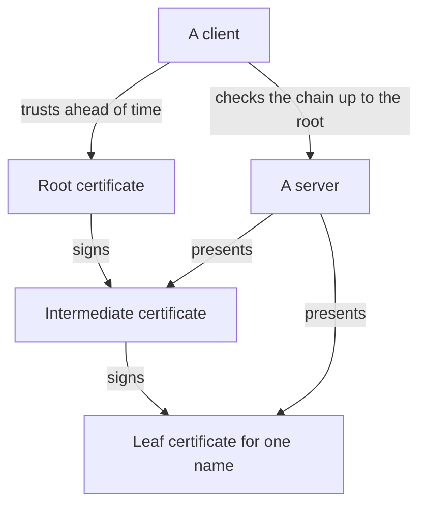
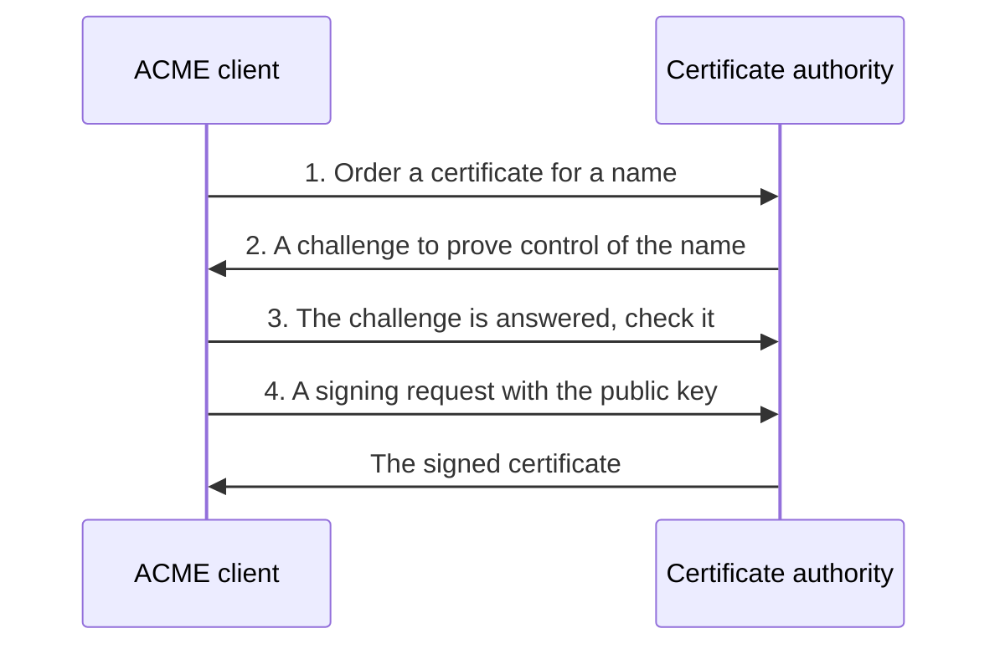

# step-ca

step-ca is the fleet's own certificate authority, running on pk01. This page is for a reader who knows a TLS certificate in outline and has never run an authority. It explains what a certificate proves, how trust is chained, where this authority sits beside Let's Encrypt, and what the fleet does and does not use it for yet.

## What it is {#what}

A certificate is only worth something when a party both sides trust has signed it. On the public internet that party is a public certificate authority such as Let's Encrypt, which signs a certificate for a name after you prove you control the name in public DNS.

A public authority cannot help with everything a private network needs. It signs TLS certificates for public names and nothing else: no SSH certificates, no names that exist only inside the network, and nothing at all while the network has no way out. step-ca is a certificate authority you run yourself. It holds its own keys, answers the same protocol Let's Encrypt does, and signs for whatever you configure it to.

In this fleet step-ca is built and its root key is secured, and nothing asks it for a certificate yet. [Which certificate a name gets](#which-certificate) says exactly what is served today.

## The ideas you need {#ideas}

### What a certificate proves {#certificate}

A certificate is a signed statement that binds a public key to a name. It holds the name, the public key, the dates between which it is valid, and the signature of whoever issued it. The private key that matches is kept by the certificate's owner and is never sent anywhere.

When a client connects to `komodo.km01.home.myah-mitchell.com`, the server presents its certificate and proves it holds the matching private key. The client checks three things: the name in the certificate is the name it asked for, today is inside the dates, and the signature comes from an issuer the client trusts. A certificate proves who the client is talking to. It says nothing about whether that party is honest.

### A certificate authority {#ca}

A certificate authority, or CA, is the holder of a key that signs other certificates. Its own certificate says so, and a client that trusts the CA accepts every certificate the CA has signed. All the trust therefore rests on the CA's private key: whoever holds it can make a certificate for any name that the CA's clients will believe.

### The chain of trust {#chain}

A CA rarely signs with one key. It has three levels, and each certificate is signed by the one above it.

| Level | Signed by | Signs | Where its key lives in the fleet |
| --- | --- | --- | --- |
| Root | Itself | The intermediate | Offline, in two encrypted backups |
| Intermediate | The root | Leaf certificates, day to day | On pk01, encrypted with the CA password |
| Leaf | The intermediate | Nothing | With the server or client it names |

A client is given the root certificate ahead of time and stores it as trusted. A server presents its leaf together with the intermediate, and the client follows the signatures upward until it reaches the root it already holds. That path is the chain of trust.

The split exists so that the key which matters most is used least. The intermediate key has to be on a running machine, because it signs every day. If it is stolen, the root signs a new intermediate and the clients, which trust the root alone, need no change.

### The offline root {#offline-root}

The root key is needed on two occasions: to sign the first intermediate, and to sign a replacement. Between those it has no reason to be on any machine that is switched on. A root key that a running host can read is one break-in away from a new CA and a new root on every client.

step-ca's first start creates the root key and the intermediate key together, on pk01. The host page then moves the root key off: it is copied out, encrypted a second time with age under a passphrase, stored in two separate places, deleted from pk01, and the backup is tested on a machine outside the fleet. See [Take the root key offline](../../fleet-bootstrap/hosts/pk01-certificates.md#root-key).

The fleet's procedure is a short one for one person. A larger organisation makes a root key on a machine that never touches a network, in front of witnesses, and calls that a key ceremony. The aim is the same.

### Trusting the root {#trust}

A machine trusts a CA when the CA's root certificate is in its trust store, the list of roots its TLS libraries accept. Operating systems ship with the public CAs in that list. A private CA's root has to be added by hand or by configuration, on every machine that should accept its certificates.

The root certificate is public, and copying it around is safe. What matters is that the copy is the real one, since trusting a forged root hands its maker every connection. A fingerprint, the SHA-256 hash of the certificate, is how a copy is checked against the original.

The fleet's hosts get the root through `ca_certificates` in the inventory. See [Give the fleet the root certificate](../../fleet-bootstrap/hosts/pk01-certificates.md#trust). For your own machine, see [Trusting the fleet's root certificate](trust-the-root.md). A container and some browsers keep a trust store of their own, apart from the operating system's.

### ACME {#acme}

ACME is the protocol a program uses to get a certificate with no person involved. Let's Encrypt made it, and step-ca speaks it too. The exchange has the same four parts with either.

The client orders a certificate for a name. The CA replies with a challenge, a task only the name's owner can do. The client completes it, the CA checks, and the client then sends its public key in a signing request and receives the certificate. The private key is made by the client and never leaves it.

A challenge comes in kinds. HTTP-01 has the client serve a token on port 80 at the name. DNS-01 has it publish a token in a DNS record under the name, which works for a host the CA cannot reach and is the only kind that allows a wildcard from Let's Encrypt. The fleet's Traefik uses DNS-01 through Cloudflare's API, so Let's Encrypt never has to connect to a host. See [Certificates from Let's Encrypt](../../fleet-bootstrap/concepts/bootstrap-mode.md#certificates).

### Provisioners {#provisioners}

A provisioner is one way of asking step-ca for a certificate, with its own rule for who may ask. The CA can have several at once. The stack turns on two at the first start.

| Provisioner | Kind | Who it answers |
| --- | --- | --- |
| `admin` | JWK | A person with the `step` command line and the provisioner's password. The name comes from `STEPCA_PROVISIONER_NAME` |
| `acme` | ACME | Any ACME client that completes a challenge |

This is why step-ca's route through Traefik asks for no sign-in. Each provisioner authenticates its own requests, and an ACME client cannot follow a redirect to a sign-in page. See [Hostnames](../../fleet-bootstrap/stacks/step-ca-server.md#hostnames).

The first start also creates an SSH certificate authority, a second pair of keys that signs SSH keys in place of TLS certificates. Nothing uses it yet.

### Lifetime and renewal {#lifetime}

Every certificate carries an expiry date, and a short lifetime is a safety measure. A stolen private key is useful only until its certificate expires, so the shorter the lifetime, the less a theft is worth. A short lifetime is practical only when renewal is automatic, which is what ACME is for.

| Certificate | Lifetime | Renewed by |
| --- | --- | --- |
| A Let's Encrypt leaf | 90 days | Traefik, by itself, well before the expiry |
| A step-ca leaf | 24 hours unless the provisioner says otherwise | The client that asked for it |
| step-ca's root and intermediate | 10 years | A person, with the root key from the backup |

The 24 hours and the 10 years are step-ca's defaults, and the stack changes neither. A client of a private CA with day-long certificates has to renew every day, so it needs to reach the CA every day.

### Which certificate a name gets {#which-certificate}

Every name a browser or a client reaches in the fleet is served by a Traefik, the reverse proxy on each host, and what that Traefik presents depends on whether the host is in bootstrap mode. step-ca issues none of these certificates. See the [Traefik primer](../traefik/index.md) and [Bootstrap mode](../../fleet-bootstrap/concepts/bootstrap-mode.md#effects).

| Name | Certificate today | Issued by |
| --- | --- | --- |
| Any name Traefik serves on a host in normal mode | One certificate for the domain and its wildcards | Let's Encrypt |
| Any name Traefik serves on a host in bootstrap mode | Traefik's self-signed default, with a browser warning | Nobody |
| step-ca's own listener on port 9000, inside pk01 | A leaf made at first start | step-ca's intermediate |

The Let's Encrypt certificate covers `myah-mitchell.com`, `*.myah-mitchell.com`, `*.home.myah-mitchell.com`, and the host's own wildcard, such as `*.pk01.home.myah-mitchell.com`. That includes the internal names. They sit under a domain that is in public DNS, so DNS-01 can prove them even though no host answers from outside.

A client that asks for `pki.home.myah-mitchell.com` reaches Traefik on pk01 and sees the Let's Encrypt certificate. Traefik then connects to step-ca on port 9000 over HTTPS, and it does not verify the certificate step-ca presents there, since `containers/traefik/compose.yaml` sets `--serversTransport.insecureSkipVerify=true`.

The CA is in place for two later pieces of work: a second Traefik resolver that takes certificates for internal names from step-ca, and SSH certificates in place of the fleet's static SSH key. Neither is wired. The Traefik service defines one resolver, `letsencrypt`.

## How the fleet uses it {#in-the-fleet}

step-ca runs on pk01 alone, as the one service of the step-ca-server stack. pk01 is on the internal network and nothing publishes it to the internet. See [Certificates (pk01)](../../fleet-bootstrap/hosts/pk01-certificates.md) for the build and [step-ca-server](../../fleet-bootstrap/stacks/step-ca-server.md) for the stack's reference.

| What | Where |
| --- | --- |
| The service definition | `containers/step-ca/compose.yaml` in fleet-stacks, image `smallstep/step-ca:0.30.2` |
| The stack | `stacks/step-ca-server` in fleet-stacks |
| The container | `step-ca-step-ca` |
| The CA's state on pk01 | `/opt/docker/volumes/step-ca/step-ca-data`, mounted in the container at `/home/step` |
| The CA password | `/opt/docker/volumes/step-ca/step-ca-secrets/password`, a file made by hand |
| The names Traefik routes to it | `pki.home.myah-mitchell.com` and `step-ca.pk01.home.myah-mitchell.com` |
| The root certificate on each host | `ca_certificates` in the private repo's `group_vars/all/private.yml`, carried by `modules/certificates.nix` in fleet-nixos |

The CA is configured by environment variables that the image reads on the first start of an empty data folder, and by nothing afterwards. They set its name from `STEPCA_CA_NAME`, the names in its own certificate, the first provisioner, and the ACME and SSH switches. Changing one later has no effect, because the CA already exists in `step-ca-data`.

The CA password is neither a sops secret nor a Komodo Secret. It is a file on pk01's persistent disk that the container mounts read-only, and it encrypts the root and intermediate keys on disk. See [Create the CA password](../../fleet-bootstrap/hosts/pk01-certificates.md#password).

step-ca talks to nothing else in the fleet. It has no database container, and it joins the proxy network only so that Traefik can reach it.

## Finding your way around {#around}

The `step` command line is inside the container, so each of these runs on pk01 through `docker exec`. None of them changes anything.

| To see | Run on pk01 |
| --- | --- |
| Whether the CA answers | `docker exec step-ca-step-ca step ca health --ca-url https://127.0.0.1:9000` |
| The provisioners | `docker exec step-ca-step-ca step ca provisioner list` |
| The root certificate's name and dates | `docker exec step-ca-step-ca step certificate inspect --short /home/step/certs/root_ca.crt` |
| The root certificate's fingerprint | `docker exec step-ca-step-ca step certificate fingerprint /home/step/certs/root_ca.crt` |
| The CA's log | `docker logs step-ca-step-ca` |

Inside the container, `/home/step/certs` holds the root and intermediate certificates, `/home/step/secrets` holds the keys, `/home/step/config/ca.json` is the CA's configuration, and `/home/step/db` is its record of what it issued.

From another machine on the internal network, `curl https://pki.home.myah-mitchell.com/health` returns `{"status":"ok"}`. Add `-k` while pk01 is in bootstrap mode.

## Making changes {#changes}

| Task | Page |
| --- | --- |
| Build pk01 and the CA | [Certificates (pk01)](../../fleet-bootstrap/hosts/pk01-certificates.md) |
| Take the root key offline and test its backup | [Take the root key offline](../../fleet-bootstrap/hosts/pk01-certificates.md#root-key) |
| Make the fleet's hosts trust the root | [Give the fleet the root certificate](../../fleet-bootstrap/hosts/pk01-certificates.md#trust) |
| Make your own machine and browser trust the root | [Trusting the fleet's root certificate](trust-the-root.md) |
| Look up the stack's folders, values, and hostnames | [step-ca-server](../../fleet-bootstrap/stacks/step-ca-server.md) |

## When it goes wrong {#troubleshooting}

| Symptom | Look at |
| --- | --- |
| The container fails at its first start | The password file. When it is missing, Docker makes a folder under its name. See [What the host needs](../../fleet-bootstrap/stacks/step-ca-server.md#host-setup) |
| The container restarts and cannot open its keys | The password file's contents and owner. The keys in `step-ca-data` open with the password they were made with and no other |
| `step ca health` fails after the root key is removed | `docker logs step-ca-step-ca`. The CA needs the intermediate key and the root certificate, and not the root key |
| The health check passes on pk01 and the name does not answer | DNS for the name, then Traefik on pk01. See [Verify](../../fleet-bootstrap/hosts/pk01-certificates.md#verify) |
| A changed `STEPCA_CA_NAME` has no effect | The data folder. The name is read on the first start alone |
| A client rejects a certificate from this CA | The client's trust store, and whether the program has a store of its own |

## Going further {#further}

- [The step-ca documentation](https://smallstep.com/docs/step-ca/), for provisioners, templates, and running the CA in production.
- [The step command line reference](https://smallstep.com/docs/step-cli/reference/), for every subcommand used on these pages.
- [The ACME standard, RFC 8555](https://www.rfc-editor.org/rfc/rfc8555), for the protocol itself.
- [How Let's Encrypt works](https://letsencrypt.org/how-it-works/), for the public side of the same exchange.
