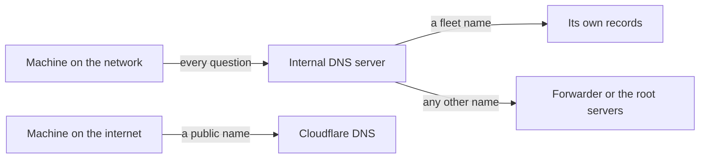

# Technitium DNS Server

Technitium DNS Server answers DNS queries and is managed from a web console. This page explains the DNS ideas the fleet leans on, what names the fleet needs answered, and where Technitium sits in the fleet-stacks repo, for a reader who has never run a DNS server.

No host in the fleet runs Technitium. It was cut from the plan, and the network's own DNS holds the fleet's records. The DNS ideas below apply to that server just as well. See [How the fleet uses it](#in-the-fleet).

## What it is {#what}

Every page in the build guide sends you to a name, such as `komodo.km01.home.myah-mitchell.com`. Something on the network has to turn that name into km01's address, and the public internet cannot do it, because the address is a private one that only exists inside the network. The network needs a DNS server of its own that knows the fleet's names.

Technitium is one such server. It holds records for the names you give it, looks up every other name on the internet for the machines that ask, and remembers the answers. Records are added in a web console or through an HTTP API.

## The ideas you need {#ideas}

### Records {#records}

DNS is a lookup from a name to a piece of data. One such pairing is a record, and its type says what the data is.

| Type | Maps a name to | Example in the fleet |
| --- | --- | --- |
| A | An IPv4 address | `tf01.home.myah-mitchell.com` to `172.16.7.111` |
| AAAA | An IPv6 address | None. The examples use IPv4 only |
| CNAME | Another name, which is then looked up in turn | A service's short name to the name of the host it runs on |
| MX | The mail server for a domain | `myah-mitchell.com` to the mail host |
| TXT | Free text, read by programs | The mail records that say who may send for the domain |
| PTR | A name, from an address. The reverse of A | The public address of the mail host to its name |

Each record carries a time to live, in seconds: how long anyone who has looked it up may reuse the answer before asking again. It is written TTL.

### Zones and authoritative servers {#zones}

A zone is one stretch of the naming tree that is managed in one place, such as `myah-mitchell.com` and the names under it. The server that holds a zone's records is authoritative for it: its answers are the source, not a copy.

A name ends up in a zone by delegation. The servers for `com` hold a record saying which servers are authoritative for `myah-mitchell.com`, and so on down from the root of the tree.

### Resolvers {#resolvers}

A resolver is the server a machine sends its questions to. A machine holds the address of one or two, which it gets from DHCP or from its configuration. The resolver does the work of finding the answer and keeps it in a cache until its time to live runs out.

A resolver finds an answer in one of two ways. A recursive resolver starts at the root and follows each delegation down until it reaches the authoritative server. A forwarding resolver hands the question to another resolver, called its forwarder, and passes the answer back.

One server can be both things at once: authoritative for the zones it holds, and a resolver for every other name. Technitium is, and so is the DNS service on most network gateways.

### Wildcard records {#wildcards}

A wildcard record has `*` as its first label and answers for every name under it that has no record of its own. One A record for `*.id01.home.myah-mitchell.com` would answer for `authentik.id01.home.myah-mitchell.com` and for any other name that ends the same way.

A wildcard saves adding a record per service. It also answers for names nothing serves, so a mistyped name gets an address and a connection error in place of a clear "no such name".

### Split-horizon naming {#split-horizon}

Split horizon means the same domain gives different answers depending on where the question comes from. Inside the network, a resolver that is authoritative for the internal names answers with private addresses. Outside, the public DNS for the domain knows nothing of those names, or answers with a public address.

The fleet depends on it. `myah-mitchell.com` is a public domain whose zone is at Cloudflare, and the handful of names the internet reaches are there. Every name under `home.myah-mitchell.com` exists on the internal DNS server only, and points at a `172.16` address.

The diagram shows the two paths a question can take.



A machine on the network asks the internal server for everything. The server answers a fleet name from its own records, and finds any other name on the internet. A machine outside never reaches the internal server, so it sees only what the public zone holds.

For this to work, every machine in the fleet must use the internal server as its resolver. A machine that asks a public resolver directly gets no answer for an internal name.

## How the fleet uses it {#in-the-fleet}

The fleet runs no DNS server of its own. Its hosts use the network's, on the UniFi gateway, and the fleet's records live there. Technitium was tried beside it and dropped, because hosts then had two resolvers that disagreed. See [Not in the plan](../../fleet-bootstrap/stacks/index.md#unused).

### The resolver each host uses {#host-resolver}

A built host's nameservers come from `network_dns` in the inventory, which defaults to the host's gateway. In the examples that is `172.16.7.1` on the internal network. The installer gets the same list from `dns_servers` in the host's entry in `opentofu/prod.tfvars`, and the run stops when the two differ. See [Limits](../../fleet-bootstrap/concepts/how-a-host-is-built.md#limits).

### The names the fleet needs {#names}

Every name is built from the host, the sub-domain, and the domain, as the [conventions](https://github.com/myah-mitchell/fleet-stacks/blob/main/docs/conventions.md) set out. Three shapes come up.

| Shape | Example | Points at |
| --- | --- | --- |
| The host | `tf01.home.myah-mitchell.com` | The host's address |
| A service on a host | `authentik.id01.home.myah-mitchell.com` | The address of the host that runs it |
| A service's short name | `semaphore.home.myah-mitchell.com` | The host whose Traefik serves that name |

The pages ask for one record per name. No wildcard record is defined in any of the fleet's repos. Each page that sends you to a name says the name needs a record pointing at the host, or an entry in your own machine's hosts file. See [What you see in bootstrap mode](../../fleet-bootstrap/concepts/bootstrap-mode.md#effects).

A hosts file is enough for a name only your browser opens. A name that another host or a container looks up needs a real record, as tf01's does. See [Traefik hub (tf01)](../../fleet-bootstrap/hosts/tf01-traefik-hub.md).

### dockns {#dockns}

dockns is a small service that watches a host's containers and writes DNS records for the ones that carry its labels. It is part of system-agent, which every VM runs outside bootstrap mode. See [system-agent](../../fleet-bootstrap/stacks/system-agent.md).

It writes to a DNS server through that server's API. The fleet's dockns is given two: the UniFi gateway for internal names, and Cloudflare for public ones. Its internal records are CNAMEs whose target is the host's own name, so a service's name follows the host and the host's A record is the only place its address is written.

As the repo stands, dockns writes no internal record. Only three containers carry its labels, and those labels still name a server called `technitium`, which the stack no longer defines. The records made by hand stay. See [Not yet confirmed](../../fleet-bootstrap/stacks/system-agent.md#unconfirmed) on the system-agent page.

### What the repo holds for Technitium {#repo}

| Path in fleet-stacks | Holds |
| --- | --- |
| `containers/technitium/compose.yaml` | The container: image `technitium/dns-server:14.3.0`, its ports, and its Traefik route |
| `stacks/technitium-server` | The stack. See [technitium-server](../../fleet-bootstrap/stacks/technitium-server.md) |
| `containers/dockns/config/config.toml.example` | An older dockns configuration that wrote to Technitium, kept as an example |

The container publishes DNS on port 53 of one address of its host, and serves the web console on port 5380 to Traefik. It also publishes port 853 for DNS over TLS and DNS over QUIC, and port 53443 for the console over HTTPS. The compose file turns none of those three on, so nothing listens on either port until you enable it in the console. Its zones, records, and settings are in one folder, `technitium-data`, mounted at `/etc/dns`.

`DNS_SERVER_FORWARDERS` is blank in the compose file. With no forwarder, Technitium resolves other names recursively, from the root servers down. The image reads these `DNS_SERVER_` variables on its first start only. After that, the settings are the ones saved in the data folder, changed in the console.

## Finding your way around {#around}

Two tools show what a DNS server says, whichever server it is. Neither changes anything.

`dig` asks one server one question. Name the server after `@`, or leave it out to ask the machine's own resolver:

```bash
dig @172.16.7.1 authentik.id01.home.myah-mitchell.com
```

The header's `status` is `NOERROR` when the name exists and `NXDOMAIN` when it does not. The *ANSWER SECTION* holds the records, each with its time to live. Add `+short` to print the answer alone.

`cat /etc/resolv.conf` on a fleet host lists the nameservers the host is using.

On a host of your own that runs the stack, the web console is where Technitium's state is. The tab names below are from version 14 and have not been checked against a running console.

| Tab | Shows |
| --- | --- |
| *Dashboard* | Query counts, the top clients, and the top names asked for |
| *Zones* | The zones the server holds, and the records in each |
| *Cache* | The answers it is holding for other names |
| *DNS Client* | A form that asks any server a question, as `dig` does |
| *Settings* | Forwarders, recursion, and the listening protocols |
| *Logs* | The server's log files |

## Making changes {#changes}

This tool has no how-to. A procedure for adding a record in Technitium's console was planned and left out, because no host runs Technitium and the fleet's records are made in the network's own DNS.

| To | See |
| --- | --- |
| Know which records a host needs | That host's page, under [Running order](../../fleet-bootstrap/index.md#running-order) |
| Give dockns the values it writes records with | [Leaving bootstrap mode](../../fleet-bootstrap/procedures/leave-bootstrap-mode.md#dockns) |
| Run Technitium on a host of your own | [Applications (ap01)](../../fleet-bootstrap/hosts/ap01-applications.md#existing-stack) and [technitium-server](../../fleet-bootstrap/stacks/technitium-server.md#values) |

## When it goes wrong {#troubleshooting}

These are for a name that does not resolve, on any DNS server.

| Sign | Look at |
| --- | --- |
| `NXDOMAIN` for a fleet name | The record. Ask the internal server directly with `dig @<server>`, and check the name's spelling against the host page |
| The name resolves on your machine and not on a host | A hosts file entry on your machine that the host does not have. Add a real record |
| The name resolves on the server and not from a machine | The machine's resolver. It is asking a different server, often a public one or a browser's own secure DNS |
| A changed record still gives the old address | The time to live. The old answer is cached until it runs out |
| A public name gives a private address, or the reverse | Split horizon. Check which server answered, in the `SERVER` line of dig's output |

## Going further {#further}

- [Technitium DNS Server](https://technitium.com/dns/), the project's site, with its help pages and API documentation
- [The project's repository](https://github.com/TechnitiumSoftware/DnsServer), which holds the Docker environment variables in `docker-compose.yml`
- [DockNS](https://codeberg.org/BrenekH/DockNS), for its labels and the DNS servers it can write to
