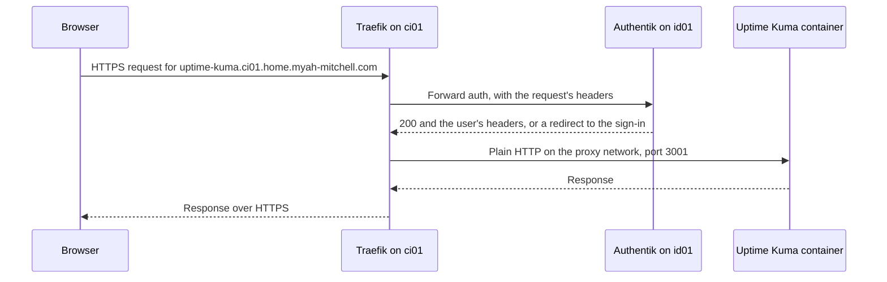
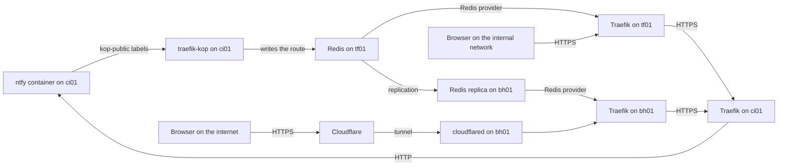

# Traefik

Traefik is the reverse proxy in front of every web interface in the fleet. This page explains what it does, the handful of its ideas the fleet relies on, and how the fleet arranges one Traefik per VM, a hub, and a public edge. It is for a reader who has never used Traefik, and it holds no procedure.

## What it is {#what}

A VM in the fleet runs several containers that each serve a web interface, and every one of them wants ports 80 and 443. Only one program can listen on a port. Each interface also needs a TLS certificate, and most need a sign-in in front of them.

Traefik solves all three in one place. It is the only program on the VM that listens on the web ports. It reads the hostname of each request, picks the container that hostname belongs to, and passes the request on. It holds the certificate, and it can ask a sign-in service whether a request may pass before the container ever sees it.

Traefik finds out which containers exist by watching Docker. A container says how it wants to be reached through labels in its own Compose file, so adding a service to a VM never means editing a Traefik config file.

## The ideas you need {#ideas}

Read these top to bottom. Each builds on the ones above it.

### Reverse proxy {#reverse-proxy}

A reverse proxy is a server that accepts requests on behalf of other servers and passes each one to the right place. The browser talks to the proxy and never to the application. The application sits on a private Docker network with no port published on the host.

In the fleet, every VM that serves a web interface has a Traefik of its own, because the containers it fronts are on that VM's Docker networks. The fleet-stacks repo defines it as one service, `.traefik` in `containers/traefik/compose.yaml`, and every Traefik stack extends that service.

### Entrypoint {#entrypoints}

An entrypoint is a port Traefik listens on, with a name. The fleet's Traefik has three.

| Entrypoint | Port | Carries |
| --- | --- | --- |
| `http` | 80 | Nothing but a redirect to HTTPS |
| `https` | 443 | Every application route |
| `dashboard` | 8443 | Traefik's own dashboard |

They are set as arguments in the Traefik service:

```yaml
- --entrypoints.http.address=:80
- --entrypoints.http.http.redirections.entrypoint.to=https
- --entrypoints.https.address=:443
- --entrypoints.https.asdefault=true
- --entrypoints.dashboard.address=:8443
```

`asdefault=true` makes `https` the entrypoint for any route that names none. That is why the labels on the fleet's containers never mention an entrypoint.

### Router {#routers}

A router is one routing decision: a rule that a request either matches or does not, and what to do with a request that matches. Traefik can hold hundreds of routers, and each has a name.

The rule the fleet uses is `Host`, which matches the hostname the browser asked for. Rules combine with `||` for "or". This is the router on the Uptime Kuma container, from `containers/uptime-kuma/compose.yaml`:

```yaml
- "traefik.http.routers.$PROJECT_NAME-uptime-kuma-rtr.rule=
  Host(`${UPTIME_KUMA_SERVICE_NAME}.${SUB_DOMAIN_NAME}${DOMAIN_NAME}`) ||
  Host(`${UPTIME_KUMA_HOSTNAME}.${SERVER_NAME}.${SUB_DOMAIN_NAME}${DOMAIN_NAME}`)"
```

On ci01 the variables resolve to `uptime-kuma.home.myah-mitchell.com` and `uptime-kuma.ci01.home.myah-mitchell.com`, so the router matches either name. The router's own name is the part after `routers.`, here `core-uptime-kuma-rtr`, since the project on ci01 is `core`.

A request that matches no router falls to a catch-all with a low priority, which belongs to the error-pages container. That is the page you see for a hostname nobody has claimed.

### Service {#services}

In Traefik, a service is the destination a router sends to: one or more addresses of the real application. The word means something different from a service in a Compose file, though for a container the two usually line up one to one.

For a container, Traefik already knows the address, because it watches Docker. The label only has to give the port the application listens on inside the container:

```yaml
- "traefik.http.services.$PROJECT_NAME-uptime-kuma-svc.loadbalancer.server.port=3001"
```

`loadbalancer` is there because a service can spread requests across several addresses. The fleet always has one. Traefik reaches the container over a shared Docker network named `proxy`, which every routed container joins.

### Middleware and chain {#middlewares}

A middleware is a step a request passes through between the router and the service. It can change the request, change the response, or refuse the request outright. Rate limiting, security headers, compression, and a sign-in check are all middlewares.

A chain is a middleware that is only a list of other middlewares, run in order. The fleet defines its middlewares one time, in files under `containers/traefik/rules`, and a router names a single chain. This is `chain-authentik.yaml`:

```yaml
http:
  middlewares:
    chain-authentik:
      chain:
        middlewares:
          - middlewares-rate-limit
          - middlewares-secure-headers
          - middlewares-compress
          - middlewares-authentik
```

A router attaches the chain with one label:

```yaml
- "traefik.http.routers.$PROJECT_NAME-uptime-kuma-rtr.middlewares=${TRAEFIK_AUTH_CHAIN:-chain-authentik@file}"
```

### Provider {#providers}

A provider is a source Traefik reads routers, services, and middlewares from. Traefik watches each provider and takes up a change within seconds, with no restart. The fleet uses three.

| Provider | Reads | Used for |
| --- | --- | --- |
| Docker | The labels of running containers | Every application route on a VM |
| File | The YAML files in `containers/traefik/rules` | The middlewares, the chains, and the TLS options |
| Redis | Keys in a Redis database | Routes published by other VMs. On tf01 and bh01 only |

Every object carries its provider's name as a suffix. `chain-authentik@file` is the chain named `chain-authentik` from the file provider, and a router made from labels shows in the dashboard with `@docker` on the end. A label has to give the suffix when it refers to something from another provider, which is why the chain is always written with `@file`.

The Docker provider ignores a container unless it carries the label `traefik.enable=true`, because the fleet sets `exposedbydefault=false`. Traefik does not read the Docker socket directly. It asks a socket-proxy container, which passes on read-only questions and nothing else.

### Static and dynamic configuration {#static-dynamic}

Traefik has two kinds of configuration, and the difference decides what a change costs.

| Kind | Holds | Read | In the fleet |
| --- | --- | --- | --- |
| Static | Entrypoints, which providers to use, certificate resolvers, logging | One time, at start | The `command:` arguments of the Traefik service |
| Dynamic | Routers, services, middlewares, TLS options | All the time, from the providers | Container labels, the rules files, and Redis |

A new route is dynamic, so it appears when its container starts and nothing else is touched. A new entrypoint or resolver is static, so it means editing the Traefik service in fleet-stacks and redeploying every Traefik stack.

### TLS termination and certificate resolvers {#tls}

Terminating TLS means Traefik holds the certificate and does the encryption with the browser. Behind it, the request travels to the container as plain HTTP over the private `proxy` network. No application in the fleet manages a certificate for its web interface.

A certificate resolver is how Traefik gets a certificate by itself. It speaks ACME, the protocol Let's Encrypt uses: Traefik asks for a certificate, the certificate authority sets a challenge that proves control of the domain, and Traefik answers it. The fleet's resolver is named `letsencrypt` and answers with the DNS challenge, where the proof is a TXT record Traefik creates through Cloudflare's API:

```yaml
- --certificatesresolvers.letsencrypt.acme.storage=/etc/traefik/certs/acme.json
- --certificatesresolvers.letsencrypt.acme.dnschallenge.provider=cloudflare
```

The DNS challenge suits the fleet for two reasons. Let's Encrypt never has to reach the VM, so internal hosts get trusted certificates without being on the internet. It is also the only challenge that issues wildcard certificates, and each Traefik asks for one certificate that covers the domain, the sub-domain, and the VM's own names. See [Certificates from Let's Encrypt](../../fleet-bootstrap/concepts/bootstrap-mode.md#certificates).

A wildcard covers one level of name. `*.ci01.home.myah-mitchell.com` covers `ntfy.ci01.home.myah-mitchell.com` and nothing deeper. The fleet's TLS options set `sniStrict`, so Traefik refuses the handshake for a name its certificate does not cover instead of answering with a certificate that does not match.

step-ca on pk01 is the fleet's internal certificate authority, and it also speaks ACME. Traefik does not use it today: the Traefik service defines the `letsencrypt` resolver and no other. See [step-ca](../step-ca/index.md).

### Forward auth {#forward-auth}

Forward auth is a middleware that asks another service whether a request may pass. Traefik sends a copy of the request's headers to an address. A `200` answer lets the request through, and any other answer goes back to the browser in place of the application's. The application needs no sign-in code of its own.

The fleet's forward auth is `middlewares-authentik`, the last link of `chain-authentik`. It asks [Authentik](../authentik/index.md), the fleet's sign-in service on id01:

```yaml
middlewares-authentik:
  forwardAuth:
    address: https://{{env "AUTHENTIK_HOST"}}/outpost.goauthentik.io/auth/traefik
    trustForwardHeader: true
```

Authentik answers `200` for a browser that holds its session cookie, and adds headers that name the user. For any other browser it answers with a redirect to its sign-in page, and the browser comes back once the user has signed in.

## How the fleet uses it {#in-the-fleet}

### One Traefik per VM {#per-vm}

Every VM that serves a web interface runs its own Traefik, and a request for a service on that VM goes straight to it. The VM's Traefik terminates TLS with its own certificate and asks Authentik itself. Nothing central sits in the path, so a VM's interfaces keep answering when tf01 is down.

This is the path of a request for Uptime Kuma on ci01, a route behind the sign-in chain.



The forward auth call is itself an HTTPS request to Authentik's hostname, so it arrives at the Traefik on id01, which routes it to the Authentik container. A redirect from Authentik goes back to the browser and the container is never reached.

### The Traefik stacks {#stacks}

All five Traefik stacks run the same Traefik service with the same rules files. They differ in what they add beside it.

| Stack | Runs on | Adds to Traefik and its helpers |
| --- | --- | --- |
| [traefik-basic](../../fleet-bootstrap/stacks/traefik-basic.md) | No host. A building block | Nothing |
| [traefik-agent](../../fleet-bootstrap/stacks/traefik-agent.md) | Every VM with a web interface | traefik-kop, the route publisher |
| [traefik-server](../../fleet-bootstrap/stacks/traefik-server.md) | tf01 | traefik-kop, and the Redis that routes are published into |
| [traefik-dmz](../../fleet-bootstrap/stacks/traefik-dmz.md) | bh01 | traefik-kop, a replica of that Redis, and cloudflared |
| [traefik-bootstrap](../../fleet-bootstrap/stacks/traefik-bootstrap.md) | A VM in bootstrap mode | Nothing. It stands in for traefik-agent |

The helpers are the socket proxies, error-pages, and logrotate. See [traefik-basic](../../fleet-bootstrap/stacks/traefik-basic.md#services) for what each does.

A VM runs exactly one of these stacks. They all use the project name `traefik`, so the Traefik container is `traefik-traefik` on every host, and two of them on one VM would collide on names and ports.

### The two chains {#chains}

A route in the fleet names one of two chains, both from the file provider.

| Chain | Runs | For |
| --- | --- | --- |
| `chain-authentik@file` | Rate limit, secure headers, compression, then forward auth to Authentik | An interface with no sign-in of its own, or one you want behind single sign-on |
| `chain-no-auth@file` | Rate limit, secure headers, compression | A service that signs its own users in, or one that machines call |

ntfy, Komodo, Grafana, and Authentik itself use `chain-no-auth@file` as a fixed value. Authentik has to, since it is the sign-in. ntfy does because other services post to it with a token and could never follow a browser redirect.

Most other containers write the chain as a variable with a default:

```yaml
${TRAEFIK_AUTH_CHAIN:-chain-authentik@file}
```

`TRAEFIK_AUTH_CHAIN` is a key in the stack's `komodo.env`, blank by default, and a blank value takes `chain-authentik@file`. The variable exists so that bootstrap mode can switch a whole stack to `chain-no-auth@file` without a change to any Compose file. See [The rules it ships with](../../fleet-bootstrap/stacks/traefik-basic.md#rules).

### Publishing a route beyond its VM {#publishing}

A route made from `traefik.` labels exists on its own VM's Traefik and nowhere else. Some services need to be reached through a Traefik on another host: through the hub on tf01, or from the internet through bh01. Publishing is how a VM offers a route to those two.

traefik-kop is a small program in the traefik-agent stack. It watches Docker as Traefik does, but reads only labels that start with `kop-public.traefik.`, and writes the routers and services they describe into a Redis database on tf01. The prefix comes from `DOCKER_PREFIX: kop-public` in `containers/traefik-kop/compose.yaml`. The VM's own Traefik ignores those labels, and traefik-kop ignores the plain ones, so a container carries both sets when it wants both.

Publishing is a choice made for each container. In fleet-stacks today, ntfy, Stalwart, and Bulwark carry the labels.

The published service does not point at the container. It points at the VM's own Traefik, by name and over HTTPS, because the container has no port open on the host. A request that comes in through the hub is therefore routed twice: the hub matches the hostname and forwards it to the VM, and the VM's Traefik matches the same hostname and forwards it to the container.

The diagram shows how a published route travels from ntfy's labels on ci01 to the two Traefiks that read it, and the two paths a request can then take.



### The hub on tf01 {#hub}

tf01 runs traefik-server. Its Redis holds every published route in the fleet, and its Traefik has the Redis provider turned on, so it serves all of them from one address. The provider is on only where `TRAEFIK_REDIS_ENDPOINTS` is set, which is in traefik-server and traefik-dmz. See [The Redis provider](../../fleet-bootstrap/concepts/bootstrap-mode.md#redis-provider).

The Redis holds nothing original. Every key in it was written by a traefik-kop from a container's labels, and is written again if the Redis is replaced. See [Traefik hub (tf01)](../../fleet-bootstrap/hosts/tf01-traefik-hub.md).

### The edge on bh01 and the tunnel {#edge}

bh01 sits in the DMZ and is the only host that carries requests from the internet. It runs traefik-dmz: a Traefik, a read-only replica of tf01's Redis, and cloudflared.

cloudflared is the connector of a Cloudflare Tunnel. It opens a connection outward to Cloudflare and keeps it open, and Cloudflare sends requests for the fleet's public hostnames back down that connection. No port is forwarded on the router and no public address points at the fleet.

Two lists decide what the internet can reach, and a hostname has to be on both. bh01's Traefik knows every published route, because the replica copies all of tf01's Redis. cloudflared accepts only the hostnames listed under `ingress` in its `config.yml` on bh01, and answers 404 for any other. A published route is therefore internal until someone adds its public name to that file and creates its DNS record in Cloudflare. See [DMZ edge (bh01)](../../fleet-bootstrap/hosts/bh01-dmz-edge.md#publish).

A public name has no sub-domain in it. `ntfy.myah-mitchell.com` is public, and `ntfy.home.myah-mitchell.com` is the internal name for the same service.

### Bootstrap mode's stand-in {#bootstrap}

The real Traefik depends on three other hosts: Authentik on id01 for the sign-in, the Redis on tf01 for traefik-kop, and a working Cloudflare token for the certificate. The first hosts are built before any of that exists. Until the fleet leaves bootstrap mode, such a host runs traefik-bootstrap in place of traefik-agent.

traefik-bootstrap is the same Traefik with three values changed in its `komodo.env`: no certificate resolver, TLS options without `sniStrict`, and `chain-no-auth@file` as the chain. It has no traefik-kop. The result is the real hostnames, a self-signed certificate the browser warns about, no sign-in, and no published routes. See [Bootstrap mode](../../fleet-bootstrap/concepts/bootstrap-mode.md#traefik).

tf01 and bh01 never run the stand-in, since their own stacks are Traefiks already. In bootstrap mode the run only sets their chain to `chain-no-auth@file`.

### Where its configuration lives {#files}

| What | Where |
| --- | --- |
| The Traefik service and its static configuration | `containers/traefik/compose.yaml` in fleet-stacks |
| Middlewares, chains, and TLS options | `containers/traefik/rules` in fleet-stacks |
| A service's routes | The `labels:` of its container, in `containers/<name>/compose.yaml` in fleet-stacks |
| The values a Traefik stack reads | Komodo Variables and Secrets. See [Traefik](../../fleet-bootstrap/concepts/variables-and-secrets.md#traefik) |
| Certificates | `acme.json` in `/opt/docker/volumes/traefik/traefik-certs` on each host |
| The access log | `/opt/docker/logs/traefik/traefik` on each host |
| The tunnel's hostnames | `config.yml` in `/opt/docker/volumes/traefik/cloudflared-config` on bh01 |

## Finding your way around {#around}

### The dashboard {#dashboard}

Every Traefik serves a read-only dashboard on port 8443, at the name `traefik.<host>.home.myah-mitchell.com`. For ci01:

```text
https://traefik.ci01.home.myah-mitchell.com:8443
```

*HTTP Routers* lists every router with its rule, its provider, and whether Traefik accepted it. Opening a router shows the entrypoint, the middlewares in order, and the service it sends to. A router with an error, such as a middleware that does not exist, is flagged there. On tf01, published routes show Redis as their provider.

The dashboard changes nothing. It sits behind the chain in `TRAEFIK_AUTH_CHAIN`, as an application route does.

### On the host {#on-the-host}

List the Traefik stack's containers and their health:

```bash
docker compose -p traefik-agent-<host> ps
```

Read Traefik's own log, which is where a rejected label or a failed certificate request shows:

```bash
docker logs --tail 50 traefik-traefik
```

Read the last requests Traefik routed. Each line is one request as JSON, with the router that matched and the status returned:

```bash
tail -n 5 /opt/docker/logs/traefik/traefik/access.log
```

Read the certificate Traefik serves for a name, from any machine that can reach the host:

```bash
openssl s_client -connect 172.16.7.121:443 \
  -servername traefik.ci01.home.myah-mitchell.com < /dev/null 2> /dev/null \
  | openssl x509 -noout -issuer -ext subjectAltName
```

On a host with traefik-kop, read what the route publisher last did:

```bash
docker logs --tail 20 traefik-traefik-kop
```

## Making changes {#changes}

| To | See |
| --- | --- |
| Put a service behind its VM's Traefik | [Adding a route to a service](add-a-route.md) |
| Offer a route to the hub, or to the internet | [Publishing a route beyond its VM](publish-a-route.md) |
| Put a public hostname on the tunnel | [Publishing a hostname](../../fleet-bootstrap/hosts/bh01-dmz-edge.md#publish) |
| Build the hub or the edge | [Traefik hub (tf01)](../../fleet-bootstrap/hosts/tf01-traefik-hub.md) and [DMZ edge (bh01)](../../fleet-bootstrap/hosts/bh01-dmz-edge.md) |
| Swap the stand-in for the real Traefik | [Leaving bootstrap mode](../../fleet-bootstrap/procedures/leave-bootstrap-mode.md) |
| Create the values every Traefik stack reads | [Create the Traefik values](../../fleet-bootstrap/foundation/komodo-setup.md#traefik) |

## When it goes wrong {#troubleshooting}

| You see | Look at |
| --- | --- |
| A certificate warning in the browser | Whether the host is in bootstrap mode, where the warning is expected. Otherwise the resolver's errors: `docker logs traefik-traefik 2>&1 \| grep -i acme` |
| The TLS handshake fails with no certificate offered | The hostname. With `sniStrict`, a name the certificate does not cover is refused. A wildcard covers one level only |
| The error-pages 404 for a hostname you expect to work | *HTTP Routers* in the dashboard. No router matched, so check the `Host` rule, the `traefik.enable=true` label, and that the container is healthy. Traefik drops a container whose health check is failing |
| *Bad Gateway* | The port in the service label, and whether the container joined the `proxy` network |
| An error on every route behind the sign-in chain | Authentik on id01, and the Provider its outpost answers for. See [Set up the sign-in in Authentik](../../fleet-bootstrap/procedures/leave-bootstrap-mode.md#authentik) |
| A published route missing on tf01 | The log of traefik-kop on the service's own VM. Its health check passes even when it cannot reach Redis |
| The Traefik stack fails to start with a name or port in use | A second Traefik stack on the VM, usually the stand-in left running. See [Which mode a host is in](../../fleet-bootstrap/concepts/bootstrap-mode.md#which) |

## Going further {#further}

- [Traefik's documentation](https://doc.traefik.io/traefik/), for everything it can do beyond what the fleet uses
- [Routers](https://doc.traefik.io/traefik/routing/routers/), for the rule syntax beyond `Host`
- [The ForwardAuth middleware](https://doc.traefik.io/traefik/middlewares/http/forwardauth/)
- [traefik-kop](https://github.com/jittering/traefik-kop), the route publisher
- [Cloudflare Tunnel](https://developers.cloudflare.com/cloudflare-one/connections/connect-networks/), for cloudflared and its ingress rules

## Not yet confirmed {#unconfirmed}

No Traefik in the fleet has run. The page was assembled from the compose files and rules in fleet-stacks, and from each tool's documentation.

- The address traefik-kop writes for a published service. The labels set `loadbalancer.server.url` and `kop.bind.ip`, and this page takes the result to be the VM's own Traefik on port 443.
- A request routed twice, by the hub or the edge and then by the VM's Traefik, with the hostname carried through unchanged.
- The path of the access log file inside the log folder, which follows the `--accesslog.filepath` argument and the folder's mount.
- The open items the Traefik stack pages list, which apply here too. See [traefik-server](../../fleet-bootstrap/stacks/traefik-server.md#unconfirmed) and [traefik-dmz](../../fleet-bootstrap/stacks/traefik-dmz.md#unconfirmed).
