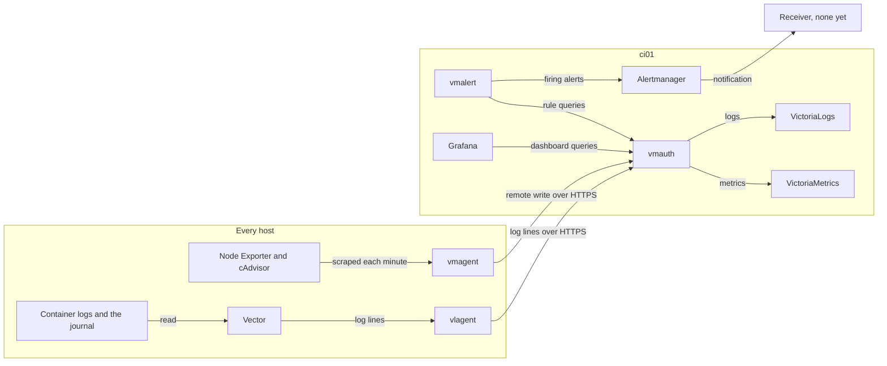

# VictoriaMetrics

VictoriaMetrics is the family of programs the fleet uses to watch itself: stores for metrics, logs, and traces, agents that fill them, and vmalert to raise alerts from what they hold. This page explains monitoring from the start and shows how the fleet's monitoring stack fits together, Grafana and Alertmanager included, for a reader who has never run one.

## What it is {#what}

A fleet of hosts fails in small ways long before it fails outright. A disk fills, a container restarts every few minutes, a certificate nears its end. Each host knows these things about itself, and nobody is logged in to see them.

Monitoring moves that knowledge to one place. Every host measures itself and ships its numbers and its log lines to a central store. From there you can draw them on a graph, search them, and write rules that raise an alert when a number crosses a line.

VictoriaMetrics is one project's set of tools for that job. Its metrics store speaks the same formats and query language as Prometheus, the best known tool of this kind, so most Prometheus exporters, rules, and dashboards work with it unchanged. The fleet pairs it with two tools from outside the project: Grafana for dashboards, and Alertmanager for sending notifications.

## The ideas you need {#ideas}

### Metrics, logs, and traces {#metrics-logs-traces}

A metric is a number measured again and again: free bytes on a disk, requests served, seconds of CPU used. Metrics are small and cheap to keep, and they answer "how much" and "since when".

A log is a line of text a program wrote when something happened. Logs answer "what exactly went wrong", which a number cannot.

A trace follows one request through every service it touches and records how long each part took. Programs have to be written to emit traces.

The fleet has a store for each: VictoriaMetrics for metrics, VictoriaLogs for logs, and VictoriaTraces for traces. Metrics and logs arrive from every host. The traces store runs, and nothing in the fleet sends to it yet.

### A time series and its labels {#time-series}

A metric has a name, such as `node_filesystem_avail_bytes`. One name covers many things measured, so each measurement also carries labels, which are pairs of a key and a value:

```text
node_filesystem_avail_bytes{job="node", instance="id01.home.myah-mitchell.com:9100", mountpoint="/"}
```

A name with one set of label values is a time series: a list of values with the time each was taken. The same name with `mountpoint="/srv/persist"` is another series. Every query selects series by name and labels, so the labels are how you say which host and which disk you mean.

Two labels are on every series the fleet collects. The `job` label is the name of the scrape job that collected it, and `instance` is the address it was collected from. In the fleet the address starts with the host's full name, so `instance` is how you tell hosts apart.

### Scraping and exporters {#scraping}

An exporter is a small program that measures something and serves the current numbers as a page of text over HTTP, by convention at the path `/metrics`. It keeps no history.

Scraping is fetching that page on a timer. The scraper stamps each number with the time and stores it, and the history builds up one fetch at a time. The scraper pulls, and the exporter never has to know where the store is.

What to scrape is listed in a scrape config, as jobs. Each job has a name and a list of targets. This job is from `containers/vmagent/config/prometheus-system.yml` in fleet-stacks, and collects the host's own numbers:

```yaml
- job_name: node
  scheme: https
  tls_config:
    ca_file: node_exporter.crt
    ## the certificate is Self-Signed so we need to skip verification
    insecure_skip_verify: true
  basic_auth:
    username: "%{NODE_EXPORTER_USER}"
    password_file: /etc/prometheus/node_exporter_password
  static_configs:
  - targets:
    - "%{SERVER_ADDRESS}:9100"
```

A name inside `%{}` is replaced with an environment variable of the container when the file is read. One file therefore serves every host, and each host's copy scrapes its own address.

The scraper adds a series of its own for every target, called `up`. Its value is 1 when the last scrape worked and 0 when it failed, which makes it the first thing to query when data is missing.

The fleet scrapes two exporters on every host.

| Exporter | Measures | Runs as |
| --- | --- | --- |
| Node Exporter | The host: CPU, memory, disks, network | A systemd service from the host's NixOS configuration, on port 9100 |
| cAdvisor | Each container: CPU, memory, disk, network | A container in the system-agent stack |

The VictoriaMetrics programs and Traefik also serve a `/metrics` page of their own, with no exporter beside them.

### Agents and remote write {#remote-write}

Something has to do the scraping. One central scraper would need a way in to every exporter on every host. The fleet turns that round: each host runs a small agent, vmagent, that scrapes the targets on its own host and pushes what it collects to the store. That push is called remote write.

Each host then makes one outbound HTTPS connection to ci01 and opens nothing for monitoring to the rest of the network. Node Exporter's password never leaves the host it was made on. The agent also buffers: when ci01 is unreachable, vmagent keeps up to 100 MB on disk and sends it when ci01 is back.

The agent's side of this is three arguments in `containers/vmagent/compose.yaml`:

```yaml
- "--remoteWrite.basicAuth.username=${VMAUTH_USER}"
- "--remoteWrite.basicAuth.password=${VMAUTH_PASS}"
- "--remoteWrite.url=https://${VMAUTH_HOST}/api/v1/write"
```

ci01 holds the stores because a store wants to be in one place. A query, a dashboard, or an alert rule can then compare every host with every other.

### vmauth {#vmauth}

vmauth is a small HTTP proxy that stands in front of the three stores. Agents, Grafana, and vmalert all talk to vmauth, and vmauth passes each request to the right store by its path. The whole of its config is `containers/vmauth/config/auth-vl-single.yml`:

```yaml
unauthorized_user:
  url_map:
  - src_paths:
    - "/api/v1/.*"
    url_prefix:
    - http://victoriametrics:8428
  - src_paths:
    - "/select/jaeger/.*"
    - "/insert/opentelemetry/.*"
    url_prefix:
    - http://victoriatraces:10428
  - src_paths:
    - "/select/.*"
    - "/insert/.*"
    url_prefix:
    - http://victorialogs:9428
```

The first match wins, so the traces paths sit above the wider logs paths. With vmauth in front, a client needs one hostname and one login for all three stores. The login is the pair of values `GLOBAL_VMAUTH_USER` and `GLOBAL_VMAUTH_PASS`, and the hostname is `GLOBAL_VMAUTH_HOST`. See [Telemetry](../../fleet-bootstrap/concepts/variables-and-secrets.md#telemetry).

### Log collection and streams {#log-streams}

Logs are pushed the whole way, since a log line is an event and there is no page to scrape. Two programs on each host share the work.

Vector reads the logs and tidies them. It takes container output from the Docker API, the host's journal, `.log` files under `/var/log`, syslog on port 5140, and Traefik's access log. It pulls out the fields it can find in each line, and settles the level into a field called `level`.

vlagent is to logs what vmagent is to metrics. Vector hands it the lines, and it forwards them to vmauth on ci01, buffering up to 100 MB on disk while ci01 is away.

VictoriaLogs stores each line as a set of fields. Three are built in: `_time`, `_msg` for the text, and `_stream`. A stream is all the lines from one source, and the fields that define it are chosen by whoever sends the logs. The fleet's Vector config sets one stream field, `stream_name`:

| `stream_name` | Source |
| --- | --- |
| `container-` and the container's name | A container's output |
| A systemd unit's name, such as `sshd.service` | The journal |
| `host-` and a file name | A `.log` file under `/var/log` |
| `syslog-` and the sender | A device sending syslog |

Traefik's access log is the exception. Its streams are defined by the fields `RouterName` and `ServiceName`.

### MetricsQL {#metricsql}

MetricsQL is the query language of VictoriaMetrics. It is PromQL, the language of Prometheus, with additions, so a PromQL query from any guide works. Three queries cover most of the grammar.

A name with labels in braces selects series. This returns one series for each host's Node Exporter, with the value 1 or 0:

```text
up{job="node"}
```

Many metrics are counters, which only ever go up, such as bytes received since boot. The raw number means little. `rate` turns a counter into a per-second speed, averaged over the window in square brackets:

```text
rate(node_network_receive_bytes_total{instance="id01.home.myah-mitchell.com:9100"}[5m])
```

An aggregation folds many series into fewer. This adds up CPU use across cores and gives one series for each container, named by cAdvisor's `name` label:

```text
sum by (name) (rate(container_cpu_usage_seconds_total{name!=""}[5m]))
```

### LogsQL {#logsql}

LogsQL is the query language of VictoriaLogs. A query is a list of filters separated by spaces, all of which must match, followed by optional steps after a `|` that work on the lines found.

A stream filter in braces and a time filter are the usual start. This returns the last 15 minutes of the ntfy container's output:

```text
_time:15m {stream_name="container-core-ntfy"}
```

A filter of the form `field:word` matches lines whose field holds that word, and a bare word or a quoted phrase is looked for in the text of the line:

```text
_time:1h level:ERROR "connection refused"
```

A `stats` step counts instead of listing. This gives the number of error lines for each stream in the last hour, busiest first:

```text
_time:1h level:ERROR | stats by (stream_name) count() as errors | sort by (errors desc)
```

Always give a time filter. A query without one searches everything the store holds.

### Alert rules {#alert-rules}

An alert rule is a query with a condition, checked on a timer. When the query returns any series, the rule has something to report. This rule is from `containers/vmalert/config/alerts-health.yml`:

```yaml
- alert: ServiceDown
  expr: up{job=~".*(victoriametrics|vmagent|vmalert|vmauth|victorialogs).*"} == 0
  for: 2m
  labels:
    severity: critical
  annotations:
    summary: "Service {{ $labels.job }} is down on {{ $labels.instance }}"
```

The repo's rule lists more job names in the same pattern. They are cut here for width.

| Key | Meaning |
| --- | --- |
| `alert` | The alert's name |
| `expr` | The query. Each series it returns is one alert |
| `for` | How long the query must keep returning that series before the alert fires. Until then the alert is pending, which keeps a single failed scrape from raising anything |
| `labels` | Labels added to the alert, used later to decide where it goes. The fleet's rules set `severity` |
| `annotations` | Text for a person. `{{ $labels.instance }}` is filled in from the series that matched |

A rule file holds groups, and a group holds rules that are evaluated together. A recording rule has the same shape with `record` in place of `alert`. It saves the query's result as a new series, so a costly query is worked out once and read many times.

### vmalert and Alertmanager {#alerting}

Two programs split the work of alerting, and neither stores metrics.

vmalert evaluates the rules. It reads every rule file at start, runs each query against the stores through vmauth on a timer, and keeps track of which alerts are pending and which are firing. It writes that state back to VictoriaMetrics as series, so a restart does not lose the count of how long an alert has been pending.

Alertmanager decides who hears about it. vmalert sends it every firing alert, over and over while the alert fires. Alertmanager groups alerts that belong together, drops repeats, and passes each group down a routing tree that matches on labels to pick a receiver. A receiver is a destination: a mail address, a webhook, a chat service.

The fleet's Alertmanager config, `containers/alertmanager/config/alertmanager.yml`, is this:

```yaml
route:
  receiver: blackhole

receivers:
  - name: blackhole
```

A receiver with a name and no destination discards what it is given. Alerts fire, show in vmalert and Alertmanager, and notify nobody until that file names a real receiver. See [Alerts go nowhere yet](../../fleet-bootstrap/hosts/ci01-victoriametrics.md#alerts).

### Grafana, data sources, and dashboards {#grafana}

Grafana draws graphs and holds no data of its own. A data source is a saved connection to a store, with its address and login. A dashboard is a page of panels, and each panel is a query against a data source.

Grafana's *Explore* view runs one query at a time with no dashboard, which makes it the place to try a query before it goes into a panel or a rule.

The fleet's Grafana gets its data sources and dashboards from files in fleet-stacks, read at every start. That is called provisioning. A provisioned dashboard changed in the browser goes back to the file's version at the next start.

## How the fleet uses it {#in-the-fleet}

The pieces are spread across two kinds of host. Every host collects, and ci01 stores, evaluates, and displays. The diagram shows the path a measurement or a log line takes.



### On every host {#on-every-host}

Node Exporter is part of the host's operating system. The module `modules/node-exporter.nix` in fleet-nixos runs it on port 9100 over TLS and behind a password. The host makes the password and the certificate at its first boot and shares them with vmagent through two files under `/etc/node-exporter`. See [What the host needs](../../fleet-bootstrap/stacks/system-agent.md#host-setup).

The rest is the system-agent stack, which every host lists: vmagent, vlagent, Vector, and cAdvisor, with three services that have nothing to do with monitoring. vmagent scrapes five targets once a minute. See [system-agent](../../fleet-bootstrap/stacks/system-agent.md).

No host runs system-agent while the fleet is in bootstrap mode, so the stores stay empty until the fleet leaves it. See [Leaving bootstrap mode](../../fleet-bootstrap/procedures/leave-bootstrap-mode.md).

### On ci01 {#on-ci01}

The victoriametrics-server stack holds the three stores, vmauth, vmalert, Alertmanager, and Grafana. See [victoriametrics-server](../../fleet-bootstrap/stacks/victoriametrics-server.md) for its services and hostnames, and [VictoriaMetrics (ci01)](../../fleet-bootstrap/hosts/ci01-victoriametrics.md) for its build.

VictoriaMetrics can scrape as well as store. On ci01 it scrapes the stack's own services every 10 seconds, with no agent between: itself, VictoriaLogs, VictoriaTraces, vmauth, and vmalert. ci01's host and container numbers come from its own system-agent, like any other host's.

Metrics are kept for 60 days. Logs and traces are kept for a year, or until each store reaches 5 GB.

### Where the configuration lives {#config-files}

Everything is in fleet-stacks, under `containers/`. No monitoring config is made by hand on a host.

| File under `containers/` | Holds |
| --- | --- |
| `vmagent/config/prometheus-system.yml` | The scrape jobs every host's vmagent runs |
| `victoriametrics/config/prometheus-vl-single.yml` | The scrape jobs VictoriaMetrics runs on ci01 |
| `vector/config/vector-system.yml` | What Vector reads, how it parses it, and the stream fields |
| `vmauth/config/auth-vl-single.yml` | Which path goes to which store |
| `vmalert/config/*.yml` | The alert rules and recording rules |
| `alertmanager/config/alertmanager.yml` | Routing and receivers |
| `grafana/config/datasources/victoriametrics.yml` | Grafana's four data sources |
| `grafana/config/dashboards/*.json` | Grafana's dashboards |

Retention, the remote write address, and the other settings of each program are arguments in that container's `compose.yaml`.

Komodo deploys each Stack from a clone of fleet-stacks that it keeps on the host, and the containers mount these files from that clone, read-only. A change is therefore a commit to fleet-stacks, a deploy of the Stack so the clone is updated, and a restart of the container so the program reads the file again. The how-tos under [Making changes](#changes) walk through it.

vmalert reads every file in its folder that ends in `.yml`. The repo keeps one example it does not want loaded as `vlogs-example-alerts.yml-disabled`, and Grafana's unused dashboards are parked the same way.

The dashboards that ship cover the monitoring programs themselves: the stores, the agents, vmalert, and vmauth. None of them draws Node Exporter's or cAdvisor's data, so a host dashboard is one you add.

### Notifications {#notifications}

ntfy, on ci01 in the core-infra stack, is the fleet's push notification service. Two things publish to it today, and neither is vmalert.

| Source | Path | ntfy topic |
| --- | --- | --- |
| Proxmox | Mail to mailrise on port 8025, which turns it into a notification | `alerts-backups` |
| Uptime Kuma | Straight to ntfy | `alerts-infra` |

Uptime Kuma is a separate, simpler monitor in the same stack. It checks from the outside whether a service answers, and is set up in its own interface. See [Core infrastructure (ci01)](../../fleet-bootstrap/hosts/ci01-core-infra.md).

core-infra also runs the blackbox exporter, which probes addresses over HTTP, TCP, ICMP, or DNS and reports the result as metrics. No scrape job in the repo reads it yet.

### What it talks to {#talks-to}

Every service on ci01 with a web interface is reached through the host's Traefik. Grafana signs people in itself, vmauth takes the telemetry login, and the rest sit behind Authentik once the fleet has left bootstrap mode. See [Hostnames](../../fleet-bootstrap/stacks/victoriametrics-server.md#hostnames).

The agents reach vmauth by the name in `GLOBAL_VMAUTH_HOST`, over HTTPS, and check the certificate Traefik presents. The DNS server the hosts use has to resolve that name to ci01.

## Finding your way around {#around}

All of these read and change nothing. The names are under `ci01.home.myah-mitchell.com`.

| Address | Shows |
| --- | --- |
| `https://grafana.ci01.home.myah-mitchell.com` | Dashboards, and *Explore* for a query against any data source |
| `https://metrics.ci01.home.myah-mitchell.com/vmui` | VictoriaMetrics' own query page |
| `https://metrics.ci01.home.myah-mitchell.com/targets` | The targets VictoriaMetrics scrapes on ci01, and the last error of each |
| `https://logs.ci01.home.myah-mitchell.com/select/vmui` | VictoriaLogs' own search page |
| `https://vmalert.ci01.home.myah-mitchell.com` | The rule groups vmalert loaded, and the alerts pending and firing |
| `https://alertmanager.ci01.home.myah-mitchell.com` | The alerts Alertmanager holds, and the config it loaded |

A host's vmagent has no route, so ask it from the host. This lists its targets and whether each scrape works:

```bash
docker exec system-vmagent wget -qO- http://127.0.0.1:8429/targets
```

The agents' own logs say whether sending works:

```bash
docker logs --tail 50 system-vmagent
docker logs --tail 50 system-vlagent
docker logs --tail 50 system-vector
```

One query tells you which hosts report. Run it in Grafana's *Explore* with the VictoriaMetrics data source:

```text
up{job="node"}
```

## Making changes {#changes}

| To | See |
| --- | --- |
| Collect metrics from something new | [Adding a scrape target](add-a-scrape-target.md) |
| Be told when something is wrong | [Adding an alert rule](add-an-alert-rule.md) |
| Find a log line | [Searching the logs](search-the-logs.md) |

These build guide pages touch the stack.

| Page | Does |
| --- | --- |
| [VictoriaMetrics (ci01)](../../fleet-bootstrap/hosts/ci01-victoriametrics.md) | Stages the login, verifies the stack, and signs in to Grafana |
| [Core infrastructure (ci01)](../../fleet-bootstrap/hosts/ci01-core-infra.md) | Sets up ntfy, mailrise, and Uptime Kuma |
| [Leaving bootstrap mode](../../fleet-bootstrap/procedures/leave-bootstrap-mode.md) | Deploys system-agent on every host, which starts the flow of data |

## When it goes wrong {#troubleshooting}

Start from the symptom and work back along the path in the diagram.

| Symptom | Look at |
| --- | --- |
| No data from any host | Whether the fleet is still in bootstrap mode. No agent runs until it has left |
| No data from one host | That host's `system-agent-<host>` Stack in Komodo, then vmagent's log for a refused login, a name that does not resolve, or a certificate it does not trust |
| Every series but `node` from a host | `/etc/node-exporter/scrape-password` on the host. See [Verify](../../fleet-bootstrap/stacks/system-agent.md#verify) |
| Metrics arrive and logs do not | Vector's log, then vlagent's |
| A rule is missing from vmalert | vmalert's log. A file it cannot parse stops it at start, and the file's name must end in `.yml` |
| An alert fires and nobody is told | Nothing. That is the committed config. See [vmalert and Alertmanager](#alerting) |
| A dashboard edit is gone | The dashboard is provisioned. See [Grafana, data sources, and dashboards](#grafana) |

The agents report as healthy whether or not ci01 accepts what they send, so a green Stack in Komodo proves little. The `up` query proves the whole path.

## Going further {#further}

- [VictoriaMetrics documentation](https://docs.victoriametrics.com/victoriametrics/), for the metrics store, vmagent, vmalert, and vmauth
- [MetricsQL](https://docs.victoriametrics.com/victoriametrics/metricsql/)
- [VictoriaLogs documentation](https://docs.victoriametrics.com/victorialogs/) and [LogsQL](https://docs.victoriametrics.com/victorialogs/logsql/)
- [Vector documentation](https://vector.dev/docs/)
- [Alertmanager configuration](https://prometheus.io/docs/alerting/latest/configuration/), for routes and receivers
- [Grafana documentation](https://grafana.com/docs/grafana/latest/)
